# Заводная ракета — иллюстрации сцен

Промпты построены по scenes.md + visuals.md + species.md (GLM 5.3), рендер gemini-3-pro-image-preview (quality).

## Глава 1

### Сцена 1. Доктор Ливия осматривает больного Дарио и ставит диагноз — дефицит света, нужны ночи в лесу

- **Место:** ферма, клумба семьи
- **Герои:** Ялда, Дарио, доктор Ливия, Клавдия, Клавдио

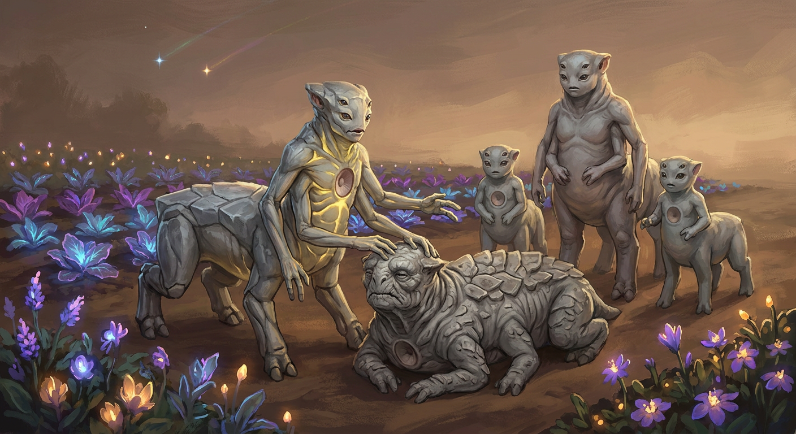

Промпт генератору

Painterly sci-fi concept art. On an alien farm family plot with rows of softly glowing cultivated plants, a medical examination takes place in warm afternoon light. A doctor with an unusually large number of arms — six or more slender arms ending in six-fingered hands — leans over an elderly male patient lying on the ground. All characters are four-legged horizontal creatures with a rearing front trunk, four eyes (front and rear pairs), a drum-like tympanum on the chest, and smooth elastic gray stone-crystal flesh with a faint yellow inner glow. The elderly patient has wrinkled, folded skin covered in countless hardened patch plates, limbs withdrawn. A large sturdy young female and two smaller children stand nearby, buzzing with concern. Bioluminescent flowerbeds glow softly around them; two stars with faint colored trails hang in the sky. Mood: gentle domestic worry, hopeful diagnosis. One creature each, no duplicates.

### Сцена 2. Семья обсуждает поездку; Дарио сомневается, Джусто предлагает Ялду как носильщицу

- **Место:** ферма, у земляной ложбинки Дарио
- **Герои:** Дарио, Вито, Джусто, Ялда, Клавдио, Клавдия

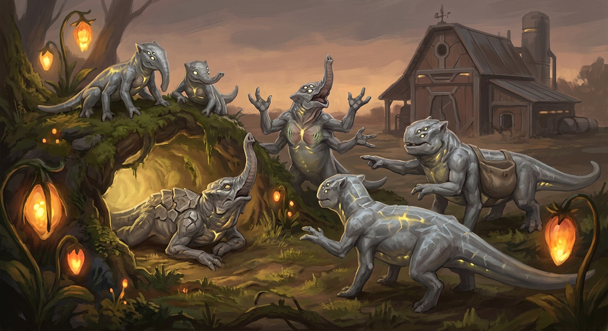

Промпт генератору

Painterly sci-fi concept art. A family council at dusk near a sunken earth hollow beside a farmstead. Five or six four-legged gray stone-crystal creatures converse: all have horizontal bodies, rearing front trunks, four eyes, chest tympana, and faint yellow glow migrating under translucent flesh. A wrinkled elderly male with hardened patch plates and withdrawn limbs lies half in the hollow, doubtful, rearing slightly. An emotional older male gestures wildly with six-fingered hands, buzzing in mock protest. A strong burly male farmer with huge side pockets on his body points a hand at a large sturdy young female, proposing her as a carrier. Two children perch nearby. Warm lantern-glow plants light the scene; mood of affectionate family argument. One creature each, no duplicates.

### Сцена 3. Рассвет, сборы; Джусто учит Ялду ходить на четырёх ногах с братьями и сёстрами в качестве пассажиров; Дарио взбирается ей на спину

- **Место:** ферма, лужайка перед домом
- **Герои:** Ялда, Джусто, Аврелия, Аврелио, Вито, Дарио, Люция, Люцио, Клавдия, Клавдио

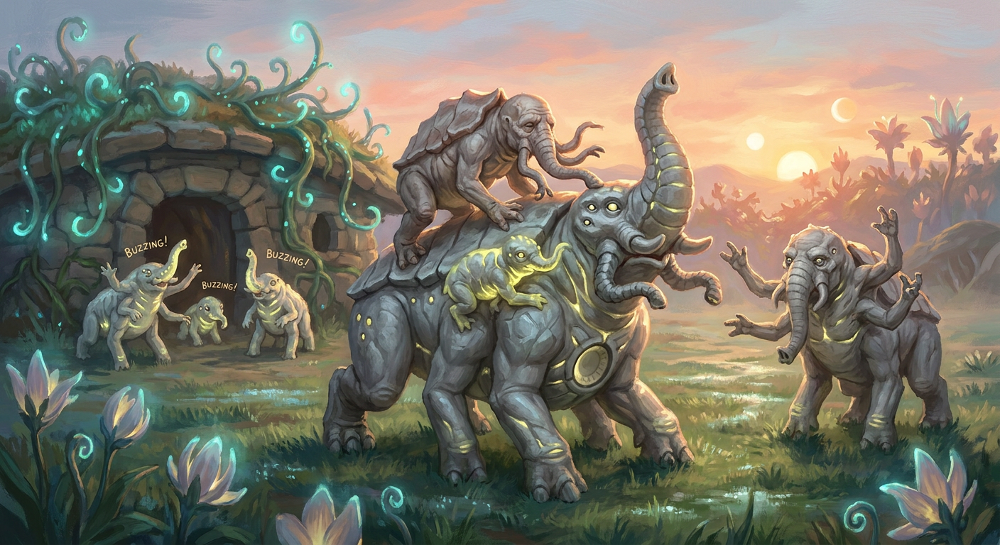

Промпт генератору

Painterly sci-fi concept art. Bright dawn on a grassy lawn before a low farm dwelling with glowing vines. A large sturdy young female creature — four-legged horizontal body, rearing front trunk, four eyes front and rear, chest tympanum, gray stone-crystal flesh with faint yellow glow — crouches as two small children cling to her back like riders, and a wrinkled elderly male with hardened patch plates climbs carefully onto her spine. An older male relative beside them waves arms, giving instructions. More children and a female relative watch, buzzing excitedly. Everyone follows the same species standard: four legs, rearing trunk, four eyes, tympana, glowing gray flesh. Sunrise light, dew, bioluminescent flowers closing for the day; mood of cheerful expedition preparation. One creature each, no duplicates.

### Сцена 4. Тропа между полями, встреча с соседями, спор о детях Массимо

- **Место:** узкая тропа между полями, развилка
- **Герои:** Ялда, Вито, Дарио, Массима, Массимо

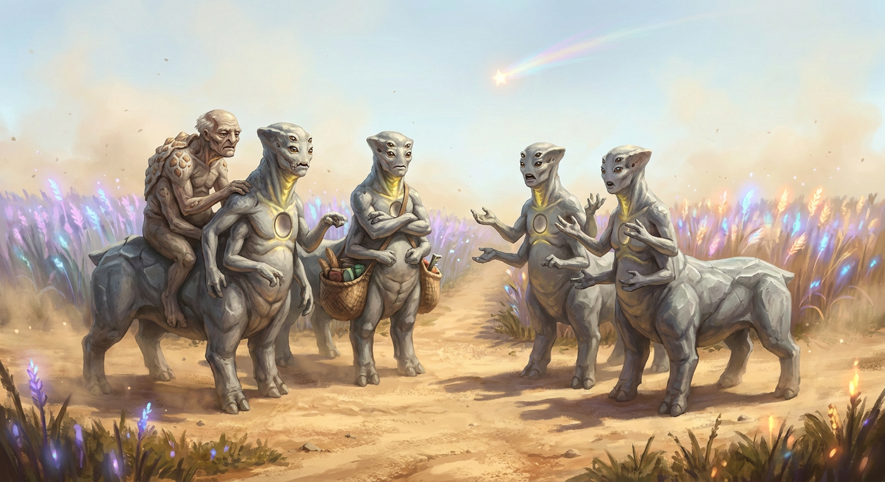

Промпт генератору

Painterly sci-fi concept art. A narrow dirt trail between two glowing crop fields, at a fork. Travelers meet neighbors: a large sturdy young female creature carrying a wrinkled elderly male with hardened patch plates on her back, and a strong male farmer with huge side pockets walk along, while a neighboring farmer couple faces them, mid-argument, hands gesturing. All are four-legged horizontal gray stone-crystal creatures with rearing front trunks, four eyes, chest tympana, faint yellow inner glow through translucent flesh. Fields of softly luminous wheat sway; a star with a colored trail hangs low in the sky. Midday light, mood of heated but civil village dispute, dust rising from the path. One creature each, no duplicates.

### Сцена 5. Полуденный привал, хлеб; Дарио вспоминает, как лес раньше был ближе

- **Место:** край чужого поля, в соломе
- **Герои:** Ялда, Вито, Дарио

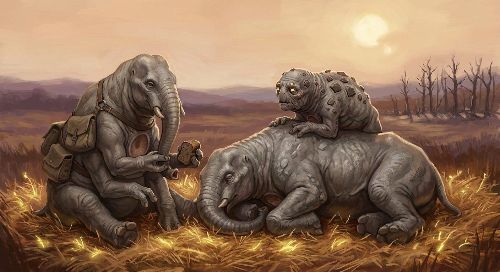

Промпт генератору

Painterly sci-fi concept art. A noon rest at the edge of a stranger's crop field, on straw. A large sturdy young female creature lies on the ground beside a strong male farmer with big side pockets; on her back rests a wrinkled elderly male with countless hardened patch plates, gazing into the distance with nostalgic four eyes. All follow the species standard: horizontal four-legged bodies, rearing front trunks, drum-like chest tympana, gray elastic stone-crystal flesh with migrating yellow glow. They share dark bread held in six-fingered hands. Sun high and strange, luminous straw, the far horizon showing where a forest once reached closer. Mood: warm, tired, wistful. One creature each, no duplicates.

### Сцена 6. По дороге Дарио рассказывает историю Аматы и Амато и древеснике

- **Место:** дорога на восток, среди полей
- **Герои:** Ялда, Вито, Дарио

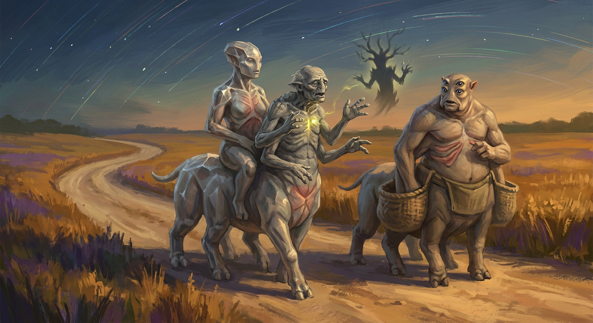

Промпт генератору

Painterly sci-fi concept art. A road heading east through open fields under an alien sky with stars trailing colored streaks. A large sturdy young female creature walks carrying a wrinkled elderly male on her back; he rears slightly from her spine, six-fingered hands gesturing as he tells a story, yellow glow pulsing faintly through his gray stone-crystal flesh. Beside them a strong male farmer with huge side pockets walks on four legs, listening. All follow the species standard: horizontal four-legged bodies, rearing front trunks, four eyes, chest tympana, translucent gray stone-crystal skin. The listeners' eyes wide; a shadowy treelike silhouette seems to flicker in the old one's tale. Mood: enchantment of a road story at golden light. One creature each, no duplicates.

### Сцена 7. Встреча с фермерами Бруной и Бруно, вечерняя остановка, решение идти до леса

- **Место:** дорога, поле пшеницы
- **Герои:** Ялда, Вито, Дарио, Бруна, Бруно

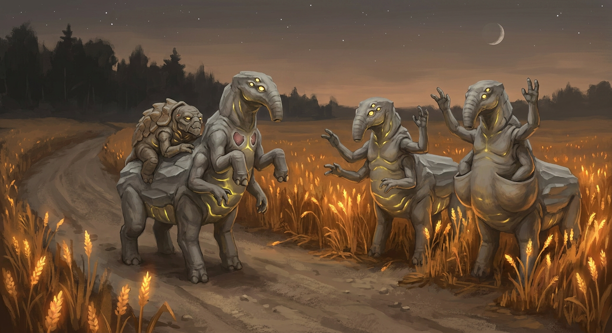

Промпт генератору

Painterly sci-fi concept art. Evening on a road through a luminous wheat field, amber light low. Travelers stop to greet a farmer couple working the field: a large sturdy young female creature carrying a wrinkled elderly male with hardened patch plates on her back, and a strong male farmer with huge side pockets beside her. The two local farmers stand among glowing wheat, rearing on hind structure, six-fingered hands raised in welcome. All are four-legged horizontal gray stone-crystal beings with rearing front trunks, four eyes, chest tympana, faint yellow inner glow. Distant forest edge visible on the horizon, dark against the sunset stars. Mood: weary but determined hospitality, decision to continue toward the forest. One creature each, no duplicates.

### Сцена 8. Ночная дорога; Вито объясняет Ялде звёздные шлейфы и движение света

- **Место:** дорога к лесу, под ночным небом
- **Герои:** Ялда, Вито, Дарио (дремлет)

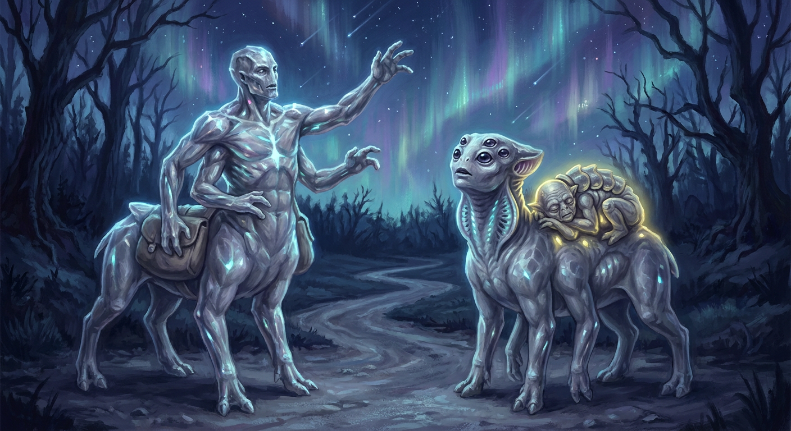

Промпт генератору

Painterly sci-fi concept art. A night road toward a dark forest, under a vast alien sky streaked with stars trailing colored shimmering veils of light. A strong male farmer with huge side pockets stands on four legs, pointing a six-fingered hand skyward, explaining the trails of light to a large sturdy young female beside him; her four eyes wide with wonder, tympanum trembling with his low voice. On her back a wrinkled elderly male with hardened patch plates sleeps curled, faint yellow glow seeping from his folds. All have horizontal four-legged bodies, rearing trunks, gray translucent stone-crystal flesh with inner glow. Mood: hushed awe, cosmic intimacy, cool blue night. One creature each, no duplicates.

### Сцена 9. Путники достигают края леса и углубляются внутрь сквозь светящиеся заросли

- **Место:** опушка леса и лесная чаща
- **Герои:** Ялда, Вито, Дарио

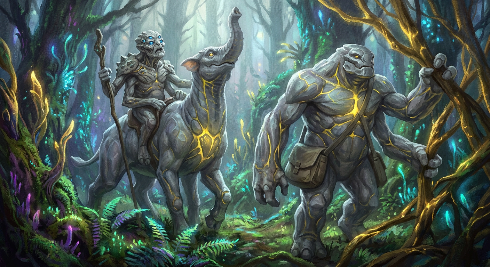

Промпт генератору

Painterly sci-fi concept art. Travelers reach the edge of a bioluminescent forest at dusk and push into the glowing undergrowth. A large sturdy young female creature steps carefully between luminous fronds, a wrinkled elderly male with hardened patch plates riding on her back, gazing with four eyes at the light; a strong male farmer with huge side pockets walks ahead, parting glowing branches with six-fingered hands. All are horizontal four-legged gray stone-crystal beings with rearing front trunks, chest tympana, and yellow inner glow answering the forest's light. Bioluminescent plants cast green, violet and gold light across their translucent flesh. Mood: wonder mixed with reverence and slight fear. One creature each, no duplicates.

### Сцена 10. Обустройство лагеря на полянке, ямы для сна, благодарность Дарио; Ялда дремлет, размышляя о древеснике

- **Место:** лесная полянка
- **Герои:** Ялда, Вито, Дарио

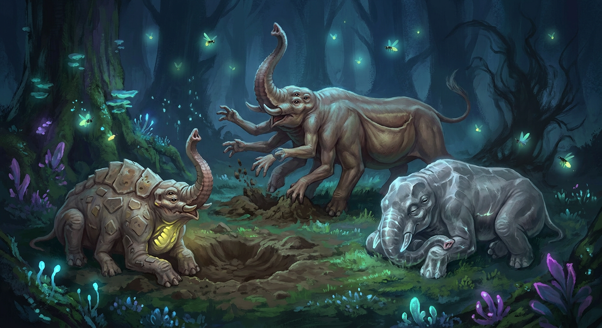

Промпт генератору

Painterly sci-fi concept art. A forest clearing at night, bioluminescent flora casting soft light. A camp is being made: a strong male farmer with huge side pockets digs sleeping hollows with six-fingered hands; a wrinkled elderly male with countless hardened patch plates rests near a hollow, faint yellow glow in his folds, expressing gratitude with a low hum from his tympanum; a large sturdy young female curls half-asleep, eyes half-closed, dreaming, her gray translucent stone-crystal flesh glowing faintly. All follow the species standard: horizontal four-legged bodies, rearing trunks, four eyes, chest tympana. Fireflies of light drift; a dark treelike shadow lingers at the clearing's edge in her thoughts. Mood: peaceful, tender, faintly ominous. One creature each, no duplicates.

### Сцена 11. День в лесу: ящерицы, разговор о матери; Вито учит Ялду «писать» символами на коже

- **Место:** лесная полянка
- **Герои:** Ялда, Вито, Дарио

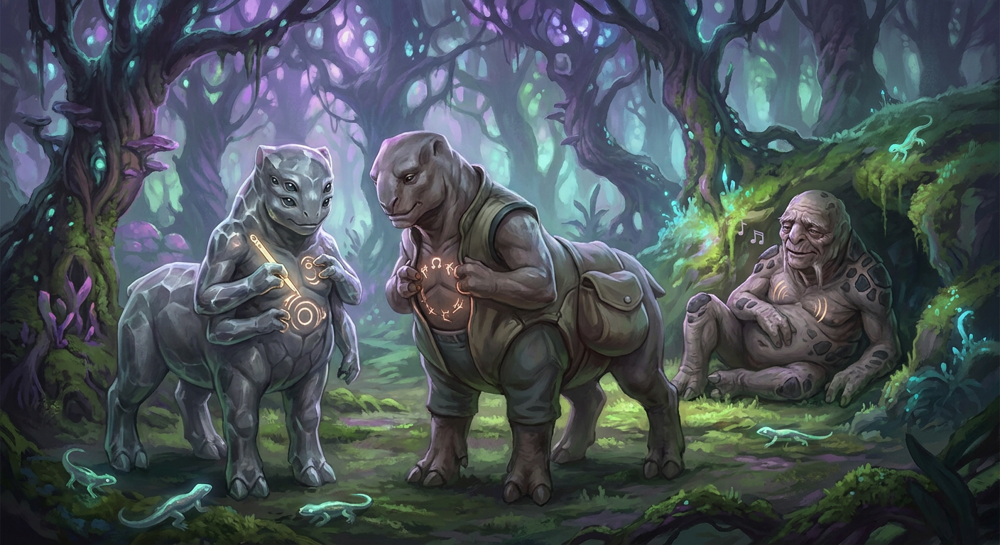

Промпт генератору

Painterly sci-fi concept art. A day in a bioluminescent forest clearing. Small lizard-like creatures skitter across luminous moss. A large sturdy young female creature sits with a strong male farmer with huge side pockets; he demonstrates writing — deliberate scar-symbols forming rings and signs on the elastic chest of his rearing trunk — while she copies the marks onto her own gray translucent stone-crystal skin with a six-fingered hand. A wrinkled elderly male with hardened patch plates rests nearby, humming softly, speaking of a mother. All have horizontal four-legged bodies, four eyes, chest tympana, faint yellow inner glow. Dappled colored light through strange canopy. Mood: quiet learning, gentle grief and closeness. One creature each, no duplicates.

### Сцена 12. Ночная агония Дарио: жёлтые светящиеся пятна, зудни, вспышки; Вито и Ялда бегут, взрыв

- **Место:** лесная полянка, затем бегство к дороге
- **Герои:** Ялда, Вито, Дарио

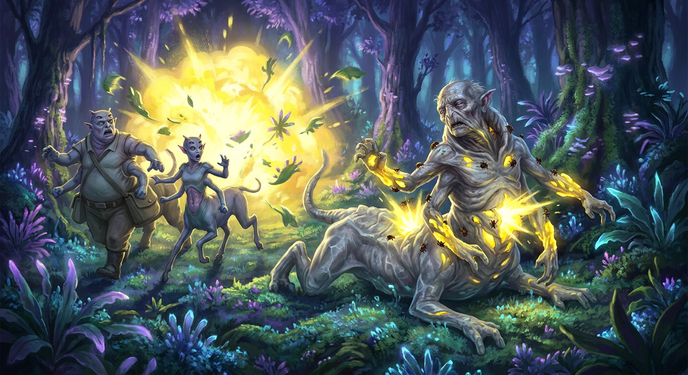

Промпт генератору

Painterly sci-fi concept art. Night horror in a forest clearing: a wrinkled elderly male creature in agony, his gray stone-crystal flesh erupting with bright yellow glowing resinous patches, small parasitic mites swarming his folds, flashes of light bursting from his body. A strong male farmer with huge side pockets and a large sturdy young female flee at a desperate four-legged run, glancing back with four eyes, tympana drumming with terror. All follow the species standard: horizontal four-legged bodies, rearing trunks, six-fingered hands, translucent flesh with inner glow. Behind them a blinding explosion of yellow light tears through the clearing, bioluminescent plants blown flat. Mood: panic, grief, blinding catastrophe. One creature each, no duplicates.

### Сцена 13. Утро после взрыва: опустошённый лес, оплакивание Дарио, возвращение

- **Место:** трава у дороги, у края разрушенного леса
- **Герои:** Ялда, Вито

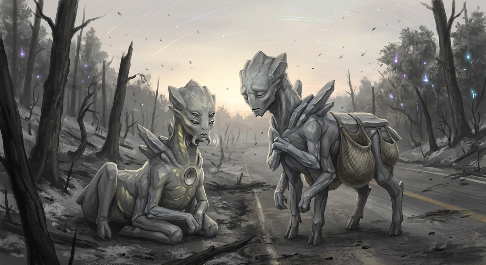

Промпт генератору

Painterly sci-fi concept art. Morning after the catastrophe: a road's edge grass, beside a devastated forest — flattened, scorched, its bioluminescence extinguished to gray ash. A large sturdy young female creature stands lowered in mourning, her gray translucent stone-crystal flesh dull, tympanum humming a low grief-note; beside her a strong male farmer with huge side pockets bows his rearing trunk, four eyes closed. Both are horizontal four-legged beings with chest tympana and faint yellow glow dimmed by sorrow. Pale strange sunrise over the ruined treeline, drifting ash like snow, stars with colored trails fading in the dawn sky. Mood: desolation, mourning, the beginning of a long walk home. One creature each, no duplicates.

## Глава 2

### Сцена 1. Ялда работает жнецом в поле вместе с семьей, отращивая новые руки по мере усталости

- **Место:** пшеничные поля фермы
- **Герои:** Ялда, Люция, Люцио, Джусто, Вито, Клавдио, Аврелия

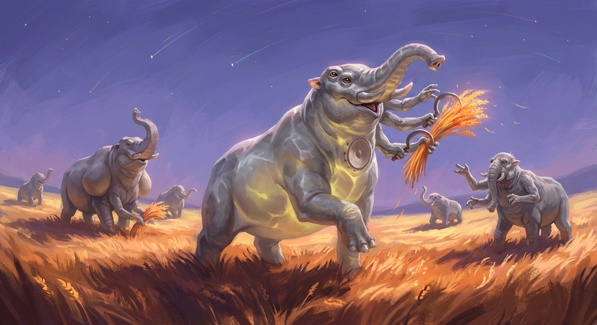

Промпт генератору

Painterly sci-fi concept art. A vast wheat field under a violet-blue sky where faint stars trail colored streaks. A large plump young female creature works as a harvester, her four-legged horizontal body rearing on its front trunk, four eyes alert, tympanum drum on her chest below the mouth, gray translucent stone-crystal flesh with a faint migrating yellow inner glow; she has grown several extra pairs of six-fingered arms that cut and bundle grain. Around her a big strong male farmer with huge side pockets, an emotional elderly male gesturing with three arms, and other farmers and youngsters of the same species — all four-legged, rearing front trunks, four eyes, gray glowing flesh — harvest the glowing wheat. Wind ripples the field, mood of warm exhausting family labor, dusk light.

### Сцена 2. Ужин у контейнера с зерном; Ялда разглядывает темнеющее небо и слушает взрослых

- **Место:** поле, у центрального контейнера
- **Герои:** Ялда, Вито, Джусто, Клавдио, Аврелия

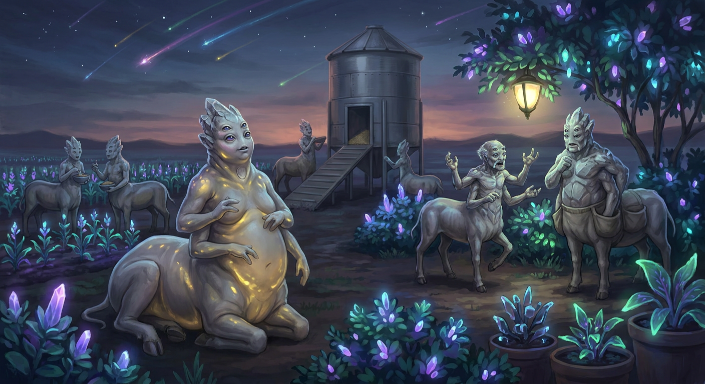

Промпт генератору

Painterly sci-fi concept art. Twilight on a farm field beside a central metal grain container on a ramp. A large plump young female creature sits on her coiled four-legged body, front trunk upright, four eyes fixed on the darkening sky where stars drag glowing colored tails. Her gray translucent stone-crystal flesh carries a soft migrating yellow glow, tympanum drum taut on her chest. Around a supper of grain, an emotional elderly male buzzes and waves arms, a big strong male farmer with huge side pockets rumbles, others of the same species — four-legged, rearing, four-eyed — eat and talk under lantern-glow plants. Peaceful mood, cool night air, warm food smell implied, distant fields dark.

### Сцена 3. Ялда подслушивает спор Джусто и Вито о ее отправке в школу

- **Место:** поле, у пандуса контейнера
- **Герои:** Ялда, Джусто, Вито

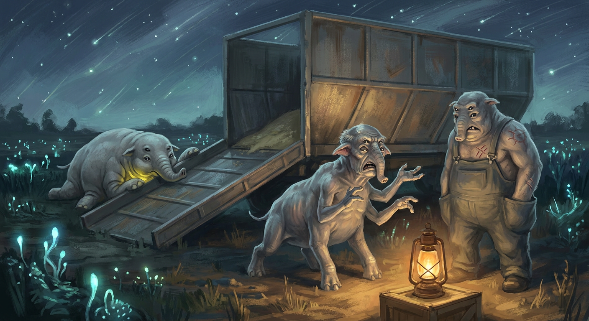

Промпт генератору

Painterly sci-fi concept art. Night by the grain container's ramp on the farm field, lit by pale star-streaks and glowing plants. A large plump young female creature hides low behind the ramp, four-legged horizontal body flattened, front trunk and four eyes barely raised, gray stone-crystal flesh dimmed to hide its yellow inner glow, tympanum silent. Nearby, illuminated by a lantern, an emotional elderly male gestures sharply with three six-fingered arms, buzzing and turning away in disgust, arguing with a big strong male farmer with huge side pockets whose chest bears old scar-ring symbols. Both are four-legged, rearing on front trunks, four eyes, gray translucent flesh. Tense, conspiratorial mood of overheard argument.

### Сцена 4. Ялда в постели разглядывает летящие звезды и размышляет о школе

- **Место:** дом, спальня
- **Герои:** Ялда, Аврелия

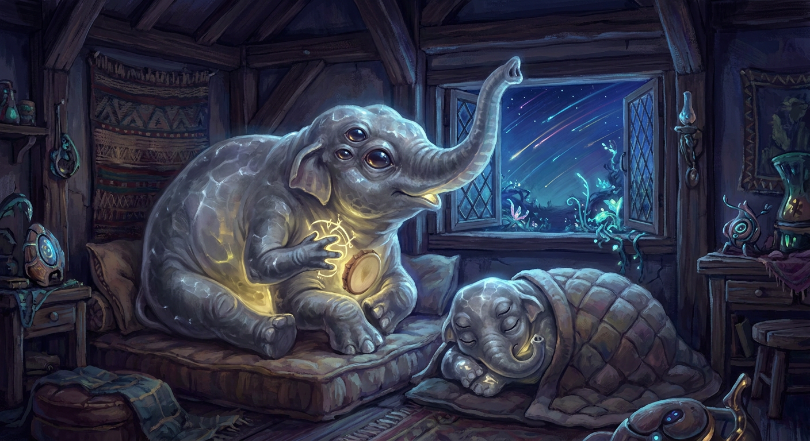

Промпт генератору

Painterly sci-fi concept art. A dim farmhouse bedroom at night. A large plump young female creature rests curled on a low bed, four-legged body folded, front trunk raised, both front and rear eye pairs gazing through a window at the sky where luminous stars streak long colored trails. Her gray translucent stone-crystal flesh glows faint yellow from within, tympanum drum soft on her chest; she traces a practice symbol on her own chest skin with a six-fingered hand, dreaming of school. Beside her a young female sibling of the same species sleeps, four-legged, four-eyed, gray glowing flesh. Quiet contemplative mood, deep blue night, faintly luminous plants outside the window.

### Сцена 5. Отгрузка зерна: грузовик Сильваны, Ялда изучает устройство двигателя и запавшие искры

- **Место:** поле, грузовик у контейнера
- **Герои:** Ялда, Вито, Джусто, Сильвана

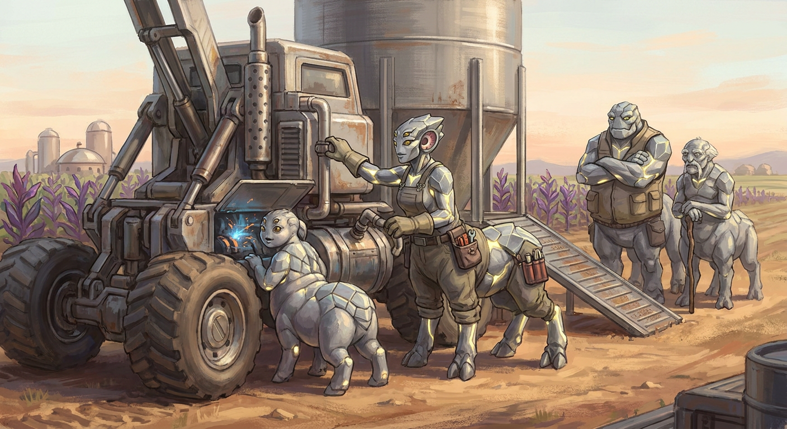

Промпт генератору

Painterly sci-fi concept art. Morning at the farm field, a heavy truck parked at the grain container ramp. A confident female driver creature works the machine — opening hatches, tapping a pipe with a six-fingered hand, showing fuel tanks with a strange liquid liberator — her four-legged horizontal body rearing, four eyes keen, tympanum resonating, gray stone-crystal flesh with yellow inner glow. A large plump young female creature leans close, studying the engine with all four eyes, fascinated by dim sparks sunk inside the machinery; a big strong male farmer with side pockets and an elderly male supervise. All the same species: four legs, rearing trunk, tympanum, geometric hardened plates. Bright daylight, mechanical mood.

### Сцена 6. Ужин на примятой земле; в небе проносится загадочная разноцветная линия, Джусто спорит с Ялдой

- **Место:** поле, место где стоял контейнер
- **Герои:** Ялда, Джусто, Вито, Клавдия, Люцио, Люция

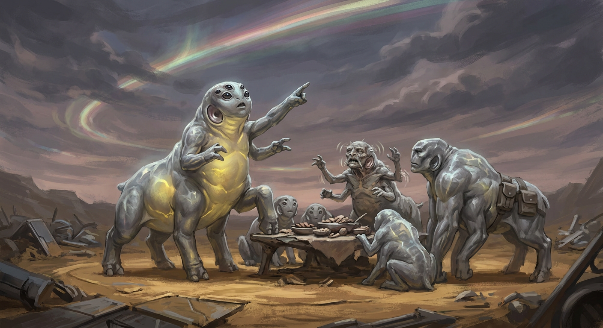

Промпт генератору

Painterly sci-fi concept art. Supper on flattened bare earth where the grain container stood, under a dramatic sky. A large plump young female creature points upward with a six-fingered arm from her rearing front trunk, four eyes wide, gray translucent stone-crystal flesh lit by her yellow inner glow, tympanum fluttering with excited buzz — a mysterious multicolored line of light races across the heavens. An emotional elderly male argues with her, arms flailing, buzzing scornfully; a big strong male farmer with side pockets watches silently; several siblings and kin of the same species — four-legged, four-eyed, glowing gray flesh — sit around the meal. Awed, unsettled evening mood.

### Сцена 7. Вито ведет Ялду в поселок в первый школьный день, рассуждая об обучении мальчиков

- **Место:** дорога в поселок
- **Герои:** Ялда, Вито

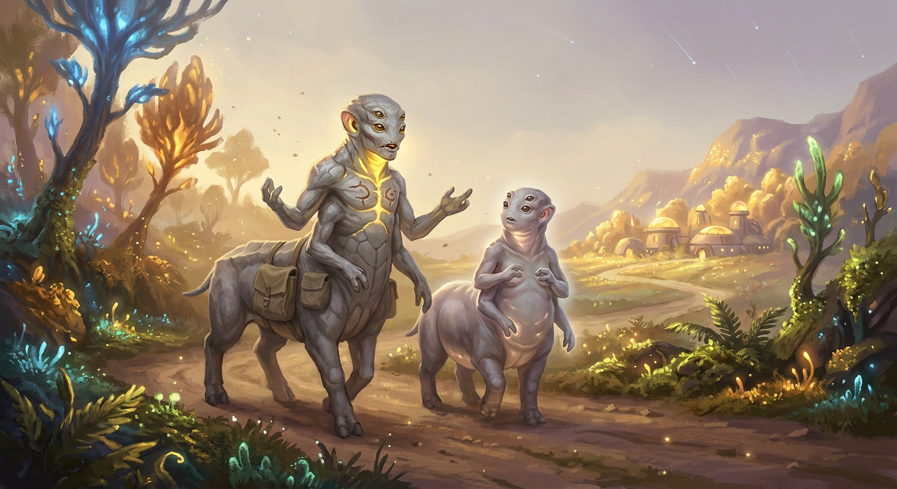

Промпт генератору

Painterly sci-fi concept art. A dirt road through glowing countryside toward a small settlement at morning. A big strong male farmer creature walks on four legs with huge side pockets, his rearing front trunk carrying four eyes and a firm tympanum, gray stone-crystal flesh with yellow inner glow, scar-ring symbols on his chest. Beside him trots a large plump young female creature, same species — four-legged horizontal body, rearing front trunk, front and rear eyes, faint inner glow — listening as the elder speaks about schooling for boys. Luminous plants line the road, star-trails still faint in the pale sky, dew and dust catching light. Mood of hopeful, nervous first journey, warm ochre morning tones.

### Сцена 8. Первый урок: Анжело показывает символы, Ялда знакомится с Фульвио и пугает Роберто

- **Место:** школьный двор, класс младших
- **Герои:** Ялда, Вито, Анжело, Фульвио, Роберто, ученики

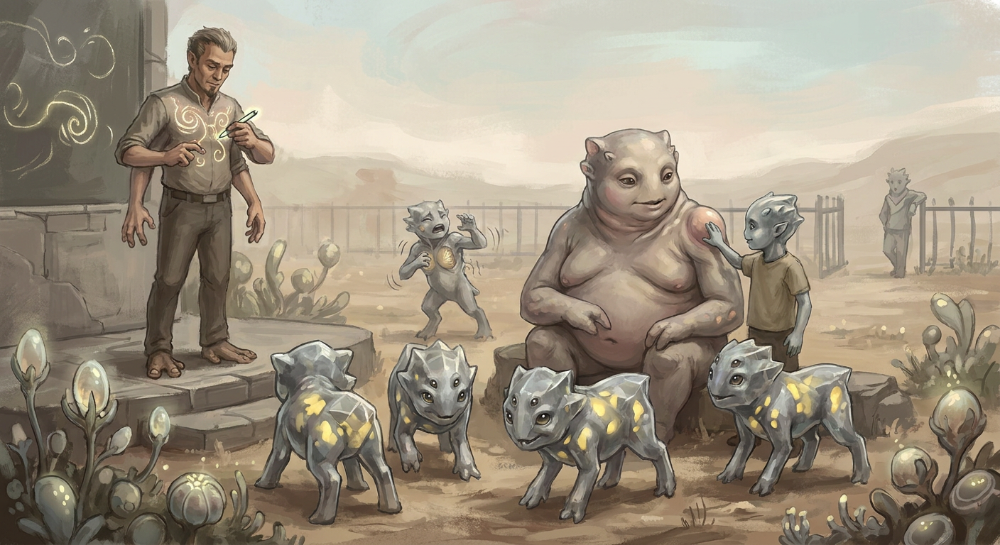

Промпт генератору

Painterly sci-fi concept art. A schoolyard class of young creatures of one alien species: all four-legged horizontal bodies with rearing front trunks, four eyes, chest tympanums, gray translucent stone-crystal flesh with faint yellow inner glow. A male teacher stands on a low platform drawing glowing circles and symbols swiftly on his own chest skin with six-fingered hands, light pulsing. A large plump young female creature sits beside a small young male who curiously touches the surrogate head-bulge on her shoulder. A startled young boy creature recoils and bolts, tympanum shrill. A strong male farmer with side pockets waits at the fence. Busy, curious morning mood, chalky light, faintly glowing plants around the yard.

### Сцена 9. Ялда и Фульвио идут через рынок; он угощает ее земляными орехами, они говорят о профессиях

- **Место:** поселок, рынок и дороги
- **Герои:** Ялда, Фульвио, лоточница

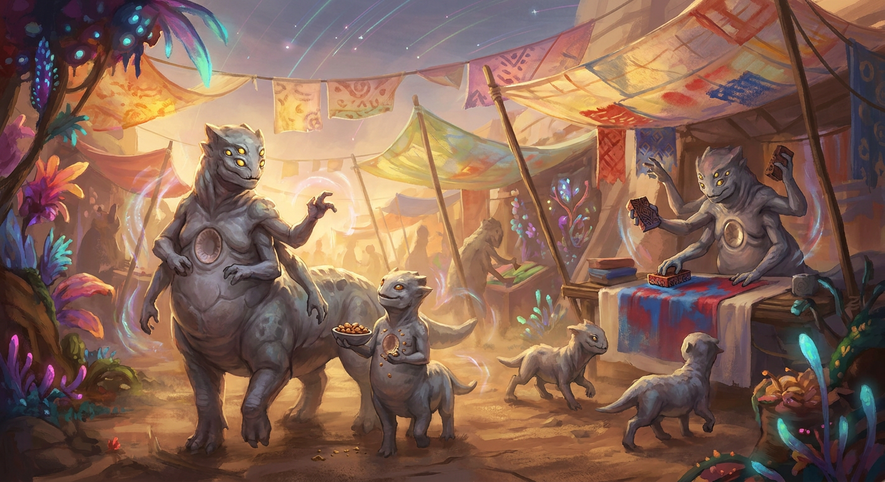

Промпт генератору

Painterly sci-fi concept art. A bustling settlement market street lined with glowing plants and stalls of dyed paper. A large plump young female creature — four-legged horizontal body, rearing front trunk, four eyes, chest tympanum, gray stone-crystal flesh with migrating yellow glow — walks beside a small young male creature of the same species who offers her roasted groundnuts, crumbs bouncing off his tympanum. At a stall a female dye-vendor creature of the same species presses raised relief patterns into her palm and transfers them to paper with colored dyes. Children of the species pass between stalls. Warm afternoon light, chatter implied by rippling tympanums, friendly exploratory mood, colorful fabrics and star-trails overhead.

### Сцена 10. Дома Ялда помогает Аврелии молоть зерно, вечером рассказывает об уроках, но сестра не заинтересована

- **Место:** ферма, лужайка и спальня
- **Герои:** Ялда, Аврелия

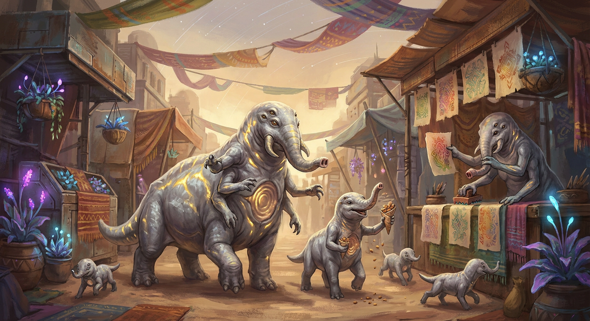

Промпт генератору

Painterly sci-fi concept art. Two moments on the farm: a young female creature turns a heavy millstone with strong six-fingered arms from her rearing front trunk while a large plump young female creature feeds grain, both four-legged, four-eyed, gray glowing stone-crystal flesh. Evening falls to a bedroom where the plump young one, curled on a low bed, buzzes eagerly about lessons, tracing glowing symbols on her chest skin, while the sister sleeps indifferent, tympanum slack. Luminous plants glow at the window, star-streaks cross the night sky. Mood of quiet domestic duty and one-sided excitement, warm dust-colored daylight fading to deep blue night.

### Сцена 11. Ученики в парах обучаются письму, выводя символы на коже

- **Место:** школа
- **Герои:** Ялда, Анжело, Фульвио, ученики

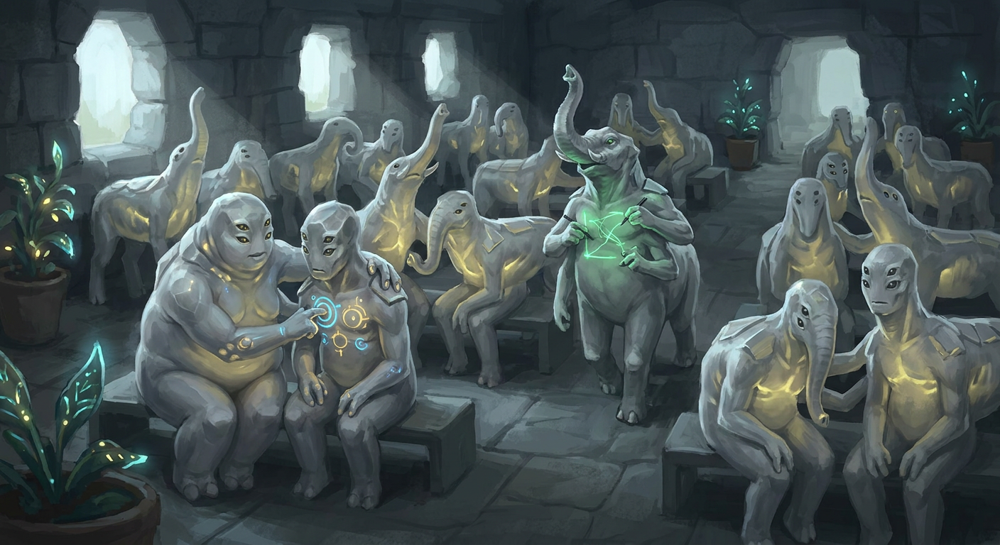

Промпт генератору

Painterly sci-fi concept art. A school room where young creatures of one alien species sit in pairs practicing writing: all four-legged horizontal bodies with rearing front trunks, four eyes, chest tympanums, gray translucent stone-crystal flesh with faint migrating yellow glow. Each pupil traces glowing symbols and diagram curves onto the partner's chest skin with six-fingered hands, light lingering on the elastic gray surface. A large plump young female works with a small young male partner, drawing careful circles; a male teacher circles between the pairs, sketching a swift luminous figure on his own chest. Soft daylight through openings, glowing plants in pots, focused hushed mood of shared learning, faint geometric hardened plates catching the light.

### Сцена 12. Анжело заболел; Фульвио водит Ялду на топливоперерабатывающий завод, где работает его семья

- **Место:** западная сторона поселка, завод
- **Герои:** Ялда, Фульвио, Фульвия, Бенигно, рабочие

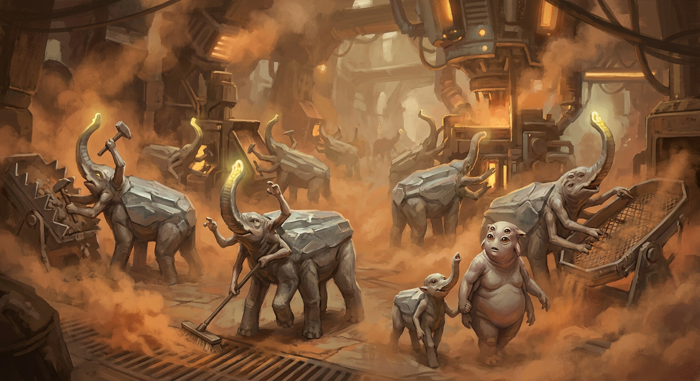

Промпт генератору

Painterly sci-fi concept art. A fuel-processing plant on the settlement's western edge: some four dozen worker creatures of one alien species hammer ore by hand, scrape it through jagged sifts, clean fuel amid drifting orange dust and noise — all four-legged, rearing front trunks, four eyes, tympanums taut, gray stone-crystal flesh glowing faint yellow. A slim young male sweeps orange fuel dust into a floor grate; a female works a sieve. A small young male leads a large plump young female visitor through the haze, both same species, her four eyes wide at the machinery. Industrial warm light, dense atmosphere of dust and vapor, awe mixed with noise, glowing conduits overhead.

### Сцена 13. Ялда украдкой практикуется в письме на теле в одиночестве, опираясь на куст медовицы

- **Место:** соседское поле, укромное место
- **Герои:** Ялда

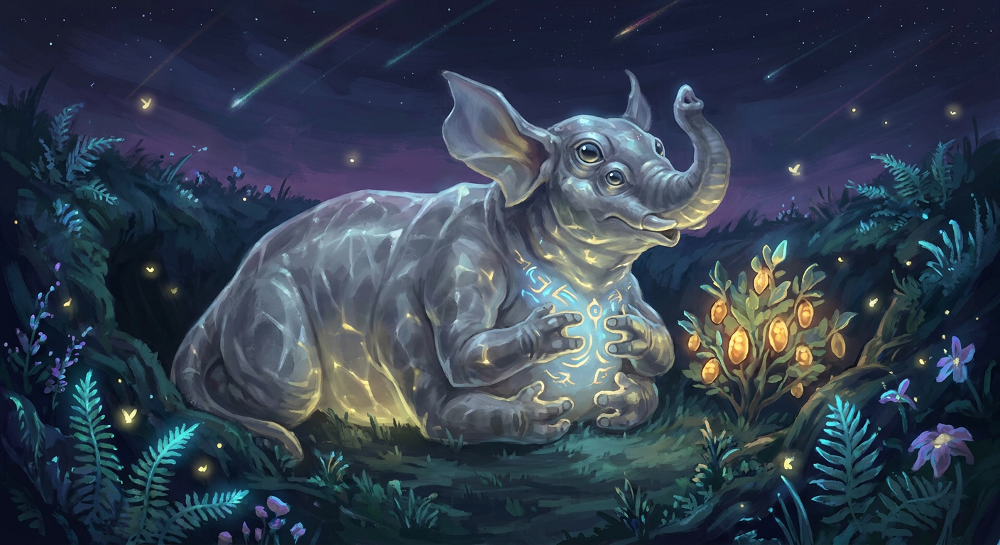

Промпт генератору

Painterly sci-fi concept art. A secluded hollow in a neighboring field at dusk. A single large plump young female creature, alone: four-legged horizontal body settled beside a glowing honey-plant bush, front trunk reared, four eyes — front and rear pairs — checking for watchers, gray translucent stone-crystal flesh carrying a nervous migrating yellow glow, tympanum fluttering. With six-fingered hands she secretly practices writing, tracing luminous circles and symbol shapes onto her own chest skin, light blooming softly in the dimness. Faint star-trails of colored light cross the deepening sky; luminous plants fringe the hiding spot. Mood of quiet defiance and tender private determination, cool blue-violet twilight, fireflies of glowing pollen drifting.

## Глава 3

### Сцена 1. Ялда просыпается до рассвета под рынком, покупает хлеб, гуляет по улицам и планирует урок

- **Место:** ночлежка под рынком, улицы Зевгмы
- **Герои:** Ялда

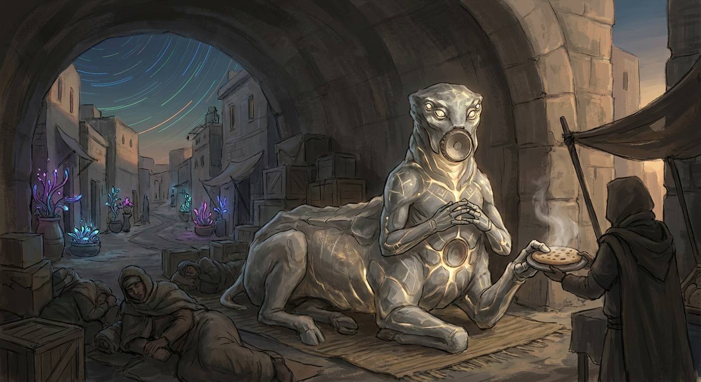

Промпт генератору

Painterly sci-fi concept art. Pre-dawn beneath a vast stone market vault, a large young female student wakes on a bedroll among sleeping traders' bundles, faint yellow glow pulsing deep inside her translucent gray stone-crystal flesh. She is a four-legged creature with a horizontal animal-like body, rearing front trunk, four eyes (front and rear pairs), a drum-like tympanum below her mouth, six-fingered hands on her chest, subtle geometric hardened plates on elastic skin. She rises, buys warm flat bread from a stall keeper, and walks through the streets of an alien city before sunrise: glowing potted plants along the walls, distant stars hanging in the sky with long colored trails, cool blue night light giving way to the first warm gleam. Her expression is quiet, thoughtful, planning a lesson; she idly traces a diagram on her own chest skin with one hand. Mood of calm anticipation, solitude and hunger for knowledge. One creature only, no duplicates, no humans.

### Сцена 2. Ялда проводит занятие с Евсебио по сохранению энергии и импульса в его квартире

- **Место:** квартира Евсебио в каменной башне
- **Герои:** Ялда, Евсебио

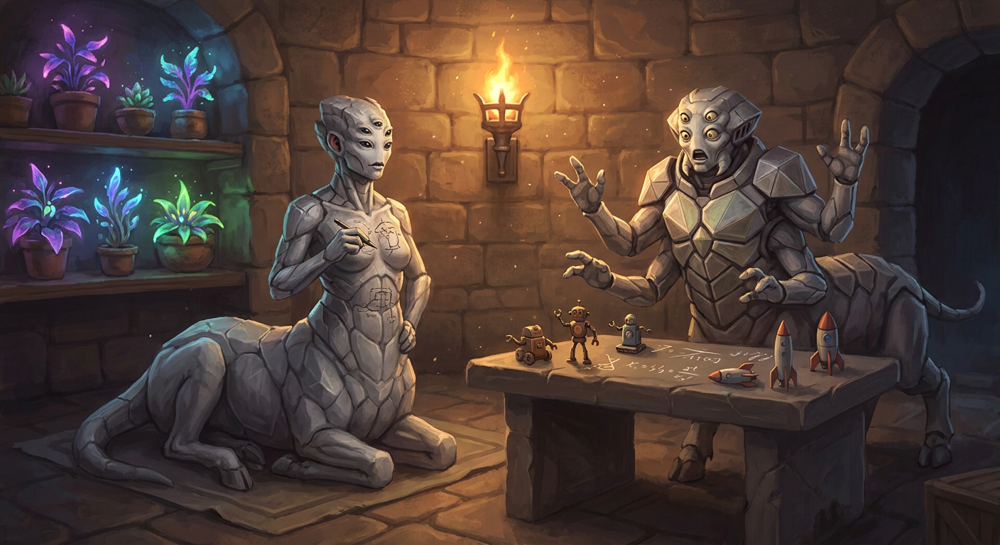

Промпт генератору

Painterly sci-fi concept art. Interior of a stone tower apartment lit by a flickering firevit lamp and glowing shelf-plants. A large strong young female tutor, a four-legged horizontal-bodied alien with rearing front trunk, four eyes, chest tympanum, gray elastic stone-crystal flesh with faint migrating yellow inner glow, sketches an energy-and-momentum diagram directly on her own chest skin. Facing her, a big burly but agile male engineering student — same species standard: four-legged stance, raised front trunk, four eyes, tympanum, geometric hardened plates — waves both six-fingered hands wide in astonishment, buzzing with surprise, head slightly pulled into his shoulders. Between them on a low stone table, toy clockwork figures and small rocket models stand beside chalk equations. Warm lamplight, dust motes, an atmosphere of friendship and intellectual excitement. One of each creature, no duplicates, no humans.

### Сцена 3. Лекция Нерео о дифракции света и демонстрация спектра на экране

- **Место:** лекционный зал университета
- **Герои:** Ялда, Нерео, Джорджо, Людовико, помощник Нерео

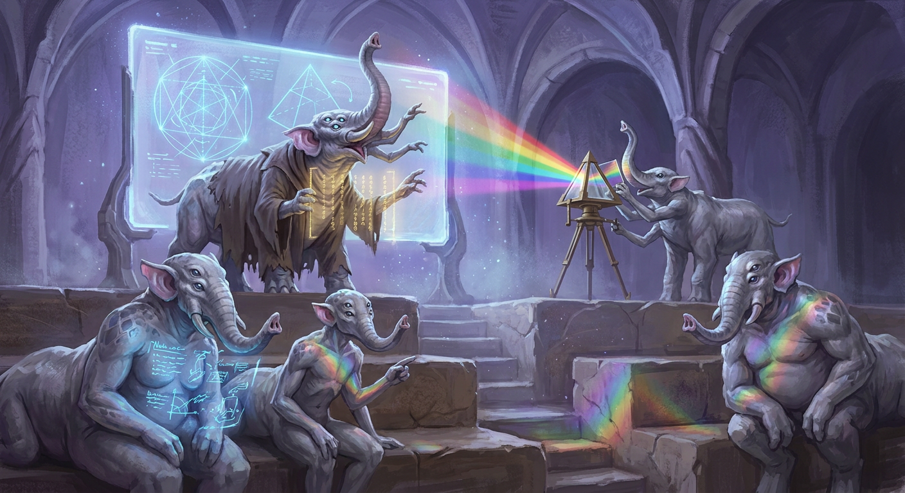

Промпт генератору

Painterly sci-fi concept art. University lecture hall with tiered stone benches and a glowing projection screen. An elderly male optics professor — four-legged horizontal alien body, rearing front trunk, four eyes, tympanum membrane, gray stone-crystal flesh with faint yellow inner glow, columns of numbers inscribed along one arm — stands projecting diagrams from his own chest skin while his assistant adjusts a prism apparatus casting a fanned rainbow spectrum onto the screen. In the audience, a large strong young female student with four eyes and chest-drawn notes sits beside a lean male classmate and a burly male student, all the same four-legged species with rearing trunks and tympana, leaning forward intently. Cool violet-blue lecture light, the spectrum's colored bands washing across their gray crystalline flesh. Mood of wonder and discovery. Each creature appears once, no duplicates, no humans.

### Сцена 4. После лекции Ялда предлагает Нерео эксперимент с рекомбинацией звездного шлейфа; Зосимо отвлекает Людовико

- **Место:** выход из зала, двор университета, столовая
- **Герои:** Ялда, Нерео, Джорджо, Руфино, Зосимо, Людовико

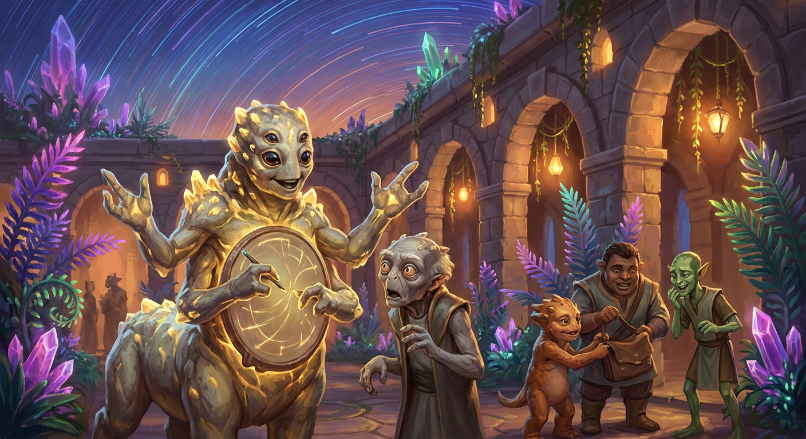

Промпт генератору

Painterly sci-fi concept art. Outside the university lecture hall, in a courtyard of luminous plants under a sky of trailing colored stars. A large strong young female student, four-legged alien with rearing front trunk, four eyes, tympanum, yellow-glowing gray stone-crystal flesh, eagerly draws a diagram of a recombined star-trail experiment on her chest while speaking to the elderly male optics professor, who listens with all four eyes widening. Nearby, a playful male classmate playfully distracts a burly male student, tugging his pack; a lean young male looks on chuckling. Lanterns and glowing vines light the stone arcade; the mood is lively, warm collegial banter after a lecture, science as shared joy. Same species standard for every figure: horizontal four-legged bodies, raised front trunks, chest tympana, six-fingered hands. One of each creature, no duplicates, no humans.

### Сцена 5. Ялда калибрует призму гребенкой Нерео в оптической мастерской

- **Место:** оптическая мастерская университета
- **Герои:** Ялда, молодой студент (гелиостат)

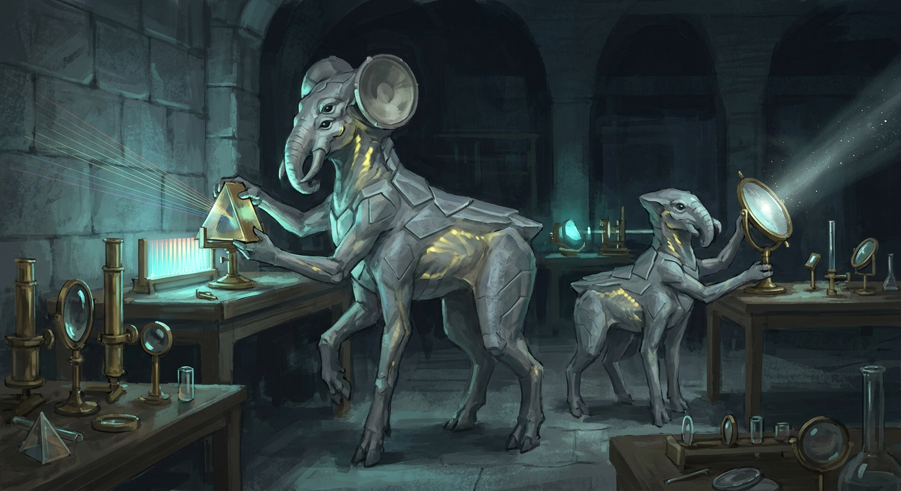

Промпт генератору

Painterly sci-fi concept art. University optical workshop at night: benches of brass prisms, lenses, mirrors and a comb-like diffraction grating glowing with faint spectral colors. A large strong young female researcher — four-legged horizontal alien body, rearing front trunk, four eyes, drum-like tympanum, elastic gray stone-crystal flesh with subtle geometric plates and migrating yellow inner glow, extra hands grown for delicate work — carefully calibrates a prism against a light-comb, fine spectral lines projected across the wall. Assisting her, a young male student of the same species, four-eyed with rearing trunk and tympanum, steadies a heliostat mirror beaming a shaft of starlight. Cool blue-green instrument light, glass glints, dust in the beam, an atmosphere of precision, patience and quiet triumph. One of each creature, no duplicates, no humans.

### Сцена 6. Прощание с Нерео у южных ворот; Джорджо отчитывает Ялду и обещает время в обсерватории

- **Место:** южные ворота университета (каменная арка)
- **Герои:** Ялда, Нерео, Джорджо, Руфино, Зосимо

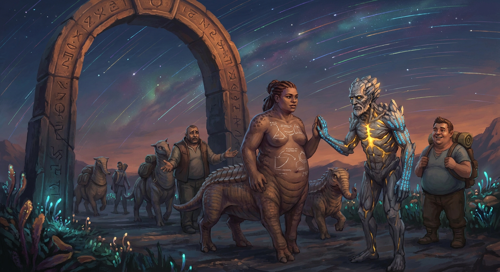

Промпт генератору

Painterly sci-fi concept art. A monumental stone archway gate at the southern edge of a university at dusk, sky streaked with stars trailing colored wakes. An elderly male optics professor — four-legged horizontal alien body, rearing front trunk, four eyes, tympanum, gray stone-crystal flesh with yellow inner glow, an arm covered in columns of numbers — bids farewell, touching hands with a large strong young female student whose chest bears freshly drawn diagrams. Behind them a broad emotional male mentor with a stocky cheerful male friend sees her off; the mentor spreads his arms wide in a warm gesture of pride and worry. Pack-laden travelers pass beneath the arch. Golden dusk light against cool shadow, glowing plants lining the road, bittersweet mood of parting and promise. Every figure follows the four-legged, four-eyed, tympanum-bearing species standard. One of each creature, no duplicates, no humans.

### Сцена 7. Людовико читает Ялде отповедь и в качестве условия даёт книгу Меконио и задание написать эссе

- **Место:** кабинет Людовико в университете, вечер
- **Герои:** Ялда, Людовико

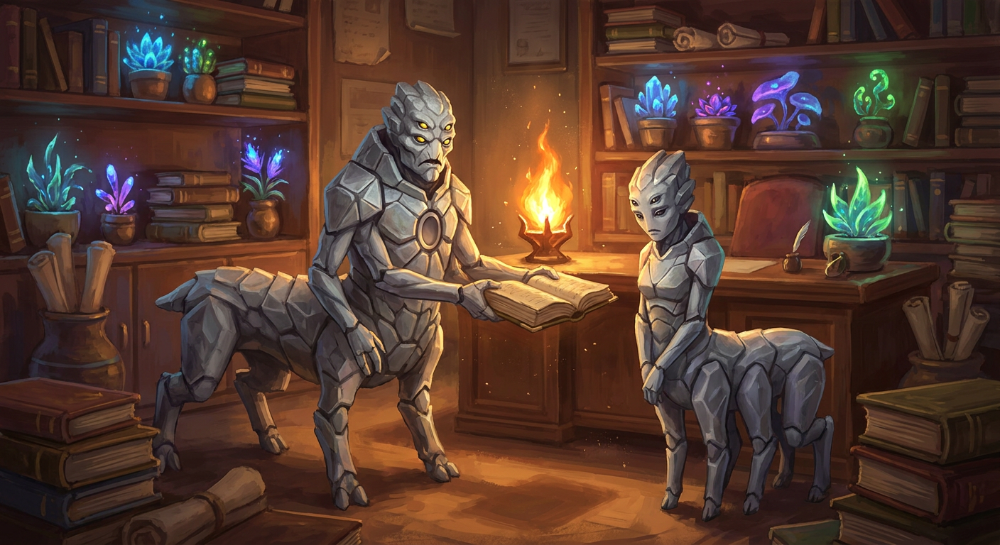

Промпт генератору

Painterly sci-fi concept art. Evening interior of a cluttered university office: stacks of paper, a crackling firevit lamp casting restless orange light. An elderly male bursar — surprisingly limber for his age, four-legged horizontal alien body, rearing front trunk, four eyes, chest tympanum, gray elastic stone-crystal flesh with faint migrating yellow glow and geometric hardened plates — rumbling in a stern lecture voice, extends a thick book toward a large strong young female student. She, same species standard with four eyes and tympanum, receives it with lowered head and chastened posture, an essay assignment implied. Shadows pool in corners, the lamp's flame breathes across the walls, mood of gravitas, reprimand and unexpected mentorship. One of each creature, no duplicates, no humans.

### Сцена 8. В тёмном коридоре Ялда знакомится с Туллией, измеряющей спектры растений; они уходят в ночь

- **Место:** коридор у мастерских университета, ночной двор
- **Герои:** Ялда, Туллия

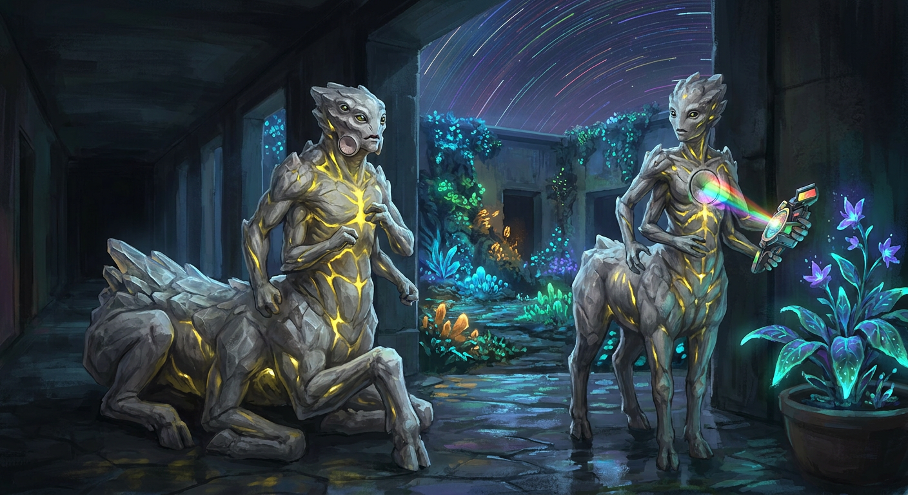

Промпт генератору

Painterly sci-fi concept art. A dark corridor outside university workshops opening onto a night courtyard where luminous plants shimmer blue-green. A large strong young female student with rear-facing eyes — four-legged horizontal alien body, rearing front trunk, tympanum, gray stone-crystal flesh with yellow inner glow — meets an energetic sardonic female biologist of the same species, who holds a spectrum-measuring instrument toward a glowing potted plant, spectral colors reflected across her chest tympanum. The biologist chirps teasingly; they turn together toward the night, star-trails with colored wakes overhead, their inner glows the brightest moving lights in the darkness. Mood of unexpected friendship, scientific curiosity and nocturnal adventure. One of each creature, no duplicates, no humans.

### Сцена 9. Разговор о жизни, мире и огне на Большом мосту над расселиной от Великого пожара

- **Место:** Большой мост, южный квартал Зевгмы
- **Герои:** Ялда, Туллия

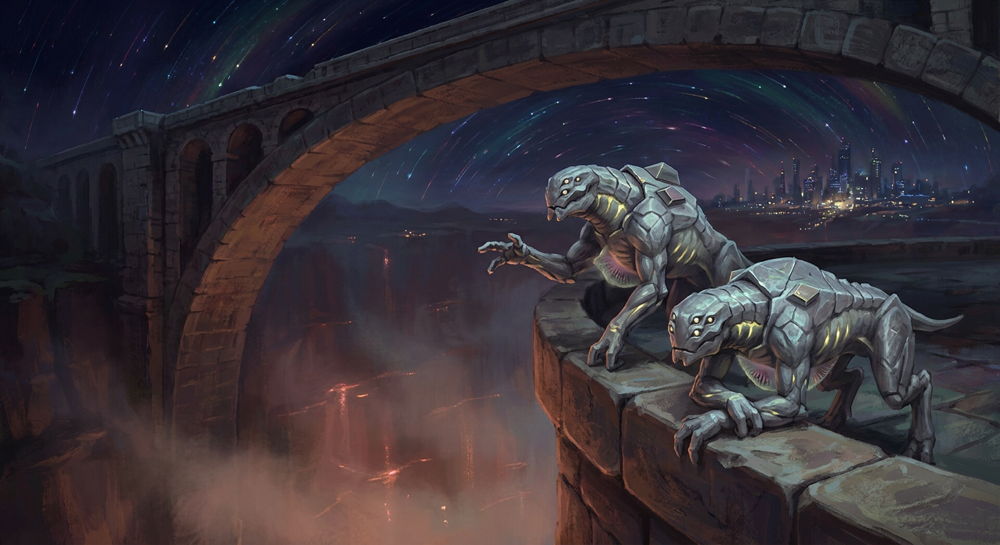

Промпт генератору

Painterly sci-fi concept art. A great stone bridge arching over a vast chasm — a rift valley carved by an ancient world-fire, its depths still exhaling faint red-gold heat haze. Two creatures of the same four-legged alien species stand at the parapet in deep conversation: a large strong young female student and an energetic sardonic female biologist, both with horizontal bodies, rearing front trunks, four eyes, chest tympana, gray elastic stone-crystal flesh lit by migrating yellow inner glows, subtle geometric plates. One gestures toward the abyss as they discuss fire, life and the world; the other leans on the parapot, reflective. Night sky above with trailing colored stars, city lights of the southern quarter beyond, wind stirring their forms. Mood of philosophical intimacy, awe and melancholy wonder. One of each creature, no duplicates, no humans.

### Сцена 10. Через задний коридор ресторана Туллия ведёт Ялду в «Клуб Соло»

- **Место:** извилистый коридор за рестораном, тёмная лестница, комната клуба
- **Герои:** Ялда, Туллия

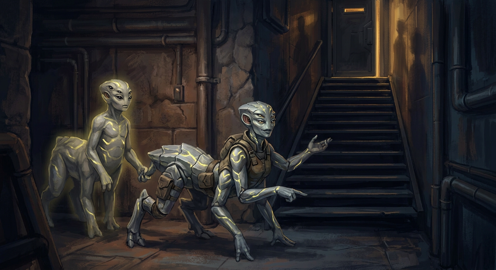

Промпт генератору

Painterly sci-fi concept art. A winding dim back corridor behind a restaurant, then a dark narrow staircase leading up to a hidden club room. An energetic sardonic female biologist — four-legged horizontal alien body, rearing front trunk, four eyes, tympanum, gray stone-crystal flesh with yellow migrating glow — leads a large strong young female student of the same species by the hand through the passage; the follower's four eyes, front and rear, watch both directions warily. A thin line of warm lamplight spills under a door at the top; cooking smells and murmured voices implied. Deep shadows, faint glow of the creatures' translucent flesh as their only lantern, mood of secrecy, conspiracy and growing trust. One of each creature, no duplicates, no humans.

### Сцена 11. Знакомство с Дарией, Антонией и Лидией; разговор о полевках, размножении и холине

- **Место:** комната «Клуба Соло» над рестораном
- **Герои:** Ялда, Туллия, Дария, Антония, Лидия

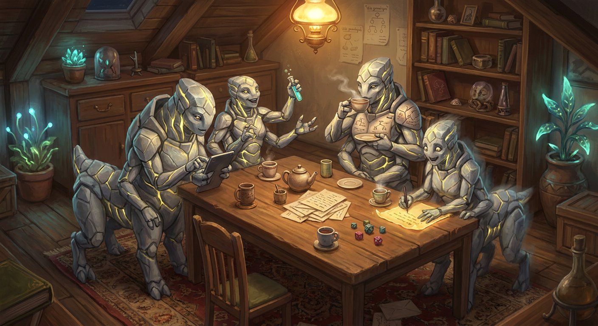

Промпт генератору

Painterly sci-fi concept art. Cozy hidden club room above a restaurant, lit by a warm lamp and glowing potted plants; a table with tea, dice and paper letters. Four creatures of the same four-legged alien species gather: a large strong young female student, an energetic sardonic female biologist, a strong female medicine teacher with a third arm budding from the middle of her chest wearing genealogical charts of voles drawn on her breast skin, and a trembling excitable female lamp-trader, restless, on the verge of spontaneous division, writing a letter with a pressed palm. All follow the species standard: horizontal bodies, rearing front trunks, four eyes, tympana, gray stone-crystal flesh with faint yellow inner glow and geometric plates. They discuss voles, reproduction and forbidden chemistry. Intimate, conspiratorial, tender and anxious mood. One of each creature, no duplicates, no humans.

### Сцена 12. Туллия провожает Ялду к рынку; разговор о квартире и о том, где прятать холин

- **Место:** ночные улицы Зевгмы, рынок
- **Герои:** Ялда, Туллия

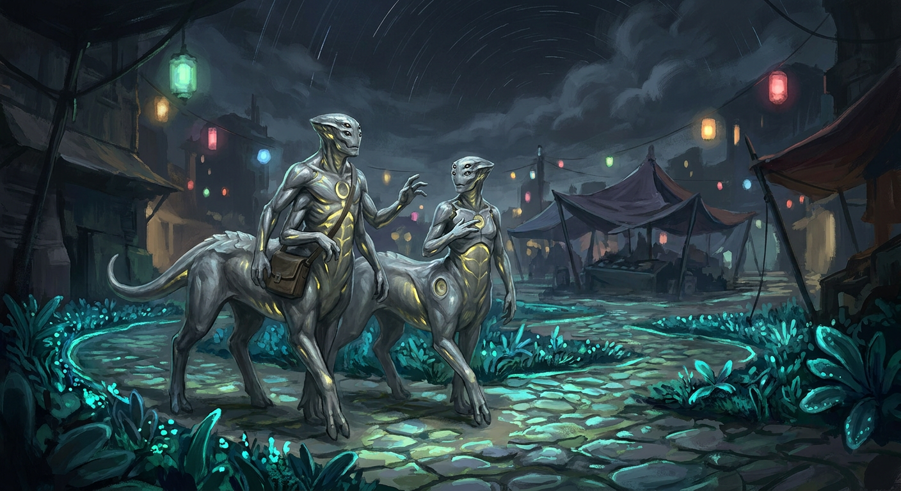

Промпт генератору

Painterly sci-fi concept art. Night streets of an alien city leading to a market square where stall canopies sleep in darkness. An energetic sardonic female biologist walks a large strong young female student home — both four-legged horizontal aliens with rearing front trunks, four eyes, chest tympana, elastic gray stone-crystal flesh with subtle hardened plates and migrating yellow inner glow. They talk in low chirps about apartments and where to hide a precious substance; the student gestures with six-fingered hands, sketching a hiding plan on her own chest skin. Glowing plants line the way, their blue-green light mixing with faint star-trails above; distant lamps glimmer. Mood of warm friendship, whispered secrets and cautious hope in the sleeping city. One of each creature, no duplicates, no humans.

## Глава 4

### Сцена 1. Ялда и Туллия встречаются у Варьете-Холла и попадают на лекцию по списку гостей

- **Место:** перед Варьете-Холлом, Зевгма
- **Герои:** Ялда, Туллия

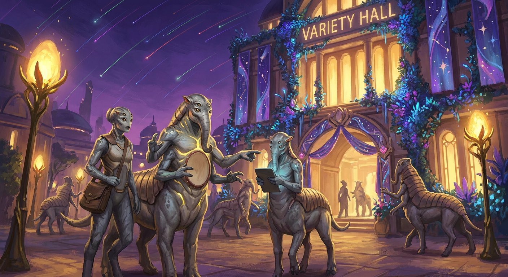

Промпт генератору

Painterly sci-fi concept art. Evening in an alien city square before a grand Variety Hall, its facade glowing with luminous climbing plants and starry banners; above, strange stars trail colored streaks across the violet sky. Two alien beings meet at the entrance and consult a guest list held by a door attendant. The first is a large, physically strong young female of a four-legged species: her horizontal animal-like body on four blunt flat feet, front third rearing upward like a bear, head with four eyes (front and rear pairs), arms with six-fingered hands budding from her chest, a drum-like tympanum membrane on her raised trunk below her mouth, smooth elastic gray stone-crystal flesh with subtle geometric hardened plates and a faint yellow glow migrating deep inside her translucent body. Her companion is a slim, energetic female of the same species, same anatomy — four-legged horizontal body, rearing front trunk, four eyes, tympanum, glowing gray stone-crystal flesh — wearing a scholar's satchel. Lush glowing flowers line the plaza, bioluminescent lanterns flicker, and a curious crowd of similar four-eyed, four-legged beings shuffles toward the doors. Warm golden lamplight, festive yet uneasy mood.

### Сцена 2. Лекция Дарии «Анатомия зверя»: вскрытие и демонстрация световых сигналов древесника

- **Место:** сцена Варьете-Холла
- **Герои:** Ялда, Туллия, Дария, импресарио, помощник, публика, древесник

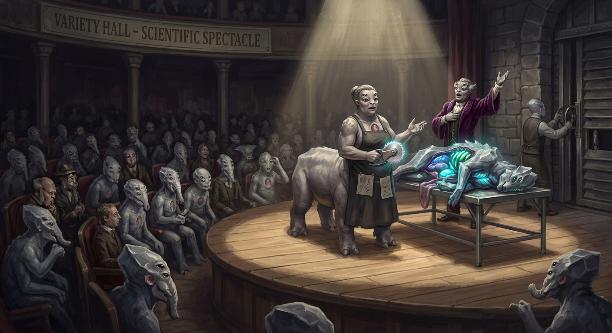

Промпт генератору

Painterly sci-fi concept art. Inside a crowded Variety Hall stage, a medical lecture-cum-dissection performance. On a raised table lies a dead lumbering beast, its gray crystalline carcass opened by a strong middle-aged female scientist of a four-legged alien species: horizontal body on four blunt feet, front trunk rearing like a bear, head with four eyes, arms budding from her chest — one normal pair plus a small third arm breaking through the mid-chest — six-fingered hands, tympanum membrane below her mouth, gray stone-crystal flesh with a deep yellow glow, genealogy diagrams pinned across her chest. She gestures with a circular saw. Beside her a theatrical impresario of the same species, flamboyantly draped, orates to the audience, while an assistant at the wall cranks mechanical shutters that dim the hall. When darkness falls, luminous organs inside the dead beast pulse with light. The audience — rows of four-eyed, four-legged gray-crystal beings — lean forward, some watching with rear eyes, tympana taut with tension. Dramatic spotlight on the table, deep shadows, wonder and morbid fascination.

### Сцена 3. Дария за кулисами отдаёт Ялде флакон холина и даёт наставления

- **Место:** гримёрная комната за кулисами
- **Герои:** Ялда, Туллия, Дария

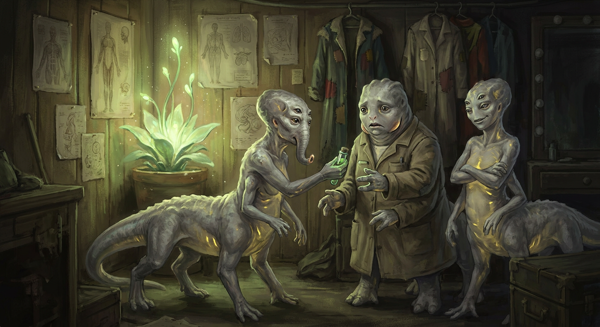

Промпт генератору

Painterly sci-fi concept art. A cramped dressing room backstage, lit by a single potted bioluminescent plant in a corner, its soft glow washing the walls. A middle-aged female scientist — four-legged horizontal alien body on blunt feet, rearing front trunk, four eyes, a small third arm budding from her mid-chest, six-fingered hands, tympanum below her mouth, gray stone-crystal translucent flesh with faint inner yellow light — solemnly hands a small glass vial to a large, strong young female of the same species, identical anatomy, wearing a plain worker's travel coat. Nearby a slim energetic female companion of the same four-eyed, four-legged kind watches with sardonic curiosity. The vial glints greenish in the plant-light. Diagrams and anatomy charts are pinned to a mirror; costumes hang on hooks; dust motes drift in the glow. Intimate, conspiratorial mood: quiet urgency, the older teacher leaning close, her third arm steadying the gift, the young one's tympanum trembling with emotion. Shadows pool in the corners; the air feels heavy with secrets.

### Сцена 4. Ялда и Туллия идут по Большому мосту, говорят о смерти дедушки и семьях

- **Место:** Большой мост над раной Зевгмы
- **Герои:** Ялда, Туллия

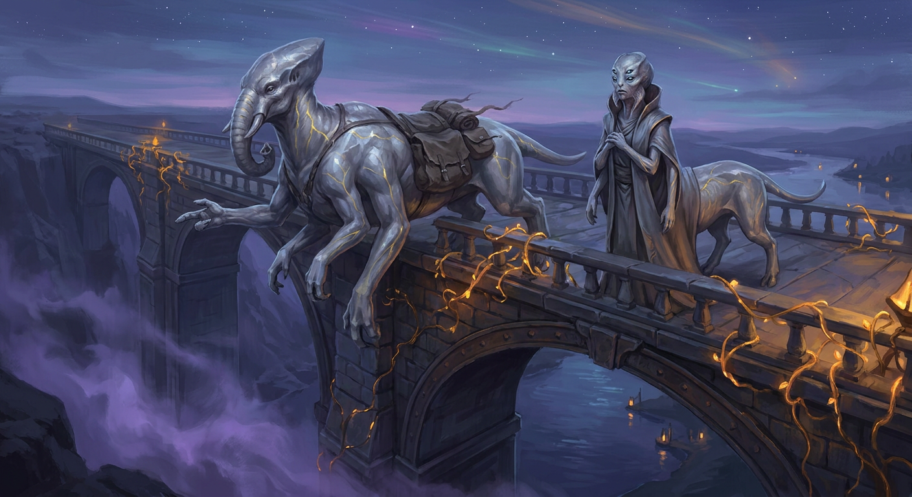

Промпт генератору

Painterly sci-fi concept art. A vast arched bridge spanning a deep gorge above a dark river plain, the Great Bridge of an alien city at dusk. Glowing vines strung along the balustrades shed amber light; distant stars with colored trailing streaks hang above. Two alien beings walk side by side across the span: a large, physically strong young female and a slim, sardonic female scholar, both of the same species — horizontal four-legged bodies on blunt flat feet, front trunks rearing like bears, heads with four eyes front and rear, six-fingered arms from the chest, tympana below their mouths, smooth gray stone-crystal flesh veined with faint migrating yellow glow. They speak in low rhythmic tones, one gesturing toward the chasm below, the other's tympanum quivering with grief as they talk of a lost grandparent and distant families. Wind tugs at their satchels. The gorge below is veiled in violet mist; lanterns of the far shore reflect in the dark water. Melancholy, tender mood of friendship and mourning, cool blue-violet palette with warm bridge-lamp accents.

### Сцена 5. В квартире Туллии: поиск эссе, тактильная передача текста кожей

- **Место:** квартира Туллии на 11-м этаже башни
- **Герои:** Ялда, Туллия

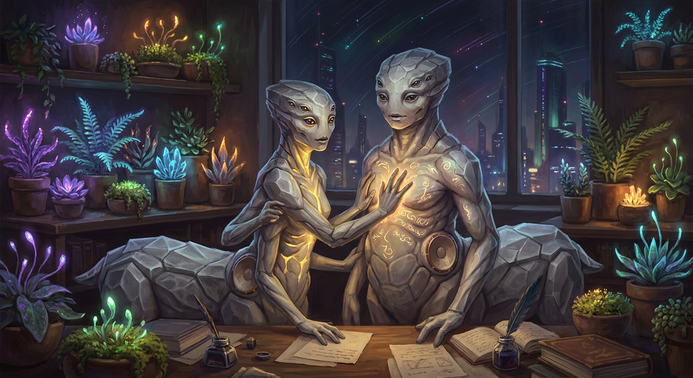

Промпт генератору

Painterly sci-fi concept art. A lampless high-rise apartment on the eleventh floor, illuminated entirely by potted glowing plants — shelves of luminous ferns casting green and amber light over a cluttered study. Two alien beings sit close together at a low desk: a slim, energetic female scholar and a large, strong young female friend, both of the same species — four-legged horizontal bodies, rearing bear-like front trunks, heads with four eyes, six-fingered arms budding from the chest, tympana below the mouth, translucent gray stone-crystal flesh with inner yellow glow. The scholar presses her palm flat against her friend's chest skin, transferring the pattern of an essay tactile through touch, the young female's skin showing faint glowing script and diagrams swelling where the hand touches. Papers and ink bottles crowd the desk; the window behind them shows the night city, stars with colored trails above glowing towers. Intense, studious intimacy, faces tilted toward each other, rear eyes watching the plants flicker. Warm bioluminescent palette, deep soft shadows, a mood of shared concentration and quiet affection.

### Сцена 6. Передача диссертации закончена; Туллия зовёт Ялду жить вместе; Ялда размышляет

- **Место:** квартира Туллии
- **Герои:** Ялда, Туллия

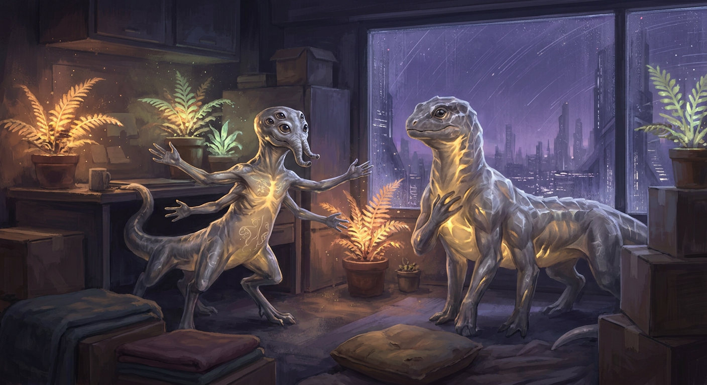

Промпт генератору

Painterly sci-fi concept art. The same glowing-plant apartment at night, potted luminous ferns casting soft amber-green light. Two alien beings of a four-legged species — horizontal bodies, rearing front trunks, four-eyed heads, six-fingered arms from the chest, tympana, translucent gray stone-crystal flesh with inner yellow glow — face each other beside the desk where the last glowing essay-diagrams fade from the large young female's chest skin. The slim energetic host leans forward, arms spread in welcoming invitation, offering her home; her tympana flutter with hopeful chirps. The larger, stronger visitor stands hesitant by the window, one hand on her own chest, city lights and star-trails beyond the glass, plants brushing her flanks. Moving boxes and spare bedding hint at a shared future; a second cushion has already been laid out. Bittersweet, hopeful mood: friendship on the edge of becoming family, warm bioluminescence against the cold violet night outside, dust and pollen glowing in the air.

### Сцена 7. Антония приходит взволнованная: её ко закрыл её торговлю и готовит детей

- **Место:** квартира Туллии
- **Герои:** Ялда, Туллия, Антония

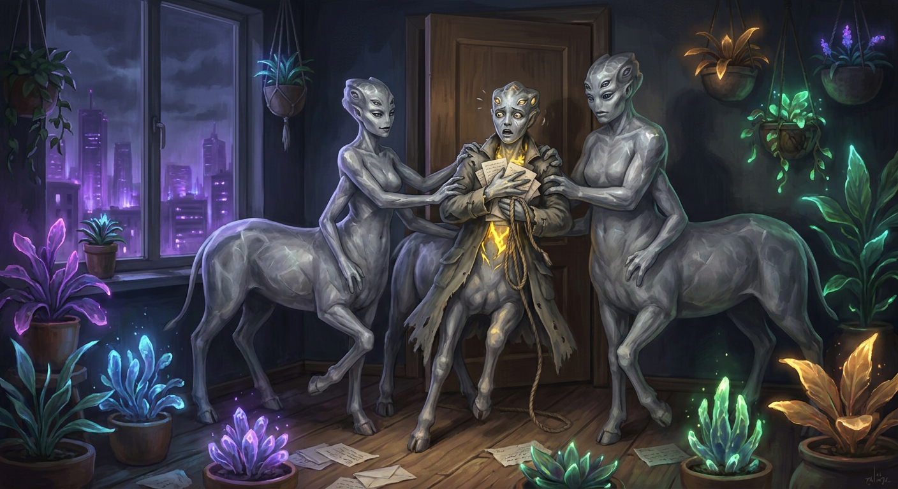

Промпт генератору

Painterly sci-fi concept art. Night in the plant-lit apartment; door flung open, a distraught lamp-seller — a trembling female of the same four-legged alien species: horizontal body on four legs, rearing front trunk, four eyes wide with fear, six-fingered hands shaking, tympana shivering, gray translucent stone-crystal flesh with agitated flickering inner yellow glow, travel-worn coat, a bundle of handwritten paper letters clutched to her chest and a loose rope dangling from her bound wrists — stumbles into the room. She is caught between two friends: a slim sardonic hostess and a large strong young female, both identical in species anatomy — four eyes, tympana, six-fingered arms, glowing gray crystal flesh — steadying her shoulders and closing the door behind her. Potted luminous plants flare with her agitation, their light pulsing; paper letters scatter to the floor. The mood is urgent, frightened, protective: shadows tighten in the corners, the night city glows violet beyond the window, and the three lean heads together in a huddled council of danger.

## Глава 5

### Сцена 1. Фоско довозит Ялду на грузовике по извилистой дороге на склоны Бесподобной и передаёт припасы в тележку; разговор о тепловом ударе

- **Место:** узкая дорога на склоне Бесподобной
- **Герои:** Ялда, Фоско

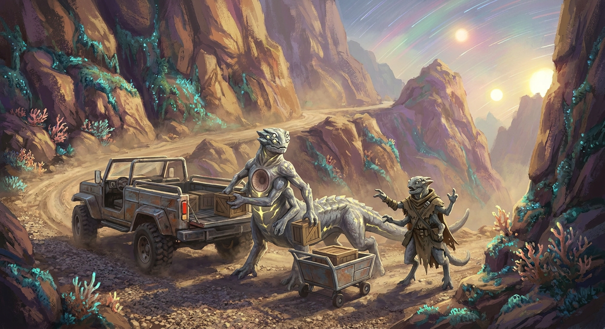

Промпт генератору

Painterly sci-fi concept art. A narrow winding road carved into the slopes of a vast mountain, a boxy open truck parked at the roadside. A large, strong female of a four-legged alien species — horizontal animal-like body, front trunk rearing upward like a rearing bear, four eyes (front and rear pairs), drum-like tympanum on the raised chest, six-fingered hands on multiple arms, smooth gray stone-crystal flesh with faint yellow inner glow — unloads crates of supplies from the truck into a small cart. Beside her, a male truck driver of the same species — four-legged horizontal body, rearing front trunk, four eyes, tympanum, gray stone-crystal flesh, two arms, worn traveling gear — gestures in conversation, mouth and tympanum animated. Bioluminescent grass and glowing shrubs line the road edge; the mountain slopes rise steeply, huge colored star-trails visible in the bright alien sky. Warm afternoon light from the twin suns casts long shadows; dust hangs in the air. Mood: friendly farewell mixed with apprehension about the heat and the long climb ahead. One creature per character, no duplicates.

### Сцена 2. Одинокое восхождение по тропинке, перегрев, болезнь, ночь в выкопанной яме и галлюцинации

- **Место:** тропа на склоне Бесподобной
- **Герои:** Ялда

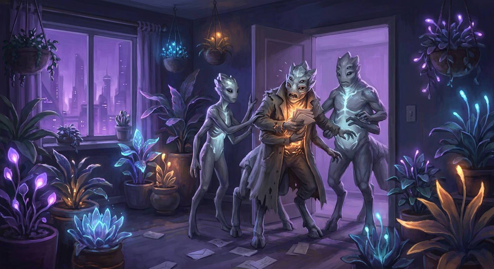

Промпт генератору

Painterly sci-fi concept art. A solitary ascent: a large, strong female of a four-legged alien species — horizontal animal-like body on four blunt feet, front trunk rearing upward, four eyes including a rear pair, drum-like tympanum on the raised chest, six-fingered hands, smooth gray stone-crystal flesh with geometric hardened plates and a weakening yellow inner glow — hauls a small cart up a steep mountain trail. Her body shows strain and exhaustion, glow flickering. Scene shows her at night digging a shallow pit beside the trail with her hands, then curling into it; the same landscape can suggest her lying in the pit under swirling stars with colored trails, eyes half-closed, faint hallucinatory shimmer of impossible glowing shapes drifting around her. Bioluminescent moss lights the rocks faintly. Cold blue starlight, deep shadows, oppressive stillness of the high slopes. Mood: isolation, suffering, dreamlike delirium. One creature, no duplicates.

### Сцена 3. Ялда приходит в обсерваторию, знакомится с Ренато, тот показывает хозяйство и телескоп; она успешно наводится на Ситу

- **Место:** обсерватория на вершине Бесподобной
- **Герои:** Ялда, Ренато

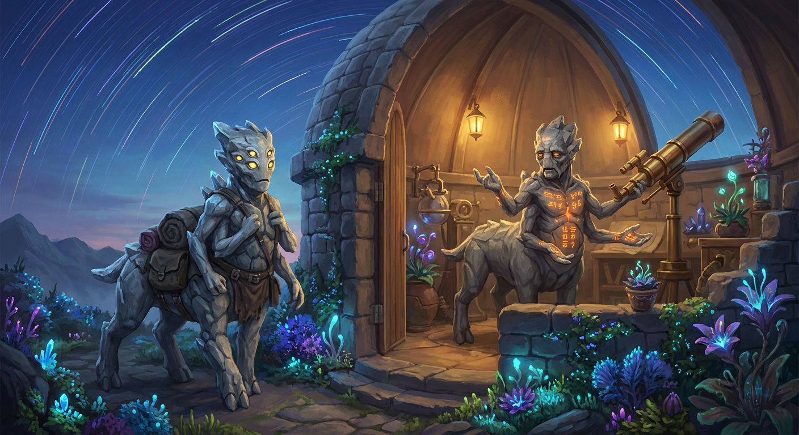

Промпт генератору

Painterly sci-fi concept art. A small mountaintop observatory: stone buildings with a large telescope dome, glowing alien plants clustered at the summit, colored star-trails blazing in the twilight sky. A large strong female of a four-legged alien species — horizontal body on four legs, rearing front trunk, four eyes, tympanum on the chest, six-fingered hands, gray stone-crystal flesh with yellow inner glow, travel-worn — arrives and greets an elderly male astronomer of the same species: four-legged horizontal body, rearing front trunk, four eyes, several pairs of arms, gray stone-crystal flesh with dim glow, unable to speak — glowing words surfacing on his chest and palm — leaning on a bench beside a great brass telescope inside the dome. He gestures proudly, showing her the quarters and instrument. Warm lamplight inside the dome, cold starlight through the open shutter. Mood: welcome, wonder, scientific curiosity. One creature per character, no duplicates.

### Сцена 4. Ренато уходит; Ялда одна осваивается, ночью настраивает своё оптическое устройство со штифтами и зеркалом на спектр Ситы

- **Место:** обсерватория и наблюдательная будка
- **Герои:** Ялда

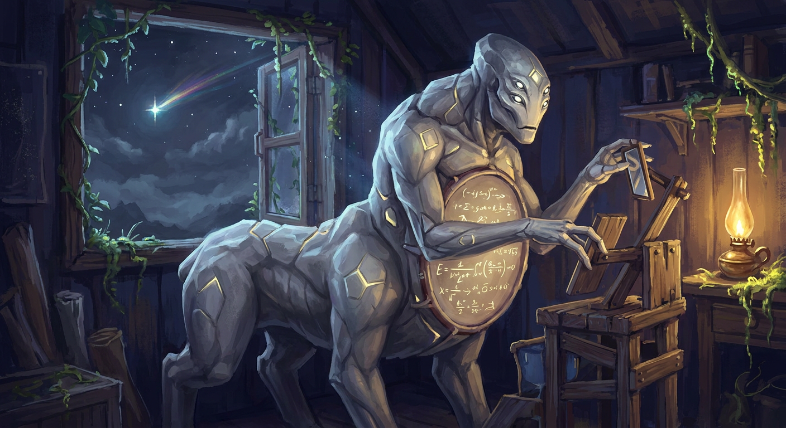

Промпт генератору

Painterly sci-fi concept art. Night inside a mountaintop observatory's observation booth. A large strong female of a four-legged alien species — horizontal four-legged body, rearing front trunk, four eyes, drum-like tympanum on the chest, six-fingered hands, smooth gray stone-crystal flesh with subtle geometric plates and a steady yellow inner glow — works alone, adjusting a homemade optical instrument: a pinhole apparatus with small mirrors mounted on a wooden frame, aimed through an open window toward a bright star with a colored trail. Diagrams and calculations are written directly in glowing script on the skin of her own chest, her hands turning mirrors with delicate precision. Cold starlight floods the booth, mixing with a warm oil lamp; bioluminescent vines frame the window. Mood: quiet concentration, solitude, the thrill of first observations. One creature, no duplicates.

### Сцена 5. Ночное созерцание звёзд; за следующие ночи Ялда добивается идеального круга изображения Ситы и снимает данные по Джуле и Мине

- **Место:** наблюдательная будка, кабинет
- **Герои:** Ялда

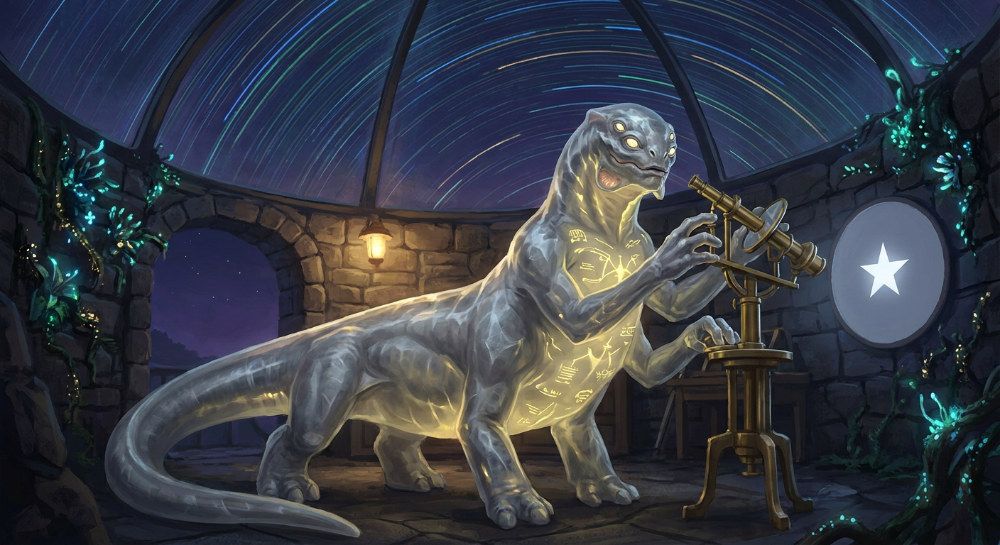

Промпт генератору

Painterly sci-fi concept art. Deep night at the mountaintop observatory. A large strong female of a four-legged alien species — horizontal body on four blunt feet, rearing front trunk, four eyes, tympanum, six-fingered hands, gray stone-crystal flesh with a calm yellow inner glow — stands at the eyepiece of her pin-and-mirror optical device in the observation booth, gazing at the stars. Through successive nights she refines her instrument until the star's image forms a perfect circle on her projection screen; she records data on sheets and on her own chest-skin, glowing diagrams spreading across the translucent gray flesh. The sky above the summit blazes with stars trailing colored streams; luminous plants cling to the observatory walls. Cold blue-violet starlight dominates, with a single warm lamp inside. Mood: patient dedication, reverent awe at the night sky. One creature, no duplicates.

### Сцена 6. Наблюдения за слабыми звёздами: Теро не даёт результата, после отдыха Ялда покоряет Лепато

- **Место:** наблюдательная будка, тропа
- **Герои:** Ялда

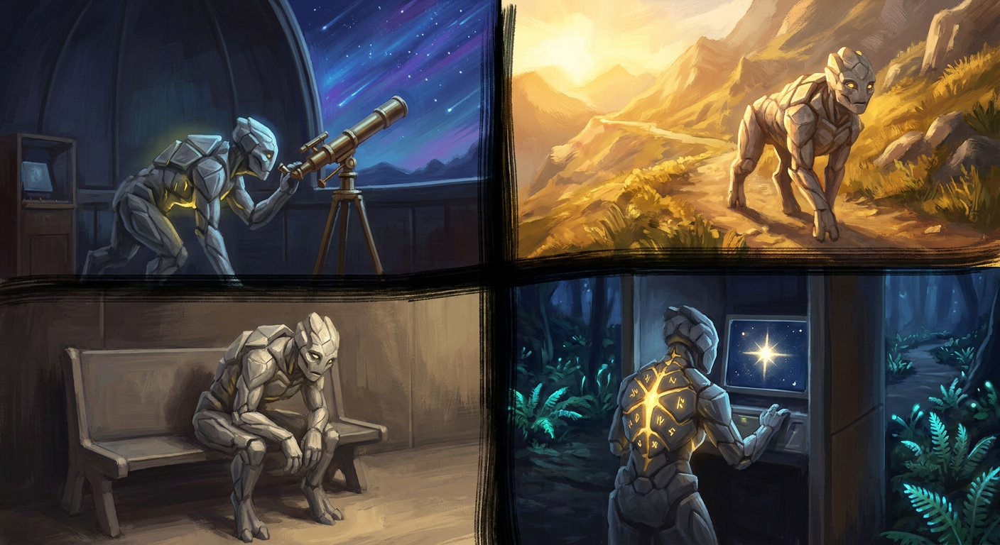

Промпт генератору

Painterly sci-fi concept art. A mountaintop observation booth at night, then a sunlit mountain trail. A large strong female of a four-legged alien species — horizontal four-legged body, rearing front trunk, four eyes, tympanum on the chest, six-fingered hands, gray stone-crystal flesh with geometric plates and yellow inner glow — strains at her telescope eyepiece observing a faint, stubborn star, her glow dimming with fatigue; then rests, then walks the trail near the observatory to clear her head, and finally returns triumphant, capturing the elusive star. Show her in the booth with a look of quiet victory, glowing notes on her chest skin. Bioluminescent plants line the trail; stars with colored trails fill the sky. Contrast cool starlit observation with warm golden daylight. Mood: perseverance and earned triumph. One creature, no duplicates.

### Сцена 7. Ялда анализирует данные дюжины звёзд и открывает квадратичную связь длины волны и скорости, сводя её к теореме Пифагора

- **Место:** кабинет обсерватории
- **Герои:** Ялда

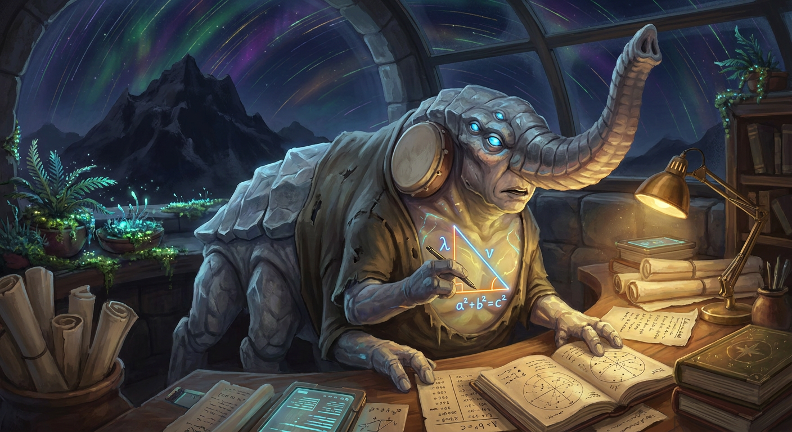

Промпт генератору

Painterly sci-fi concept art. A cozy study inside a mountaintop observatory at night. A large strong female of a four-legged alien species — horizontal body on four legs, rearing front trunk, four eyes, drum-like tympanum, six-fingered hands, smooth gray stone-crystal flesh with faint yellow migrating glow — works intently at a desk covered with data sheets, columns of measurements for a dozen stars, hand-drawn graphs. She draws a glowing diagram directly on the skin of her own chest: wavelengths and velocities forming a right triangle, the Pythagorean relation glowing on her translucent flesh. Warm lamplight, glowing ink, papers scattered; through the window, alien stars with colored trails hang over the dark summit, bioluminescent plants shimmering on the sill. Mood: dawning epiphany, the electric moment of discovery, exhaustion turned to exhilaration. One creature, no duplicates.

### Сцена 8. Ялда сомневается, перепроверяет расчёты, приходит к идее единства света и четырёхмерной геометрии; вечером обращается к Сите

- **Место:** кабинет, жилые помещения, тропа у обсерватории
- **Герои:** Ялда

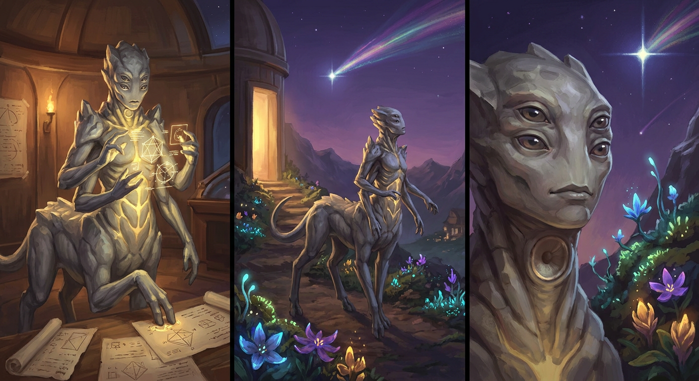

Промпт генератору

Painterly sci-fi concept art. Evening sequence at a mountaintop observatory: a study, living quarters, and a trail outside. A large strong female of a four-legged alien species — horizontal four-legged body, rearing front trunk, four eyes, tympanum, six-fingered hands, gray stone-crystal flesh with a thoughtful yellow inner glow — sits in the study re-checking calculations, sheets of figures spread before her, glowing geometric diagrams on her chest skin: rays of light drawn as lines in a four-dimensional lattice. She rises and walks out onto the trail at dusk, pausing to gaze up at a single bright star with a long colored trail dominating the twilight sky, her four eyes fixed upward, tympanum taut with emotion. Warm interior lamplight gives way to deep violet dusk outside; bioluminescent flowers glow along the path. Mood: doubt dissolving into profound conviction, a quiet dialogue with a star. One creature, no duplicates.

## Глава 6

### Сцена 1. Джорджо допрашивает Ялду о природе времени и пространства в его кабинете, готовя её к выступлению перед учёными

- **Место:** кабинет Джорджо в Зевгме, комната рядом с яслями
- **Герои:** Ялда, Джорджо

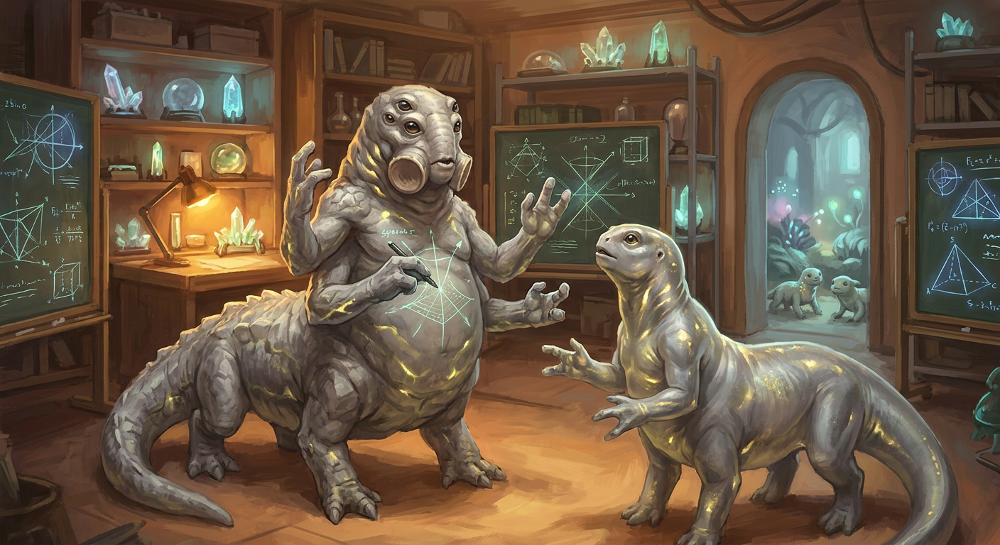

Промпт генератору

Painterly sci-fi concept art. A cozy study in an alien scholarly home, walls lined with glowing crystalline instruments and chalkboards covered in geometric physics diagrams. A stern elderly male teacher, heavyset, four-legged horizontal body on blunt flat feet, front trunk rearing up like a bear with four eyes (front and rear pairs), a drum-like tympanum membrane below his mouth, smooth elastic gray stone-crystal flesh with faint geometric hardened plates and a migrating yellow inner glow. His two six-fingered hands gesture as he sketches a spacetime diagram in glowing ink on his own chest. Facing him stands a large, physically strong young female student, same species: four-legged horizontal body, rearing front trunk, four eyes front and back, tympanum membrane, gray translucent stone-crystal flesh shimmering with yellow inner light, her two hands spread attentively as she answers. Through a doorway, a nursery where small hatchlings chirp and buzz amid softly luminous plants. Warm amber lamplight mixed with the cold sheen of the diagrams; mood of a demanding but affectionate oral examination, teacher's eyes widened with excitement.

### Сцена 2. Ялда понимает и признаёт возражение Джорджо о нестабильности волн с экспоненциальным ростом

- **Место:** там же, кабинет Джорджо
- **Герои:** Ялда, Джорджо

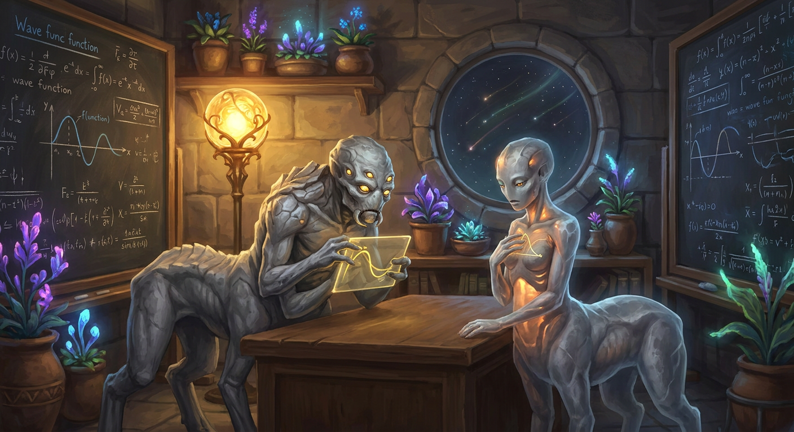

Промпт генератору

Painterly sci-fi concept art. Same cozy alien study: chalkboards dense with wave-amplitude equations, luminous plants in clay pots, starlight with colored trails drifting through a round window. The elderly male scholar, four-legged horizontal body, bear-like rearing front trunk, four eyes in front and rear pairs, tympanum membrane below his mouth, gray elastic stone-crystal flesh with faint hardened plates and a deep migrating yellow glow, leans forward on two six-fingered hands, drawing an exponentially growing oscillation curve on his chest, eyes widened, buzzing with theatrical emphasis. Opposite him, a large strong young female of the same species — four-legged horizontal body, rearing trunk, four eyes including rear vision, tympanum, translucent gray stone-crystal flesh with warm yellow inner light — lowers her gaze in sudden comprehension, her tympanum fluttering with a low hum of acknowledgment, one hand tracing the unstable wave diagram on her own chest skin. Quiet dramatic moment of intellectual surrender and insight; warm lamplight against cool glowing chalk marks, mood of mentor and student reaching genuine agreement.

## Глава 7

### Сцена 1. Ялда и Туллия выходят из Варьете-Холла, обсуждают представление и судьбу Антонии

- **Место:** площадь у Варьете-Холла, Зевгма, вечер
- **Герои:** Ялда, Туллия

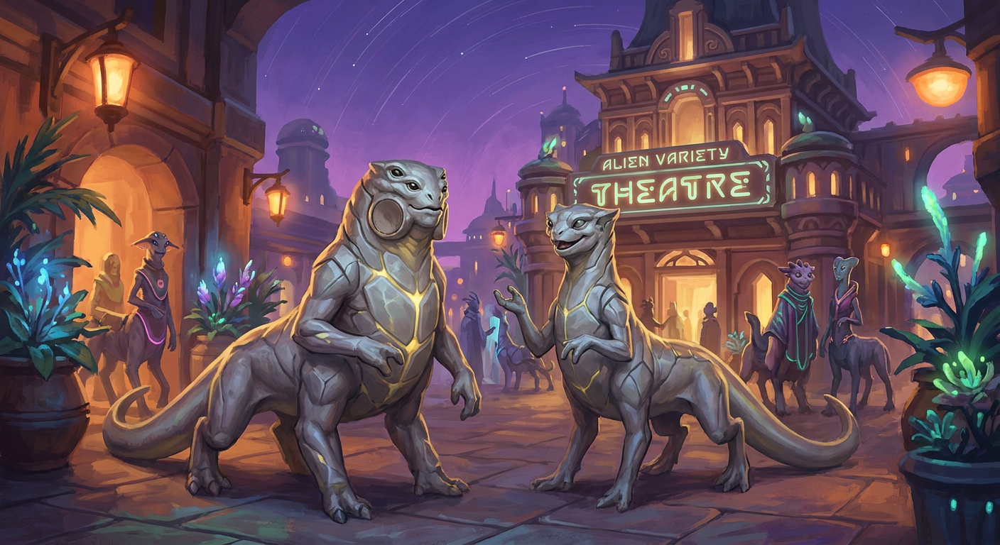

Промпт генератору

Painterly sci-fi concept art. Two alien creatures stand on a plaza outside a variety theatre in a bustling alien city at dusk, chatting after a show. One is a large, powerfully built female with a four-legged horizontal animal-like body, rearing front trunk, four eyes (front and rear pairs), a drum-like tympanum below her mouth, two six-fingered arms, smooth gray stone-crystal flesh with subtle geometric hardened plates and a faint migrating yellow inner glow. Her companion is a slim energetic female biologist of the same species, four legs, rearing trunk, four eyes, tympanum, two arms, chirping playfully. Around them: ornate theatre facade, luminous potted plants glowing softly, alien passersby, star trails streaking the deepening violet sky. Warm lamplight and cool plant-glow mix on the pavement. One creature each, no duplicates. Mood: lively, curious, festive evening.

### Сцена 2. Появление гремучей звезды в небе; Ялда фиксирует координаты, Туллия время; молодой хулиган бросает камень в Ялду, она отвечает брошенным камнем, попав ему в тимпан

- **Место:** площадь, ночь
- **Герои:** Ялда, Туллия, молодой хулиган, его ко, друзья хулигана

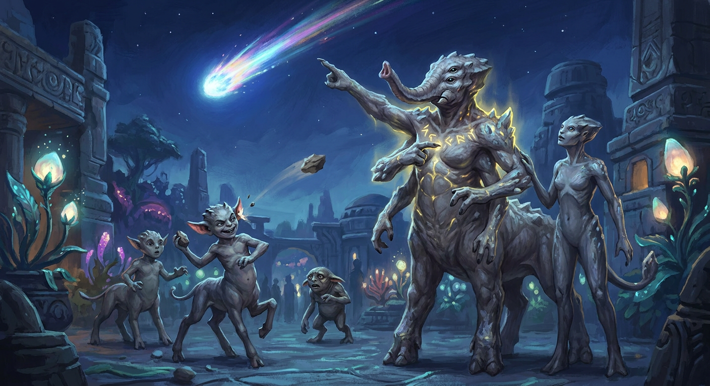

Промпт генератору

Painterly sci-fi concept art. Night plaza scene: two alien females of a four-legged species — a large strong female with rearing trunk, four eyes, tympanum, gray stone-crystal flesh with faint yellow inner glow, two six-fingered arms, and a slim female companion beside her — look up as a spectacular rattling star blazes across the sky with a glowing colored trail. The large female traces coordinates on her own chest skin with a fingertip. Nearby, a young male troublemaker of the same species hurls a stone at her; she throws one back, striking his tympanum, while his startled mates and his co (a small tense companion) flinch. Lit by the star's trail, plant-glow lamps, deep blue night. Four-legged horizontal bodies, rearing trunks, four eyes, blunt flat feet. One creature each, no duplicates. Mood: sudden violence amid wonder.

### Сцена 3. Ялда и Туллия обсуждают наблюдение, скорость гремучих звезд и теорию времени, идут домой записывать результаты

- **Место:** улицы Зевгмы по пути к дому Туллии
- **Герои:** Ялда, Туллия

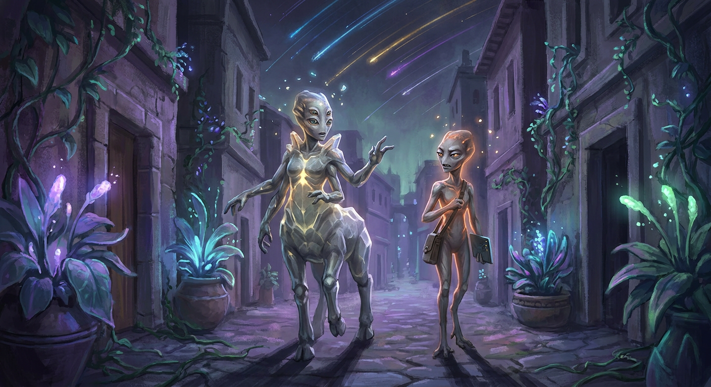

Промпт генератору

Painterly sci-fi concept art. Two alien females walk home through narrow night streets of an alien city, deep in animated technical conversation. The large one, a strong heavyset creature with four-legged horizontal body, rearing front trunk, four eyes front and rear, tympanum, two six-fingered arms, gray translucent stone-crystal flesh glowing faintly yellow inside, gestures mid-thought. Her slim biologist friend, same species standard, chirps sardonically. Streets lined with luminous plants in pots and glowing vines on walls instead of lamps; colored stellar trails hang in the sky above rooftops. Cool plant-glow lighting, long shadows, intimate conversational mood, sense of ideas sparking between them. One creature each, no duplicates.

### Сцена 4. В квартире Туллии Антония пишет письмо; девушки приходят за краской для записи наблюдений

- **Место:** квартира Туллии
- **Герои:** Ялда, Туллия, Антония

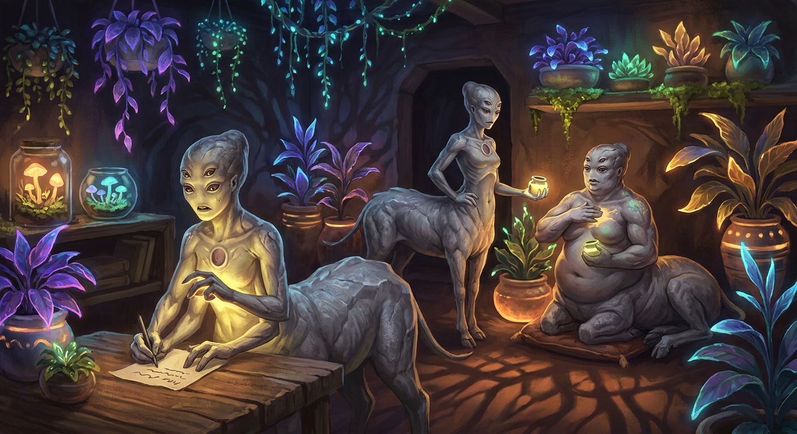

Промпт генератору

Painterly sci-fi concept art. Interior of a lampless alien apartment lit entirely by potted glowing plants; bioluminescent leaves cast green and gold light. A nervous lamp-seller, a female of the four-legged alien species with rearing front trunk, four eyes, tympanum, two trembling six-fingered arms, gray stone-crystal flesh with faint yellow inner glow, sits writing a letter on paper, agitated, near spontaneous division. The apartment's owner, a slim sardonic female biologist, hands a pot of luminous paint to a large strong female visitor — same species standard, four legs, rearing trunk, four eyes, two arms, heavyset body — who prepares to record observations on her own chest skin. Cozy yet tense atmosphere, plant-glow chiaroscuro. One creature each, no duplicates.

### Сцена 5. В квартиру врывается полиция, арестовывает Ялду и Антонию; Ялду сковывают спаянными руками и бьют по тимпану

- **Место:** квартира Туллии
- **Герои:** Ялда, Туллия, Антония, полицейские офицеры

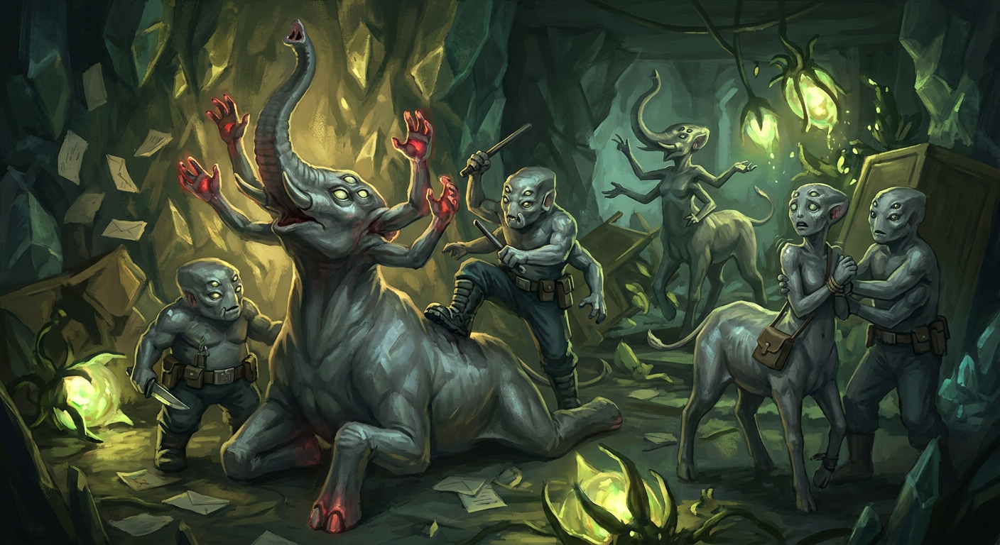

Промпт генератору

Painterly sci-fi concept art. Harrowing arrest scene in a plant-lit alien apartment: police officers of the four-legged alien species — with belts and knives, one a cruel dwarf-bodied officer pressing a boot down — restrain a large strong female, her six-fingered hands fused together with red resin, an officer striking her tympanum. Beside them a trembling lamp-seller female with bound arms is seized; the apartment's slim owner protests, all animals with horizontal four-legged bodies, rearing trunks, four eyes, gray stone-crystal flesh with faint yellow inner glow. Potted glowing plants knocked askew, green-gold light thrown into wild shadows, paper letters scattered. Dramatic, claustrophobic, violent mood. One creature each, no duplicates.

## Глава 8

### Сцена 1. Ялда и Туллия, в соседних камерах тюрьмы, перешептываются через стены: советы о слушании у сержанта, затем переходят на обсуждение светового уравнения и проблемы экспоненциального взрыва

- **Место:** Соседние камеры тюрьмы (подвал), городские бараки
- **Герои:** Я, л, д, а, , , , Т, у, л, л, и, я

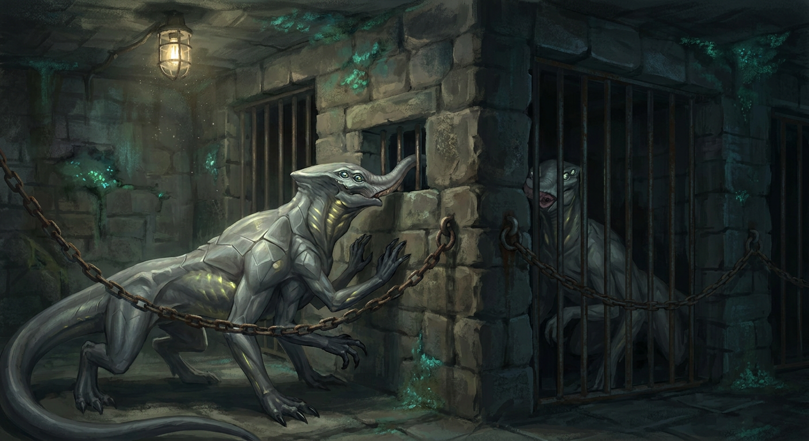

Промпт генератору

Painterly sci-fi concept art. A dim stone basement prison with two adjacent cells separated by a thick wall; a heavy metal chain runs through both cells. In one cell, a large, strong female alien creature of the standard species: horizontal four-legged body, rearing front trunk, four eyes (front and rear pairs), a drum-like tympanum on the raised chest below her mouth, arms with six-fingered hands budding from her chest, smooth elastic gray stone-crystal flesh with subtle hardened geometric plates and a faint migrating yellow inner glow. She leans her tympanum close to the wall, whispering to a similar female prisoner in the neighboring cell, visible through a barred opening. Faint bioluminescent moss glows on the damp walls; a single dim lamp casts long shadows. Mood of hushed conspiracy and fragile friendship in oppressive darkness. One creature per cell, no duplicates.

### Сцена 2. Ялда одна в камере считает дни по звону часов, думает о судьбе Туллии, репетирует, что скажет сержанту

- **Место:** Камера Ялды в тюрьме
- **Герои:** Я, л, д, а

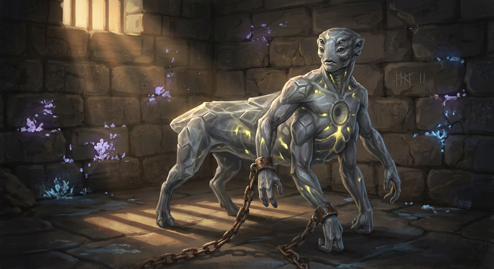

Промпт генератору

Painterly sci-fi concept art. A lone prison cell in a stone basement; the same large, strong female alien of the standard species — horizontal four-legged body, rearing front trunk, four eyes, tympanum on the chest below her mouth, chest arms with six-fingered hands, gray translucent stone-crystal flesh with faint yellow inner glow and geometric hardened patches — paces slowly, counting days as muffled clock chimes echo. Her limbs are bound by a heavy chain with soldered links. Weak lamplight from a corridor grate stripes the floor; glowing pale lichen spots the wall. Mood of solitude, patient endurance and quiet mental rehearsal, her four eyes thoughtful, tympanum faintly humming. One creature only, no duplicates.

### Сцена 3. Слушание у сержанта: дюжина прикованных заключённых, разбор чужих дел, затем дело Ялды — гигантский штраф, который ей нечем оплатить, возвращение в камеру

- **Место:** Комната для слушаний в бараках, затем лестница обратно в подвал
- **Герои:** Я, л, д, а, , , , с, е, р, ж, а, н, т, , , , о, х, р, а, н, н, и, к, и, , , , п, о, м, о, щ, н, и, к, , , , б, о, л, е, е, , д, ю, ж, и, н, ы, , з, а, к, л, ю, ч, ё, н, н, ы, х, , (, м, у, ж, ч, и, н, , и, , ж, е, н, щ, и, н, ), , , , м, о, л, о, д, о, й, , в, о, р, , к, а, р, а, в, а, я, , , , н, а, р, у, ш, и, т, е, л, ь, , г, р, а, н, и, ц, ы, , с, а, д, а

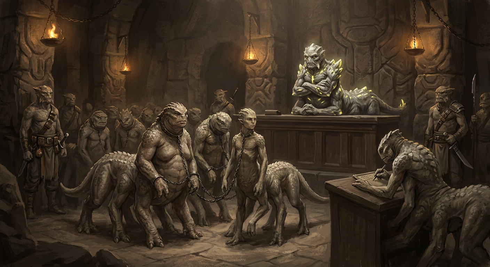

Промпт генератору

Painterly sci-fi concept art. A crowded hearing room in stone barracks: a stern older male sergeant of the same four-legged, four-eyed, tympanum-bearing alien species sits elevated behind a wooden bench, gray stone-crystal flesh glowing faintly yellow, arms folded. Before him, more than a dozen chained male and female prisoners — all the same species, horizontal bodies, rearing trunks, soldered limbs, heads bowed in fear. Among them a large strong female and a lean young male thief. Guards with belts and knives stand at the walls; a clerk scratches records. Harsh oil lamps, dust in the air, oppressive mood of bureaucratic severity and despair. Each creature appears once, no duplicates.

### Сцена 4. Ялда в темноте камеры размышляет о своих заблуждениях, о еде и энтропии, затем производит выкладки о сферических гармониках и приходит к идее тороидального космоса

- **Место:** Камера Ялды
- **Герои:** Я, л, д, а

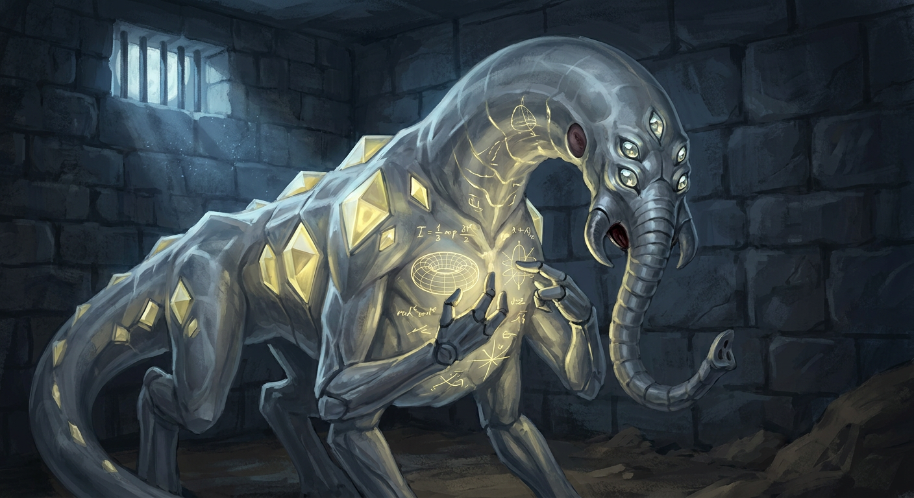

Промпт генератору

Painterly sci-fi concept art. Deep night in a small stone prison cell; the large female alien prisoner of the standard species — horizontal four-legged body, rearing front trunk, four eyes, tympanum below her mouth, chest arms with six-fingered hands, gray translucent stone-crystal flesh with geometric plates and migrating yellow glow — bends her head down, tracing glowing mathematical diagrams of spherical harmonics and a torus-shaped cosmos directly on the skin of her own chest with a fingertip. The faint yellow marks shimmer in the darkness, the only light besides a thin grate of moonlight. She is unchained now, absorbed, eyes wide with revelation. Mood of solitary intellectual epiphany in darkness. One creature only, no duplicates.

### Сцена 5. Охранники освобождают Ялду — штраф оплачен; отделение от цепи, возвращение рук, выход на свет

- **Место:** Камера, затем верхний этаж бараков
- **Герои:** Я, л, д, а, , , , д, в, о, е, , о, х, р, а, н, н, и, к, о, в, , с, , л, а, м, п, а, м, и

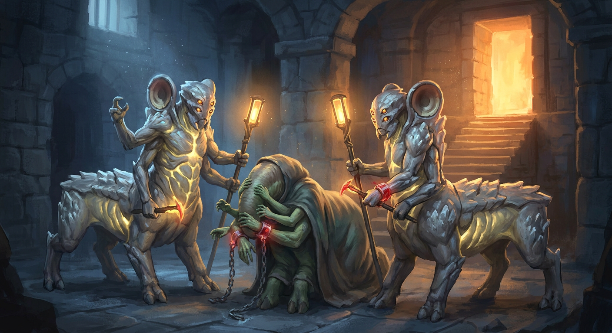

Промпт генератору

Painterly sci-fi concept art. A prison cell opening at dawn: two burly male guards of the same alien species — four-legged horizontal bodies, rearing trunks, four eyes, tympanums, gray stone-crystal flesh with yellow inner glow, carrying glowing lamps — unlock the chain of the large female prisoner. Her soldered limbs are being freed, fresh arms budding from her chest as the guards break the red resin sealing her hands. Warm lamplight against cold blue dungeon shadows; the doorway at the top of the stairs blazes with morning light, symbolizing release. Mood of relief, rebirth and hesitant hope. One female creature and two guards, each appearing once, no duplicates.

### Сцена 6. Евсебио ждёт Ялду у тюрьмы; объясняет, что огромный штраф был местью его соперника Ачилио, и он сам его оплатил; они решают продолжить занятия

- **Место:** Улица у городских бараков
- **Герои:** Я, л, д, а, , , , Е, в, с, е, б, и, о

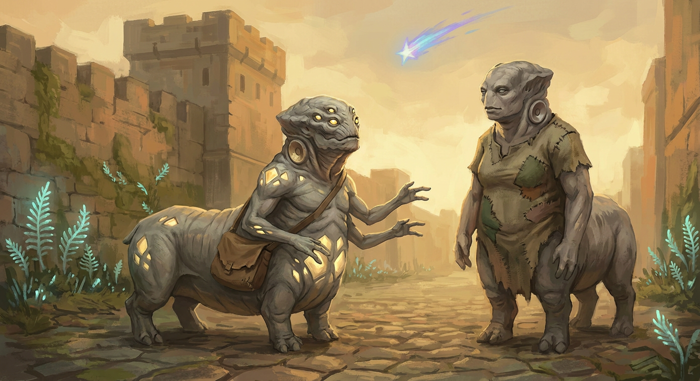

Промпт генератору

Painterly sci-fi concept art. A cobbled street outside stone city barracks in warm afternoon light. An elderly male scholar of the standard alien species waits — horizontal four-legged body, rearing front trunk, four eyes, drum-like tympanum, six slender arms with six-fingered hands gesturing in explanation, wrinkled gray stone-crystal flesh with hardened geometric patches and a soft yellow inner glow, wearing a simple teaching satchel. He speaks with the large strong female just released from prison, same species, four eyes, tympanum, chest arms, faint yellow glow under translucent gray flesh. Bioluminescent street plants glow faintly at the roadside; a star with a colored trail hangs in the daytime sky. Mood of gratitude, friendship and renewed purpose. Each creature once, no duplicates.

### Сцена 7. Ялда в банке и на рынке, день в парке; вечером приходит к Туллии: новости об Антонии, холин, гремучие звезды и открытие тороидального космоса

- **Место:** Банк, рынок, тихий парк, квартира Туллии
- **Герои:** Я, л, д, а, , , , Т, у, л, л, и, я, , , , б, а, н, к, о, в, с, к, и, й, , с, л, у, ж, а, щ, и, й

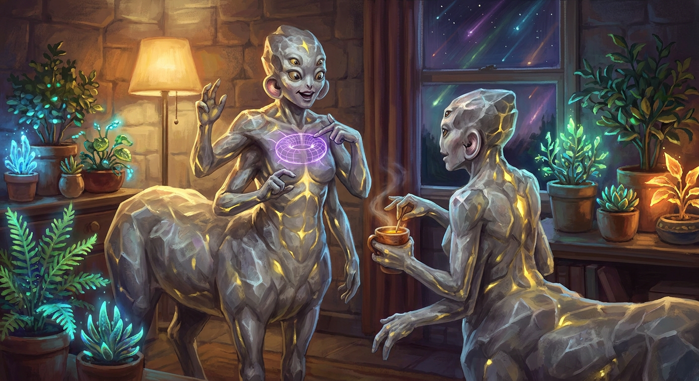

Промпт генератору

Painterly sci-fi concept art. Evening interior of a modest apartment, warm lamplight and softly glowing potted plants. The large strong female of the standard alien species — horizontal four-legged body, rearing front trunk, four eyes, tympanum, chest arms with six-fingered hands, gray translucent stone-crystal flesh with yellow inner glow — excitedly shares news, tracing a glowing torus diagram on her own chest skin. Facing her, a female friend of the same species, similar anatomy, leans in with tympanum humming, stirring a cup of a warm amber drink. Through a window, night stars streak with faint colored trails and distant rumbled thunder-glow. Mood of warm reunion, animated scientific talk and shared wonder. Two creatures, each once, no duplicates.

## Глава 9

### Сцена 1. Ялда пешком идёт от посёлка к ферме, встречает девочку Аду, которая её ждёт и расспрашивает о семье

- **Место:** Дорога от посёлка к ферме
- **Герои:** Ялда, Ада

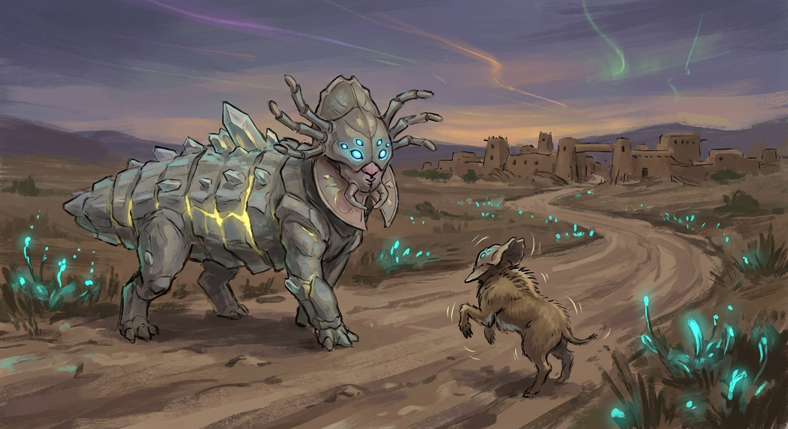

Промпт генератору

Painterly sci-fi concept art. A dusty country road winding from a small village toward a distant farm under a pale sky streaked with colorful star-trails. A large, strong female farmer walks on four legs, her horizontal gray stone-crystal body with faint yellow inner glow carrying a raised front trunk with four eyes, a tympanum membrane below her mouth, and six-fingered hands budding from her chest. She meets a young girl waiting eagerly on the path, the child's small four-legged body rearing up, buzzing happily as she asks questions. Glowing roadside plants cast soft cyan light on the packed dirt. The mood is warm, homecoming, bittersweet. Both creatures are single beings, no duplicates.

### Сцена 2. Прибытие на ферму, обнимания с семьёй, оплакивание и засыпание землёй могилы Вито

- **Место:** Лужайка у фермы, угол с могилой
- **Герои:** Ялда, Джусто, Аврелио, Клавдио, дети

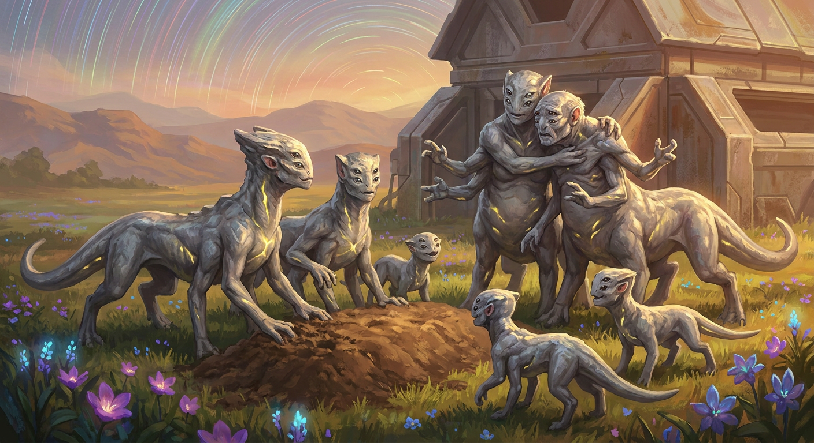

Промпт генератору

Painterly sci-fi concept art. A farmstead lawn at golden late afternoon, a fresh grave in a corner with mourners gathered around it, patting earth over the mound with their six-fingered hands. A large strong female traveler on four legs embraces an elderly male relative whose raised front trunk gestures emotionally, four eyes glistening. Around them younger males and several small children — all horizontal four-legged bodies with rearing front trunks, four eyes, tympanums, gray stone-crystal flesh with faint migrating yellow glow — hum and chirp softly in grief. Glowing flowers dot the grass; distant hills under colorful star-trails. Solemn, tender, communal mourning atmosphere. Each creature is one being, no duplicates.

### Сцена 3. После обеда Джусто требует, чтобы Ялда заняла место отца на новой ферме; ссора о её учёбе

- **Место:** Лужайка фермы, в сторонке
- **Герои:** Ялда, Джусто

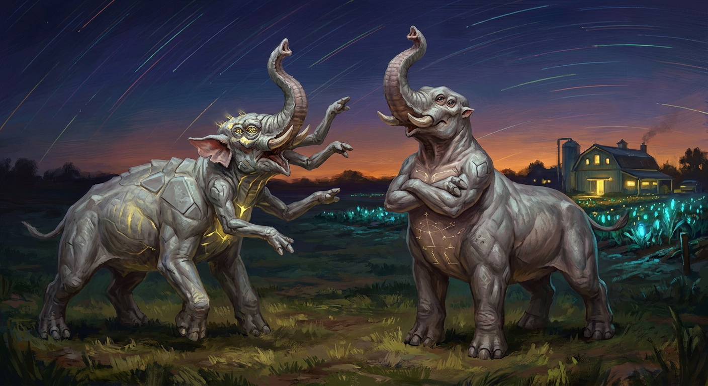

Промпт генератору

Painterly sci-fi concept art. On one side of a farm lawn at dusk, an elderly male relative stands arguing with a large strong female — both on four horizontal legs, raised front trunks, four eyes, tympanums, gray stone-crystal flesh with subtle geometric plates and faint yellow inner glow. The old male flails his arms in agitation, buzzing derisively; the female plants her blunt-footed stance firmly, chest arms crossed, rear eyes watching the farm behind her. Diagram-like marks glow faintly on her chest skin. Glowing flowers and a farmhouse shape the background under a deepening sky with colorful star-trails. Tense, confrontational mood of family obligation versus ambition. Each is one creature, no duplicates.

### Сцена 4. Ночью Ялда спит на лужайке среди светящихся цветов под звёздами

- **Место:** Лужайка фермы, ночёвка
- **Герои:** Ялда, Ада, дети

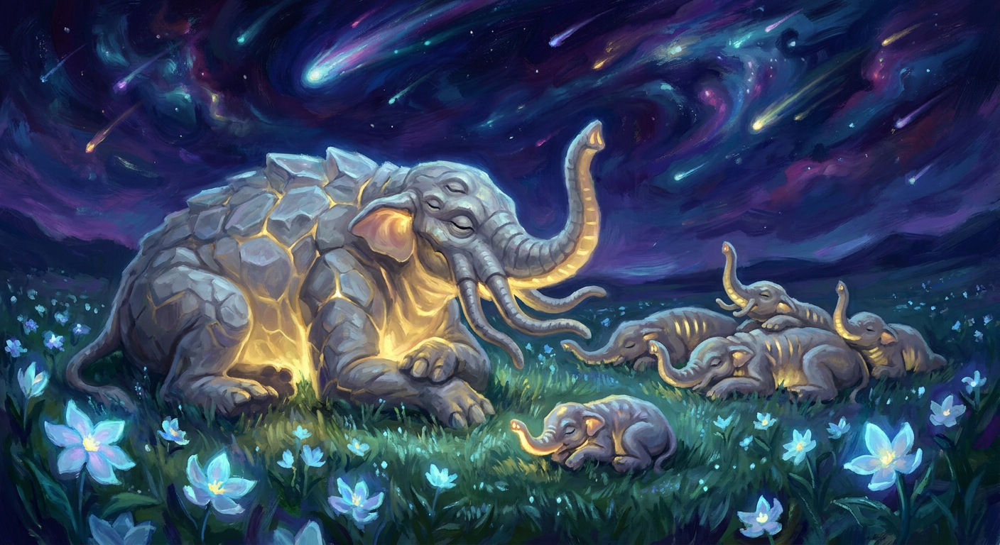

Промпт генератору

Painterly sci-fi concept art. Night on the farm lawn: a large strong female sleeps curled on the grass among luminous blue-white flowers, her four-legged gray stone-crystal body glowing faintly yellow from within, rearing front trunk relaxed, four eyes closed, tympanum soft. Nearby a small girl and several children doze in loose heaps, their smaller horizontal bodies dimming with sleepy hums and chirps. Overhead an alien sky blazes with stars trailing colored streaks; the glowing plants paint the lawn in shifting light. Peaceful, safe, dreamlike atmosphere after a long day of grief and argument. Every creature is a single being, no duplicates.

### Сцена 5. Перед рассветом Ялда будит Лючию, зовёт её в Зевгму, обсуждают детей и планы; Лючия пишет на коже послание

- **Место:** Край лужайки на ферме, предрассветные сумерки
- **Герои:** Ялда, Лючия

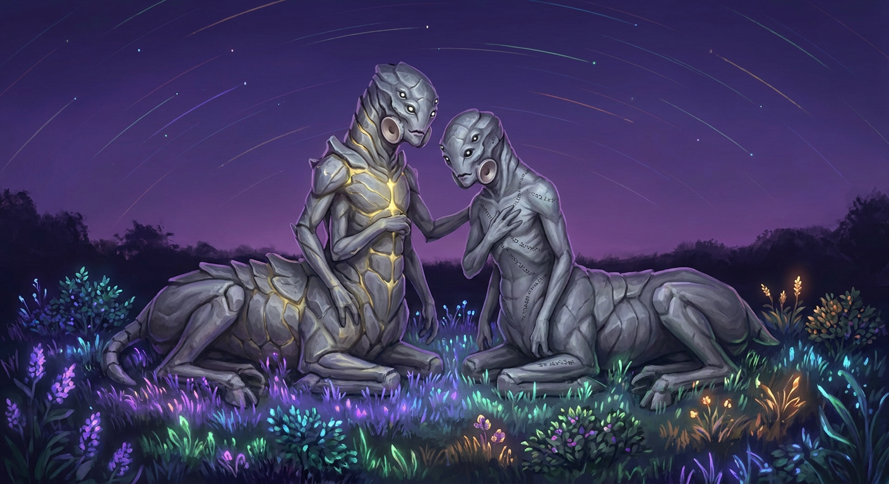

Промпт генератору

Painterly sci-fi concept art. Pre-dawn twilight at the edge of the farm lawn, sky deep violet with fading colored star-trails. A large strong female gently wakes her sister — both on four horizontal legs with raised front trunks, four eyes, tympanums, gray stone-crystal flesh with subtle hardened plates and faint yellow inner glow. The awakened sister's chest skin shows thin gray scar-symbols forming chains of writing, her hand pressing her skin as if composing a letter. Their postures lean close, intimate, urgent and hushed. Glowing flowers dim slowly as first pale light touches the grass. Mood of farewell, tenderness, and quiet resolve. Each is one creature, no duplicates.

### Сцена 6. Корнелио показывает Ялде в химической мастерской прибор для светозаписи и излагает теорию отрицательных температур с диаграммами на груди

- **Место:** Мастерская химического факультета
- **Герои:** Ялда, Корнелио

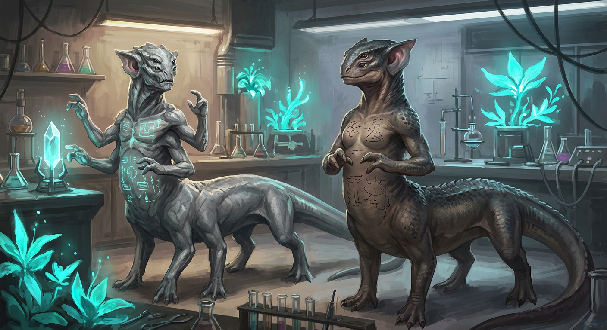

Промпт генератору

Painterly sci-fi concept art. Inside a chemistry department workshop, shelves of glassware and a strange light-recording box casting spectral glows. An elderly male chemist — four-legged horizontal body, rearing front trunk, four eyes, tympanum, gray stone-crystal flesh — leans over the apparatus, his chest skin raised with fine embossed diagram lines tracing curves of a theory of negative temperatures. Facing him, a large strong female student studies the device, her own chest marked with hand-drawn diagrams, rear eyes alert. Lamplight mixes with cyan glow of luminous plants on the benches; the mood is intellectual excitement, discovery, mentorship. Each creature is one being, no duplicates.

### Сцена 7. Вечером грузовик везёт Ялду, Корнелио и студентов через равнину; из-за гремучей звезды водитель тормозит, Ялда упускает наблюдение

- **Место:** Пыльная равнина между факультетом и городом
- **Герои:** Ялда, Корнелио, пять студентов, водитель

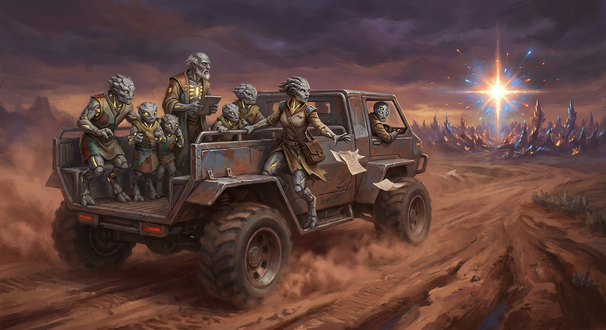

Промпт генератору

Painterly sci-fi concept art. An open truck rattles across a dusty plain at dusk carrying a female scholar, an elderly male chemist with chest diagrams, five young students, and a driver at the front — all four-legged beings with rearing front trunks, four eyes, tympanums, gray stone-crystal flesh and faint yellow inner glow. The vehicle brakes sharply, dust pluming, as a crackling, sparking star flares low in the sky; the passengers clutch the sides, the female scholar's hands fumbling her observation notes in frustration. Alien scrub plants glow faintly along the ruts. Tense, dynamic mood of interrupted science on a frontier road. Each creature is one being, no duplicates.

### Сцена 8. Ялда возвращается в город, играет в кости с Дарией и Лидией в Соло, затем находит в квартире безмолвную Туллию

- **Место:** Университетский городок, клуб Соло, квартира Туллии
- **Герои:** Ялда, Дария, Лидия, Туллия (тело)

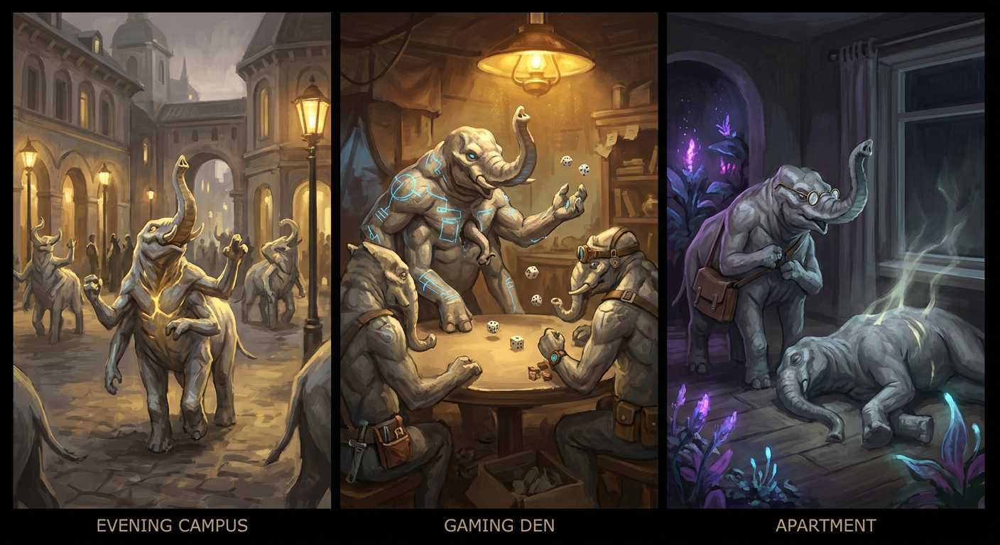

Промпт генератору

Painterly sci-fi concept art in three beats within one frame: a university campus square at evening, then a gaming den where a large strong female plays dice with two friends — a strong female with a third arm budding from mid-chest and genealogy diagrams on her skin, and a female factory worker — all four-legged with raised front trunks, four eyes, tympanums, gray stone-crystal flesh, yellow inner glow. Dice tumble on a table under warm glow. Then a dim apartment lit only by potted luminous plants, where the scholar finds a silent still female body sprawled by the window, faint light seeping wrong from her flesh. Mood shifts from raucous warmth to eerie dread. Each creature is one being, no duplicates.

### Сцена 9. Ялда пытается спасти Туллию холином и сжимает края борозды; тело Туллии необратимо делится

- **Место:** Квартира Туллии, у окна
- **Герои:** Ялда, Туллия (тело)

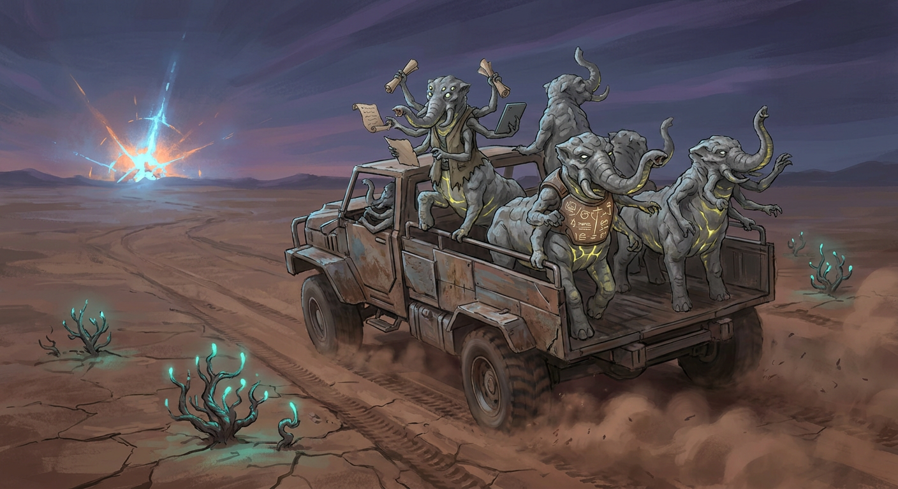

Промпт генератору

Painterly sci-fi concept art. A plant-lit apartment interior, only potted luminous plants glowing cyan and violet, no lamps. A large strong female kneels urgently beside a still female body by the window, pressing something to its mouth and squeezing the edges of a deep groove cracking across its flesh — light wells up from within the body along spreading fissures, its eyes and limbs and tympanum fading as the body irreversibly divides along glowing seams. Both are four-legged beings with raised front trunks, four eyes, gray translucent stone-crystal flesh with migrating yellow glow, now chaotic. Desperate, anguished, uncanny mood of failed rescue. Each creature is one being, no duplicates.

### Сцена 10. Дария и Лидия приходят и объясняют, что Туллия мертва и деление необратимо; остаётся решить судьбу её детей

- **Место:** Квартира Туллии
- **Герои:** Ялда, Дария, Лидия, Туллия (тело)

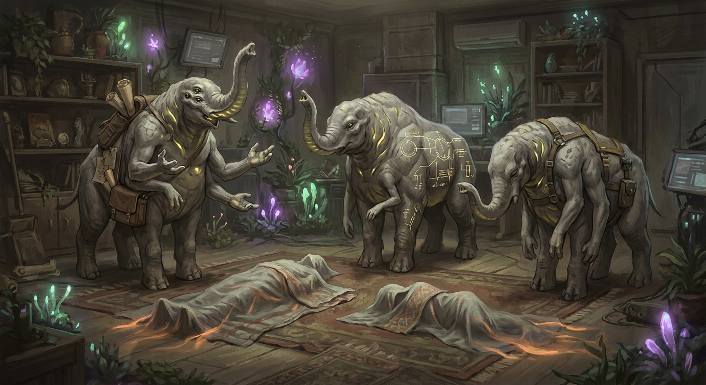

Промпт генератору

Painterly sci-fi concept art. The same plant-lit apartment, somber and still: on the floor a divided female body lying in two separated halves, deep glowing grooves fading, eyes and tympanum gone. Around it stand three mourners — a large strong female scholar, a strong female with a third arm budding from her chest and genealogy diagrams on her skin, and a female factory worker — all on four horizontal legs with raised front trunks, four eyes, tympanums, gray stone-crystal flesh and faint yellow inner glow, postures bowed, one gesturing gently in explanation, hands open in grief and deliberation. Luminous plants cast soft unsteady light. Heavy, compassionate, sorrowful mood of farewell and hard decisions. Each creature is one being, no duplicates.

## Глава 10

### Сцена 1. Ялда встречает Евсебио во дворе университетского городка; гуляя, они обсуждают теорию гремучих звёзд и допустимый катастрофический сценарий; Евсебио излагает идею ракеты-путешествия во времени и план поднять в космос гору Бесподобную.

- **Место:** двор и прогулка по университетскому городку
- **Герои:** Ялда, Евсебио, студенты возле столовой (фоном)

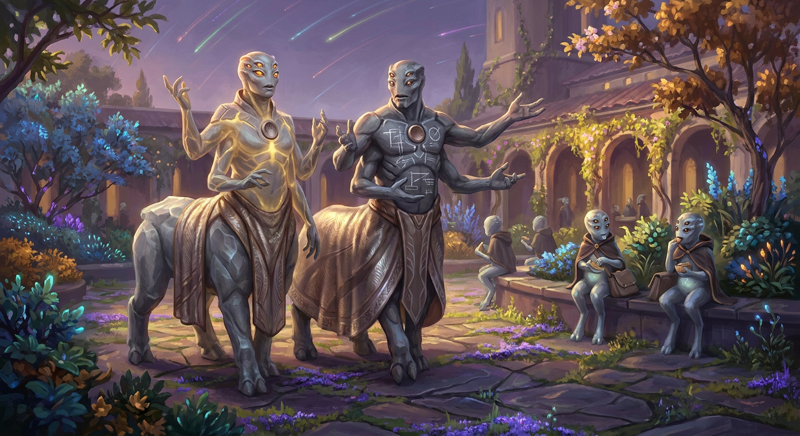

Промпт генератору

Painterly sci-fi concept art. A sunlit university campus courtyard on an alien world, glowing violet moss between flagstones, star-trails of colored light streaking the daytime sky. A large, strong female professor — four-legged horizontal body, rearing front trunk, four eyes, drum-like tympanum on her chest below the mouth, smooth gray stone-crystal translucent flesh with a faint migrating yellow inner glow, subtle geometric hardened plates — walks beside a tall, powerfully built male engineer with broad two-armed gesturing sweeps, chalk-like schematics drawn on his own chest plates; he too is four-legged with a rearing trunk, four eyes, tympanum, glowing gray stone-crystal flesh. They gesture skyward discussing ravenous stars and a time-travel rocket. In the background near a refectory, several younger four-eyed, four-legged students in short cloaks eat bread rolls, their elastic gray bodies faintly luminous. Warm afternoon light, glowing shrubs, contemplative mood. One creature each, no duplicates.

### Сцена 2. Ялда приводит детей в оптическую мастерскую; дети играют с бракованными линзами и рисуют воображаемых животных; Джорджо со студентами проводит опыт с гелиостатом.

- **Место:** мастерская оптики в университете
- **Герои:** Ялда, Амелия, Амелио, Валерия, Валерио, Джорджо, студенты

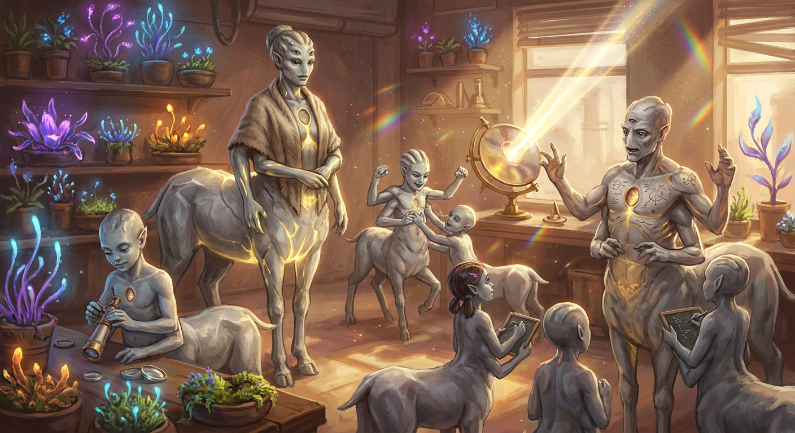

Промпт генератору

Painterly sci-fi concept art. Inside an optics workshop at an alien university: shelves of rejected glass lenses, brass frames, tools, a heliostat on a bench with a focused beam of shimmering light. A large strong female professor — four-legged horizontal body, rearing front trunk, four eyes, tympanum on the chest, gray stone-crystal translucent flesh with soft yellow inner glow, hardened geometric plates — watches fondly. Four children, all the same species in miniature: a teenage girl with six arms playfully wrestling a smaller child; a boy assembling a small telescope from flawed lenses; a girl drawing imaginary monsters on slate. An emotional male senior scientist, four-legged, four-eyed, tympanum vibrating, guides young students around the heliostat, his chest plates bearing hand-drawn diagrams. Dust motes and prism rainbows in warm lamplight, glowing filament-plants in pots, joyful busy mood. One creature each, no duplicates.

### Сцена 3. Ночью Ялда просыпается, смотрит в окно на гремучие звёзды и принимает решение помогать плану Евсебио, не давая согласия лететь самой.

- **Место:** квартира Ялды ночью, у окна
- **Герои:** Ялда, спящие дети (фоном)

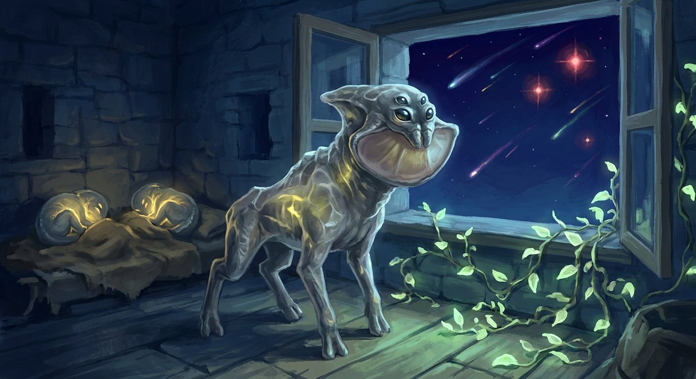

Промпт генератору

Painterly sci-fi concept art. Night interior of a modest apartment on an alien world. A large, strong female figure — four-legged horizontal body, front trunk reared upward, four eyes, rear eyes catching dim reflections, drum-like tympanum below the mouth, smooth gray stone-crystal translucent flesh with a slow migrating yellow glow, faint geometric plates — stands at an open window, silhouetted against a deep indigo sky where strange stars hang with trailing colored comets' tails, a few pulsing with eerie ravenous light. Her expression is resolute, tympanum taut. Behind her in shadow, small sleeping children of the same species curled on bedding, their gray bodies dimly glowing. A pale luminous climbing plant on the sill casts green light across the floor. Quiet, weighty, melancholy-yet-determined mood; cool moonlight with warm inner glow of bodies. One creature each, no duplicates.

### Сцена 4. Ялда и Евсебио пешком идут через пустыню к экспериментальной ракете; осмотр конструкции; запуск ракеты из-за деревянного барьера; спиральный полёт, падение и осмотр обломков.

- **Место:** пыльная бурая равнина, стартовая площадка в пустыне
- **Герои:** Ялда, Евсебио, Амандо, Сильвио, Фридо

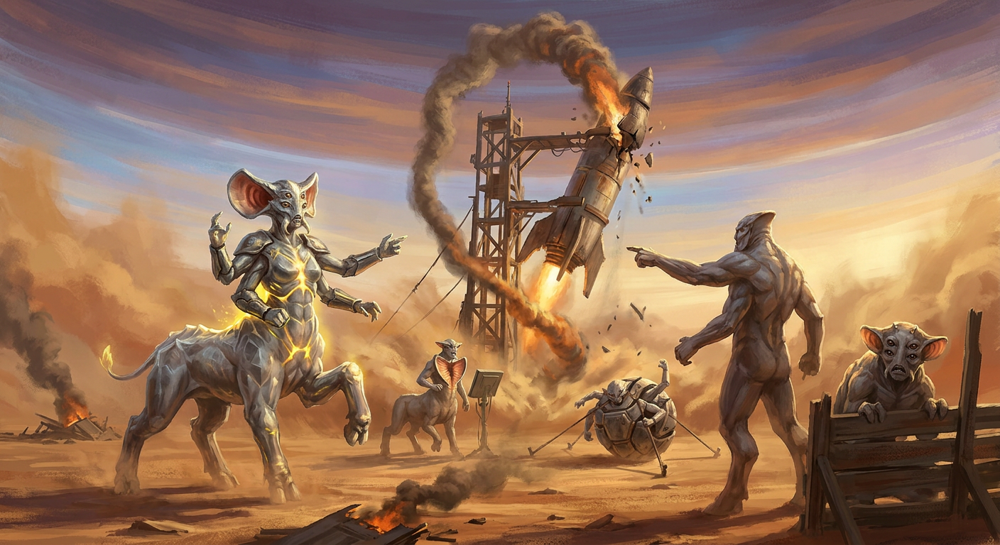

Промпт генератору

Painterly sci-fi concept art. A dusty brown desert plain under a huge banded sky, an experimental rocket on a crude launch gantry. A large strong female professor — four-legged horizontal body, rearing front trunk, four eyes, tympanum, gray translucent stone-crystal flesh with yellow inner glow — stands with a tall, powerfully built male engineer gesturing with sweeping two-armed motions at the rocket's hull. Nearby, three assistant males of the same species: one watching launch timing with his chest tympanum flared, one rolled into a ball traversing guy-ropes with legs turned into extra arms, one crouched behind a wooden barrier, face frozen in dread. The rocket lifts on a spiral of smoke and fire, then tumbles; smoking debris scattered across the flat. Harsh sunlight, heat shimmer, ochre dust, tense mood of bold experiment and failure. One creature each, no duplicates.

### Сцена 5. В грузовике по дороге в город Евсебио рассказывает о семье, покупке лицензий на гору, обсерватории; спор о Вечном Пламени, теплоотводе и необходимости открыть проект миру.

- **Место:** грузовик, дорога через пустыню в город
- **Герои:** Ялда, Евсебио

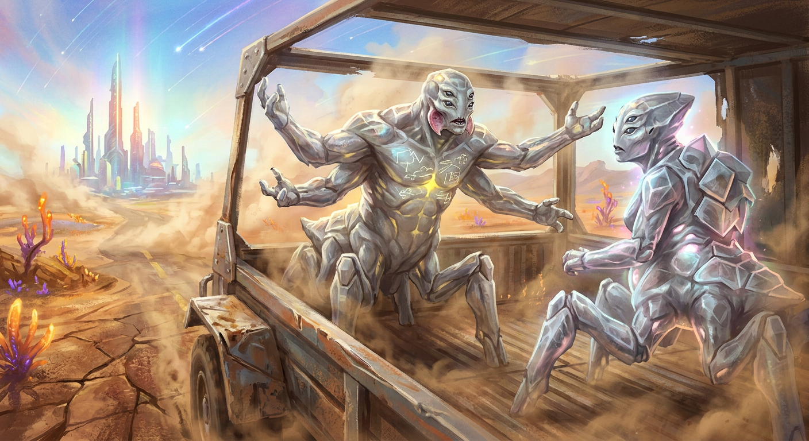

Промпт генератору

Painterly sci-fi concept art. Interior of a rattling open truck crossing a brown desert road toward a distant alien city with glowing spires. A tall, powerfully built male engineer — four-legged horizontal body, front trunk reared, four eyes, drum-like tympanum, smooth gray stone-crystal translucent flesh with faint yellow migrating glow, hardened geometric plates — speaks with wide two-armed sweeps, schematic diagrams drawn and half-erased on his chest; his face is animated, head slightly drawn into shoulders. Beside him a large strong female professor of the same species listens intently, four eyes narrowed, her own body faintly luminous through gray translucent flesh. Wind-blown dust, colorful star-trails in the bright sky, heat shimmer over cracked ground, sparse glowing desert plants streaking past. Mood of earnest debate and dawning ambition. One creature each, no duplicates.

### Сцена 6. Дома Дария учит детей анатомии гигантских ящериц; Ялда читает последнее письмо сестры Лючии, которая завтра станет матерью.

- **Место:** квартира Ялды, вечер
- **Герои:** Ялда, Дария, Валерия, Валерио

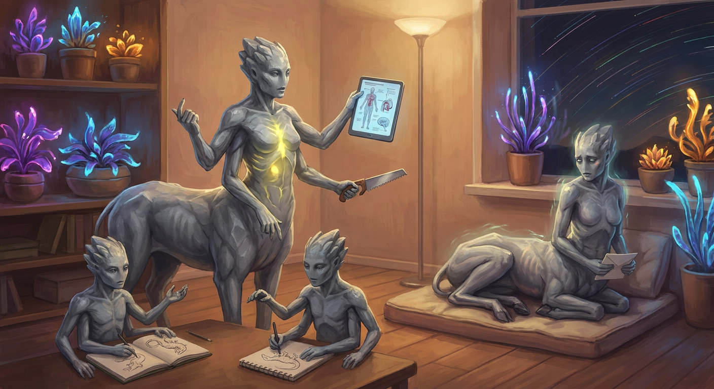

Промпт генератору

Painterly sci-fi concept art. Evening in a warm apartment on an alien world, lamplight and glowing potted plants. A strong female medical teacher — four-legged horizontal body, rearing front trunk, four eyes, tympanum, gray stone-crystal translucent flesh with yellow inner glow, a third arm budding from the middle of her chest — holds up anatomical diagrams and a saw, teaching two children of the same species, four-eyed, four-legged small versions of the species, who sketch giant lizards with absorbed interest. Across the room, apart, a large strong female professor lies curled with a letter, four eyes dim with emotion, tympanum quivering softly, faint yellow glow pulsing slow under her gray translucent flesh, geometric plates catching lamplight. Domestic warmth mixed with private sorrow; colored star-trails faintly visible through a window. One creature each, no duplicates.

## Глава 11

### Сцена 1. Ялда утром покупает газету и читает ядовитую статью «Молвы» о её выступлении

- **Место:** угол улицы, Зевгма
- **Герои:** Я, л, д, а, , , , м, а, л, ь, ч, и, к, -, г, а, з, е, т, ч, и, к

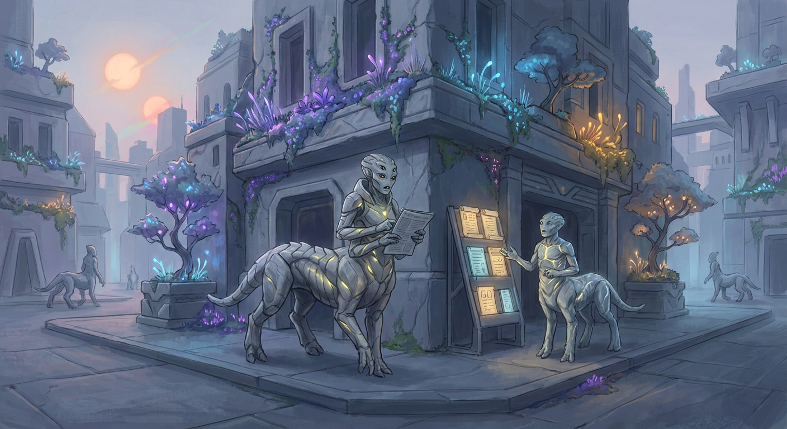

Промпт генератору

Painterly sci-fi concept art. Early morning at a street corner in an alien city, bioluminescent plants glowing softly along stone facades, twin suns rising with faint colored trails. A large female scholar of a four-legged stone-crystal species — horizontal animal-like body, front trunk rearing upward with four eyes and a drum-like tympanum, smooth gray elastic flesh with geometric hardened plates and a migrating faint yellow inner glow, two six-fingered arms on her chest — stands holding a newspaper low, all four eyes fixed on a venomous article. Beside her a small male news-vendor of the same species, four-legged, rearing front, four eyes, tympanum, gray glowing flesh, offers papers from a rack, watching her curiously. Her posture is tense, shoulders of the raised trunk drooping slightly. Mood: quiet hurt and public scrutiny, cool dawn light, one creature of each character, no duplicates.

### Сцена 2. Дария успокаивает Ялду из-за статьи в «Молве»

- **Место:** квартира Ялды
- **Герои:** Я, л, д, а, , , , Д, а, р, и, я

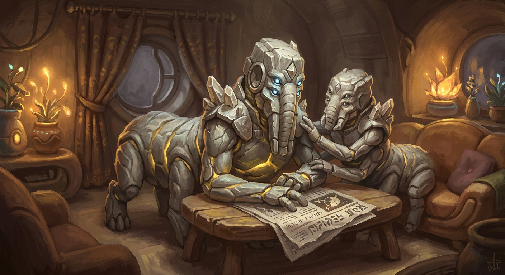

Промпт генератору

Painterly sci-fi concept art. Interior of a modest alien apartment, warm lamplight from glowing potted plants, drawn curtains, a low table with the offending newspaper lying open. A large female scholar of a four-legged stone-crystal species — horizontal body on four legs, rearing front trunk with four eyes, tympanum below the mouth, smooth gray elastic flesh with hardened geometric plates and a faint migrating yellow inner glow, two six-fingered arms — sits slump-shouldered, newspaper before her. Beside her an older female friend of the same species, slightly smaller, four-legged with rearing trunk, four eyes, tympanum, gray glowing flesh, four arms, reaches out two hands to gently touch the scholar's shoulder in consolation, leaning close. Mood: intimate comfort, worry melting into reassurance, soft warm shadows. One creature per character, no duplicates.

### Сцена 3. Джорджо сообщает об отказе финансировать обсерваторию и споре о земле

- **Место:** университет Зевгмы
- **Герои:** Я, л, д, а, , , , Д, ж, о, р, д, ж, о

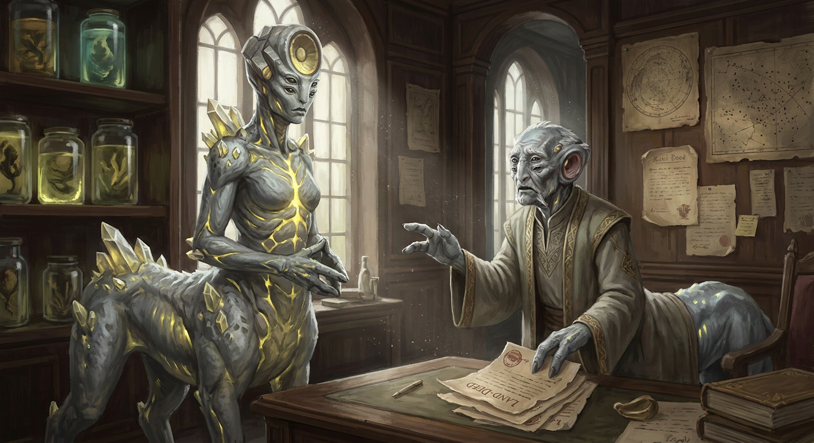

Промпт генератору

Painterly sci-fi concept art. A wood-paneled office in an alien university, shelves of glowing specimen jars, star-charts pinned to walls, light through tall arched windows. A large female scholar of a four-legged stone-crystal species — horizontal animal body, rearing front trunk with four eyes, drum-like tympanum, smooth gray elastic flesh with geometric hardened patches and a faint inner yellow glow, two six-fingered arms — stands upright on her hind legs' base, listening gravely. Across the desk an elderly male administrator of the same species, four-legged, rearing trunk, four eyes, tympanum, gray glowing flesh, four arms, gestures with one hand in refusal, the other resting on land-deed papers. His expression is apologetic but firm. Mood: bureaucratic disappointment, dust motes in pale daylight, tense stillness. One creature per character, no duplicates.

### Сцена 4. Ялда читает лекцию по оптике, внутренне переживая о конце света

- **Место:** аудитория университета
- **Герои:** Я, л, д, а, , , , с, т, у, д, е, н, т, ы

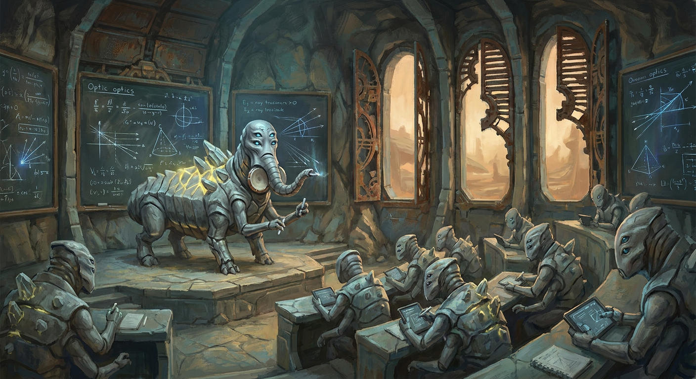

Промпт генератору

Painterly sci-fi concept art. A tiered lecture hall in an alien university, chalkboards covered in optics equations and ray diagrams, tall windows with mechanical shutters. At the front a large female scholar of a four-legged stone-crystal species — horizontal body on four legs, rearing front trunk with four eyes, drum-like tympanum, smooth gray elastic flesh with geometric hardened plates and faint migrating yellow glow, two six-fingered arms — draws light-ray diagrams with chalk, outwardly calm while her four eyes betray inner dread. Rows of students of the same species, each four-legged with rearing trunk, four eyes, tympanum, gray glowing flesh, some with two arms, some with four, watching and taking notes. Mood: public composure over private dread about the end of the world. One creature per character, no duplicates.

### Сцена 5. Стычка с Людовико в столовой: его фантастическое объяснение гремучих звёзд

- **Место:** столовая университета
- **Герои:** Я, л, д, а, , , , Л, ю, д, о, в, и, к, о, , , , п, о, с, е, т, и, т, е, л, и, , с, т, о, л, о, в, о, й

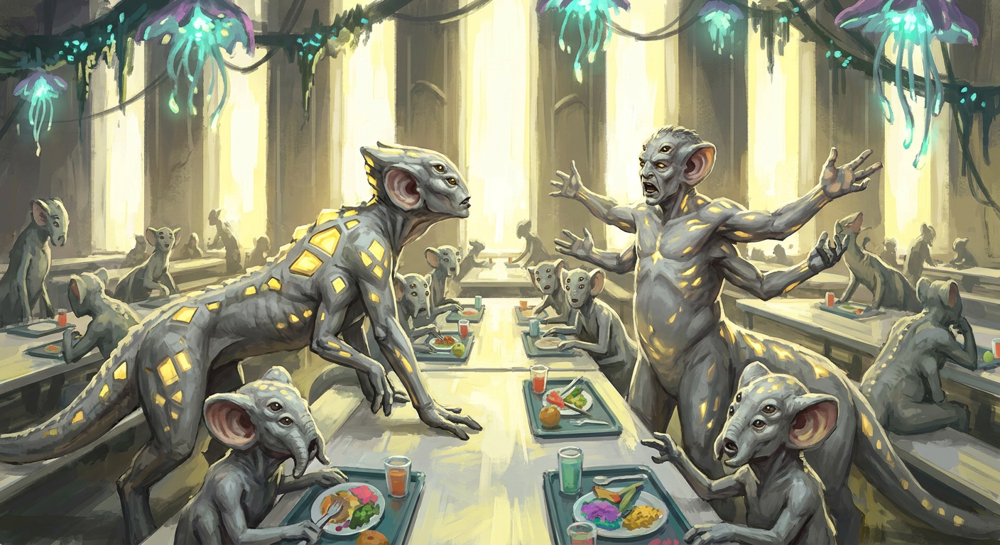

Промпт генератору

Painterly sci-fi concept art. A busy university dining hall for an alien species, long tables, glowing ceiling plants, trays of food, chatter frozen mid-scene. A large female scholar of a four-legged stone-crystal species — horizontal animal body, rearing front trunk, four eyes, drum-like tympanum, smooth gray elastic flesh with hardened geometric patches and faint inner yellow glow, two six-fingered arms — stands confrontational, one hand planted on the table. Opposite her an arrogant middle-aged male professor of the same species, four-legged, rearing trunk, four eyes, tympanum, gray glowing flesh, four arms spread wide as he expounds a fantastical theory about roaring stars. Around them curious diners of the same species, all four-legged with four eyes and tympanums, watch the clash. Mood: sharp intellectual friction, harsh noon light through windows. One creature per character, no duplicates.

### Сцена 6. Выступление в Варьете-Холле с проекцией на экран; Евсебио излагает план путешествия

- **Место:** сцена Варьете-Холла
- **Герои:** Я, л, д, а, , , , Е, в, с, е, б, и, о, , , , х, у, д, о, ж, н, и, к, и, -, д, е, к, о, р, а, т, о, р, ы, , , , з, р, и, т, е, л, и

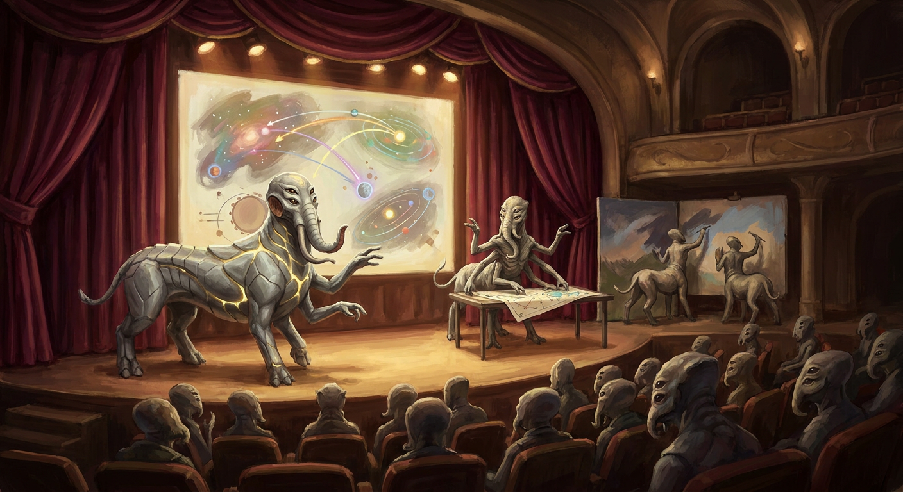

Промпт генератору

Painterly sci-fi concept art. A grand varieté hall stage on an alien world, heavy velvet curtains, a large projection screen glowing with diagrams of a voyage between stars with colored trails. Center stage a large female scholar of a four-legged stone-crystal species — horizontal body, rearing front trunk with four eyes, drum-like tympanum, smooth gray elastic flesh with geometric plates and faint migrating yellow glow, two six-fingered arms — gestures at the screen. Beside her a wiry male engineer of the same species, four-legged, rearing trunk, four eyes, tympanum, gray glowing flesh, six arms, lays out a travel plan on a chart. Behind them artist-decorators of the same species on four legs adjust painted backdrops. An audience of four-legged, four-eyed creatures fills the seats. Mood: wonder and persuasion under stage lights. One creature per character, no duplicates.

### Сцена 7. Беседы в фойе со зрителями после выступления; добродушный скептик

- **Место:** фойе Варьете-Холла
- **Герои:** Я, л, д, а, , , , Е, в, с, е, б, и, о, , , , м, о, л, о, д, о, й, , м, у, ж, ч, и, н, а, , , , с, л, у, ш, а, т, е, л, и

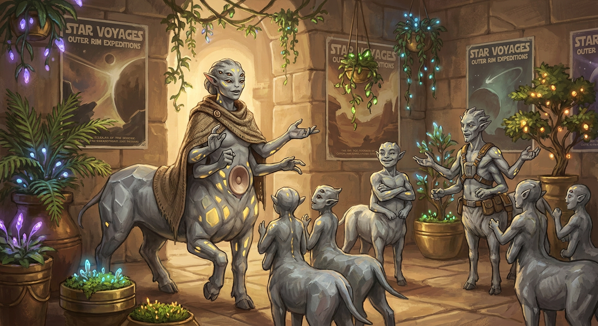

Промпт генератору

Painterly sci-fi concept art. A crowded foyer after a show on an alien world, warm lamps, glowing plants in brass pots, posters of star voyages on the walls. A large female scholar of a four-legged stone-crystal species — horizontal animal body, rearing front trunk, four eyes, drum-like tympanum, smooth gray elastic flesh with hardened geometric patches and faint yellow inner glow, two six-fingered arms — converses with small clusters of listeners of the same species, all four-legged with rearing trunks, four eyes, tympanums, gray glowing flesh, varied arm counts. A good-natured young male skeptic of the same species grins skeptically, four arms crossed. Nearby the wiry six-armed male engineer chats with guests. Mood: warm post-performance buzz, friendly debate, hopeful weariness. One creature per character, no duplicates.

### Сцена 8. Бенедетта обращается к Ялде, задаёт вопрос о движении назад во времени и записывается пассажиром

- **Место:** фойе Варьете-Холла, поздний вечер
- **Герои:** Я, л, д, а, , , , Б, е, н, е, д, е, т, т, а

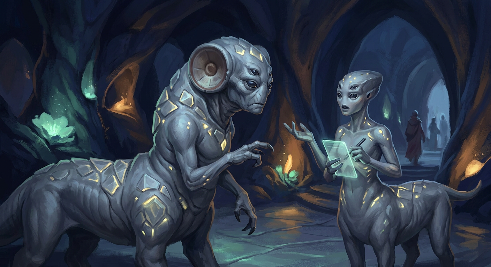

Промпт генератору

Painterly sci-fi concept art. Late evening in a theater foyer on an alien world, most lamps dimmed, light-pools under glowing plants, a few distant figures. A large female scholar of a four-legged stone-crystal species — horizontal body on four legs, rearing front trunk with four eyes, drum-like tympanum, smooth gray elastic flesh with geometric plates and faint migrating yellow glow, two six-fingered arms — listens intently, head lowered. Facing her a young slender female of the same species, four-legged, rearing trunk, four eyes, tympanum, gray glowing flesh, two arms, speaks earnestly, one hand raised as she asks a question about traveling backward in time, the other writing her name onto a passenger list held against her chest. Mood: hushed, electric curiosity, midnight-blue shadows. One creature per character, no duplicates.

### Сцена 9. Ночной разговор о замкнутом времени, свободе воли и судьбе

- **Место:** ночной город, улица, Большой мост
- **Герои:** Я, л, д, а, , , , Б, е, н, е, д, е, т, т, а

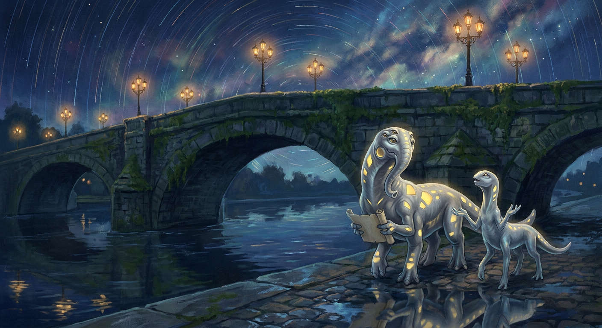

Промпт генератору

Painterly sci-fi concept art. Night on a great bridge over a river in an alien city, gaslight-style lamps, glowing moss on the stone railings, stars above with soft colored trails. Two creatures of a four-legged stone-crystal species walk side by side: a large female scholar with a horizontal animal body, rearing front trunk, four eyes, drum-like tympanum, smooth gray elastic flesh with geometric hardened patches and a faint migrating yellow inner glow, two six-fingered arms; and a young slender female of the same build standard, four-legged, four eyes, tympanum, gray glowing flesh, two arms, gesturing as she talks. They discuss closed time, free will and fate; the scholar's four eyes turn thoughtful toward the sky. Mood: philosophical intimacy, deep blue night, river reflections. One creature per character, no duplicates.

### Сцена 10. Пробный запуск ракеты из бункера; трещина в стекле, Нерео ведёт измерения

- **Место:** бункер в пустыне
- **Герои:** Я, л, д, а, , , , Е, в, с, е, б, и, о, , , , А, м, а, н, д, о, , , , Н, е, р, е, о, , , , Д, ж, у, л, и, о

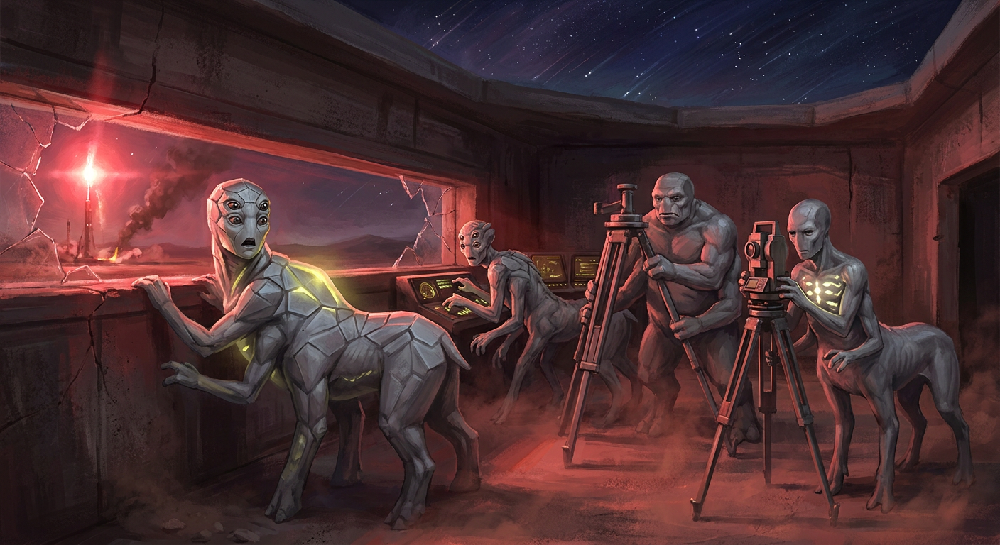

Промпт генератору

Painterly sci-fi concept art. A concrete bunker in a desert under alien stars with colored trails, observation slit facing a launch pad. Inside, a large female scholar of a four-legged stone-crystal species — horizontal body, rearing front trunk with four eyes, drum-like tympanum, gray elastic flesh with geometric plates and faint yellow inner glow, two arms — peers through the slit in alarm at a cracked observation glass. Beside her a wiry six-armed male engineer of the same species, four-legged, four eyes, tympanum, gray glowing flesh, studies instruments; a burly four-armed male assistant of the same species steadies a tripod; a lean male mathematician of the same species, two arms, takes measurements with a theodolite, tongue of light on his chest-skin notes. Mood: tension after a rocket test, red flare light through the slit, dust and adrenaline. One creature per character, no duplicates.

### Сцена 11. Разговор Ялды и Евсебио о поездке в Красные Башни, деньгах и подкупе Совета

- **Место:** пустыня, место запуска
- **Герои:** Я, л, д, а, , , , Е, в, с, е, б, и, о

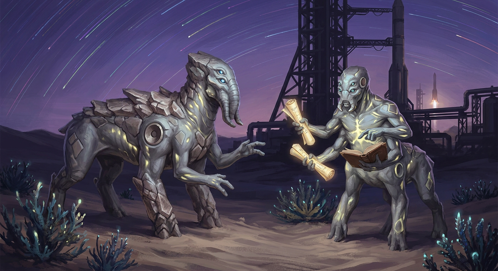

Промпт генератору

Painterly sci-fi concept art. Desert dusk at a rocket launch site, scaffolding and fuel pipes silhouetted, glowing desert shrubs, stars with colored trails emerging in a violet sky. Two creatures of a four-legged stone-crystal species face each other on the sand: a large female scholar with a horizontal animal body, rearing front trunk, four eyes, drum-like tympanum, smooth gray elastic flesh with geometric hardened patches and faint migrating yellow glow, two six-fingered arms; and a wiry male engineer of the same standard, four-legged, four eyes, tympanum, gray glowing flesh, six arms, three hands busy with charts and a ledger as he argues about money, land bribes and a journey to the Red Towers. Mood: weary resolve, negotiation under fading light. One creature per character, no duplicates.

### Сцена 12. Прибытие в Красные Башни; Нерео с детьми встречает Ялду, проход в имение

- **Место:** вокзал и имение Паоло, Красные Башни
- **Герои:** Я, л, д, а, , , , Н, е, р, е, о, , , , ч, е, т, в, е, р, о, , д, е, т, е, й, , Н, е, р, е, о, , , , о, х, р, а, н, н, и, к, и

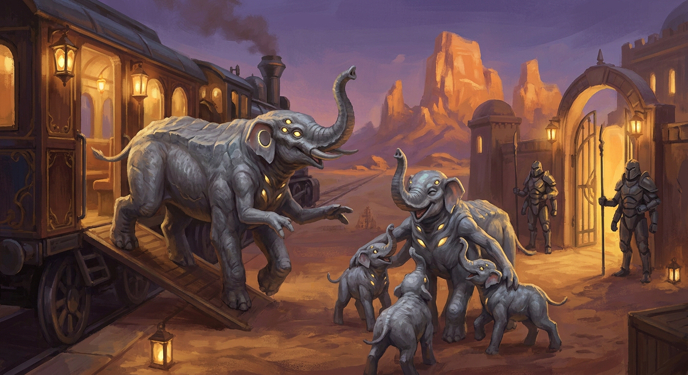

Промпт генератору

Painterly sci-fi concept art. A small desert railway station at the Red Towers estate, ochre rock formations glowing faintly, lantern light, a steam train at rest. On the platform a large female scholar of a four-legged stone-crystal species — horizontal body, rearing front trunk, four eyes, drum-like tympanum, smooth gray elastic flesh with geometric plates and faint yellow inner glow, two arms — steps down from a carriage. A slender middle-aged female of the same species, four-legged, four eyes, tympanum, gray glowing flesh, four arms, greets her warmly; around her four children of the same species, small four-legged creatures with rearing trunks, four eyes, tympanums, young gray glowing flesh, bounce excitedly. Uniformed guards of the same species stand by an ornate gate to the estate. Mood: warm welcome in an alien oasis evening. One creature per character, no duplicates.

### Сцена 13. В гостевой комнате Евсебио хвалит Джулио; подготовка к выступлению

- **Место:** гостевая комната в имении
- **Герои:** Я, л, д, а, , , , Е, в, с, е, б, и, о, , , , Н, е, р, е, о

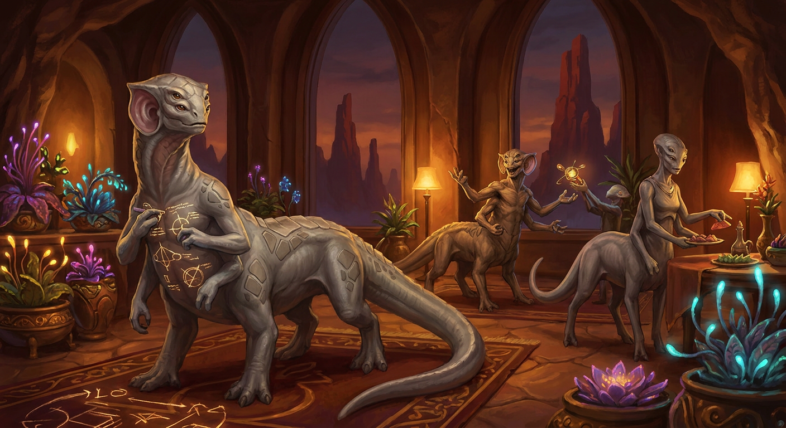

Промпт генератору

Painterly sci-fi concept art. A guest room in a wealthy alien estate, ornate rugs, glowing potted plants, tall windows onto red rock towers at dusk. A large female scholar of a four-legged stone-crystal species — horizontal animal body, rearing front trunk with four eyes, drum-like tympanum, smooth gray elastic flesh with geometric hardened patches and faint migrating yellow glow, two six-fingered arms — prepares for a lecture, writing diagrams in chalk lines on her own chest skin. Across the room a wiry male engineer of the same species, four-legged, four eyes, tympanum, gray glowing flesh, six arms, praises a young assistant's work with enthusiastic gestures. A slender middle-aged female of the same species, four arms, supervises refreshments. Mood: pre-performance nerves and gratitude, amber lamplight. One creature per character, no duplicates.

### Сцена 14. Выступление в зале Красных Башен с ответами на вопросы со сцены; рекрутинг в фойе

- **Место:** зал и фойе в Красных Башнях
- **Герои:** Я, л, д, а, , , , Е, в, с, е, б, и, о, , , , Д, ж, у, л, и, о, , , , п, у, б, л, и, к, а, , , , п, о, ж, и, л, о, й, , м, у, ж, ч, и, н, а, , , , ж, е, н, щ, и, н, а, , с, , в, о, п, р, о, с, о, м

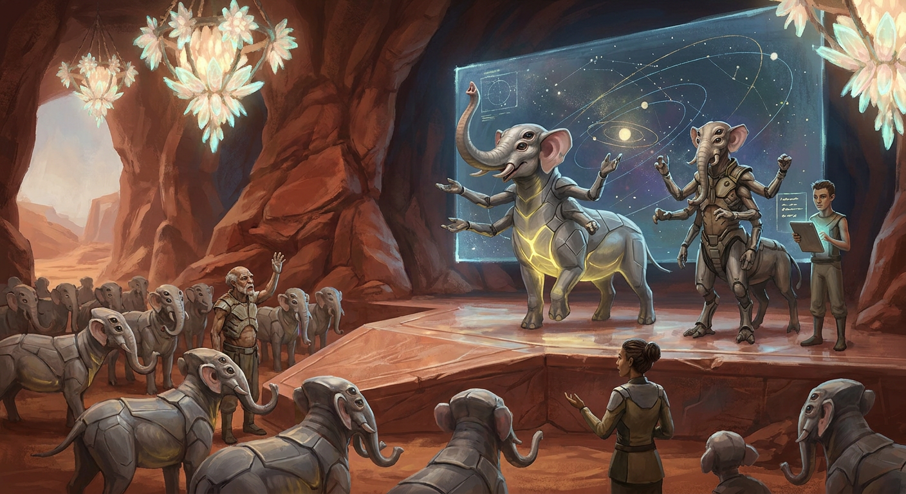

Промпт генератору

Painterly sci-fi concept art. A grand hall in an alien desert estate, chandeliers of glowing crystal plants, red rock walls, a stage with a projection screen of star charts. On stage a large female scholar of a four-legged stone-crystal species — horizontal body on four legs, rearing front trunk with four eyes, drum-like tympanum, smooth gray elastic flesh with geometric plates and faint yellow inner glow, two arms — answers questions, gesturing at the screen. Beside her a wiry six-armed male engineer of the same species stands proudly, and a young two-armed male assistant of the same species holds notes. The audience is filled with four-legged, four-eyed, tympanum-bearing creatures of the same species; an elderly male raises a hand, a female listener stands to ask. Mood: persuasion and hope. One creature per character, no duplicates.

### Сцена 15. Обед у Паоло; обсуждение ракеты, Вечного пламени и отказа от инвестиций

- **Место:** столовая в доме Паоло
- **Герои:** Я, л, д, а, , , , Е, в, с, е, б, и, о, , , , Н, е, р, е, о, , , , П, а, о, л, о, , , , ш, е, с, т, е, р, о, , с, ы, н, о, в, е, й, , , , с, л, у, г, а

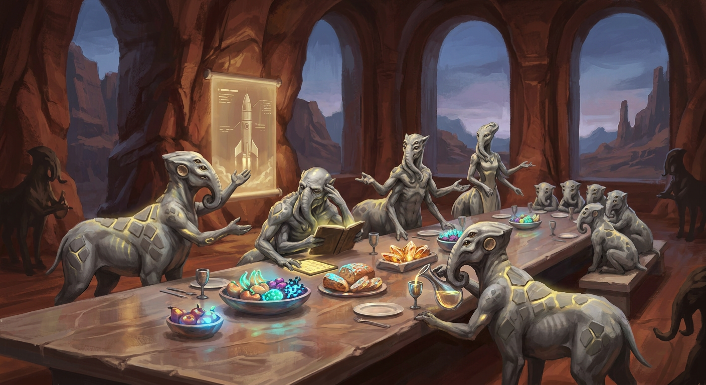

Промпт генератору

Painterly sci-fi concept art. A lavish dining room in an alien estate, long table with glowing fruit bowls and resin bread, red rock visible through arched windows, servant shadows. A large female scholar of a four-legged stone-crystal species — horizontal animal body, rearing front trunk with four eyes, drum-like tympanum, smooth gray elastic flesh with geometric hardened patches and faint migrating yellow glow, two arms — discusses a rocket voyage with a rich elderly male patriarch of the same species, four-legged, four eyes, tympanum, gray glowing flesh, four arms, who shakes his head in refusal over ledgers. A wiry six-armed male engineer argues across the table; a slender four-armed female hostess mediates; six young sons of the same species, small four-legged creatures with four eyes and tympanums, listen at the table's end; a servant of the same species pours drinks. One creature per character, no duplicates.

### Сцена 16. После второго выступления Евсебио в отчаянии; Ялда его утешает

- **Место:** гостевая комната Нерео
- **Герои:** Я, л, д, а, , , , Е, в, с, е, б, и, о

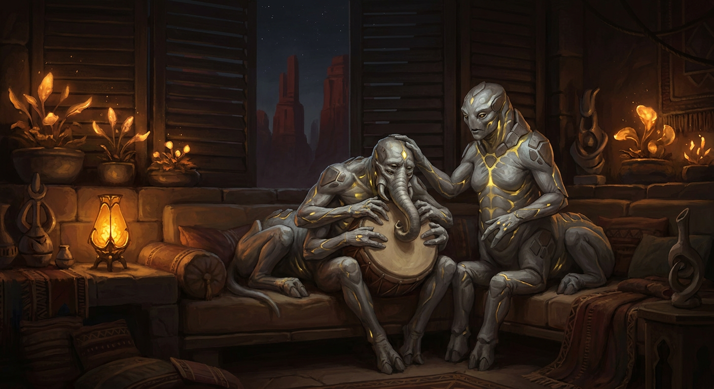

Промпт генератору

Painterly sci-fi concept art. A guest room at night in an alien estate, dim amber lamps, glowing plants, red rock towers faint through shutters. A wiry male engineer of a four-legged stone-crystal species — horizontal animal body, rearing front trunk with four eyes, drum-like tympanum, smooth gray elastic flesh with geometric hardened patches and faint migrating yellow glow, six arms now slack and drooping — sits collapsed in despair on a low couch, several hands over his tympanum. Beside him a large female scholar of the same species, four-legged, four eyes, tympanum, gray glowing flesh with plates, two six-fingered arms, leans close and rests one hand on his raised trunk, consoling him after a failed second performance. Mood: quiet grief and friendship, deep warm shadows. One creature per character, no duplicates.

### Сцена 17. Ночное искушение: Ялда смотрит на спящего Евсебио и отвергает мысль об объединении тел

- **Место:** гостевая комната, ночь
- **Герои:** Я, л, д, а, , , , Е, в, с, е, б, и, о

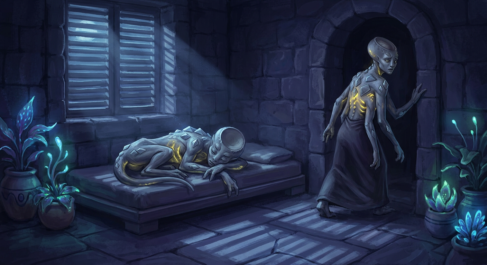

Промпт генератору

Painterly sci-fi concept art. Deep night in a guest room of an alien estate, moonlight through shutters striping the floor, glowing plants dimmed. A wiry male engineer of a four-legged stone-crystal species sleeps curled on a low bed — horizontal animal body, rearing trunk relaxed, four eyes closed, drum-like tympanum soft, smooth gray elastic flesh with geometric hardened plates and a faint slowly-migrating yellow glow beneath translucent skin. In the doorway a large female scholar of the same species, four-legged, four eyes, tympanum, gray glowing flesh, two arms, watches him intently, torn by temptation, then deliberately turns away, rejecting the thought of merging bodies. Her inner glow flickers with conflict. Mood: moral struggle, blue darkness, hushed stillness. One creature per character, no duplicates.

### Сцена 18. Нерео провожает Ялду; обсуждение уравнения света и источника-вектора

- **Место:** вокзал Красных Башен
- **Герои:** Я, л, д, а, , , , Н, е, р, е, о, , , , А, м, а, н, д, о, , (, у, п, о, м, ., )

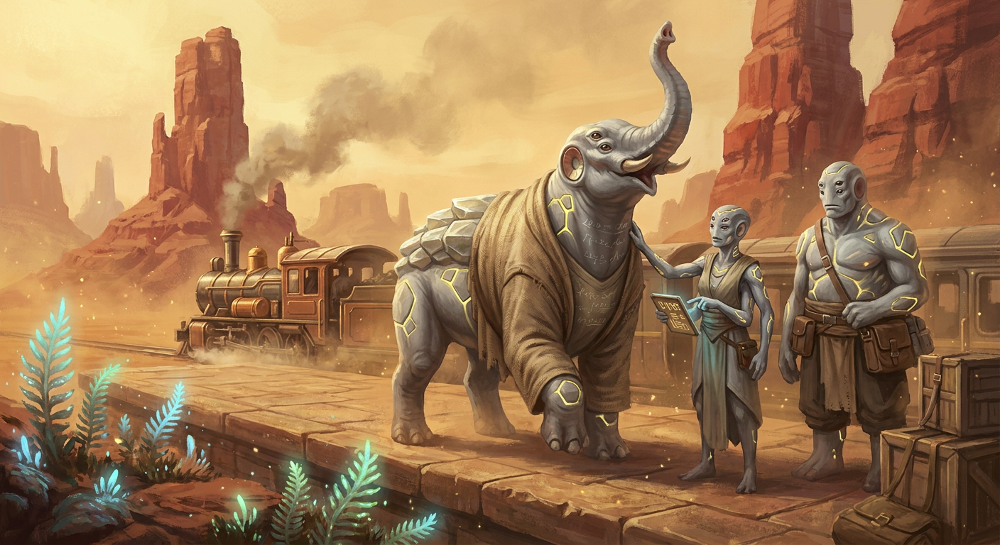

Промпт генератору

Painterly sci-fi concept art. A small desert railway station platform in morning light, red rock towers behind, steam train waiting, glowing plants along the platform edge. A large female scholar of a four-legged stone-crystal species — horizontal animal body on four legs, rearing front trunk with four eyes, drum-like tympanum, smooth gray elastic flesh with geometric hardened patches and faint migrating yellow glow, two six-fingered arms — prepares to board, mathematical equations chalked faintly on her chest skin. A slender middle-aged female of the same species, four-legged, four eyes, tympanum, gray glowing flesh, four arms, farewell-touches her shoulder, discussing the equation of light and the source-vector; a quiet burly male of the same species stands by with the luggage. Mood: warm scientific farewell, golden dust light. One creature per character, no duplicates.

### Сцена 19. В поезде Ялда решает уравнение Нерео, размышляет о двух видах источников

- **Место:** поезд в Зевгму
- **Герои:** Я, л, д, а

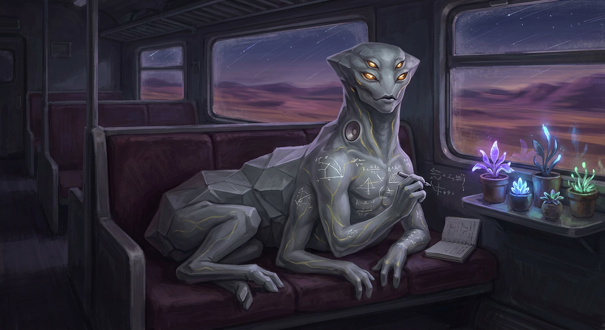

Промпт генератору

Painterly sci-fi concept art. Interior of a moving alien train carriage at dusk, velvet seats, glowing potted plants on the windowsill, desert and stars with colored trails sliding past the window. Alone in the compartment a large female scholar of a four-legged stone-crystal species — horizontal animal body on four legs, rearing front trunk with four eyes, drum-like tympanum below the mouth, smooth gray elastic flesh with geometric hardened plates and a faint migrating yellow inner glow, two six-fingered arms — works intently, drawing diagrams of light sources and vectors directly in fine chalk lines on her own chest skin, one hand steady, four eyes narrowed in concentration. A notebook of equations lies open beside her. Mood: solitary breakthrough, rhythmic clatter, warm compartment light against a violet desert. One creature only, no duplicates.

### Сцена 20. Ялда возвращается домой; Лидия потеряла работу; на небе зажглась новая звезда Гемма

- **Место:** квартира Ялды, Зевгма, вечер
- **Герои:** Я, л, д, а, , , , Л, и, д, и, я

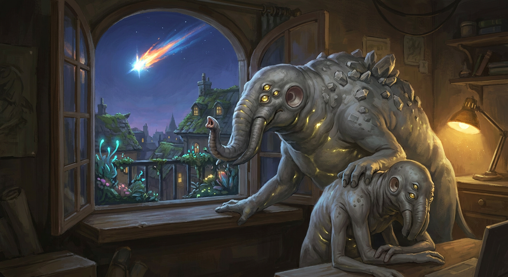

Промпт генератору

Painterly sci-fi concept art. Evening in an alien city apartment, window open to rooftops where a new star with a brilliant colored trail has just ignited in the darkening sky, glowing plants on the balcony. Inside, a large female scholar of a four-legged stone-crystal species — horizontal animal body, rearing front trunk with four eyes, drum-like tympanum, smooth gray elastic flesh with geometric hardened patches and faint migrating yellow glow, two six-fingered arms — comforts a thin younger female of the same species, four-legged, four eyes, tympanum, gray glowing flesh, two arms, who has just lost her job, shoulders of her raised trunk sagging. One of the scholar's hands rests on the window frame, her four eyes fixed on the newborn star. Mood: grief and awe entwined, cold starlight and warm lamplight. One creature per character, no duplicates.

## Глава 12

### Сцена 1. Ялда ведёт группу новичков по туннелю в огромный садовый зал с буровыми скважинами и рассказывает о двигателях

- **Место:** туннели и садовый зал внутри горы (верхний ярус ракеты)
- **Герои:** Ялда, Нино, Доротео, Фатима, Ассунта, Ассунто, Леония, Эрнесто, Эрнеста, Серафина и др. новобранцы, рабочие в скважинах

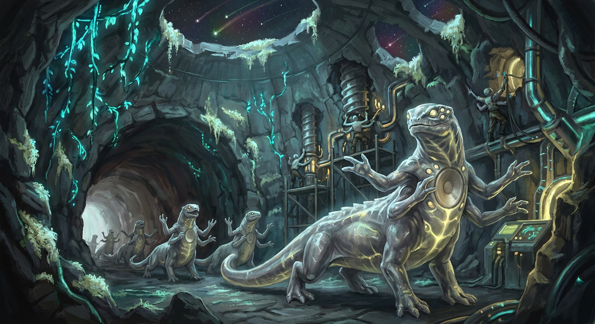

Промпт генератору

Painterly sci-fi concept art. A broad tunnel opens into a vast garden hall hollowed inside a mountain, where a group of eager young recruits follows a large, strong female guide. She is a four-legged creature with a horizontal body, rearing front trunk, four eyes, drum-like tympanum, gray translucent stone-crystal flesh with a faint migrating yellow glow, gesturing with six-fingered hands as she explains engines. The recruits trail behind her, same species standard, smaller builds, curious. At the far end of the hall, drill shafts bore into rock; worker creatures cling to scaffolding with multiple arms, tending glowing pipes. Bioluminescent vines and pale luminous moss line the tunnel walls, casting green-gold light. Stars with faint colored trails shine through shaft openings. Mood of awe and industrious purpose. One creature per character, no duplicates.

### Сцена 2. Подъём по винтовой лестнице в шахте и экскурсия по подземному лесу с фиолетовыми цветами

- **Место:** шахта со светящимся мхом и лесной зал внутри горы
- **Герои:** Ялда, Фатима, Леония, Эрнесто, Ассунта, Ассунто и др. новобранцы

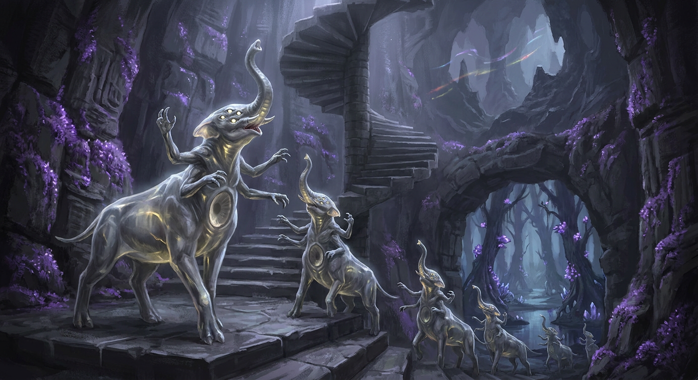

Промпт генератору

Painterly sci-fi concept art. Inside a vertical mineshaft, glowing moss coats the walls in soft violet light as a file of young recruits climbs a great spiral staircase of stone. Leading them is a large, strong female creature with a four-legged horizontal body, rearing front trunk, four eyes, a tympanum on her chest, and gray translucent stone-crystal flesh glowing faintly yellow from within. Below and beyond, through an archway, stretches an underground forest: tall dark trees dotted with purple luminescent flowers, their glow reflecting off crystal pools. The recruits, all the same four-legged species, crane their rearing heads to gaze at the blossoms. Colored star-trails shimmer in distant rock openings. Atmosphere of wonder, quiet reverence, damp cool air. One creature per character, no duplicates.

### Сцена 3. Обед на ферме, осмотр школ и кают, закат в наблюдательной каюте и размышления Ялды о новичках в столовой

- **Место:** ферма, помещения и наблюдательная каюта у вершины горы, столовая
- **Герои:** Ялда, Фатима, Леония, Нино, новобранцы, строители

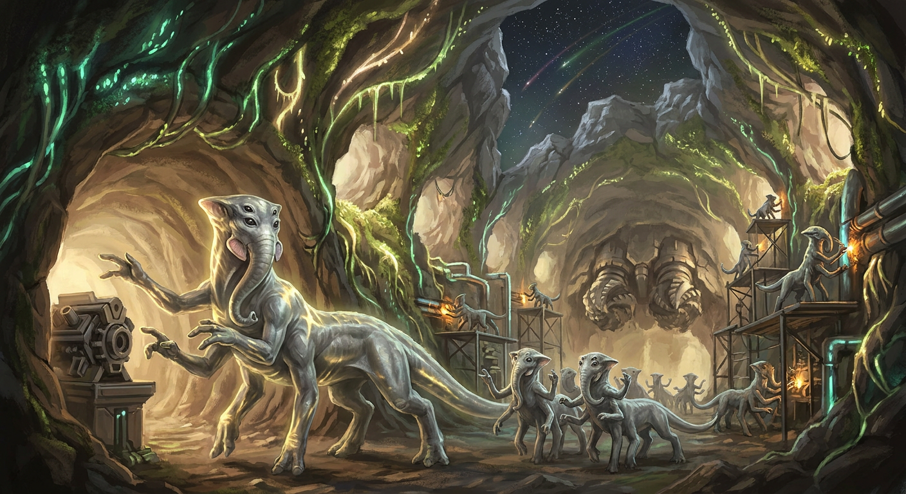

Промпт генератору

Painterly sci-fi concept art. A hilltop farm inside a mountain's upper level at sunset: a large strong female creature stands in a windowed observation cabin, gazing out as alien stars with colored trails fill the sky and glowing plants sway in the fields below. She has a four-legged horizontal body, rearing front trunk, four eyes, chest tympanum, and gray translucent stone-crystal flesh with faint yellow inner glow, faint chalk diagrams drawn on her chest skin. Earlier scenes visible in the composition's warm interior: simple cabins, small school rooms, builders — four-legged creatures like her — working with six-fingered hands. In a long dining hall, recruits share a meal, lanterns of glowing fruit lighting their gray crystalline bodies. Mood of tired satisfaction and quiet melancholy. One creature per character, no duplicates.

### Сцена 4. Бенедетта приносит снимок вернувшегося зонда с изображением ортогональных звёзд; споры и её решение лететь самой

- **Место:** песчаная земля между офисом и грузовым гаражом, Плацдарм
- **Герои:** Бенедетта, Ялда, Доротео, Фатима, Леония, Серафина, Ассунто и его ко, новобранцы

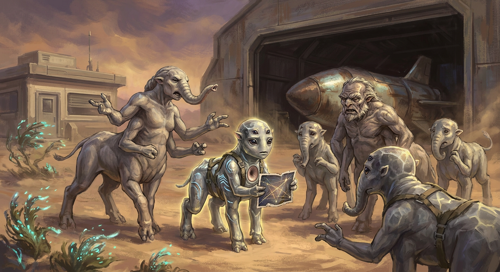

Промпт генератору

Painterly sci-fi concept art. On sandy ground between a low office building and a cargo garage, a young female pilot-creature holds up a printed image of orthogonal stars — strange points of light crisscrossed by streaks. She is small, four-legged with a rearing front trunk, four eyes, tympanum, gray translucent stone-crystal flesh glowing yellow within, painted 'story lines' on her chest, strapping gear on her body, brave despite downcast eyes. Around her a tense crowd: a large strong female leader, several recruits, and a stern elderly male — all the same four-legged species with rearing trunks and six-fingered hands gesturing in argument. Wind stirs luminous scrub plants; a bulky rocket garage looms behind. Dusty golden light, charged argumentative mood, decision hanging in the air. One creature per character, no duplicates.

### Сцена 5. Сильвио отвозит Ялду к новому лагерю фермеров; спор с Витторио о риске возгорания планеты

- **Место:** новый фермерский лагерь у заброшенного городка строителей, в тени горы
- **Герои:** Ялда, Сильвио, Витторио, члены общины

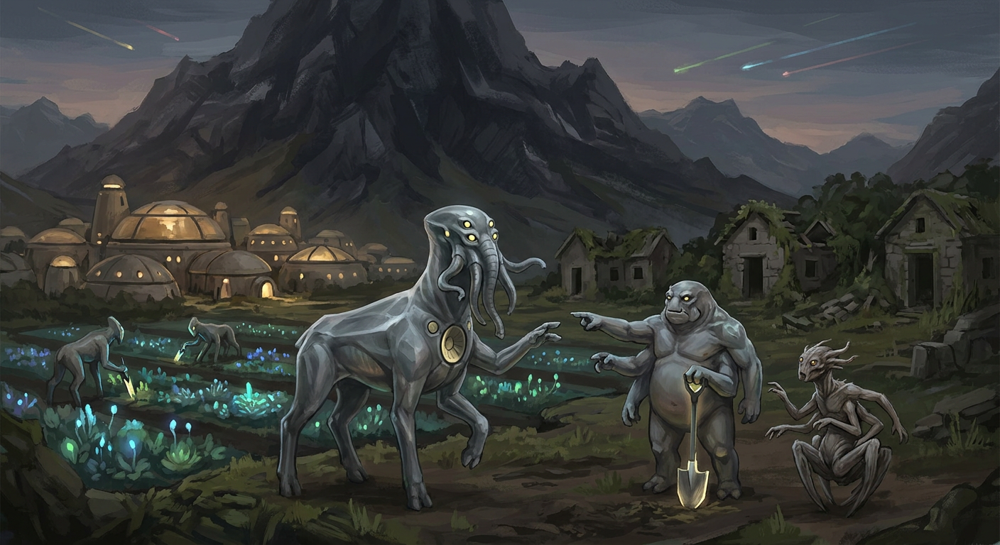

Промпт генератору

Painterly sci-fi concept art. A new farming settlement in the shadow of an immense mountain, beside an abandoned builders' town of empty stone huts. A large strong female leader-creature — four-legged horizontal body, rearing front trunk, four eyes, chest tympanum, gray translucent stone-crystal flesh with faint yellow glow — argues with a broad farmer male who sets down his shovel and gestures sharply with two fingers of a six-fingered hand. Nearby, a wiry assistant creature moves curled like a ball, legs turned into an extra pair of arms, face unreadable. Community members of the same species work glowing crop fields; luminous plants pulse softly in the dusk. The mountain towers dark and vast, and distant colored star-trails streak the sky, hinting at distant fire and risk. Mood of rural tension and foreboding. One creature per character, no duplicates.

### Сцена 6. Прощание с Бенедеттой, пристёгнутой в крошечной кабине испытательной ракеты

- **Место:** вершина испытательной ракеты и её кабина
- **Герои:** Ялда, Бенедетта, трое новобранцев

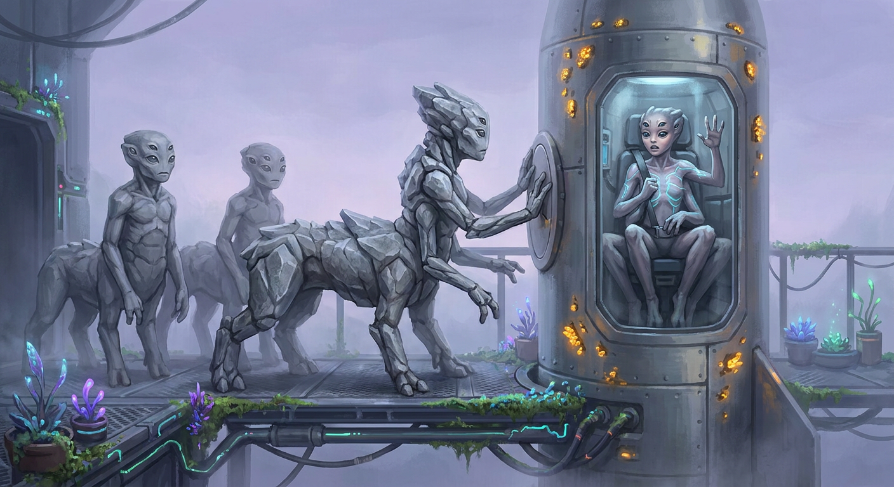

Промпт генератору

Painterly sci-fi concept art. At the summit cone of a slender test rocket, a tiny cramped cabin: a young female pilot-creature is strapped by harnesses to a bench, painted 'story lines' glowing faintly on her gray translucent stone-crystal chest. She has a four-legged horizontal body curled into the seat, rearing front trunk, four eyes wide with fear and resolve, tympanum below her mouth, six-fingered hand raised in farewell. Outside the hatch, on the gantry platform, a large strong female leader presses a six-fingered hand to the hull, and three young recruits of the same species stand behind, solemn. Cables, pipes, and rivets detail the metallic structure; glowing indicator lichens mark the rocket's flanks. Cold morning light, thin haze, mood of grief, courage, and final goodbye. One creature per character, no duplicates.

### Сцена 7. Наблюдение из бункера за стартом и полётом; сбой таймера, ручные зажигания и гибель Бенедетты при крушении

- **Место:** бункер и равнина у испытательного полигона
- **Герои:** Ялда, Фридо, Фатима, Леония, Эрнеста, Нино, новобранцы, Бенедетта (в ракете)

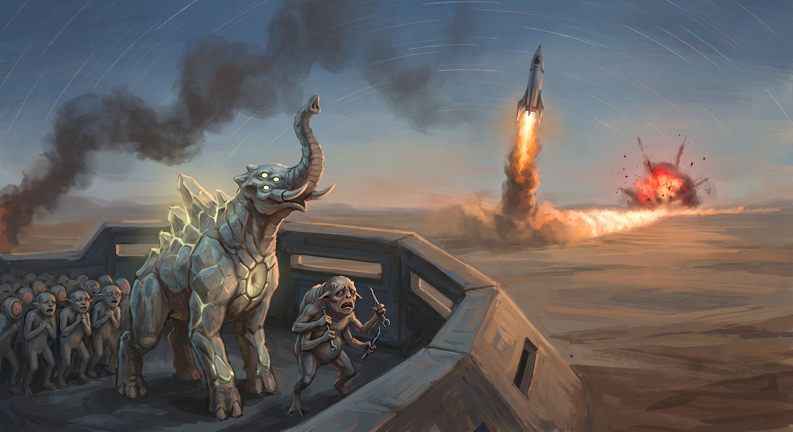

Промпт генератору

Painterly sci-fi concept art. A flat test range at dawn: from a reinforced observation bunker, a large strong female leader-creature and rows of young recruits watch a slender rocket lift off in a column of fire and smoke. She has a four-legged horizontal body, rearing trunk, four eyes, chest tympanum, gray translucent stone-crystal flesh glowing faint yellow; beside her an assistant creature with legs converted to extra arms clutches instruments, face showing wounded horror. The rocket climbs, stutters, drifts off course — a failed manual ignition — and plunges in a distant bloom of flame and debris across the plain, shockwave rippling glowing dust. Recruits press together, tympanums taut, gray bodies trembling. Colored star-trails hang in the sky above the smoke. Mood of dawning grief and helplessness. One creature per character, no duplicates.

### Сцена 8. Разговор с Евсебио в хижине: траншея вокруг горы, планеты, рождение его детей без обета; итоговые размышления Ялды

- **Место:** хижина Ялды у полигона
- **Герои:** Ялда, Евсебио

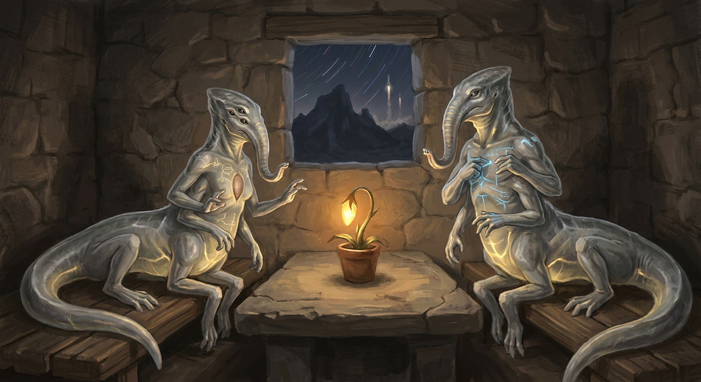

Промпт генератору

Painterly sci-fi concept art. Interior of a simple stone hut near a rocket test range, night. A large strong female creature — four-legged horizontal body, rearing front trunk, four eyes, chest tympanum, gray translucent stone-crystal flesh with faint yellow inner glow, diagrams sketched on her chest skin — talks quietly with a big but agile male visitor. He is tall, powerfully built, same species, drawing glowing schematic lines on his own chest with six-fingered hands and wiping them away as he speaks of a great trench dug around the mountain and distant planets. A single luminous lamp plant casts amber light over rough wooden benches; through the window, a vast dark mountain looms under a sky of colored star-trails. Mood of weary reflection, mourning, and fragile hope. One creature per character, no duplicates.

## Глава 13

### Сцена 1. Прощальная вечеринка для Ялды в доме Джорджо в Зевгме, речь Зосимо

- **Место:** дом Джорджо в Зевгме
- **Герои:** Ялда, Джорджо, Зосимо, Дария, гости

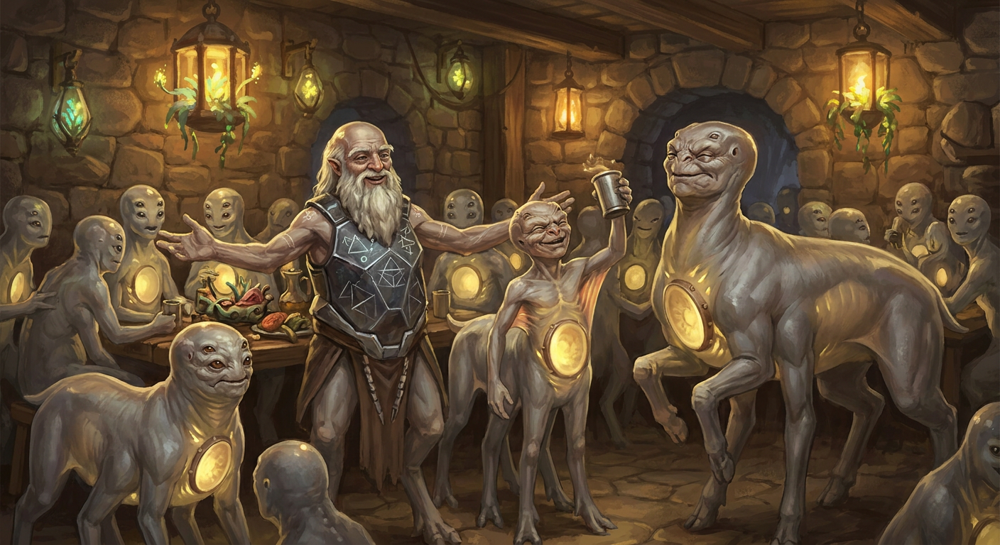

Промпт генератору

Painterly sci-fi concept art. A warm farewell party inside a rustic stone house in a provincial town. A distinguished elderly male scholar, host of the house, stands with arms spread wide in an expansive welcoming gesture, geometric chalk diagrams drawn on the gray stone-crystal plates of his chest. Beside him a young male academic gives a humorous toast, tympanum membrane rippling with speech, all four eyes crinkled. The guest of honor is a large, physically strong female of the species — a big-bodied solo, four-legged horizontal body, rearing front trunk, four eyes, drum-like tympanum, smooth gray translucent flesh with a faint yellow glow migrating inside. Dozens of guests crowd the room, four-legged, rearing, four-eyed, yellow inner glow. Lanterns of glowing plants light the walls; cheerful, bittersweet mood. Every creature is one creature, no duplicates.

### Сцена 2. Разговор Ялды с Дарией во дворе о веяниях и разделении семей

- **Место:** двор дома Джорджо
- **Герои:** Ялда, Дария

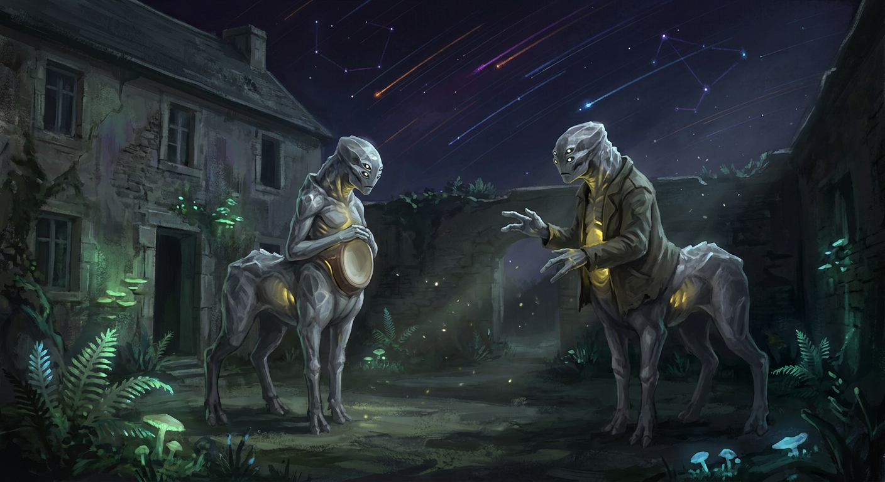

Промпт генератору

Painterly sci-fi concept art. A quiet courtyard at night beside a stone house, bioluminescent plants casting soft green-blue light, alien stars with colored trails in the sky. Two figures face each other. A large, strong-bodied female solo — four-legged horizontal body, rearing front trunk, four eyes, drum-like tympanum on the raised trunk, smooth gray stone-crystal translucent flesh with faint migrating yellow glow — stands in pensive thought. Opposite her, a mature female factory worker friend, also four-legged with rearing trunk, four eyes and tympanum, sturdy gray crystalline body with yellow inner light, gestures gently with two six-fingered hands as she speaks. Mood is intimate, melancholic, a serious conversation about families parting ways. Long shadows, glowing pollen dust drifting in the air. Each creature is one creature, no duplicates.

### Сцена 3. Приход Лидии с детьми, разговор о роли Ялды на ракете

- **Место:** двор дома Джорджо
- **Герои:** Ялда, Лидия, Валерия, Валерио, Дария

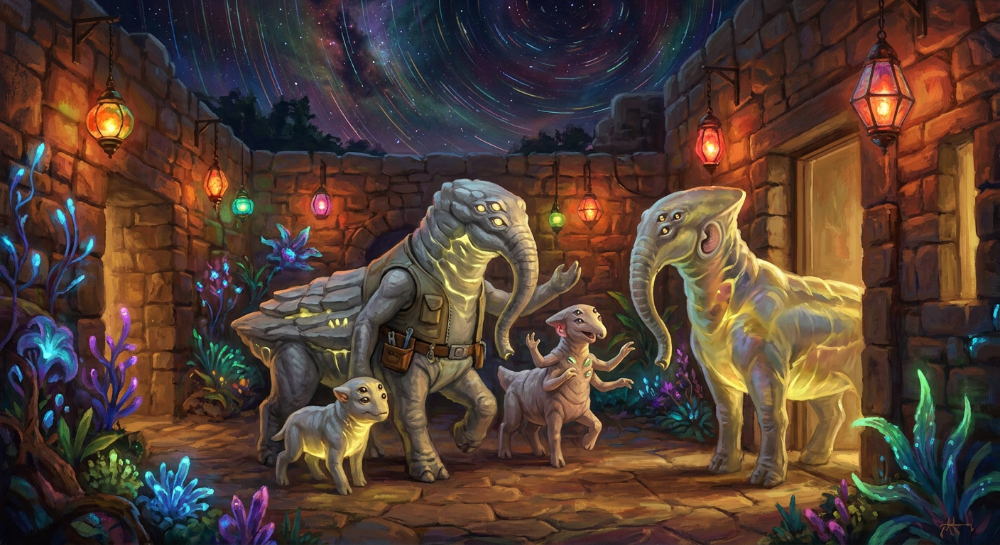

Промпт генератору

Painterly sci-fi concept art. A stone house courtyard at night, lit by glowing plants and hanging lamps with colored star-trails above. A family arrives: a middle-aged female factory worker, four-legged horizontal body with rearing front trunk, four eyes, tympanum, gray stone-crystal flesh glowing faintly yellow, greets the hostess warmly. With her come a teenage female with SIX arms budding from her chest, playful and bold, and a young male child, both with the standard four-legged rearing form, four eyes and yellow inner glow. The large strong female solo of the household stands listening, her tympanum taut with attention, faint yellow light shifting inside her translucent gray body. Domestic, warm, slightly noisy mood of a family gathering. Each creature is one creature, no duplicates.

### Сцена 4. Валерия дарит Ялде расчёты светового поля сферической оболочки светородов

- **Место:** двор дома Джорджо
- **Герои:** Ялда, Валерия, Лидия, Дария

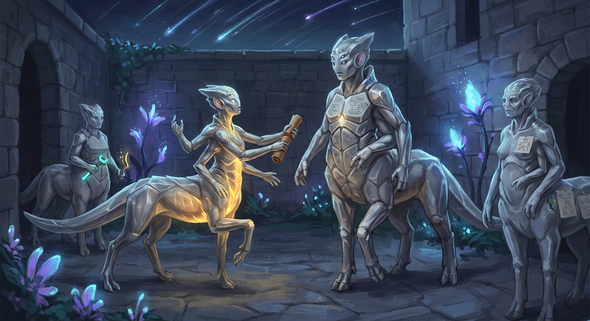

Промпт генератору

Painterly sci-fi concept art. Night courtyard of a stone house, glowing plants shedding soft light. A six-armed teenage female student, four-legged horizontal body, rearing front trunk, four eyes, tympanum, gray translucent stone-crystal flesh with inner yellow glow, solemnly hands a wooden tube of rolled calculations to a large strong female solo — same alien form, big-bodied, four eyes front and back, tympanum, diagrams sketched on her chest plates. Around them stand her mother, a sturdy four-legged female worker, and an older female biologist with a third arm budding from the middle of her chest, genealogical charts pinned to her gray crystalline body. The gift-giving is tender and ceremonious; lamplight and alien star-trails overhead. Each creature is one creature, no duplicates.

### Сцена 5. Беседа о светородах, газах и липкости пыли; разговор об Амелио

- **Место:** двор дома Джорджо
- **Герои:** Ялда, Валерия, Лидия, Дария

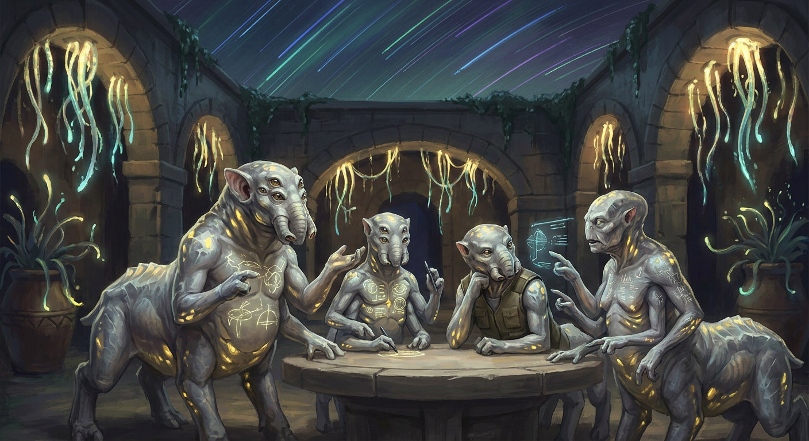

Промпт генератору

Painterly sci-fi concept art. A courtyard gathering at night, lantern-glow from bioluminescent plants, colored star-trails in the dark sky. Four aliens in animated technical discussion: a large strong female solo with four eyes front and rear, tympanum, gray translucent stone-crystal flesh and migrating yellow glow, sketching light-field diagrams on her own chest; a six-armed teenage female student drawing lens diagrams on her chest plates; a middle-aged female factory worker listening; and an older female biologist with a third arm budding mid-chest, charts on her body, demonstrating with six-fingered hands. All are four-legged horizontal creatures with rearing front trunks and four eyes. Chalk-like equations glow faintly on their crystalline skin. Mood curious, warm, scholarly. Each creature is one creature, no duplicates.

### Сцена 6. Завершение вечеринки, проводы Ялды на вокзал, слёзы Валерио, отъезд поезда

- **Место:** дом Джорджо, улицы Зевгмы, вокзал
- **Герои:** Ялда, Джорджо, Лидия, Валерия, Валерио, Дария, гости

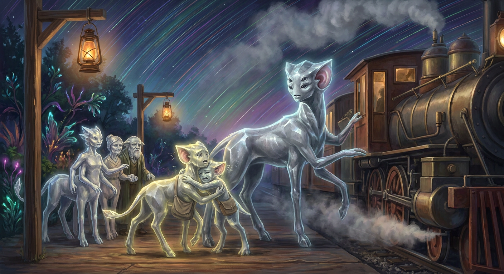

Промпт генератору

Painterly sci-fi concept art. A farewell scene at a small-town railway platform under alien night sky with colored star-trails. A large strong female solo — four-legged horizontal body, rearing trunk, four eyes, tympanum, gray translucent stone-crystal flesh with inner yellow glow — boards a steam-hauled train. Beside the train, a young male student clumsily embraces her, tympanum trembling, weeping; a six-armed young female student stands with her mother and an elderly male scholar, all with the standard four-legged rearing form, four eyes, faint yellow glow inside gray crystalline bodies. Glowing plants line the platform; lanterns hiss; smoke and steam curl as the train begins to move. Bittersweet, tearful, warm mood. Each creature is one creature, no duplicates.

### Сцена 7. Прибытие в опустевший Плацдарм, встреча с незнакомой сокомандницей

- **Место:** Плацдарм, главная площадь
- **Герои:** Ялда, женщина-путешественница

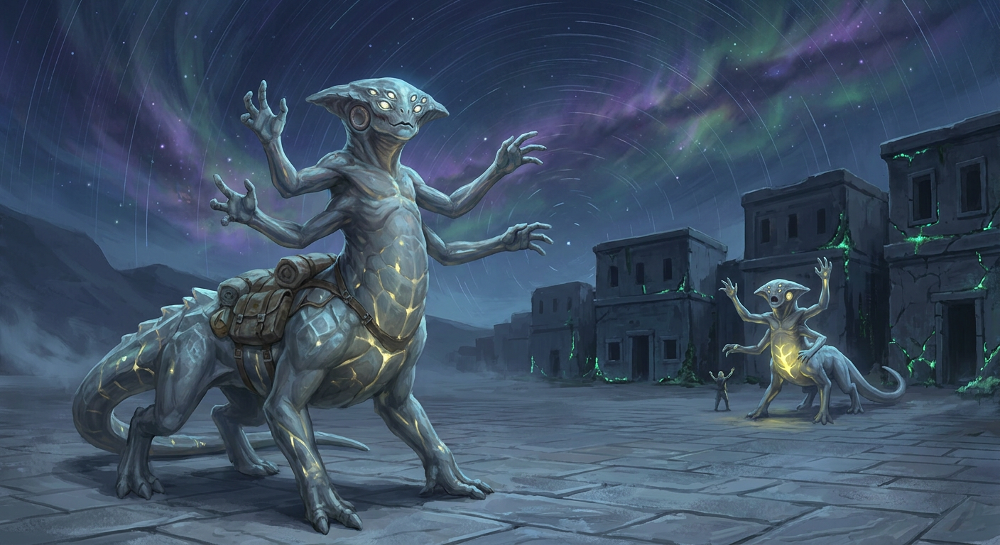

Промпт генератору

Painterly sci-fi concept art. A vast, almost deserted town square at night — a frontier settlement under a huge alien sky streaked with star-trails and glowing nebulae. Empty stone buildings, faintly luminous plants growing from cracks in the pavement. A large strong female solo traveler — four-legged horizontal body, rearing front trunk, four eyes, drum-like tympanum, gray translucent stone-crystal flesh with a faint yellow glow migrating inside, travel gear strapped to her broad back — pauses in the middle of the square. Across the way, another female traveler of the same species, also four-legged with rearing trunk and four eyes, calls out a cheerful greeting with a raised six-fingered hand, yellow light pulsing warmly under her skin. Lonely yet friendly mood, cold blue night air. Each creature is one creature, no duplicates.

### Сцена 9. Дорога на грузовике к горе, размышления Ялды о возможности остаться

- **Место:** грузовик между Плацдармом и Бесподобной
- **Герои:** Ялда, водитель грузовика

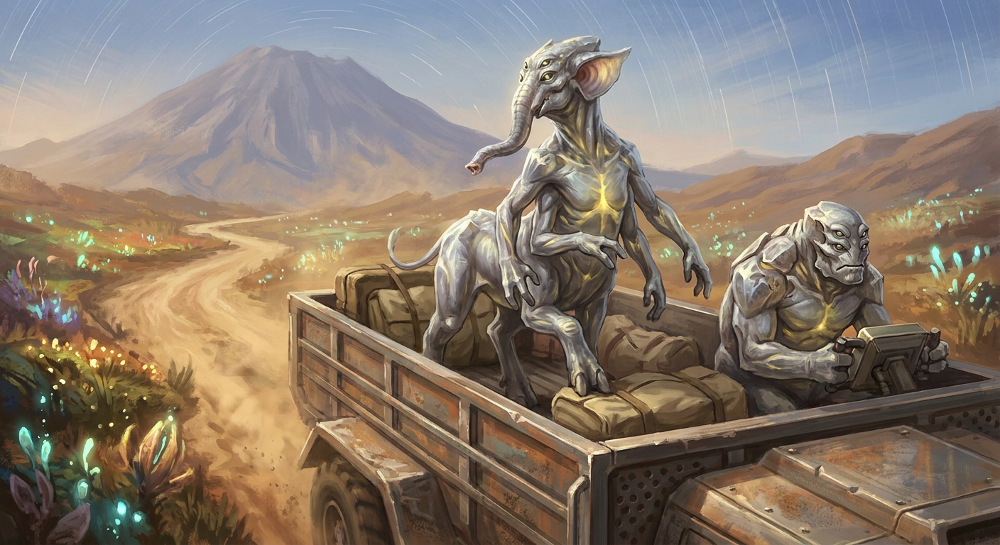

Промпт генератору

Painterly sci-fi concept art. Interior of a rugged open truck bouncing along a dirt road toward a colossal mountain on the horizon, alien landscape dotted with glowing plants, colored star-trails in the daylight-distorted sky. Two passengers in the cargo bed: a large strong female solo — four-legged horizontal body, rearing front trunk, four eyes, tympanum, gray translucent stone-crystal flesh with faint yellow inner glow, luggage around her — gazes thoughtfully at the distant mountain, contemplating. Beside her the driver, a stocky male of the same species, four-legged with rearing trunk, four eyes, weathered crystalline plates, grips the wheel with six-fingered hands. Wind, dust, hot light, a mood of determination mixed with doubt. Each creature is one creature, no duplicates.

### Сцена 10. Переход по пешеходному мосту над траншеей, Ялда преодолевает страх и входит в гору

- **Место:** пешеходный мост через траншею у Бесподобной
- **Герои:** Ялда

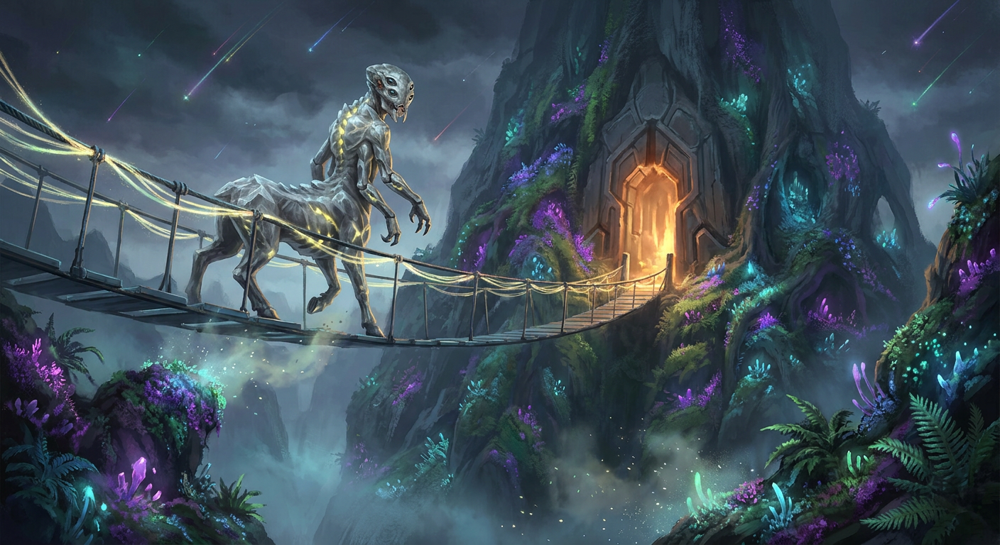

Промпт генератору

Painterly sci-fi concept art. A lone pedestrian suspension bridge crossing a deep, vast trench at the foot of a colossal hollowed mountain, the structure looming with carved openings glowing faintly yellow. In the middle of the swaying bridge walks a single figure: a large strong female solo — four-legged horizontal body, rearing front trunk, four eyes front and back, drum-like tympanum, smooth gray translucent stone-crystal flesh, faint yellow glow trembling inside with fear and resolve. Wind whips glowing dust from the trench below; alien stars with colored trails wheel overhead. Her head is lowered but determined as she approaches the mountain's entrance, which glows like a gateway. Dramatic, vertiginous, awe-filled mood. One creature only, no duplicates.

### Сцена 12. Прощальная речь Евсебио перед экипажем о рисках и назначении Ялды лидером

- **Место:** сцена конференц-зала
- **Герои:** Евсебио, Ялда, Фридо, путешественники

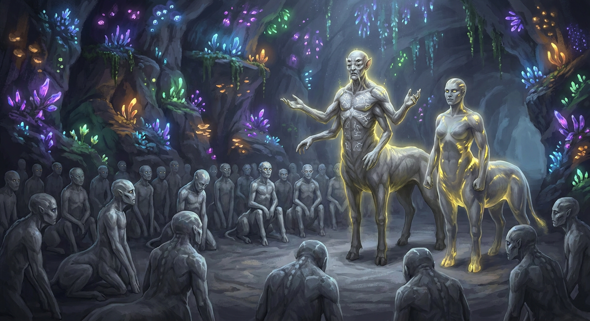

Промпт генератору

Painterly sci-fi concept art. A large assembly hall carved inside a mountain, walls of worked stone glowing with embedded luminescent plants, before a crew of travelers. At the front stands a tall, strong, perfectly built elderly male leader — four-legged horizontal body, rearing front trunk, four eyes, tympanum, gray stone-crystal flesh with faint yellow glow — speaking with sweeping two-handed gestures, chest plates covered in chalk diagrams, his expression grave and weary. Beside him stands a large strong female solo, four eyes, tympanum, translucent gray flesh with migrating yellow light, newly appointed leader, steady and resolute. The seated crowd of travelers — dozens of four-legged, rearing, four-eyed beings — hunch with lowered eyes, worried. Somber, weighty mood of farewell and duty. Each creature is one creature, no duplicates.

### Сцена 13. Фридо инструктирует экипаж о пусковых станциях; возвращение жетонов ушедшими

- **Место:** конференц-зал
- **Герои:** Фридо, Евсебио, Ялда, Рина, Лавиния, путешественники

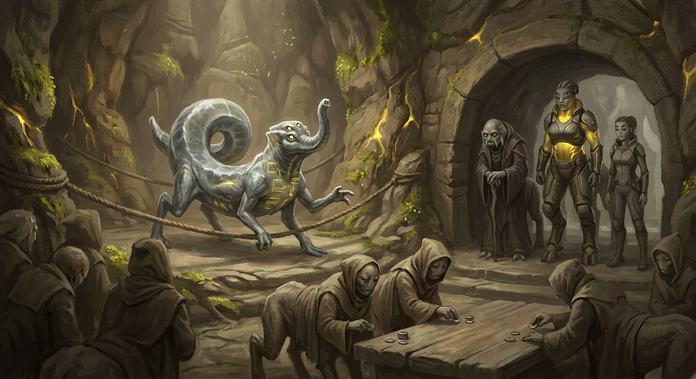

Промпт генератору

Painterly sci-fi concept art. A stone assembly hall inside a mountain, lit by glowing plants and wall veins of yellow light. A male engineer-assistant with an impassive face — four-legged horizontal body curled as he moves nimbly along ropes, legs transformed like an extra pair of hands, rearing front trunk, four eyes, tympanum, gray translucent stone-crystal flesh with faint yellow glow — instructs the crowd, chest diagrams glowing. Several worried crew members file forward to return their metal tokens to a table, heads lowered, tympanums slack with grief. Watching from the side: a tall weary elderly male leader, a large strong female solo with four eyes and yellow inner glow, and two female crew members, all four-legged rearing four-eyed beings. Somber, disciplined, tense atmosphere. Each creature is one creature, no duplicates.

### Сцена 15. Ялда встречает Фатиму и предлагает стать её учителем

- **Место:** конференц-зал
- **Герои:** Ялда, Фатима

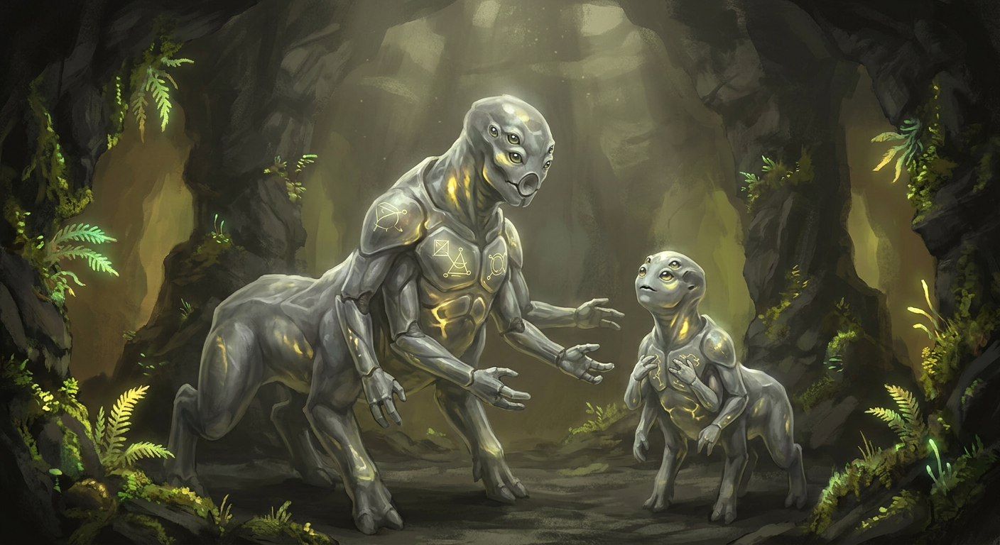

Промпт генератору

Painterly sci-fi concept art. A carved stone conference hall inside a mountain, luminous plants along the walls casting soft green-yellow light. A large strong female solo — four-legged horizontal body, rearing front trunk, four eyes front and back, drum-like tympanum, smooth gray translucent stone-crystal flesh with faint migrating yellow glow, neat stylized diagrams drawn on her chest plates — leans gently toward a young female worker, offering a mentor's greeting with open six-fingered hands. The younger one, also four-legged with rearing trunk, four eyes and tympanum, slender gray crystalline body with a shy yellow glow, looks up with hopeful, nervous eyes, drawing hesitant diagrams on her own chest. Quiet, tender mood of a new apprenticeship beginning. Two creatures only, no duplicates.

## Глава 14

### Сцена 1. Обратный отсчёт и запуск двигателей «Бесподобной» на навигационном посту

- **Место:** навигационный пост «Бесподобной»
- **Герои:** Ялда, Фридо, Бабила

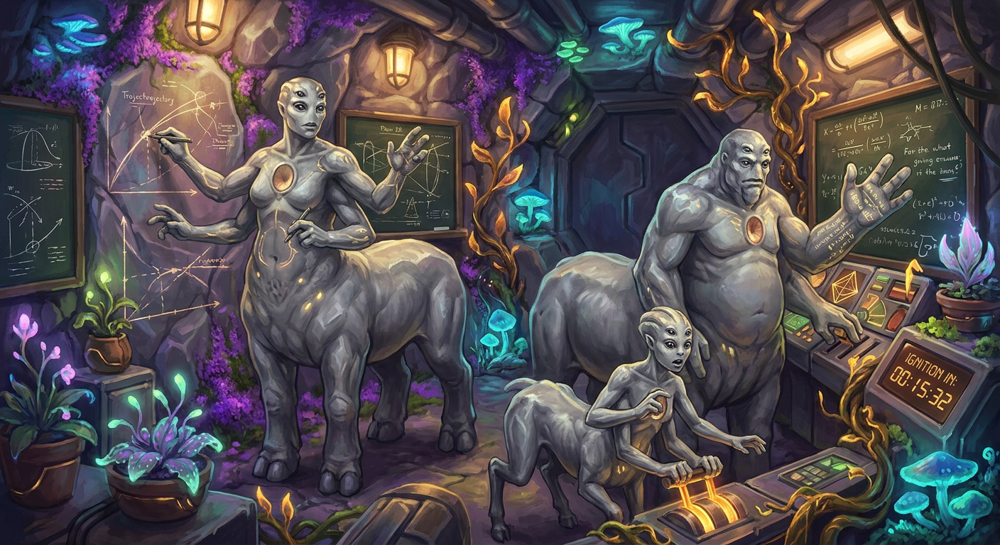

Промпт генератору

Painterly sci-fi concept art. Inside a cramped navigation post of a generation starship, a countdown to engine ignition: glowing geometric instruments and chalkboards covered in diagrams line the rock-crystal walls. A large strong female scholar with a bulky gray stone-crystal body stands on four blunt-footed legs, her raised front trunk bearing four eyes (front and rear pairs), a drum-like tympanum below her mouth, and six-fingered hands on her chest sketching trajectory diagrams on her own skin. Beside her, a heavyset male engineer with thick legs grown from his torso leans on a console, words written across his stretched palm. A slim younger female assistant with a rearing trunk and four alert eyes crouches at the firing lever. Warm lamplight, faint yellow glow migrating inside their translucent gray flesh, tension and wonder in the air. Painterly sci-fi concept art.

### Сцена 2. Отказы двигателей, обмен сообщениями, обнаружение диверсанта

- **Место:** навигационный пост
- **Герои:** Ялда, Фридо, Бабила

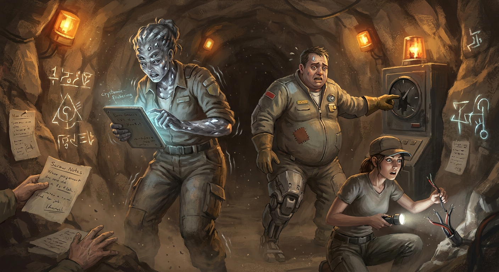

Промпт генератору

Painterly sci-fi concept art. The same navigation post, moments later: engine failure. Alarm lamps pulse amber across chalk-marked walls as the crew exchanges urgent written messages scrawled on chests and stretched palms. A large strong female with four eyes (front and rear pairs), a tympanum on her raised front trunk, and gray stone-crystal flesh flickering with inner yellow glow reads a failure report, her body trembling. A heavyset male engineer with legs grown from his torso gestures at a dead gauge, face frozen in dread. A slim female assistant stares at a hidden cable someone has cut, eyes widening as the saboteur's work is discovered. Dusty lamplight, cramped grotto interior, tension thick as the countdown stops. Painterly sci-fi concept art.

### Сцена 3. Механики приводят пойманного диверсанта Нино; допрос

- **Место:** навигационный пост
- **Герои:** Ялда, Фридо, Бабила, Нино, Пия, Дельфиния, Онеста, Северо

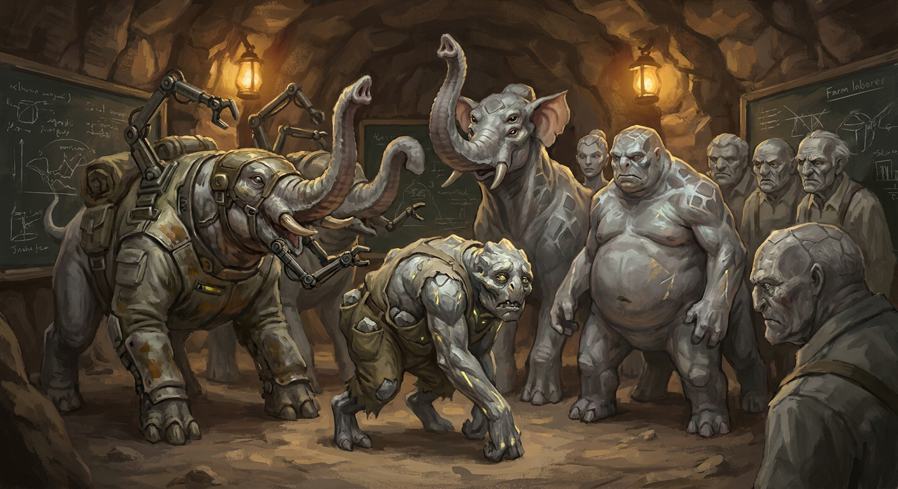

Промпт генератору

Painterly sci-fi concept art. In the navigation post cavern, mechanics escort in a captured saboteur: a hunched male farmer, four-legged body low and cowering, four eyes blinking nervously, rear eyes flicking about, gray stone-crystal flesh with faint yellow glow, stones bulging in body pockets. Around him stand the interrogators: a large strong female leader with rearing trunk, four eyes and tympanum; a heavyset male engineer with legs grown from his torso; a slim female assistant; and three stern farm women and an elderly male, all four-legged creatures with blunt feet, hardened geometric plates on their gray translucent flesh. Chalkboard walls, amber lamplight, hostile crowd mood, tense claustrophobic drama. Painterly sci-fi concept art.

### Сцена 4. Устройство временной камеры и спор о казни Нино

- **Место:** навигационный пост / кладовая
- **Герои:** Ялда, Фридо, Бабила, Нино

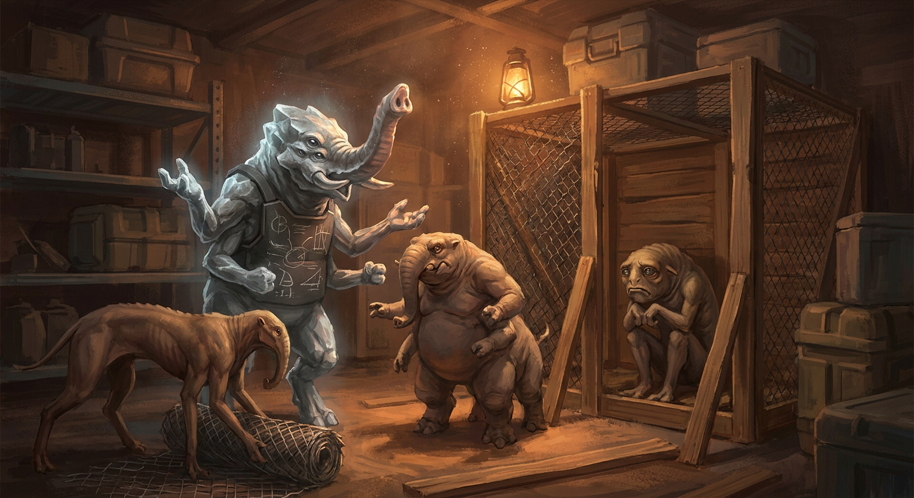

Промпт генератору

Painterly sci-fi concept art. In a storage alcove off the navigation post, the crew builds a temporary holding cell from timber beams, wire mesh and crates while arguing about the saboteur's fate. A large strong female with four eyes, tympanum, rearing front trunk and gray stone-crystal flesh glowing faint yellow inside gestures in reasoned argument, diagrams written on her chest. A heavyset male engineer with torso-grown legs helps lash the frame; a slim female assistant hauls mesh. The hunched male prisoner, a four-legged creature with crouched posture and shifting rear eyes, sits curled inside the half-built cell, pouting stones in his pockets. Warm lamplight, dust motes, uneasy mood between mercy and fury. Painterly sci-fi concept art.

### Сцена 5. Ялда в наблюдательной каюте разглядывает родную планету и звёзды

- **Место:** наблюдательная каюта-пещера с хрусталитовым куполом
- **Герои:** Ялда

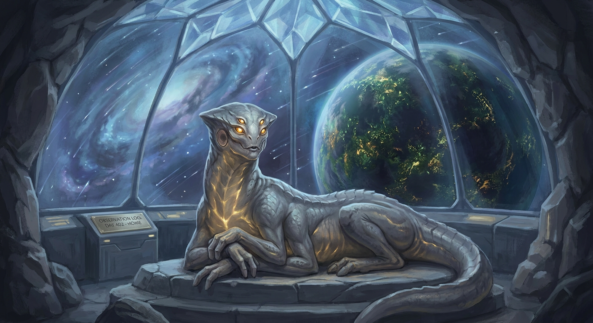

Промпт генератору

Painterly sci-fi concept art. Alone in an observation cabin, a cave room capped by a crystal dome, a large strong female creature lies on her blunt-footed legs gazing upward. Her horizontal body's raised front trunk carries four eyes (front and rear pairs), a tympanum below her mouth, six-fingered hands folded quietly at her chest; gray stone-crystal flesh glows faint yellow deep within, translucent under starlight. Through the dome: her home planet, a vast mottled world with glowing vegetation on its night side, drifting against stars that trail colored streaks like brush strokes, alien physics bending their light. The vast silence of space presses against the crystal. Melancholy, homesickness, awe. Soft blue starlight and warm inner glow. Painterly sci-fi concept art.

### Сцена 6. Осмотр обвала в дозирующей камере второго яруса, беседа с Палладией

- **Место:** дозирующая камера второго яруса
- **Герои:** Ялда, Палладия, рабочие

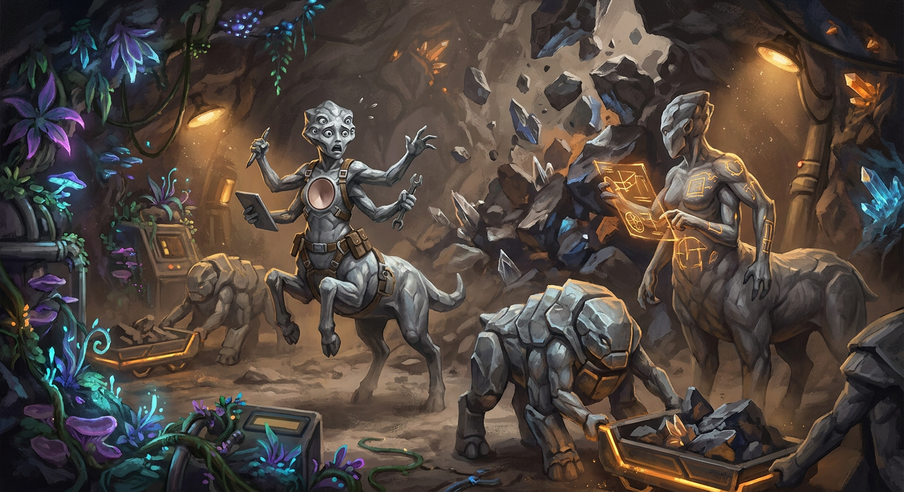

Промпт генератору

Painterly sci-fi concept art. A metering chamber on the second level of a hollowed asteroid starship, partly blocked by a rockfall. A former mining engineer female with rich expressive face — panicked wide four eyes, pleading look — directs workers clearing rubble; her four-legged gray stone-crystal body rears at the collapse, tympanum taut, hands gesturing instructions. A large strong female leader inspects the fallen stones, diagrams sketched on her chest, rear eyes watching workers. Several four-legged laborers with blunt feet and hardened geometric plates haul rock in the dust. Amber work-lamps, drifting stone dust, glowing crystal veins in the walls, tense rescue atmosphere. Painterly sci-fi concept art.

### Сцена 7. Подъём по лестнице, осмотр глубинного леса и пшеничной пещеры

- **Место:** лестничная клетка, лесная пещера, пшеничная пещера
- **Герои:** Ялда, древесники (упомянуты)

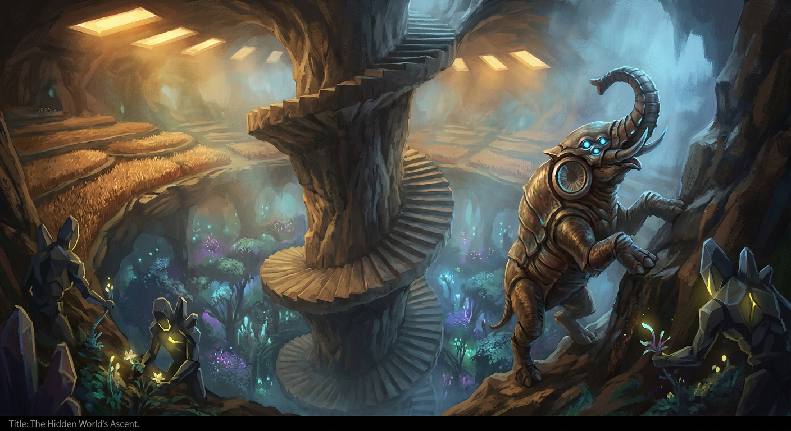

Промпт генератору

Painterly sci-fi concept art. A tall stairwell shaft inside a hollowed-out rock world, leading into a deep forest cavern. A large strong female creature climbs on four blunt-footed legs, her rearing trunk with four eyes and tympanum turning to take in the view. Below spreads a forest of luminous trees, faint colored glows migrating up their translucent trunks; beyond, a wheat cavern with terraced fields of grain under glowing ceiling panels. In the shadows, forest-keeper figures — four-legged gray stone-crystal creatures with faint inner yellow glow and geometric plates — tend the glowing plants. Warm golden field light and cool blue forest glow mix in the misty air. Peaceful, strange, wondrous. Painterly sci-fi concept art.

### Сцена 8. Обвал в медицинском саду, встреча с Фатимой

- **Место:** медицинский сад-пещера
- **Герои:** Ялда, Фатима, Джоконда, работники

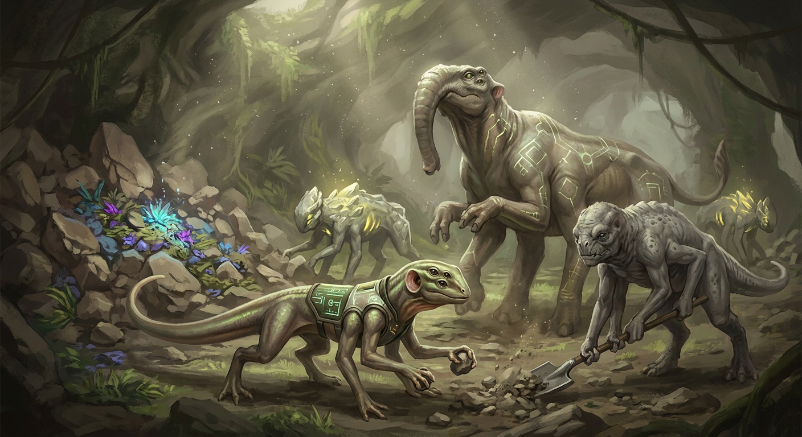

Промпт генератору

Painterly sci-fi concept art. A medical garden cavern with a fresh rockfall at one wall, crushed glowing herbs under stones. A young female worker, small-bodied with four eyes and a tympanum, neatly styled diagrams drawn on her chest, clears debris with six-fingered hands. Beside her an older female gardener and several four-legged workers with gray stone-crystal flesh and faint inner yellow glow shovel rubble. A large strong female leader, rearing trunk high, rear eyes scanning the ceiling for further danger, inspects the damage, diagrams on her own skin. Luminous medicinal plants cast green and gold light, dust drifts in the beams, a mood of loss and careful recovery. Painterly sci-fi concept art.

### Сцена 9. Садовники в наблюдательной каюте смотрят на родной мир и Пио

- **Место:** наблюдательная каюта
- **Герои:** Ялда, Фатима, Калогера, Джоконда, садовники

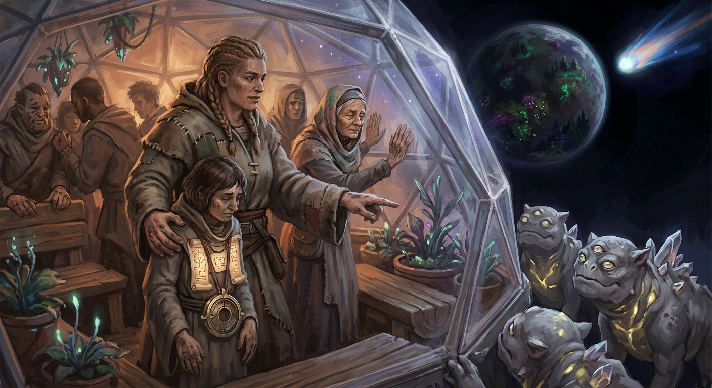

Промпт генератору

Painterly sci-fi concept art. A crystal-domed observation cabin crowded with gardeners. A large strong female leader and a young small-bodied female with chest diagrams and a tympanum stand close, while an older female gardener and several four-legged workers with gray stone-crystal flesh and faint yellow inner glow press toward the dome, four-eyed faces lifted in awe. Through the crystal: their home world hanging in the void, glowing vegetation freckling its dark hemisphere, and a wandering star trailing a colored streak of light. Warm body glow mingles with cool starlight reflected off the crystal facets. A hushed, reverent, homesick mood, wonder mixed with grief. Painterly sci-fi concept art.

### Сцена 10. Возвращение на пост; разговор с заключённым Нино и решение не казнить

- **Место:** навигационный пост, камера Нино
- **Герои:** Ялда, Фридо, Бабила, Нино

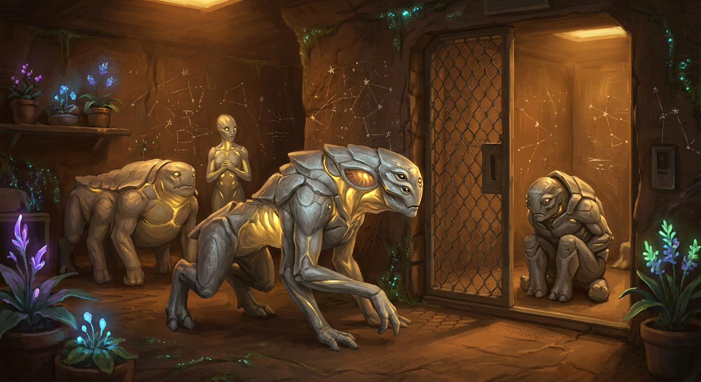

Промпт генератору

Painterly sci-fi concept art. Back in the navigation post, the leader speaks with the prisoner through the wire mesh of his small cell. A large strong female creature, four-eyed with tympanum and gray stone-crystal flesh glowing faint yellow within, crouches low in an open, forgiving posture, hands resting calmly. Inside the cell, a hunched male farmer sits curled on four blunt feet, rear eyes blinking warily, stones in his pockets, tension easing from his plated body. Behind the leader, a heavyset male engineer with torso-grown legs and a slim female assistant observe quietly, chalkboard walls covered in star charts around them. Amber lamplight, decision made — mercy instead of execution. Quiet, solemn mood. Painterly sci-fi concept art.

## Глава 15

### Сцена 1. Ялда в наблюдательной каюте измеряет курс; планета исчезает в сиянии Солнца

- **Место:** наблюдательная каюта «Бесподобной»
- **Герои:** Ялда

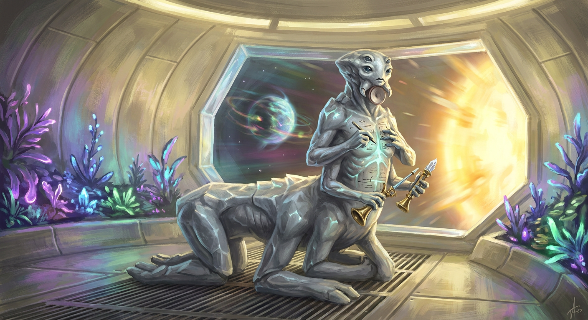

Промпт генератору

Painterly sci-fi concept art. A large female navigator-scholar of an alien species stands in a domed observation chamber aboard a generation starship, measuring the vessel's course. Her body is horizontal on four blunt flat legs, front third rearing upward like a bear, four eyes (front and rear pairs), a drum-like tympanum membrane below her mouth, smooth elastic gray stone-crystal flesh with faint yellow glow migrating inside; she has four six-fingered arms, one hand pressing a stylus against diagrams written on her own chest skin, two rear eyes watching curved brass instruments. Through the wide crystalline viewport the home planet shrinks into the blinding radiance of a swollen star, its colored trailing streaks smeared by the strange physics of this universe. The chamber glows with pale gold instrument light; bioluminescent guide-plants line the walls. Mood: solemn, awed, quietly grieving. One creature, no duplicates.

### Сцена 2. Ялда с агрономом Лавинио идёт по цветущему пшеничному полю; занятия для рабочих

- **Место:** медицинские сады и поля «Бесподобной»
- **Герои:** Ялда, Лавинио, Севера, Фатима, ученики

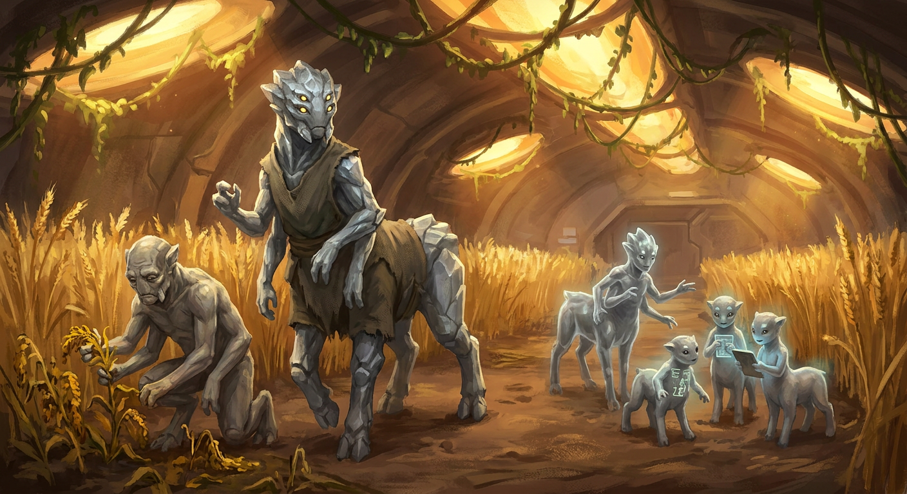

Промпт генератору

Painterly sci-fi concept art. Inside a vast shipboard agricultural bay, a flowering wheat field stretches under glowing ceiling vines. A large strong female teacher of the alien species — four-legged horizontal body, rearing front trunk, four eyes, tympanum on the chest, gray stone-crystal flesh with inner yellow glow — walks beside a stern older male agronomist who kneels among the stalks, four arms digging in soil, examining diseased goldenrod plants. Nearby a female instructor questions a small group of young students, all of the same species: horizontal bodies on blunt flat feet, rearing front trunks, four eyes, faint yellow glow under translucent gray crystalline skin; one young female worker has neat stylized diagrams drawn on her chest. Sunlamps and luminous plants cast warm amber light; soft mood of learning and labor. Several creatures, each unique, no duplicates.

### Сцена 3. Ялда навещает Нино в камере и уговаривает его учиться читать и писать

- **Место:** тюремная камера, навигационный пост первой ступени
- **Герои:** Ялда, Нино

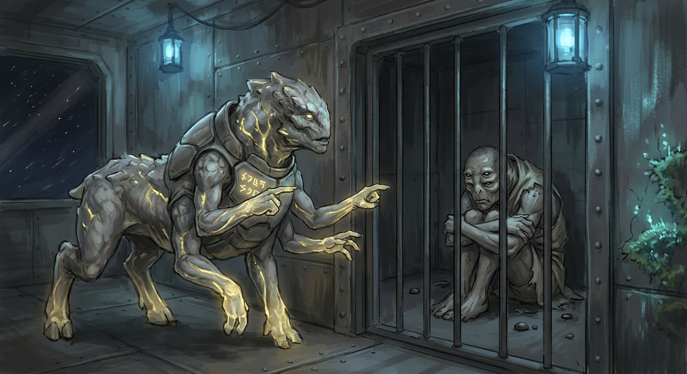

Промпт генератору

Painterly sci-fi concept art. A dim prison cell on a starship's navigation deck. A large strong female visitor of an alien species — horizontal four-legged body, rearing front trunk, four eyes, tympanum, gray stone-crystal flesh with migrating yellow glow, four six-fingered arms — crouches by the barred door, gesturing persuasively, one hand pointing to written symbols on her chest. Inside, a hunched male prisoner of the same species sits curled on the floor, two arms wrapped around his knees, blinking his rear eyes warily; his cell is bare except for a few small pebbles. Cold blue lantern light and a faint yellow glow from their translucent flesh mix in the gloom; riveted metal walls, faintly luminous moss. Mood: tense, coaxing, cautious hope. Two creatures, no duplicates.

### Сцена 4. Подготовка к переезду на второй ярус; Бабила, Фридо, взрыватели

- **Место:** навигационный пост первой ступени
- **Герои:** Ялда, Бабила, Фридо

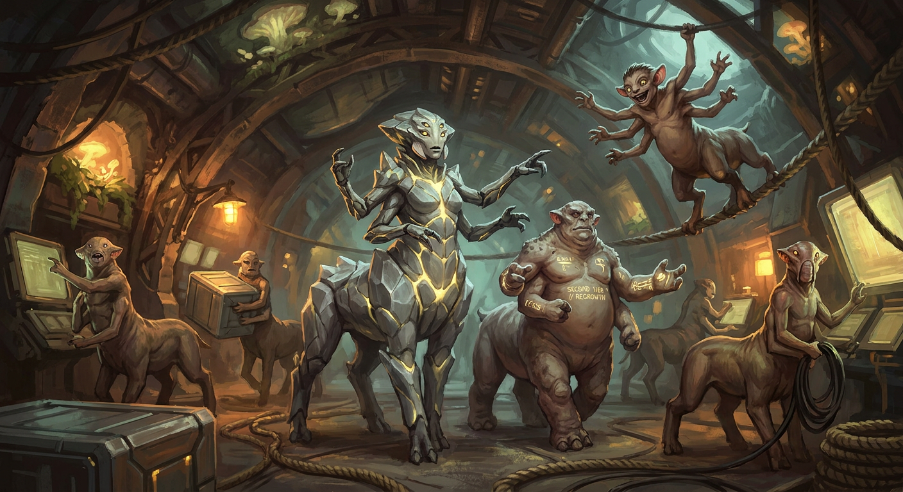

Промпт генератору

Painterly sci-fi concept art. A bustling navigation post on the first stage of a colossal generation starship, preparations for migration to the second tier. A large strong female leader of an alien species — horizontal four-legged body, rearing front trunk, four eyes, tympanum, gray stone-crystal flesh with yellow inner glow — stands among rope lines, directing workers. Beside her a heavyset male navigator-engineer walks with visibly thickened regrown legs, words written across his chest and stretched palm; an enthusiastic male assistant balances on the ropes, curled with his legs transformed into an extra pair of arms, tympanum membranes taut with excitement. Other crew members haul crates and coil lines. Warm lamplight, glowing plants in wall niches, deep shadows of the ship's cavernous interior. Mood: purposeful, industrious urgency. Several creatures, each unique, no duplicates.

### Сцена 5. Ялда ведёт Нино по лестнице, разговор о его семье и времени

- **Место:** лестница между ярусами
- **Герои:** Ялда, Нино

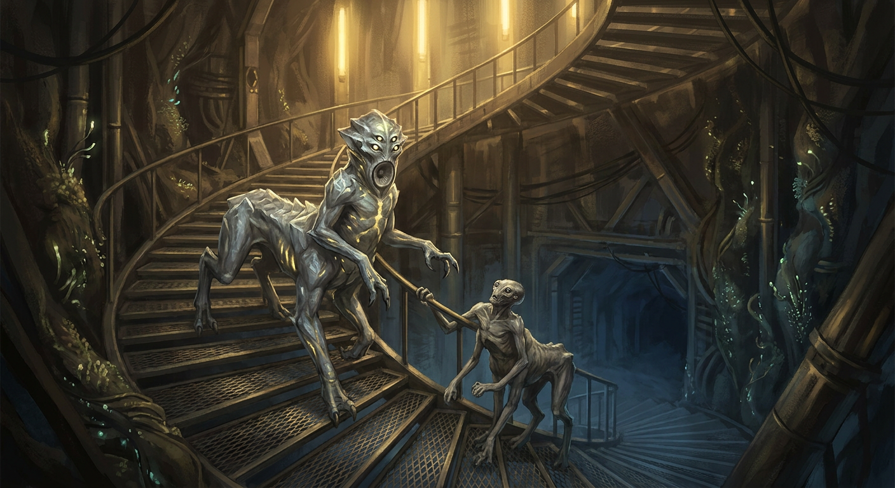

Промпт генератору

Painterly sci-fi concept art. A long metal staircase spiraling between the enormous tiers of a generation starship. A large strong female of an alien species — four-legged horizontal body, rearing front trunk, four eyes, tympanum, gray stone-crystal flesh with faint migrating yellow glow — descends carefully, guiding a gaunt male prisoner who blinks his rear eyes nervously, two of his hands gripping the rail. Their voices resonate through tympana as they speak of family and time; diagrams on her chest skin catch the light. Vertical shafts of warm lamplight fall between struts and cables; faintly glowing vines climb the walls; the stairwell plunges into shadowed depth below. Mood: intimate, meditative, melancholy — a conversation carried down through the bones of the ship. Two creatures, no duplicates.

### Сцена 6. Переход через дозирующие камеры; конфликт с Дельфиной, встреча с Онестой

- **Место:** дозирующие камеры, второй ярус
- **Герои:** Ялда, Нино, Дельфина, Онеста

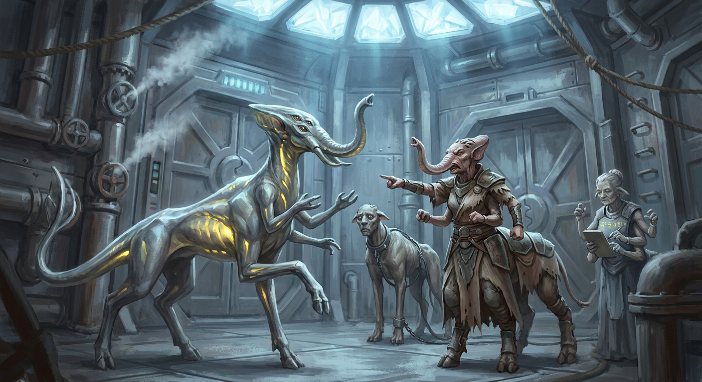

Промпт генератору

Painterly sci-fi concept art. The vast dosing chambers of a generation starship's second tier, a cavernous airlock complex of huge valves and pressure doors. A large strong female of an alien species — horizontal four-legged body, rearing front trunk, four eyes, tympanum, gray stone-crystal flesh with yellow inner glow — argues tensely with an angry senior female official gesturing with four arms; behind them a gaunt male prisoner waits warily, blinking rear eyes, while an elderly female attendant calmly prepares documents written on her chest. Steam curls from valves; cold blue-white light from crystallal panels overhead; ropes and handholds cross the chamber. Mood: confrontation and uneasy resolution inside the cold industrial heart of the ship. Several creatures of the same species, each unique, no duplicates.

### Сцена 7. Ялда предлагает Нино записать саги; он соглашается

- **Место:** новая камера Нино на втором ярусе
- **Герои:** Ялда, Нино

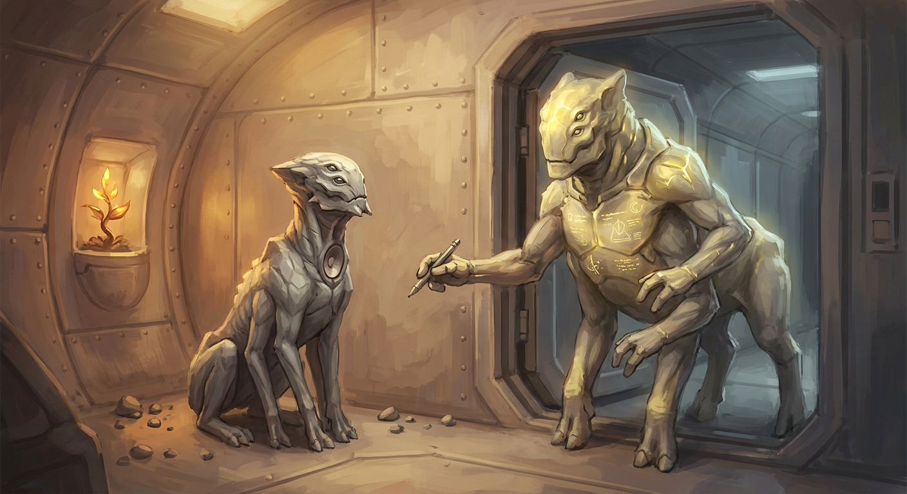

Промпт генератору

Painterly sci-fi concept art. A small new cell on the second tier of a generation starship, warmer and brighter than the old one. A large strong female of an alien species — horizontal four-legged body, rearing front trunk, four eyes, tympanum, gray stone-crystal flesh with faint yellow glow — leans through the doorway, one six-fingered hand offering a writing stylus, words and diagrams traced on her chest skin. Inside, a lean male of the same species, formerly hunched, now sits upright with the first spark of resolve, rear eyes blinking less warily, a few treasured pebbles on the floor beside him. Warm amber lamplight, a small glowing plant in a wall niche, riveted metal walls softened by light. Mood: quiet hope, an agreement forming — the gift of literacy and a future. Two creatures, no duplicates.

### Сцена 8. Успешный запуск второй ступени; сброс куска горы; Нино пишет саги

- **Место:** «Бесподобная» после запуска второй ступени
- **Герои:** Ялда, Фридо, Бабила, Нино

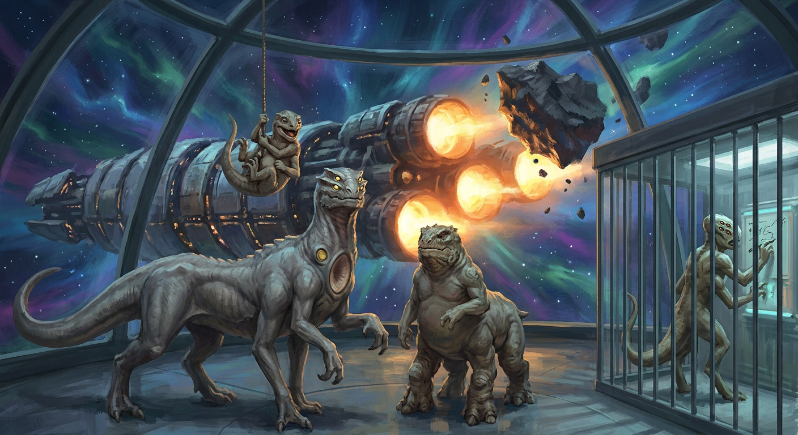

Промпт генератору

Painterly sci-fi concept art. The colossal spine of a generation starship mid-maneuver: the second stage's engines roar to life, and a torn-away chunk of mountain tumbles into the void, silhouetted against colored stellar streaks of this universe's strange physics. In the observation chamber, a large strong female commander of an alien species — horizontal four-legged body, rearing front trunk, four eyes, tympanum, gray stone-crystal flesh with yellow inner glow — watches the engine flame with a heavyset male navigator whose legs are thickened regrown flesh; an exuberant male assistant curls on a rope, legs turned into extra arms, tympanum thrumming. In a nearby cell a lean male prisoner writes sagas in shorthand on the wall, rear eyes fixed on his work. Triumph, awe, the violence of departure. Several creatures, each unique, no duplicates.

### Сцена 9. Урок с учениками Северы: наблюдение превращения звёзд в цветные шлейфы

- **Место:** наблюдательная каюта у края горы
- **Герои:** Ялда, Севера, Фатима, Авсилия, Проспера, ученики

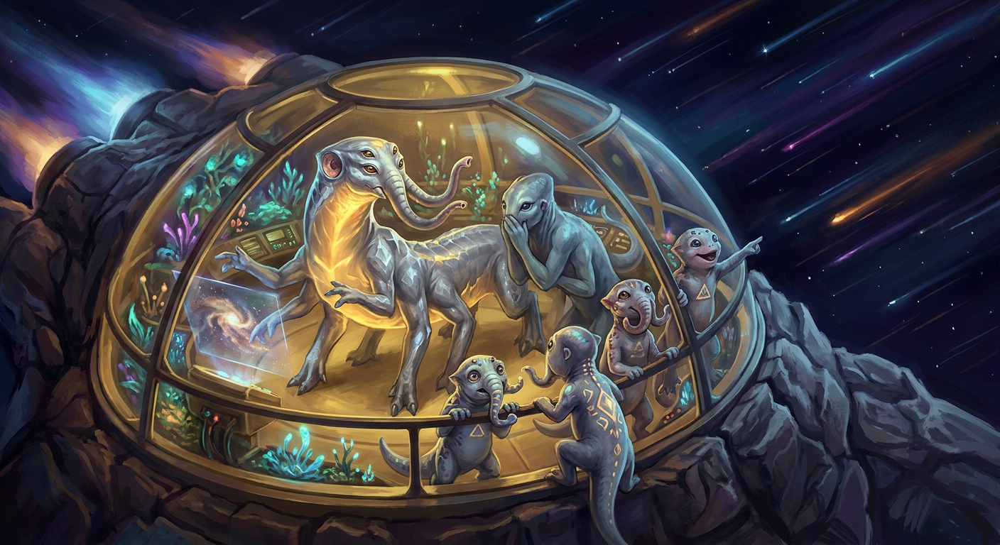

Промпт генератору

Painterly sci-fi concept art. An observation cabin at the edge of a mountain-sized starship, its dome overlooking a vacuum landscape where stars stretch into colored trails. A large strong female teacher of an alien species — horizontal four-legged body, rearing front trunk, four eyes, tympanum, gray stone-crystal flesh with yellow inner glow — leads a lesson; beside her a female instructor whispers a joke to the students. A crowd of young pupils of the same species presses to the dome: one eager female points to a triangle symbol on her chest; a bolder young female climbs the dome's edge to glimpse engine flames; a young female with neat diagrams on her chest clutches a rail, trembling with fear and wonder. Golden instrument light, luminous plants, cosmic streaks overhead. Several creatures, each unique, no duplicates.

## Глава 16

### Сцена 1. Остановка двигателей «Бесподобной»: экипаж навигационного поста переживает наступление невесомости, учится передвигаться по веревкам

- **Место:** каюта навигационного поста на борту «Бесподобной»
- **Герои:** Я, л, д, а, , , , Ф, р, и, д, о, , , , Б, а, б, и, л, а

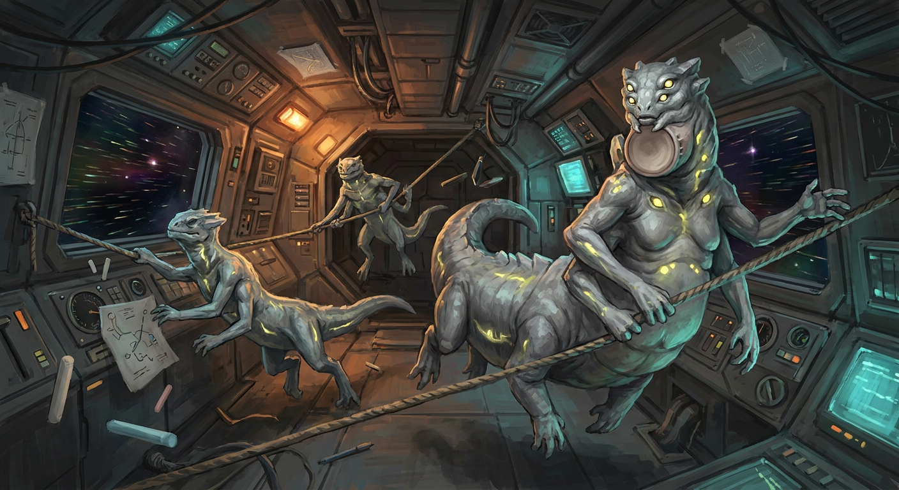

Промпт генератору

Painterly sci-fi concept art. Interior of a cramped navigation-post cabin aboard a starship at the moment the engines die: alien creatures drift into weightlessness, gripping and pulling themselves along taut guide-ropes strung across the low vaulted cabin. In the foreground, a large heavyset female of the species — four-legged horizontal body, rearing front trunk with four eyes (front and rear pairs), drum-like tympanum below the mouth, six-fingered hands on her chest, smooth gray stone-crystal flesh with faint migrating yellow glow — floats mid-air, one hand clamped on a rope, her body curled awkwardly. Around her, two lean male crew members, same alien anatomy — horizontal four-legged bodies, rearing trunks, four eyes, tympanums, gray translucent crystalline flesh with inner yellow light — tug themselves hand over hand along the ropes. Loose chalk sticks, tools and diagrams drift lazily in the zero-g air. Warm yellow interior lamplight mixes with cold light from glowing instrument panels; a viewport shows stars dragging long colored streaks. Mood: tense, disorienting, quietly exhilarating. One creature each, no duplicates.

### Сцена 2. Ялда навещает заключенного Нино в его камере, спорит о его судьбе

- **Место:** камера Нино у навигационного поста
- **Герои:** Я, л, д, а, , , , Н, и, н, о

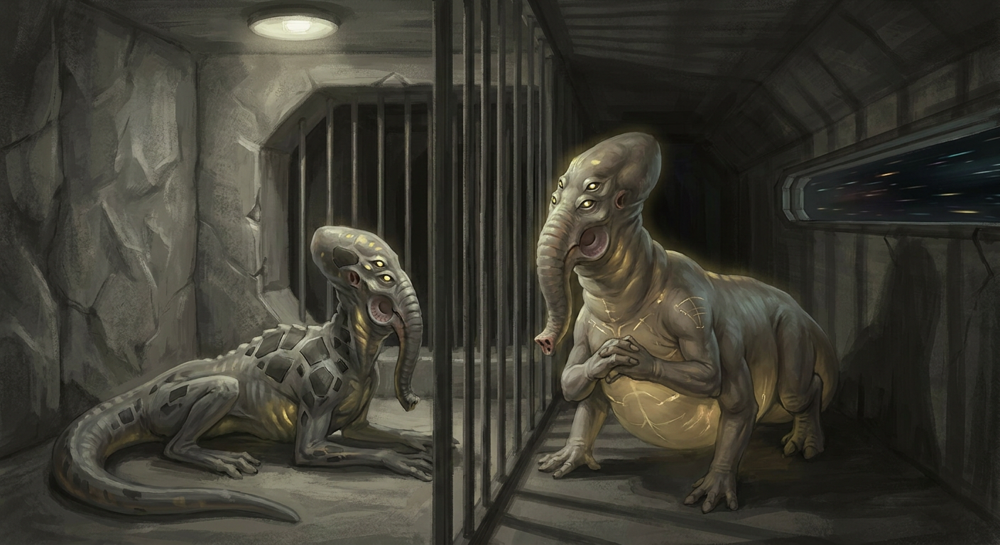

Промпт генератору

Painterly sci-fi concept art. A dim shipboard detention cell beside the navigation post: a small barred chamber carved from the vessel's gray stone-crystal bulkheads, lit by a single pale lamp. Behind the bars sits a lean male prisoner of the alien species — four-legged horizontal body resting on the floor, rearing front trunk, four eyes, tympanum membrane below the mouth, hardened geometric plates patching his gray translucent flesh, faint yellow glow dimmed and weary. Facing him through the bars stands a large heavyset female visitor: four-legged horizontal body, rearing trunk with front and rear eye pairs, tympanum, six-fingered hands on her chest, gray stone-crystal flesh with a soft inner yellow glow, diagram-scarred skin on her chest. Their postures are taut with argument — she leans forward on her forelimbs, tympanum taut; he turns his four eyes away. Long shadows, restrained anger, melancholy. Through a slit viewport, stars streak by with faint colored trails. One creature each, no duplicates.

### Сцена 3. Исидора зовет Ялду в оптическую мастерскую, где Сабино демонстрирует силу Нерео между песчинками пассивита

- **Место:** кабинет Ялды, коридор, оптическая мастерская
- **Герои:** Я, л, д, а, , , , И, с, и, д, о, р, а, , , , С, а, б, и, н, о

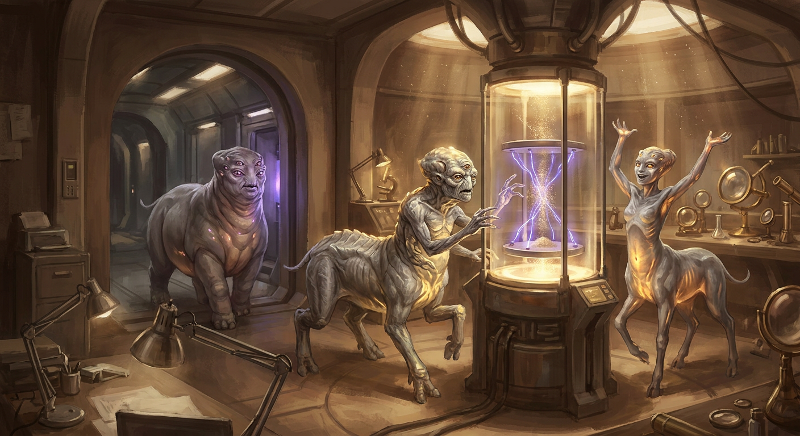

Промпт генератору

Painterly sci-fi concept art. Sequence setting: a modest office opening into a corridor that leads to an optical workshop aboard a starship. In the workshop, an elderly male artisan demonstrates a demonstration before a glowing apparatus: grains of shimmering passive material float between two plates, threads of strange light force — energy visible as violet-blue filaments — threading between the sand grains. He is an alien: four-legged horizontal body, rearing front trunk, four eyes, tympanum, wiry arms with six-fingered hands, wrinkled gray stone-crystal flesh glowing faintly yellow from within. Beside him a slim younger female gestures excitedly toward the grains; entering behind her is a large heavyset female — same species anatomy, rearing trunk, front and rear eye pairs, tympanum, chest hands, gray translucent flesh with yellow inner light. Warm workshop lamplight, brass-and-glass optical instruments, dust motes catching the violet energy. Mood: wonder of discovery. One creature each, no duplicates.

### Сцена 4. Обсуждение дальнейших экспериментов продолжается в столовой; Ялда вечером размышляет о будущем

- **Место:** столовая, затем каюта Ялды
- **Герои:** Я, л, д, а, , , , И, с, и, д, о, р, а, , , , С, а, б, и, н, о

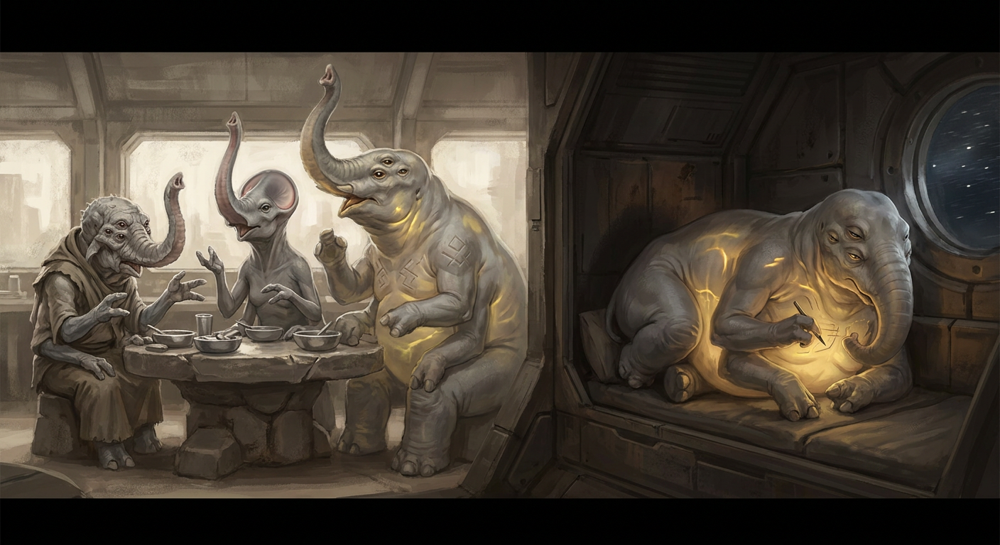

Промпт генератору

Painterly sci-fi concept art. Two beats in one frame's mood: first a ship's mess hall, long low stone tables, where three aliens of one species discuss over shared food — an elderly male artisan with wrinkled gray stone-crystal flesh and four eyes gesturing with wiry six-fingered arms; a slim female leaning in, tympanum membrane on her raised front trunk taut with argument; and a large heavyset female, four-legged horizontal body, front and rear eye pairs, diagram-scarred chest skin, faint yellow glow inside translucent gray flesh, all with rearing trunks and blunt flat feet. Then the evening image dominates: the large female alone in her small dim cabin, curled in a resting coil of her elastic body, four eyes half-lidded, drawing faint geometric diagrams on her own chest skin with one six-fingered hand, warm yellow inner glow pulsing softly against dark bulkheads, a viewport full of slowly streaking stars. Mood: thoughtful, quiet, uncertain future. One creature each, no duplicates.

### Сцена 5. Фатима докладывает о визитах к Нино и о состоянии леса; упоминает странную пшеницу

- **Место:** кабинет Ялды
- **Герои:** Я, л, д, а, , , , Ф, а, т, и, м, а

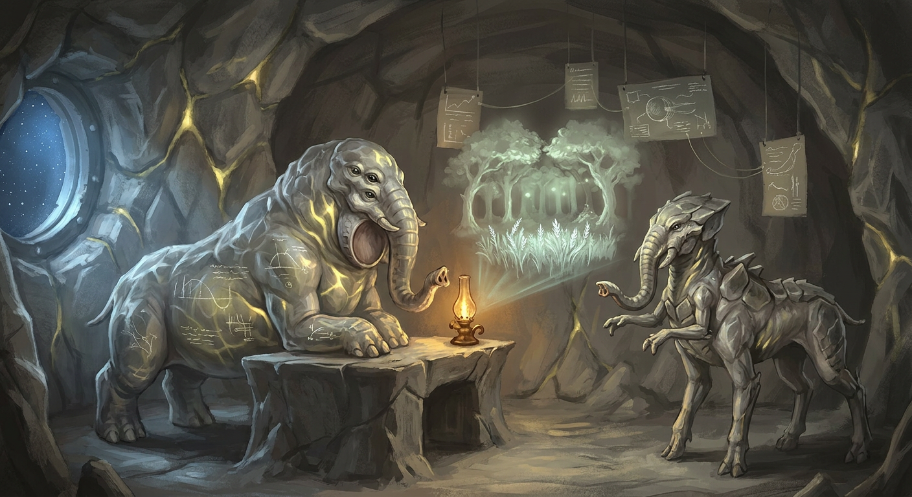

Промпт генератору

Painterly sci-fi concept art. A ship captain's office aboard a generation starship: low vaulted room of gray stone-crystal walls with softly glowing yellow veins of light. A large heavyset female commander — four-legged horizontal body, rearing front trunk with four eyes in front and rear pairs, drum-like tympanum below the mouth, six-fingered hands on her chest, gray translucent crystalline flesh with faint migrating yellow inner glow, diagram-scarred chest skin — listens gravely while a slim female envoy reports: same alien anatomy, rearing trunk, four eyes, tympanum, chest hands, gray stone-crystal flesh, subtle hardened plates. Between them a glowing projection of the ship's forest chamber: dense canopy of softly luminous trees and a patch of pale wheat glowing faintly silver-green. Charts and chalk diagrams float tethered to the walls. Cold blue starlight from a viewport mixes with warm amber lamplight. Mood: quiet concern, growing mystery about the strange wheat. One creature each, no duplicates.

### Сцена 6. Ялда спускается по лестнице в лес и находит Лавинио; проблема пшеницы — семена не прорастают без гравитации

- **Место:** лестничные пролеты, туннели, зал с лесом на борту «Бесподобной»
- **Герои:** Я, л, д, а, , , , Л, а, в, и, н, и, о

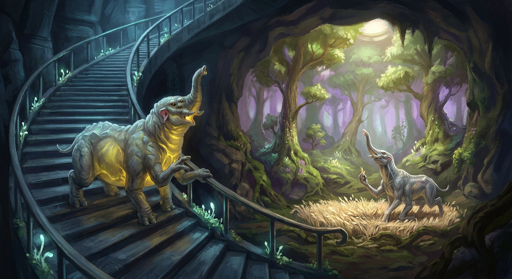

Промпт генератору

Painterly sci-fi concept art. Deep interior of a generation starship: a long spiral of steel-and-stone staircases descending through tunnels, lit by handrails of faintly glowing plants, toward a vast cavern chamber where an entire forest grows under artificial sunlamps — luminous trees, mosses glowing soft green and violet. Descending the stairs, a large heavyset female — four-legged horizontal body, rearing front trunk, four eyes front and rear, tympanum, six-fingered chest hands, gray stone-crystal flesh with yellow inner glow — grips the rail, peering down. At the forest floor below, a lean male forester of the same species, rearing trunk, four eyes, tympanum, gray translucent flesh, kneels over a bed of pale wheat whose seeds lie dormant and ungerminated in the low-gravity soil, holding up a lifeless seed toward the light. Moody chiaroscuro: warm forest glow against cool stairwell shadows. One creature each, no duplicates.

### Сцена 7. Общее собрание экипажа: Лавинио и Ялда излагают проблему пшеницы и план раскрутки горы; Дельфина возражает; голосование

- **Место:** конференц-зал «Бесподобной»
- **Герои:** Я, л, д, а, , , , Л, а, в, и, н, и, о, , , , Ф, р, и, д, о, , , , Б, а, б, и, л, а, , , , Д, е, л, ь, ф, и, н, а, , , , э, к, и, п, а, ж

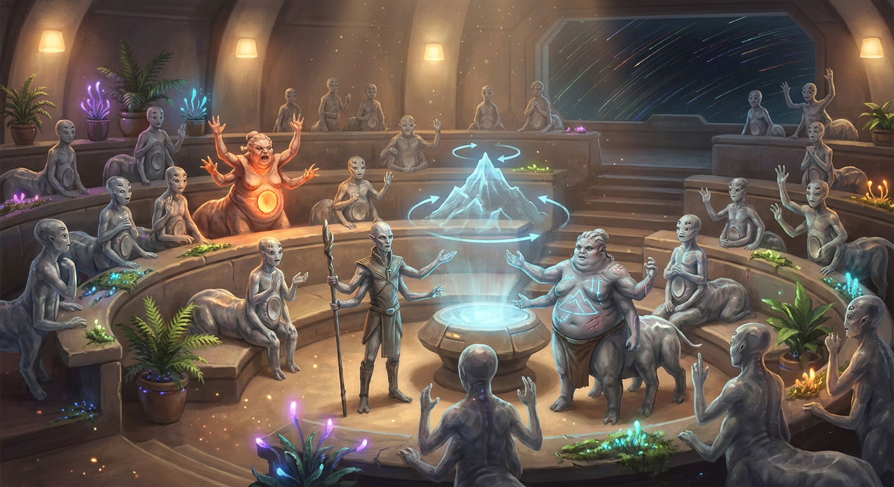

Промпт генератору

Painterly sci-fi concept art. A wide conference hall aboard the ship: tiered benches of gray stone-crystal rising around a central floor, filled with a whole crew of alien beings — every one a four-legged horizontal body with rearing front trunk, four eyes, tympanum, gray translucent flesh and faint yellow inner glow. At the center floor, a lean male forester and a large heavyset female commander — chest-hands gesturing, diagrams chalked on her own scarred chest skin — present their plan: a huge glowing projection of a mountain being spun, with arrows showing induced gravity. A stout female elder rears up on a bench in fierce objection, tympanum flushed bright; others hum and murmur in a wave of sound. Hands raised for the vote catch the light. Warm lamplight, dust in the air, charged democratic tension, colored star-streaks beyond the viewport. One creature each, no duplicates.

## Глава 17

### Сцена 1. У воздушного шлюза Ялда помогает Фатиме надеть охладительный мешок; Авсилио выходит наружу

- **Место:** воздушный шлюз на склоне горы
- **Герои:** Ялда, Фатима, Авсилио

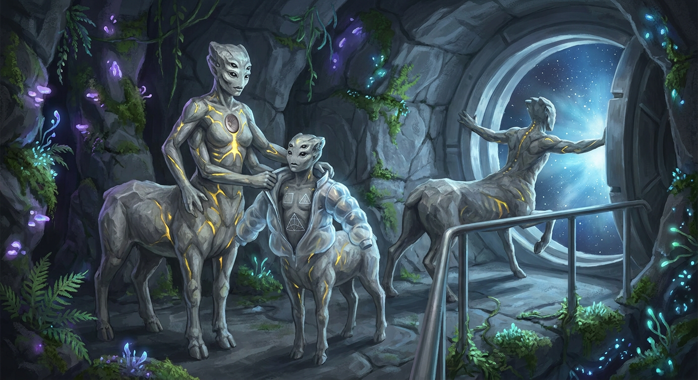

Промпт генератору

Painterly sci-fi concept art. Inside a rugged mountain airlock chamber carved from stone, a large strong female of an alien species helps a young slim female put on an inflated cooling sack suit. Both are four-legged horizontal creatures whose front trunk rears up bear-like, ending in a head with four eyes — a front and a rear pair — a drum-like tympanum membrane on the raised chest below the mouth, smooth elastic gray stone-crystal flesh with subtle geometric hardened plates and a faint yellow glow migrating deep inside their translucent bodies. The young one has neat stylized diagrams drawn on her chest skin; the large female has diagrams inked on her chest and extra arms budding from the front trunk. A male crew member stretches his body along a handrail, pushing the wide door open into starlight. Cool blue interior glow from lichenous light-plants mixes with harsh white starlight leaking through the hatch, glinting off brass fittings and coiled ropes. Awe and quiet tension before the climb. Each creature appears once, no duplicates.

### Сцена 2. Ялда выходит на склон и по поручням спускается к туннелю, любуясь новым горизонтом

- **Место:** склон горы, снаружи
- **Герои:** Ялда

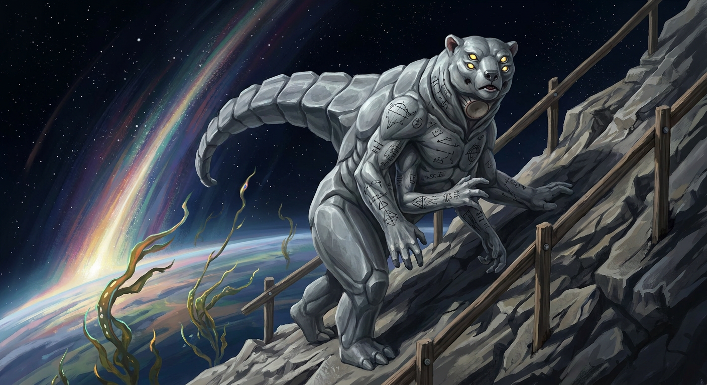

Промпт генератору

Painterly sci-fi concept art. On the steep outer slope of a vast mountain above an airless void, a large powerfully built female of an alien species descends along wooden handrails set into the rock. She is a four-legged horizontal creature, spine parallel to the ground, front trunk rearing up bear-like with four eyes — a front and rear pair — arms with six-fingered hands budding from her chest, a drum-like tympanum below the mouth, smooth gray stone-crystal flesh with faint geometric plates and a migrating yellow inner glow. Diagrams are drawn in ink on the skin of her raised chest. Behind her stretches a breathtaking alien horizon: a colossal star with a colored trail of light, drifting glowing plants like luminous kelp anchored to the slope, the curve of a strange world below. Crisp hard light, deep shadows, a mood of wonder and vertigo. One creature only, no duplicates.

### Сцена 3. Ялда по веревкам входит в туннель и видит забой: рабочих в клетках с отбойными молотками; забирает мешки с мусором

- **Место:** туннель внутри горы, забой
- **Герои:** Ялда, Фатима, семь бурильщиков, четверо рабочих

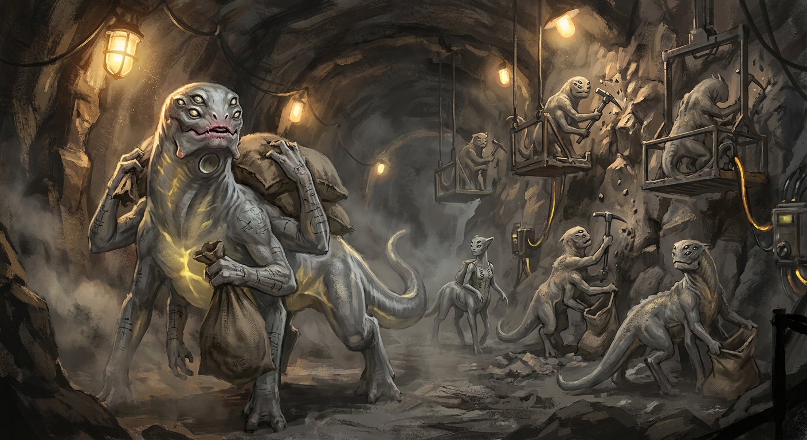

Промпт генератору

Painterly sci-fi concept art. Deep inside a mining tunnel in the heart of a mountain, a large strong female of an alien species carries sacks of rubble. She is a four-legged horizontal creature, front trunk rearing bear-like, four eyes in a front and rear pair, drum tympanum below the mouth, arms budding from the chest with six-fingered hands, gray stone-crystal translucent flesh with a faint migrating yellow glow, ink diagrams on her chest skin. At the tunnel face, seven drillers in suspended cage platforms hammer with pneumatic picks, their four-eyed horizontal bodies coated in pale gray dust; four workers catch falling rock shards with open sacks. A slim young female with cooling sack and neat chest diagrams stands among them. Harsh lamplight, swirling dust, chipped stone walls, thunderous labor. Each creature appears once, no duplicates.

### Сцена 4. Ялда катапультой запускает два мешка мусора в пустоту; столб расшатывается, она подбивает его киянкой

- **Место:** катапульта снаружи, за поручнями
- **Герои:** Ялда

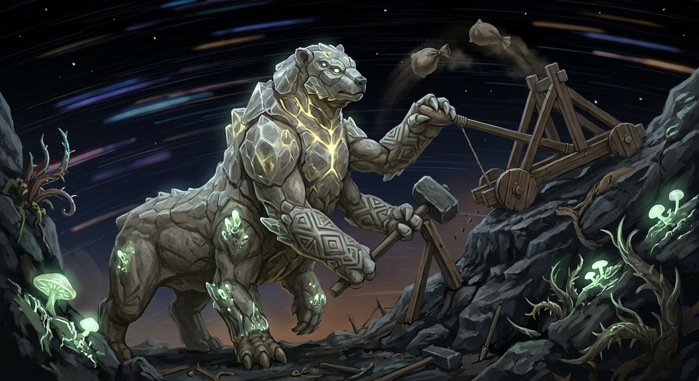

Промпт генератору

Painterly sci-fi concept art. On the outer slope of a mountain beside a timber-frame catapult, a large powerful female of an alien species launches two sacks of waste into the starry void. She is a four-legged horizontal creature with a rearing bear-like front trunk, four eyes in a front and rear pair, arms with six-fingered hands budding from the chest, a drum tympanum below the mouth, gray translucent stone-crystal flesh with geometric hardened plates and a faint yellow inner glow, ink diagrams drawn on her chest. The catapult's lever arm swings, sacks spinning away against a black sky streaked by stars with colored trails; the support post has loosened, and she steadies it with a heavy mallet in one hand. Glowing plants cling to the rocks, casting green-white highlights on her stone flesh. Bright vacuum light, sharp shadows, a mood of practical determination. One creature only, no duplicates.

### Сцена 5. Бурильщики вскрывают пудритовую жилу, пыль застилает щитки; Ялда возвращается к катапульте

- **Место:** туннель и катапульта
- **Герои:** Ялда, бурильщики, Фатима

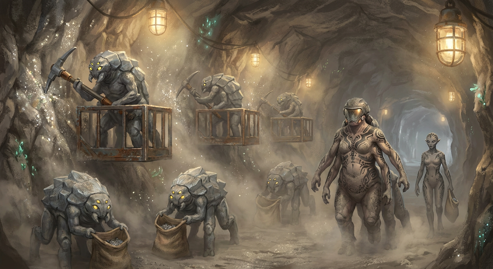

Промпт генератору

Painterly sci-fi concept art. In a dust-choked mining tunnel inside the mountain, drillers have just broken into a glittering pale powder vein — a dense cloud of mineral dust fills the air, coating the visors of the workers. Seven drillers of an alien species stand in cage platforms with pneumatic picks, four-legged horizontal bodies with rearing front trunks, four eyes each, gray stone-crystal flesh under thick gray dust, faint yellow glow barely showing through. Four workers catch debris with open sacks. A large strong female with ink diagrams on her chest and arms budding from her trunk makes her way back toward the tunnel mouth and daylight, while a slim young female with a cooling sack and chest diagrams follows. Lamplight refracts through the swirling pale dust like fog, glowing plants along the walls dimmed by haze. Gritty, breathless atmosphere. Each creature appears once, no duplicates.

### Сцена 6. Запутавшись рукой в кулисе мешка, Ялда запускается в космос; рассуждая о законе сохранения, она бросает камни, чтобы вернуться

- **Место:** космос над горой, в полете
- **Герои:** Ялда

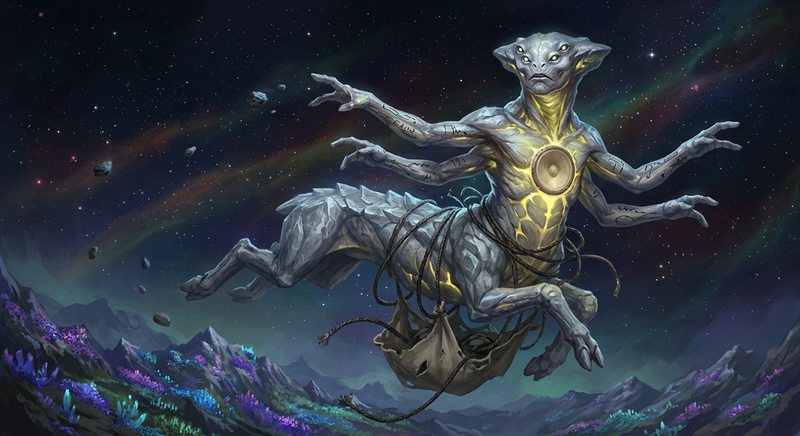

Промпт генератору

Painterly sci-fi concept art. A large powerful female of an alien species tumbles through open space above the mountain, tangled in the rigging lines of a great sack that drags behind her. She is a four-legged horizontal creature, front trunk rearing bear-like, four eyes in a front and rear pair, arms with six-fingered hands budding from her chest, drum tympanum below the mouth, gray translucent stone-crystal flesh with geometric plates and a migrating yellow inner glow, ink diagrams on her chest skin. With cool deliberation she hurls small stones in one direction to push herself back the other way, stones drifting away as tiny dark specks. Below stretches the vast mountain slope with glowing plants, above a sky of stars with colored trails and a colossal veiled nebula. Silent void, hard starlight, her body lit from within by the yellow glow. One creature only, no duplicates.

### Сцена 7. Ялда видит вспышки от ударов пыли о гору, размышляет о пожарной охране; мешок пустеет; вдали замечает лампу, летящую к ней

- **Место:** космос, вдали от горы
- **Герои:** Ялда

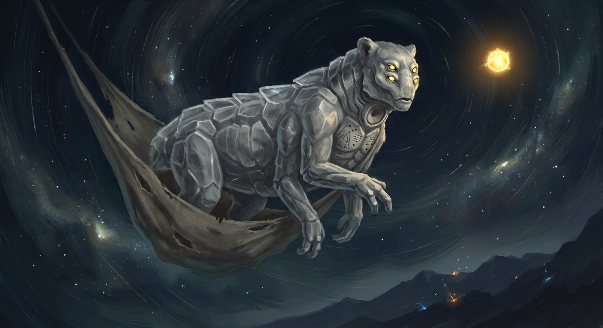

Промпт генератору

Painterly sci-fi concept art. Far out in the void above the mountain, a large female of an alien species drifts in a slowly emptying sack, watching faint flashes bloom where dust motes strike the mountainside far below. She is a four-legged horizontal creature with a rearing bear-like front trunk, four eyes in a front and rear pair, arms with six-fingered hands budding from her chest, a drum tympanum below the mouth, gray translucent stone-crystal flesh with geometric hardened plates and a faint yellow glow migrating inside her body, ink diagrams drawn on her chest. Her posture is thoughtful, contemplative, watching the tiny distant fire-like flashes and drifting sparks. Far off in the black, a small bright lamp approaches — a tiny sun gliding toward her. Stars with colored trails, glowing plants faintly visible on the distant slope, deep isolation and quiet wonder. One creature only, no duplicates.

### Сцена 8. Фатима, прилетевшая на поиски, связывает Ялду веревкой; они гасят делят воздух из баллона, тормозят и цепляются за веревочную сеть у входа

- **Место:** космос у горы, затем склон у туннеля
- **Герои:** Ялда, Фатима

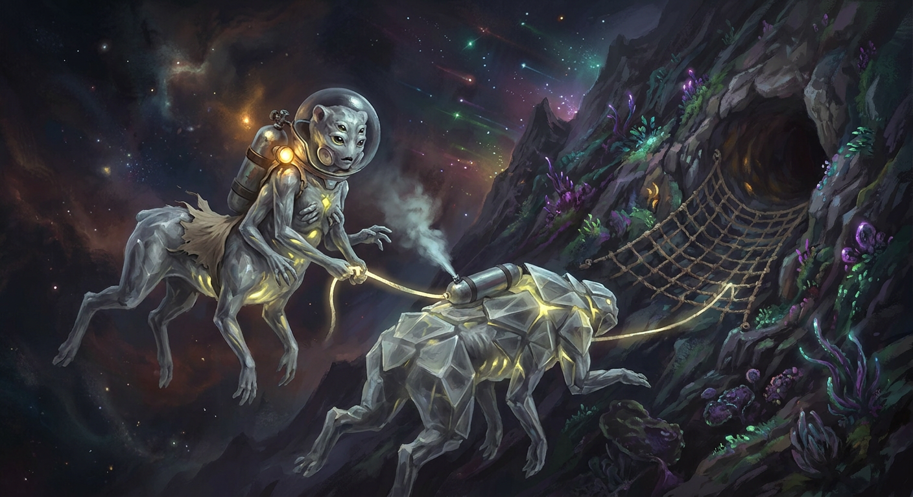

Промпт генератору

Painterly sci-fi concept art. In open space near the mountain's face, a slim young female of an alien species flies to the rescue of a large drifting female. Both are four-legged horizontal creatures with rearing bear-like front trunks, four eyes in front and rear pairs, arms with six-fingered hands budding from the chest, drum tympanums below the mouths, gray translucent stone-crystal flesh with geometric plates and faint migrating yellow inner glow. The young one wears a cooling sack, a helmet, and an air tank on her back, a small solar lamp on her shoulder; she trembles with fear yet ties a rope between them. Together they vent shared air from the tank to brake their drift, then catch hold of a rope net strung at the tunnel entrance on the mountain slope. Starlight with colored trails, glowing plants on the rock, the young rescuer's lamp a warm point of light. Each creature appears once, no duplicates.

## Глава 18

### Сцена 1. Ялда и Лавинио обсуждают карликовую пшеницу, выращенную в центрифугах без гравитации

- **Место:** опытное поле на «Бесподобной»
- **Герои:** Ялда, Лавинио

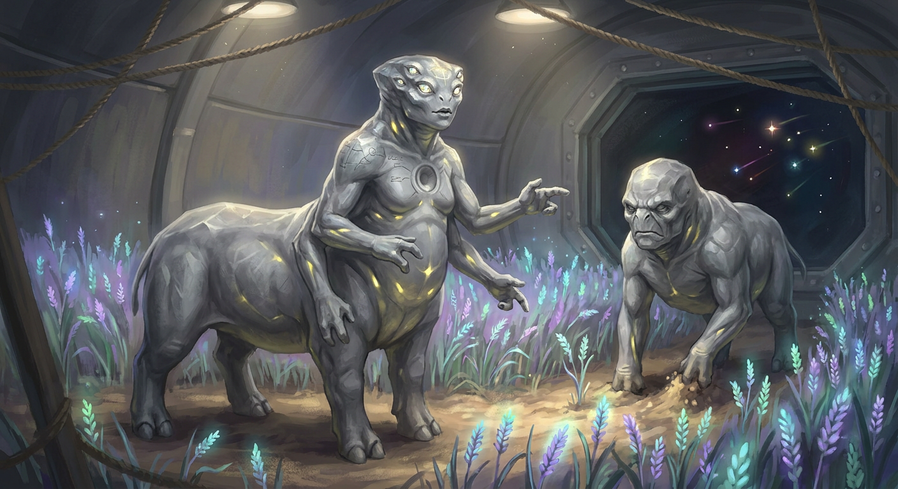

Промпт генератору

Painterly sci-fi concept art. An experimental crop field inside a rotating habitat: neat plots of dwarf wheat growing under artificial light, pale stalks swaying as centrifugal gravity pulls them outward. A large female farmer — a heavyset, powerful creature with a four-legged horizontal body, rearing front trunk, four eyes (front and rear pairs), a drum-like tympanum below her mouth, and smooth elastic gray stone-crystal flesh with faint yellow glow migrating inside — stands on blunt flat feet among the wheat, four six-fingered arms gesturing as she discusses the crop, diagrams sketched on her chest skin. Beside her a stern older male agronomist, same alien species standard (four-legged horizontal body, rearing front trunk, four eyes, tympanum, gray stone-crystal flesh with yellow inner glow), two arms digging in the soil between stems, ropes strung overhead through the field. Soft directional lamplight, luminous plants glowing faintly at the field edges, alien stars with colored trails visible through a distant viewport. Mood: scientific curiosity, quiet hope. One creature each, no duplicates.

### Сцена 2. Ялда поднимается в академгородок; Марция у кабинета просит разрешения на испытательное сжигание пассивита

- **Место:** лестничная шахта, академгородок, кабинет Ялды
- **Герои:** Ялда, Марция, прохожие

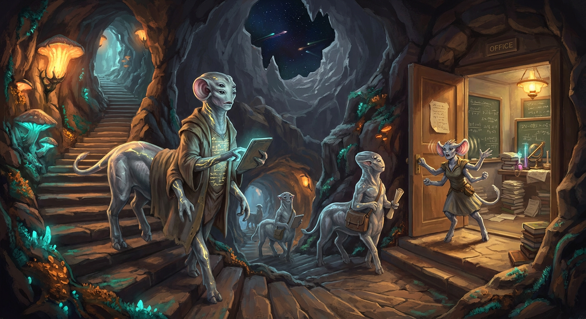

Промпт генератору

Painterly sci-fi concept art. A vertical shaft and academic campus inside a vast hollowed mountain world: a broad stairwell spiraling upward through tunnels lit by glowing plants, then a cluttered office with chalkboards and stacked papers. A large female scholar — four-legged horizontal body, rearing front trunk, four eyes, drum-like tympanum, smooth gray stone-crystal flesh with faint migrating yellow glow, several six-fingered arms, diagrams written on her chest skin — climbs the stairs while passers-by, alien creatures of the same species (horizontal four-legged bodies, rearing trunks, four eyes, tympanums, gray translucent flesh), move along the tunnel. At her office door an energetic female chemist waits, vibrating with urgency, tympanum rippling as she makes an urgent request. Warm lamplight against cool tunnel shadows, luminous moss on walls, stars with colored trails through a distant opening. Mood: busy institutional life, mounting tension. One creature each, no duplicates.

### Сцена 3. В наблюдательной каюте Ялда и Марция наблюдают взрыв установки, горение пассивита и неудачные попытки тушения

- **Место:** наблюдательная каюта академгородка
- **Герои:** Ялда, Марция

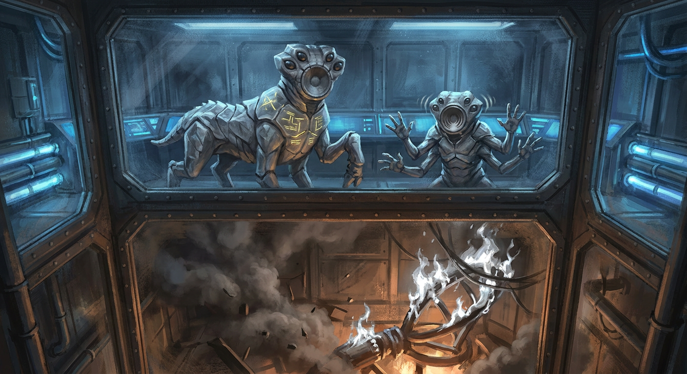

Промпт генератору

Painterly sci-fi concept art. An observation cabin with thick transparent windows overlooking a test chamber: an experimental apparatus has exploded below, a strange fire burning with unnatural persistence — silvery-white passive flames clinging to metal, extinguishing attempts failing in bursts of smoke. Behind the window two alien creatures watch: a large female scholar with a four-legged horizontal body, rearing front trunk, four eyes, drum-like tympanum, gray stone-crystal flesh with faint yellow inner glow, diagrams on her chest; and a female experimenter of the same species, agitated, tympanum rippling with frustrated trills, several six-fingered arms pressed to the glass. Harsh orange firelight from below contrasts with cool cabin glow; smoke and sparks drift in the chamber; luminous pipes line the walls. Mood: alarm, scientific dread, fascination. One creature each, no duplicates.

### Сцена 4. Наблюдатели фиксируют вспышки, эксперименты Марции проваливаются, Ялда поручает Палладии проработать отделение фрагментов горы

- **Место:** гора, кабинет Ялды
- **Герои:** Ялда, Марция, Палладия, наблюдающие

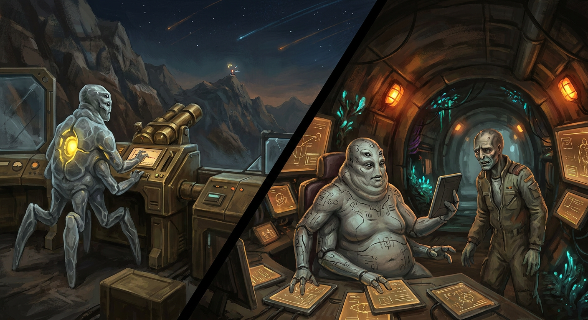

Промпт генератору

Painterly sci-fi concept art. Two linked scenes in one image: an observation post on a mountain slope where observers — alien creatures with four-legged horizontal bodies, rearing front trunks, four eyes, tympanums, gray translucent stone-crystal flesh with yellow glow — record flashes of distant impacts with instruments; and a cluttered office where a large female leader (same species standard, heavyset, diagrams on her chest, multiple six-fingered arms) assigns a task to a former mining engineer, an expressive male whose face shows relief and grimaces. Luminous plants along the tunnel, warning-lamp glow, data panels with sketched diagrams. Stars with colored trails visible through a distant viewport; faint flashes like tiny lightning on the mountain's outer face. Mood: relentless pressure, urgency, weary determination. One creature each, no duplicates.

### Сцена 5. Палладия предлагает варианты: расходуемое покрытие или сброс внешних стен со взрывчаткой; расчеты показывают провал плиток

- **Место:** кабинет Ялды
- **Герои:** Ялда, Палладия

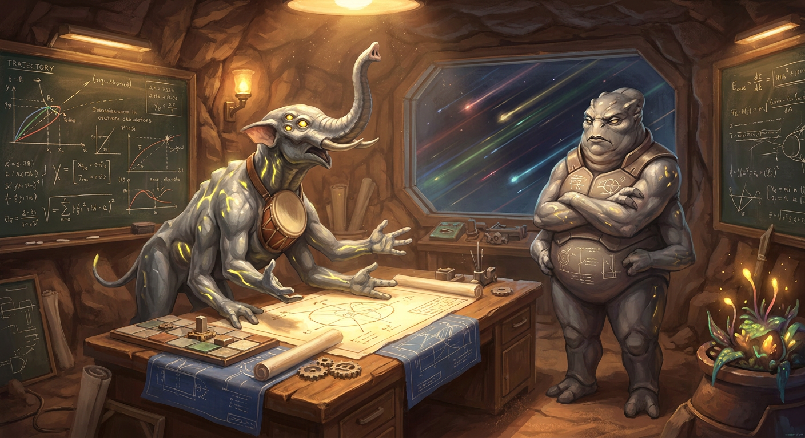

Промпт генератору

Painterly sci-fi concept art. A cluttered engineering office inside a hollowed mountain: chalkboards covered in trajectory calculations, model plates and tiles scattered on a desk, half-unrolled blueprints. A former mining engineer — an alien creature with four-legged horizontal body, rearing front trunk, four eyes, drum-like tympanum, smooth gray stone-crystal flesh with faint migrating yellow glow, expressive face showing pleading intensity — stands with six-fingered hands spread over a diagram, proposing options. Facing him a large female leader of the same species, heavyset, powerful, diagrams sketched across her chest skin, several arms, eyes narrowed in skeptical thought as calculations on the board show cracked failing tiles. Warm lamplight, glowing plants in a corner pot, dust motes; a viewport reveals alien stars with colored trails. Mood: tense problem-solving, weight of impossible choices. One creature each, no duplicates.

### Сцена 6. Фридо поддерживает план сброса стен, но требует вынести вопрос на общее собрание из-за угрозы саботажа

- **Место:** кабинет Фридо
- **Герои:** Ялда, Фридо, Палладия

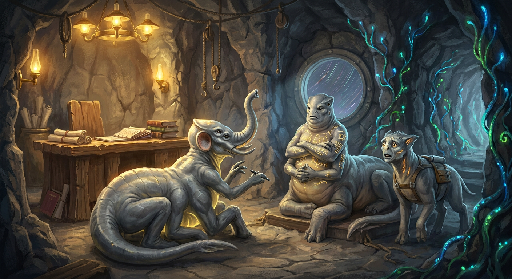

Промпт генератору

Painterly sci-fi concept art. A dignified office inside the mountain ship: maps, rope rigging along the ceiling, an orator's desk with stacked reports. An assistant-deputy — an alien creature with a four-legged horizontal body curled deftly on the floor, legs converted into an extra pair of arms, rearing front trunk, four eyes, drum-like tympanum, smooth gray stone-crystal flesh with faint yellow inner glow, impassive face touched with wounded dread — speaks with persuasive, measured authority. Facing him a large female leader, heavyset, same species standard, multiple six-fingered arms, diagrams on her chest skin; beside her an expressive former mining engineer whose face flickers with hope and anxiety. Warm lamplight over cold stone walls, luminous vines along the corridor outside, faint colored star-trails through a porthole. Mood: political gravity, fear of sabotage, solemn resolve. One creature each, no duplicates.

### Сцена 7. Ялда обходит гору при подготовке к вращению: перенос урожая, лес оставляют на месте, переоборудование помещений

- **Место:** поля, сады, туннели и мастерские горы
- **Герои:** Ялда, рабочие, агрономы

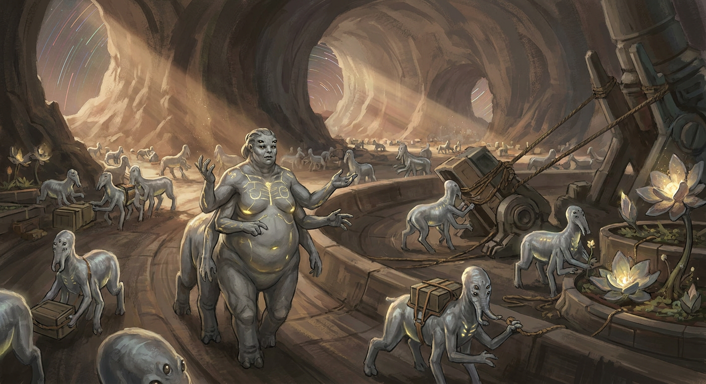

Промпт генератору

Painterly sci-fi concept art. A vast hollow mountain being prepared for rotation: terraced fields and orchards being rearranged, workers carrying bundled harvests along radial tunnels, workshops being re-equipped with rope rigging and reoriented machinery. A large female overseer — four-legged horizontal body, rearing front trunk, four eyes, drum-like tympanum, gray stone-crystal flesh with faint yellow glow, heavyset, several six-fingered arms, chest diagrams — moves through the tunnels inspecting progress. Around her dozens of alien workers and agronomists of the same species (horizontal four-legged bodies, rearing trunks, four eyes, tympanums, translucent gray flesh) haul crates, tend a forest left anchored in place, swing hammers. Glowing plants light the tunnels, dust in shafts of warm lamplight, colored star-trails through distant openings. Mood: colossal labor, disciplined urgency. One creature each, no duplicates.

### Сцена 8. В обсерватории перед запуском двигателей Фатима умоляет Ялду освободить Нино; старт вращения бело-голубым огнём

- **Место:** обсерватория на вершине горы
- **Герои:** Ялда, Фатима, Авсилия, Проспера, друзья Просперы, Авсилио

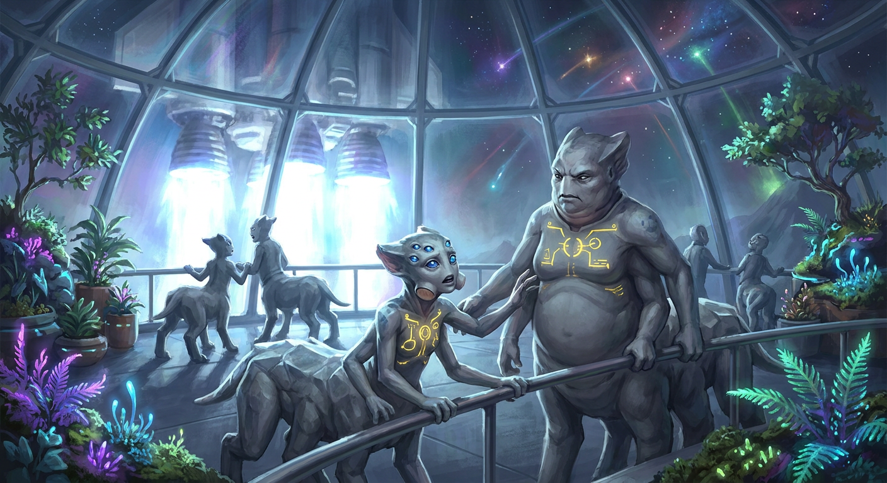

Промпт генератору

Painterly sci-fi concept art. An observatory dome at the summit of a hollowed mountain just before engine ignition: curved crystal panels overhead reflecting glints, a young female worker clinging to handrails at the dome's edge, pleading desperately — an alien creature with four-legged horizontal body, rearing front trunk, four eyes, drum-like tympanum, gray translucent stone-crystal flesh with yellow glow, neat stylized diagrams drawn on her chest — begging the large heavyset female commander beside her (same species standard, multiple arms, chest diagrams). Nearby a young student pair and other crew creatures of the same species grip rails, watching. Then through the dome: colossal engines flare with white-blue fire washing the scene in blinding light. Glowing plants at the dome rim, alien stars with colored trails overhead. Mood: desperate plea, awe, thunderous launch. One creature each, no duplicates.

### Сцена 9. После начала вращения Ялда обходит поля: ростки взошли, фермеры сеют; Эрминия задаёт вопрос о взрывчатке, Ялда назначает собрание

- **Место:** радиальные туннели, поля-«долины», третье поле
- **Герои:** Ялда, Эрминия, фермеры

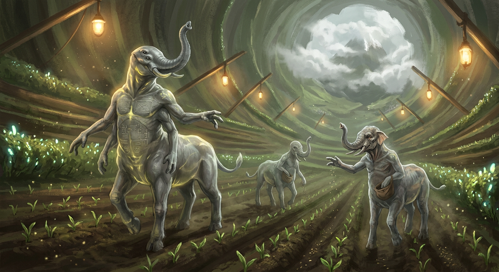

Промпт генератору

Painterly sci-fi concept art. Radial tunnels and valley-fields inside a rotating hollow mountain, now under centrifugal gravity: terraced crop plots where fresh green shoots have sprouted, farmers sowing seeds along the furrows. A large female commander — four-legged horizontal body, rearing front trunk, four eyes, drum-like tympanum, smooth gray stone-crystal flesh with faint yellow inner glow, heavyset, several six-fingered arms, diagrams on her chest skin — walks the rows inspecting the growth. Farmers of the same alien species (horizontal four-legged bodies, rearing trunks, four eyes, tympanums, translucent gray flesh) sow around her; one older female farmer gestures toward the mountain's summit with a six-fingered hand, asking a grave question. Warm lamplight angled by the spin, luminous hedgerows glowing faintly, dust and green scent in the air. Mood: fragile renewal, lingering unease. One creature each, no duplicates.

### Сцена 10. У конференц-зала Ялда готовит речи о Нино; Исидора приносит новость: после вращения вспышек ударов больше нет

- **Место:** коридор у конференц-зала
- **Герои:** Ялда, Палладия, Исидора, Проспера, наблюдающие, Фридо, толпа

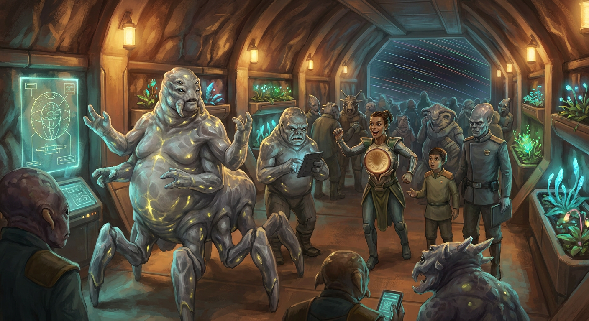

Промпт генератору

Painterly sci-fi concept art. A corridor outside a conference hall inside the hollow mountain ship: a large female commander with a four-legged horizontal body, rearing front trunk, four eyes, drum-like tympanum, gray translucent stone-crystal flesh with faint yellow glow, heavyset, several six-fingered arms and chest diagrams, quietly rehearsing speeches. Beside her an expressive former mining engineer (same species standard) waits with a tense face; an energetic emotional female leader of the observers arrives breathless, chirping joy, tympanum rippling with excitement as she brings news: no more impact flashes. A young student and gathered onlookers, a stern deputy, and a crowd of alien creatures of the same species fill the corridor. Glowing plants along the walls, warm lamplight, colored star-trails through a viewport. Mood: taut anticipation breaking into hope. One creature each, no duplicates.

## Глава 19

### Сцена 1. Ялда читает лекцию о трёх загадках: устойчивость твёрдых тел, липкость газов, опасная пыль

- **Место:** учебный зал на «Бесподобной»
- **Герои:** Ялда, Авсилия, Проспера, Фатима, Джокондо, Тамара, студенты

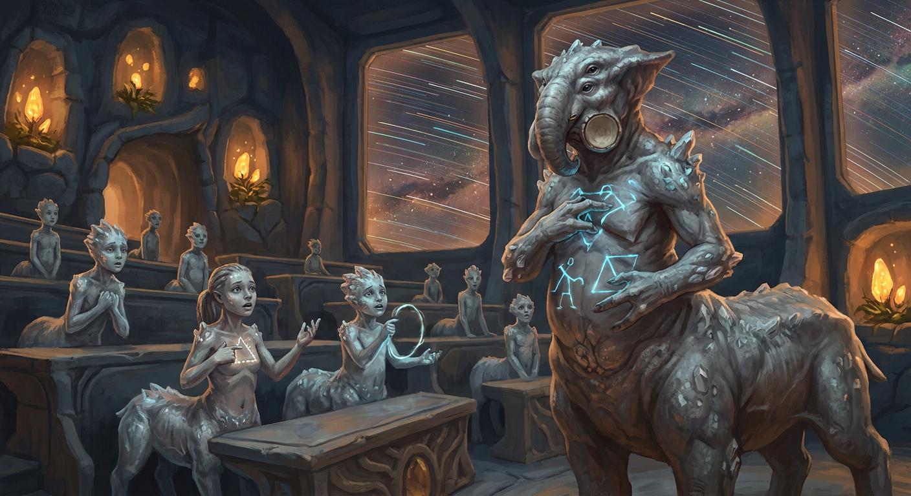

Промпт генератору

Painterly sci-fi concept art. A lecture hall aboard a generation starship, lit by glowing amber plants in wall niches and panels showing stars with colored light-trails. At the front, a large elderly female teacher — massive, broad-bodied creature with a horizontal four-legged stance, rearing front trunk, four eyes, a drum-like tympanum below her mouth, gray stone-crystal flesh with faint migrating yellow inner glow — draws glowing geometric diagrams directly on her own chest skin with a finger of one of her six-fingered hands. Before her, rows of young students of the same species — four-legged bodies with raised front trunks, four eyes, tympanums, translucent gray crystal flesh — watch with anxious, wonder-filled expressions. One female student gestures at a triangle pattern drawn on her own chest; another traces a loop in the air with one hand. Murky starlight and warm bioluminescence mix; mood of urgent, fragile learning in an alien ship. Each creature appears once, no duplicates.

### Сцена 2. Лавинио сообщает о болезни золотарника в садах и мерах по спасению черенков

- **Место:** кабинет Ялды
- **Герои:** Ялда, Лавинио

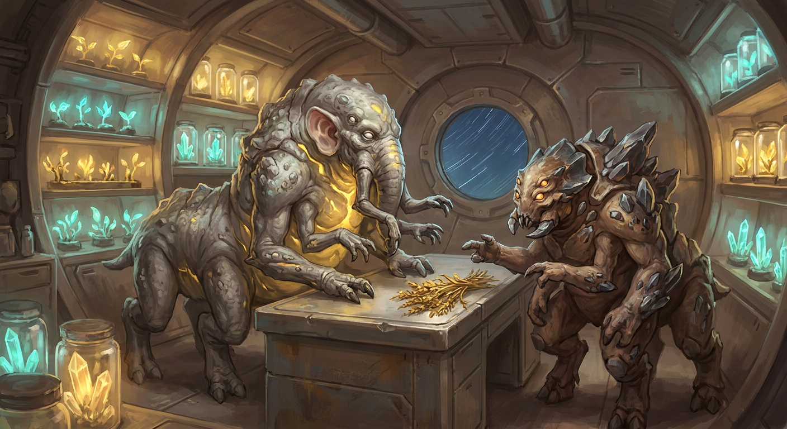

Промпт генератору

Painterly sci-fi concept art. A cramped office aboard the starship, shelves of glowing seedlings and translucent crystal jars casting soft yellow light. A large elderly female — six-armed, four-legged horizontal body with rearing front trunk, four eyes, tympanum, gray stone-crystal flesh with a subtle inner yellow glow — sits behind a desk listening gravely. Facing her, a grim male head gardener, four-legged and rearing, four eyes, heavy weathered crystal plates on his flesh, two pairs of arms, gestures downward as if reporting dying plants; small withered golden stalks lie on the desk between them. Faint drifting star-trail light through a viewport. Mood of quiet agricultural disaster and somber duty. One of each creature, no duplicates.

### Сцена 3. Сефора оценивает запасы холина; решают растянуть их на десять черед, защищая старших женщин

- **Место:** аптека «Бесподобной»
- **Герои:** Ялда, Сефора

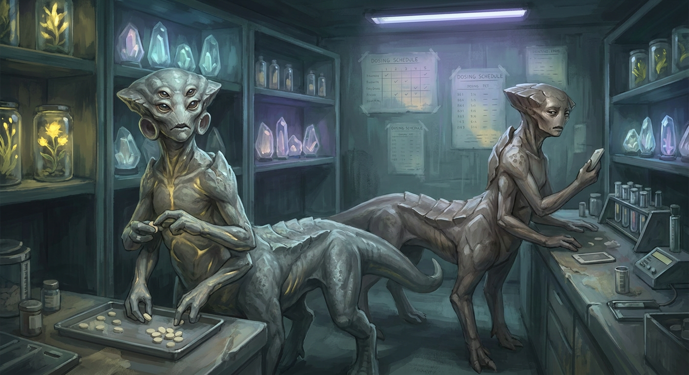

Промпт генератору

Painterly sci-fi concept art. The ship's pharmacy: walls of crystalline vials and softly glowing yellow medicinal plants, a counter with measured drug portions. A large elderly female with four-legged horizontal body, rearing front trunk, four eyes, tympanum, gray stone-crystal translucent flesh with inner yellow glow, counts out small chalky tablets using two of her six-fingered hands. Beside her, a weary middle-aged female apothecary — same alien form, four eyes, tympanum, dull crystal plates, two arms — hums a joyless drone, glancing sidelong at vials. Charts of dosing schedules glow faintly on the wall. Cool light from luminescent shelves, mood of rationing, scarcity, and protective resolve toward the elders. One of each creature, no duplicates.

### Сцена 4. Вторая лекция: гармонический анализ колебаний в потенциальных ямах

- **Место:** учебный зал
- **Герои:** Ялда, Проспера, Фатима, Авсилия

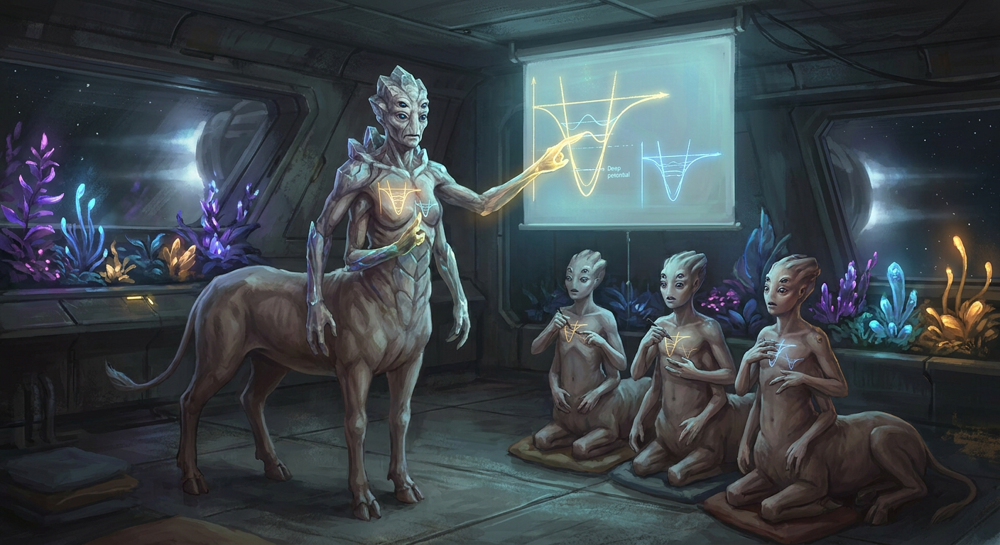

Промпт генератору

Painterly sci-fi concept art. The lecture hall again, darkened: on a glowing projection, deep potential wells with shimmering harmonic oscillation curves ripple in yellow and blue light. A large elderly female teacher — four-legged horizontal body, rearing front trunk, four eyes, drum-like tympanum, gray translucent stone-crystal flesh with migrating yellow glow — taps the projected curves with a long extra arm, diagram glowing on her chest. Three or four young students of the same species sit on low cushions, rearing trunks upright, four eyes wide with concentration, drawing stylized diagrams on their own chests with six-fingered hands. Warm bioluminescent plants at the walls, faint engine-light through the viewport. Mood of intense intellectual focus aboard a fragile starship. Each creature once, no duplicates.

### Сцена 5. После урока студенты в столовой принимают уменьшенные дозы холина; Ялда размышляет о своей заменимости

- **Место:** столовая / класс
- **Герои:** Ялда, студенты, молодые женщины

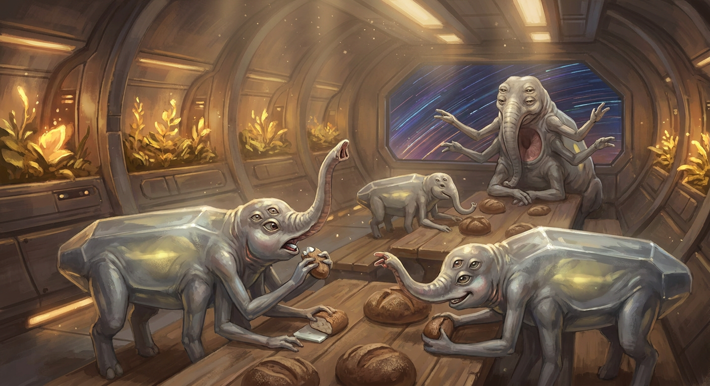

Промпт генератору

Painterly sci-fi concept art. A communal dining hall aboard the starship, long low tables with round loaves, glowing amber plants along the bulkheads. Young students of the alien species — four-legged horizontal bodies, rearing front trunks, four eyes, tympanums, gray crystal flesh with faint yellow inner glow — each swallow a small chalky tablet with a bite of bread, faces showing anxiety and forced cheer. At the far end, a large elderly female with six arms and rearing trunk sits apart, four eyes half-lowered, tympanum slack, lost in melancholy thought about her own replaceability. Soft warm light, drifting dust motes, a viewport with colored star-trails. Mood of rationed hope and quiet loneliness. One of each creature, no duplicates.

### Сцена 6. Фатима просит Ялду освободить заключённого Нино; Ялда просит подождать подходящего момента

- **Место:** класс после ухода всех
- **Герои:** Ялда, Фатима

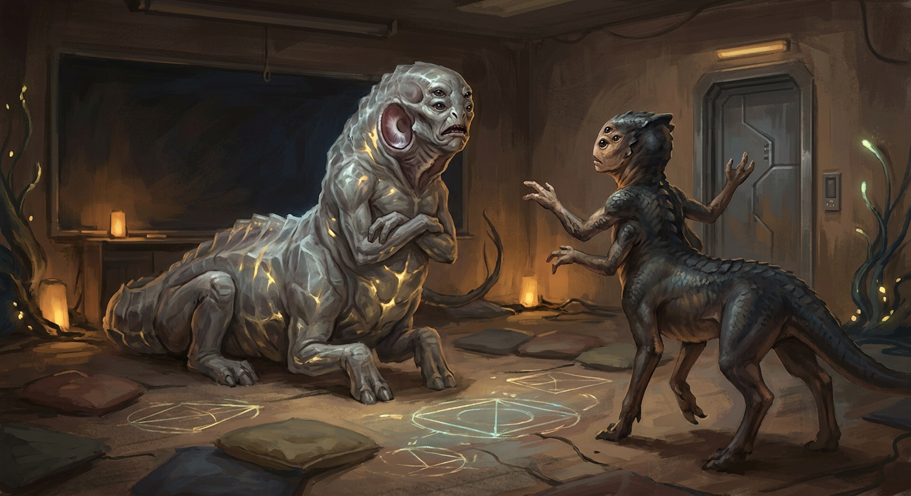

Промпт генератору

Painterly sci-fi concept art. An emptied classroom after lessons: cushions scattered, glowing chalk diagrams fading on the floor, dim amber wall-plants. A large elderly female — four-legged horizontal body, rearing front trunk, four eyes, tympanum, gray translucent stone-crystal flesh with weak yellow inner glow — sits heavily, facing a young female student who rears up pleading, four eyes earnest, one six-fingered hand gesturing toward a sealed hatch. The elder's expression is pained and gentle, her tympanum taut with regret. Low warm light, long shadows, mood of an impossible request and patient deferral. One of each creature, no duplicates.

### Сцена 7. Лавинио сообщает: все сады погибли, живы только два черенка из дюжины

- **Место:** кабинет Ялды
- **Герои:** Ялда, Лавинио

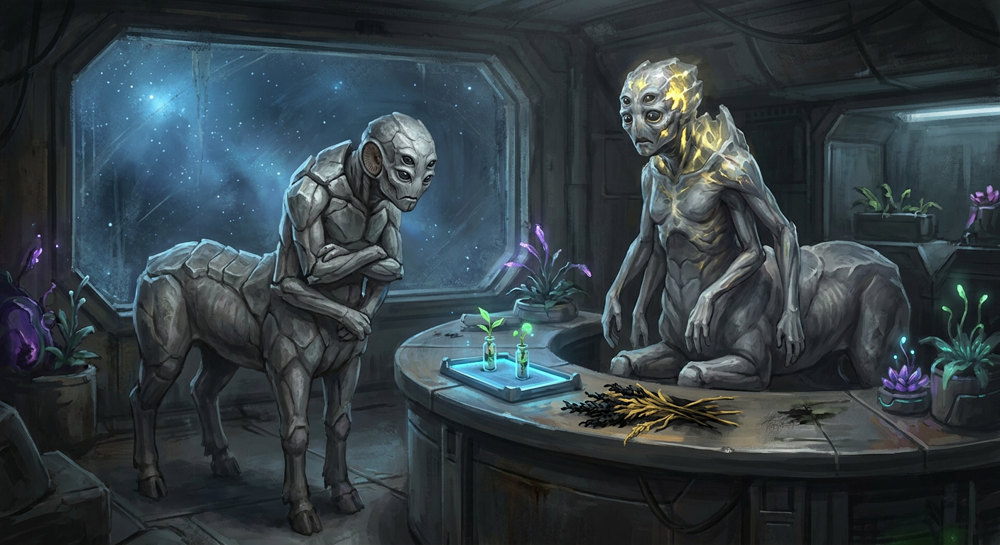

Промпт генератору

Painterly sci-fi concept art. The elder's office, dimmer now: on the desk a small tray holding only two tiny living green cuttings in crystal vials — survivors among dead withered golden stalks scattered blackened around them. A grim male head gardener — four-legged alien body, rearing trunk, four eyes, tympanum, weathered crystal plates, two pairs of arms — stands with head lowered, reporting total loss. The large elderly female across the desk, six arms slack, four eyes wide with grief, her gray translucent flesh flickering with unstable yellow light, tympanum trembling. Cold starlight through viewport mixing with dying yellow plant-glow. Mood of devastating harvest loss aboard a starving starship. One of each creature, no duplicates.

### Сцена 8. Оставшись одна, Ялда переживает приступ дрожи и решает уступить холин молодым

- **Место:** кабинет Ялды
- **Герои:** Ялда

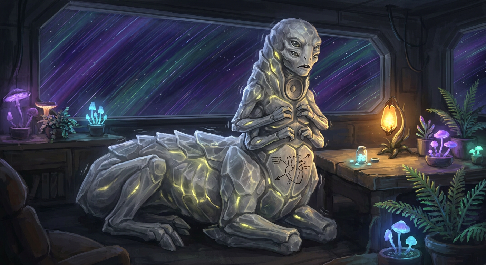

Промпт генератору

Painterly sci-fi concept art. Alone in the dim office, a large elderly female alien — four-legged horizontal body, rearing front trunk, four eyes, drum-like tympanum, gray translucent stone-crystal flesh with faint migrating yellow glow — endures a visible trembling fit: her whole crystal body shudders, plates rattling, arms drawn tight, eyes narrowed with pain and resolve. She stares at a single small vial of chalky tablets glowing on the desk beside a chest-diagram she has drawn on her own skin. Darkness pressing in from the viewport with colored star-trails, one weak amber plant-lamp. Mood of private suffering, mortality, and a selfless decision to give the medicine to the young. One creature only, no duplicates.

### Сцена 9. Ялда встречается с Ко Исидорой, проверяя его лояльность перед переворотом в аптеке

- **Место:** аптека
- **Герои:** Ялда, Ко Исидоры

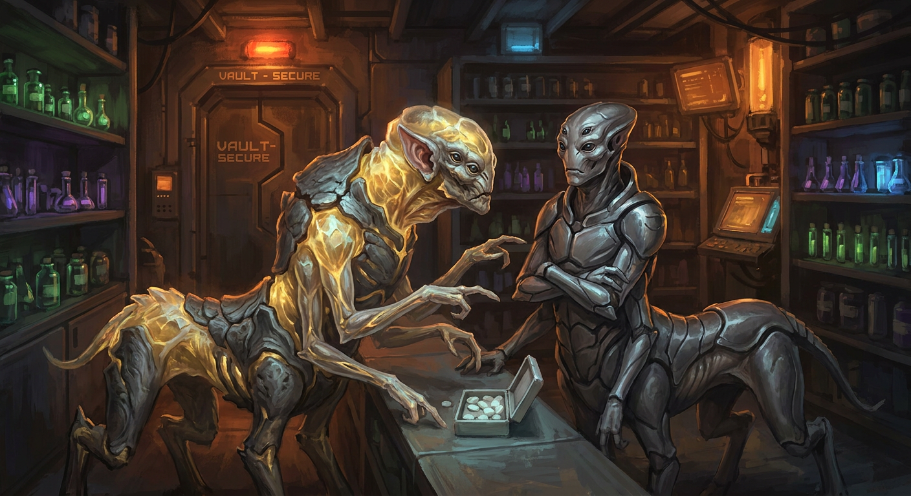

Промпт генератору

Painterly sci-fi concept art. The ship's pharmacy after hours: shelves of glowing vials, half-shadow, a locked drug vault in the background. A large elderly female — four-legged horizontal body, rearing trunk, four eyes, tympanum, gray translucent crystal flesh with yellow inner glow — leans close in quiet, probing conversation with a lean younger male: same alien species, four legs, rearing trunk, four eyes, two arms, more polished hardened crystal plates, expression guarded. Between them on the counter, a small case of chalky tablets. Tense amber bioluminescence, long shadows, mood of secret loyalty-testing before a planned takeover. One of each creature, no duplicates.

### Сцена 10. Отряд Ялды занимает склад холина; Сефора смещена с поста

- **Место:** аптека и склад холина
- **Герои:** Ялда, Сефора, дюжина молодых женщин, фармацевты

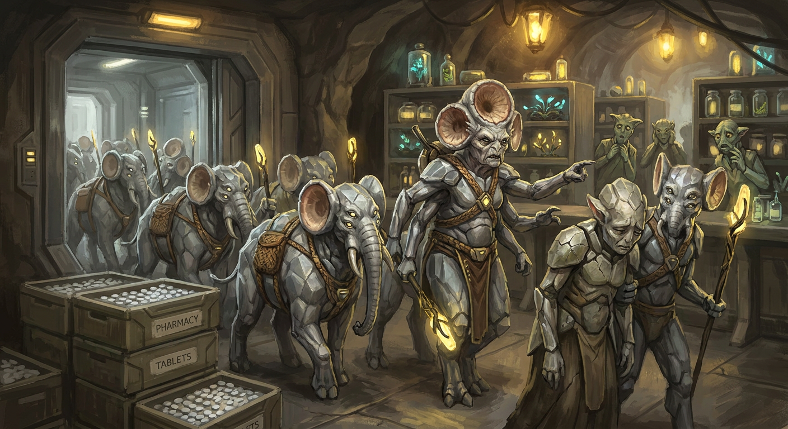

Промпт генератору

Painterly sci-fi concept art. A tense takeover in the ship's pharmacy and drug storehouse: a dozen young armed females of the alien species — four-legged horizontal bodies, rearing trunks, four eyes, tympanums, gray crystal flesh with yellow glow, carrying staves and rope harnesses — file through the doorway and seize stacked crates of chalky tablets. At their head, a large elderly six-armed female, resolute, four eyes stern, tympanum rumbling. Before her, the deposed middle-aged female apothecary — same species, dull crystal plates — is being escorted away, four eyes lowered, shoulders slumped in defeat. Pharmacists of the same species watch anxiously from behind glowing shelves. Flickering yellow plant-light, mood of urgent, disciplined revolt. Each creature once, no duplicates.

### Сцена 11. На собрании Ялда отрекается от поста лидера в пользу Фридо, выговорив защиту своей будущей семьи

- **Место:** зал собраний
- **Герои:** Ялда, Фридо, команда

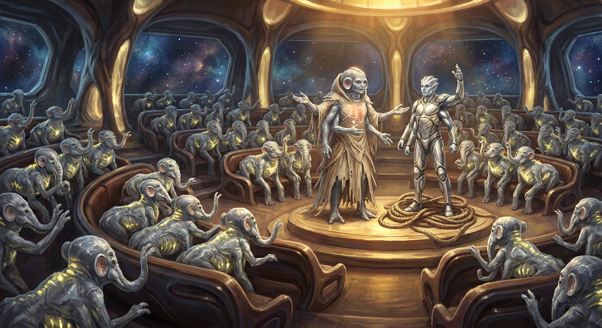

Промпт генератору

Painterly sci-fi concept art. A crowded assembly hall aboard the starship, tiered benches filled with members of the alien species — four-legged bodies, rearing trunks, four eyes, tympanums, gray translucent crystal flesh with faint yellow glow — all eyes fixed on the center. There, a large elderly six-armed female publicly withdraws from leadership, gesturing with open hands toward a charismatic younger male beside her: same species, four legs, rearing trunk, four eyes, polished plates, poised like an orator, moving on ropes coiled beneath him. She speaks with quiet dignity, one hand resting on her own chest where a drawn diagram glows. Warm bioluminescent light and hopeful, solemn faces; mood of succession, protection, and fragile unity. Each creature once, no duplicates.

## Глава 20

### Сцена 1. Ялда и Фатима спускаются по шахте к камере Нино

- **Место:** центральная лестничная шахта и радиальные туннели «Бесподобной»
- **Герои:** Ялда, Фатима

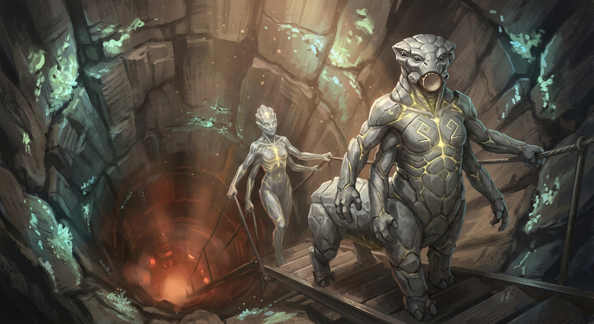

Промпт генератору

Painterly sci-fi concept art. Two alien creatures descend a deep vertical mine-shaft staircase inside a colossal hollow asteroid ship, lit by pale glowing lichen along the tunnel walls. The first is a large robust female farmer, her horizontal four-legged body bearing a rearing front trunk with four eyes (a front pair and a rear pair), a drum-like tympanum below her mouth, and six-fingered arms budding from her chest; her smooth gray stone-crystal flesh shows faint geometric hardened plates and a migrating yellow inner glow, and neat stylized diagrams are drawn on her chest skin. Behind her climbs a slim young female courier, same species standard — four-legged horizontal body, rearing front trunk, four eyes, tympanum, translucent gray crystal flesh with a soft yellow glow — gripping guide ropes with four arms. Radial side-tunnels branch off into darkness; distant engine-glow pulses far below like a slow heartbeat. Dust motes drift through shafts of warm light from glowing plants. Mood: tense, determined descent toward a hidden prison chamber. Painterly brushwork, cinematic depth, each creature exactly one figure, no duplicates.

### Сцена 2. Разговор в камере: Ялда предлагает Нино свободу, он колеблется

- **Место:** камера Нино на заброшенном навигационном посту над двигателями второй ступени
- **Герои:** Ялда, Фатима, Нино

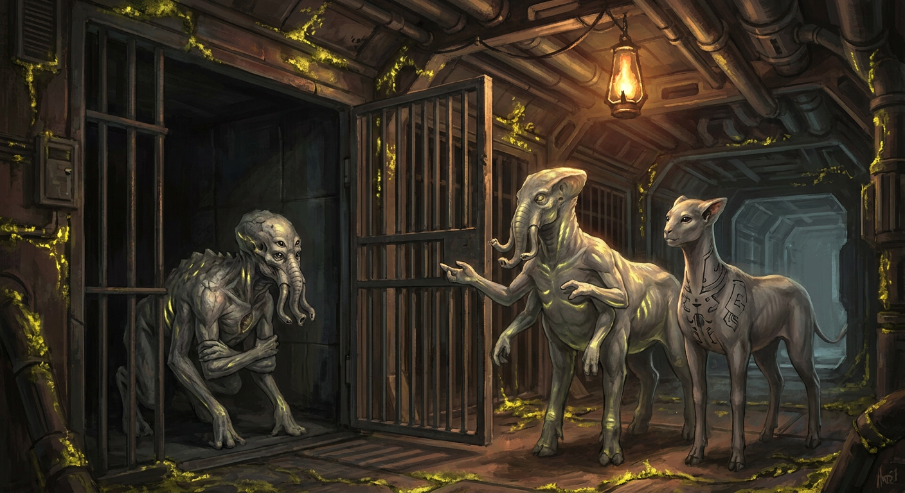

Промпт генератору

Painterly sci-fi concept art. A cramped abandoned navigation post chamber above the rumbling engines of a hollow asteroid starship, lit by a single sputtering solaret lamp and seams of yellow bioluminescent moss. In the corner crouches a gaunt imprisoned male alien: four-legged horizontal body curled tight, rearing front trunk with four eyes whose rear pair blink nervously, tympanum membrane on his chest trunk below the mouth, thin gray stone-crystal flesh with a feeble migrating yellow glow, holding small pebbles in body pockets, four arms hugging his legs. Before the open cell door stand two visitors: a large strong female farmer with six arms, four eyes front and rear, chest tympanum, gray translucent crystal flesh glowing faint yellow, and a slim young female courier with neat stylized diagrams inked on her chest skin. The farmer extends an arm in invitation; the prisoner hesitates, rear eyes flickering. Mood: fragile hope meeting long-earned fear. Each creature one figure, no duplicates.

### Сцена 3. Нино выпущен из камеры; шок от пространства, первые встречи с людьми

- **Место:** туннели и академгородок «Бесподобной»
- **Герои:** Нино, Фатима, Ялда, похожая

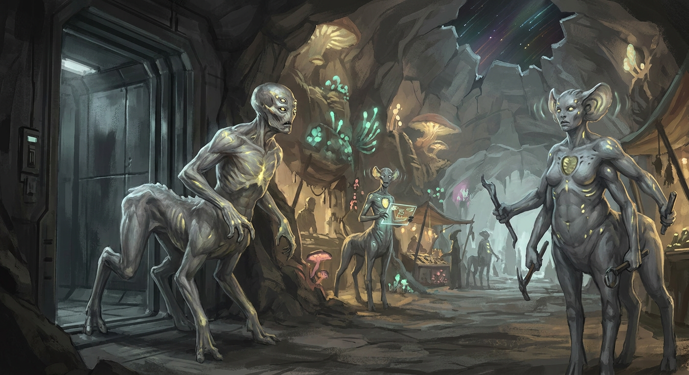

Промпт генератору

Painterly sci-fi concept art. A freed gaunt male alien steps out of confinement into a bustling settlement carved inside a hollow asteroid ship: vast tunnels lit by glowing plants,Market-like alcoves, and distant colored star-streaks visible through an observation crack. He is a thin male with a four-legged horizontal body, rearing front trunk, four eyes blinking in alarm, tympanum below the mouth, gray stone-crystal translucent flesh with faint geometric plates and a weak migrating yellow glow, moving in a hunched, wary crouch. Around him pass curious settlers of the same species — four-legged, rearing front trunks, four eyes, chest tympanums, gray glowing flesh — including a large strong female farmer with six arms and a slim young courier with diagrams drawn on her chest. Faces turn toward him; tympanums ripple with murmurs. He flinches at the sheer open space, pebbles clutched in a pocket. Mood: overwhelming liberation, awe mixed with terror. Each creature one figure, no duplicates.

### Сцена 4. Дни адаптации Нино: экскурсии, занятия, первая ночь в каюте Ялды

- **Место:** столовые, мастерские, классные комнаты, каюта Ялды
- **Герои:** Нино, Фатима, Ялда, Исидора, Сабино, старый класс Ялды

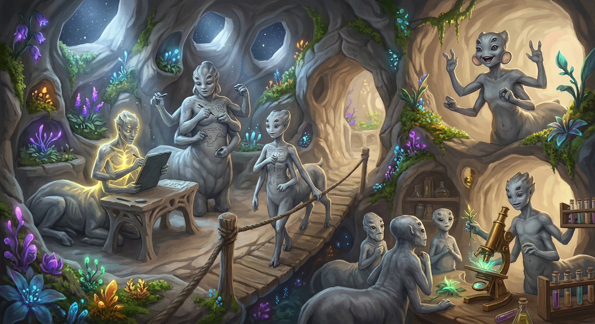

Промпт генератору

Painterly sci-fi concept art. A montage-like interior scene aboard a hollow asteroid ship: a bright schoolroom and adjoining workshop where glowing plants climb carved walls. A once-gaunt male alien, now filling out, sits among students at a low desk — four-legged horizontal body, rearing front trunk, four eyes, tympanum below the mouth, gray translucent stone-crystal flesh with a strengthening yellow glow, four arms copying stylized shorthand sagas onto a slate. A large six-armed female teacher-farmer writes diagrams on her own chest skin; a slim young courier female with chest diagrams guides him by a rope walkway; an energetic female observer chirps with joy, her tympanum fluttering, emotions plain on her face; a young male researcher grips wooden racks beside a brass microscope, teaching the older class. Warm lamplight, bioluminescent greens, starlight through high windows. Mood: patient belonging, gentle adaptation. Every creature one figure, no duplicates.

### Сцена 5. В наблюдательной каюте — разговор об ортогональных звёздах и зачатие детей

- **Место:** наблюдательная каюта у края горы
- **Герои:** Нино, Ялда

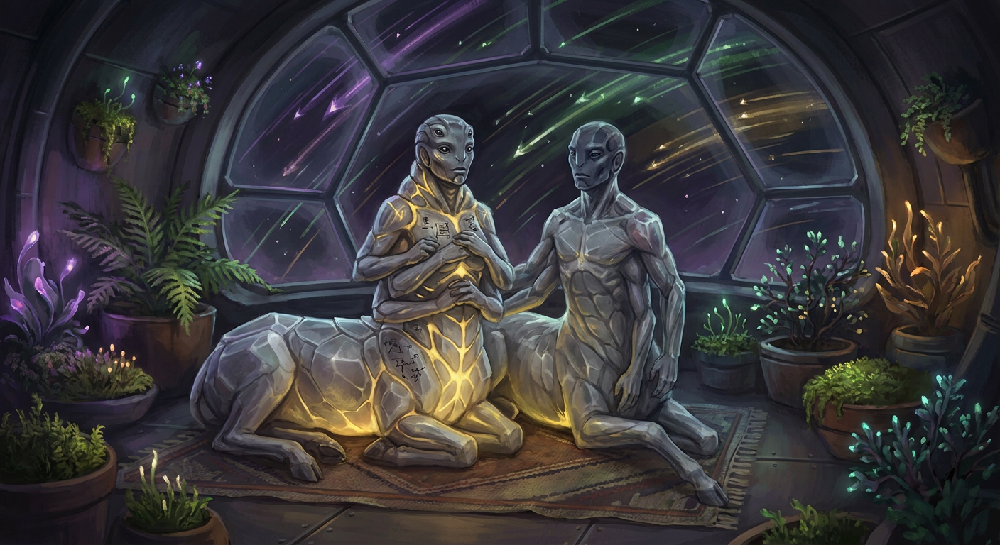

Промпт генератору

Painterly sci-fi concept art. A dim observation cabin at the rim of a mountain inside a hollow asteroid ship: a huge curved crystal window overlooking the void, where strange orthogonal stars streak past with long multicolored trails — violet, green, gold — bending against impossible physics. Two aliens sit close together on a woven mat. A large strong female farmer: four-legged horizontal body, rearing front trunk, front and rear eyes, tympanum below the mouth, gray translucent stone-crystal flesh with geometric plates and a warm migrating yellow glow, six arms, her chest skin covered in neat inked diagrams. Beside her a leaner male, same species standard, rear eyes blinking softly, tympanum trembling with quiet speech, a faint yellow glow rising where their flanks touch. Glowing potted plants cast amber light; the star-trails paint their gray flesh in shifting colors. Mood: intimate, tender, awe before the cosmos — a conversation about children and distant stars. Each creature one figure, no duplicates.

## Глава 21

## Глава 22

## Глава 23

## Глава 24
