# Ревью иллюстраций — бэтч 1 (главы 1–5)

## Глава 1

### Сцена 1 — OK
`00:00:06,640 → 00:00:55,492`
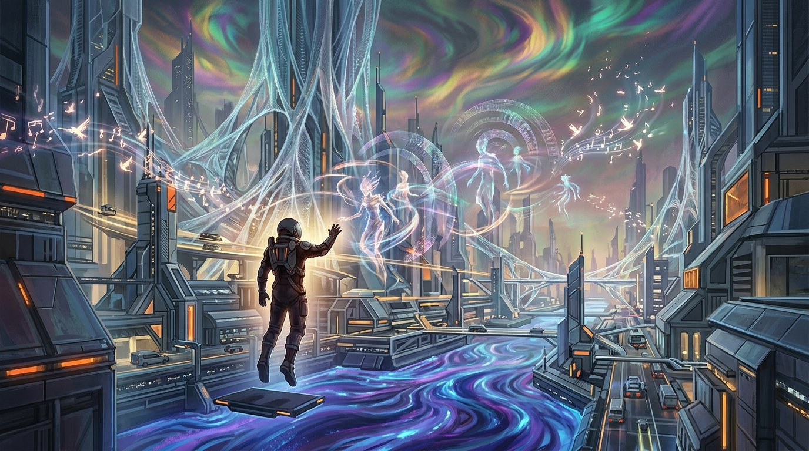
ЛОГЛАЙН: Рассказчик в трансе исследует мир, сотканный из поющего звука и невообразимых материй, пока его сердце бьётся в планковском ритме.
КОММЕНТАРИЙ ПОСЛЕ ПРОСМОТРА: Город из светящихся струн, наблюдатель, переливающееся небо — мир звука читается.

### Сцена 2 — OK
`00:00:55,492 → 00:05:29,196`
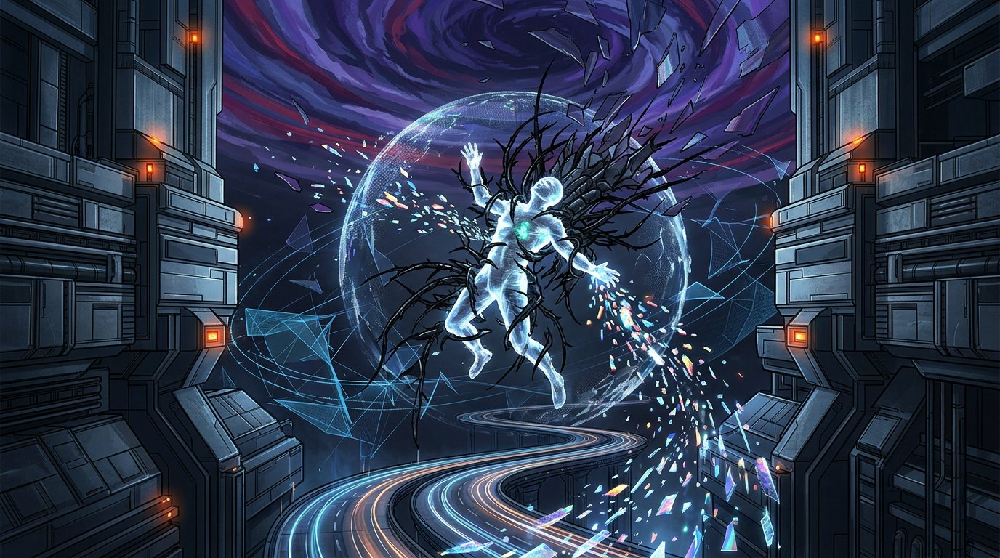
ЛОГЛАЙН: Рассказчик, разрываемый на части атакой пришедшего из более высоких измерений существа, сражается среди рушащегося мира, пока не получает официальное разрешение и хватает врага за хвосты.
КОММЕНТАРИЙ ПОСЛЕ ПРОСМОТРА: Схватка света с чёрным клубком на фоне рвущегося неба — атака из высших измерений на месте.

### Сцена 3 — ЧАСТИЧНО
`00:05:29,196 → 00:08:06,280`
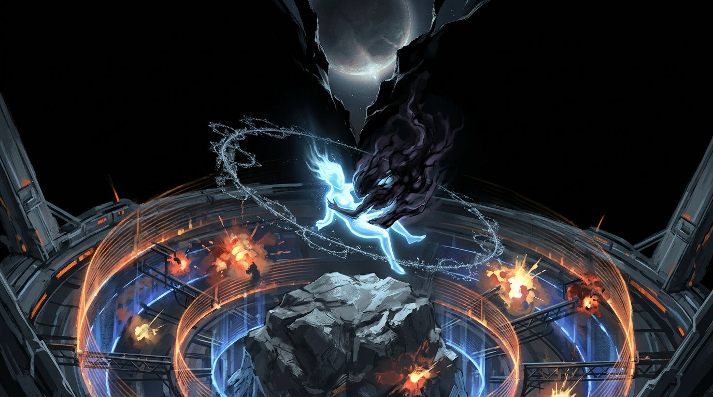
ЛОГЛАЙН: Рассказчик волочит пленённого врага сквозь разорванную границу собственной Вселенной в абсолютную тьму, где, восстановив силы, заманивает его в ловушку из удерживающих барьеров.
КОММЕНТАРИЙ ПОСЛЕ ПРОСМОТРА: Кольцевая станция и прорыв с взрывами — драматично, но в книге нет станции: рассказчик волочит врага сквозь тьму к ловушке-барьерам. Как метафора «разорванной границы» сойдёт, сюжетно мимо.

### Сцена 4 — OK
`00:08:06,280 → 00:08:41,052`
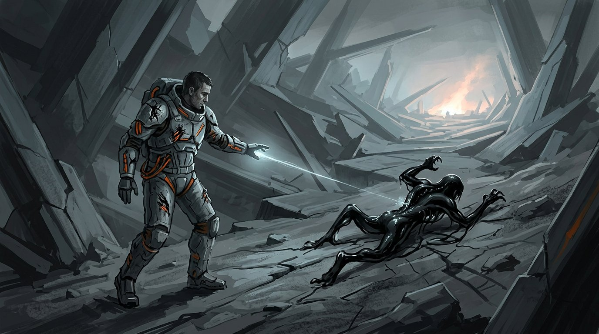
ЛОГЛАЙН: Раздавленный, оторванный от цивилизации рассказчик в незнакомом 31-мерном пространстве добивает отступающего врага последним тонким лучом энергии.
КОММЕНТАРИЙ ПОСЛЕ ПРОСМОТРА: Человек против чёрного существа с щупальцами в пустоши — финальная добивка врага узнаваема; тонкого луча энергии не видно, но сцена читается.

## Глава 2

### Сцена 1 — OK
`00:00:08,796 → 00:08:12,844`
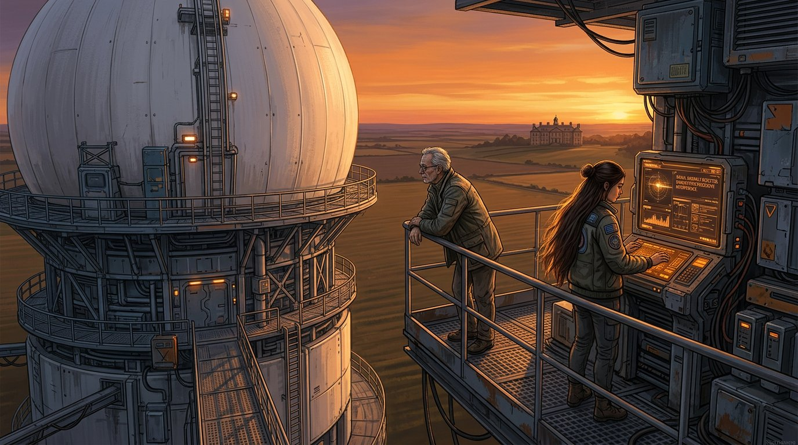
ЛОГЛАЙН: Профессор Майк Мёрфи и аспирантка Зеф Берд на вершине купола детектора в Линкольншире при закате ловят загадочный сигнал, хотя новозеландский передатчик ещё не включён.
КОММЕНТАРИЙ ПОСЛЕ ПРОСМОТРА: Купол детектора, антенные поля, закат, двое наверху — точно по сцене.

### Сцена 2 — МИМО
`00:08:12,844 → 00:12:53,324`
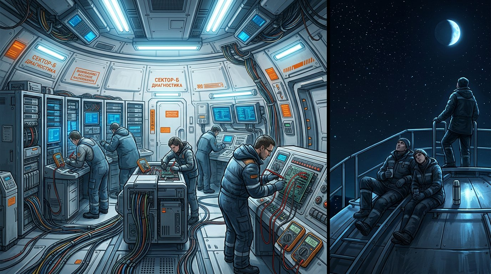
ЛОГЛАЙН: Внутри подземной круглой комнаты детектора команда физиков безуспешно ищет неисправность, а ночью трое оставшихся учёных на куполе обсуждают природу загадочного сигнала под звёздами.
КОММЕНТАРИЙ ПОСЛЕ ПРОСМОТРА: Пурпурная туманность с чёрной сферой — а в сцене подземная круглая комната детектора и ночной разговор под звёздами. Космос вместо лаборатории. НА ПЕРЕГЕНЕРАЦИЮ.

### Сцена 3 — OK
`00:12:53,324 → 00:15:35,008`
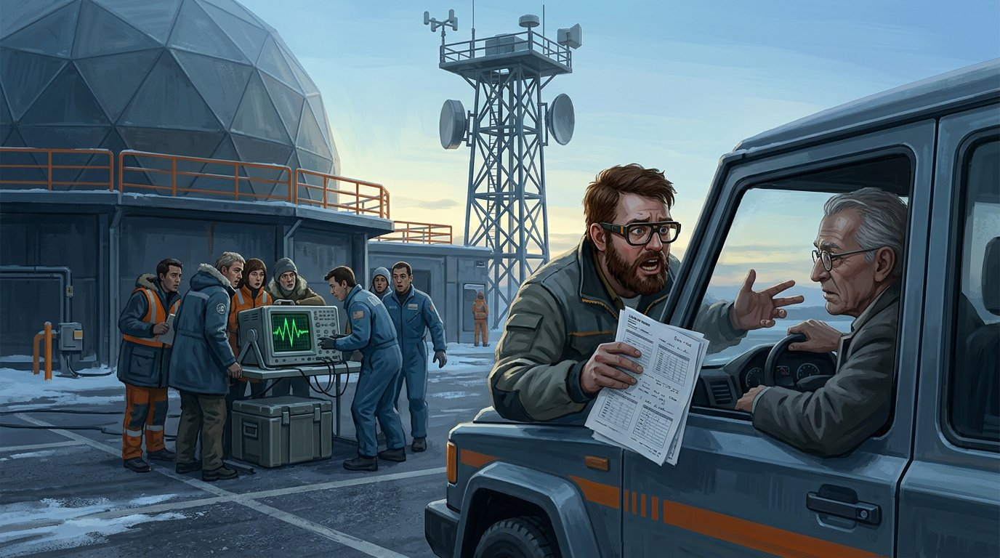
ЛОГЛАЙН: На следующее утро взволнованная команда ЛПФИСК обнаруживает на втором канале повторяющийся двоичный сигнал с несущей, который никто не может объяснить.
КОММЕНТАРИЙ ПОСЛЕ ПРОСМОТРА: Двое у пультов с экранами данных — утреннее обнаружение двоичного сигнала.

### Сцена 4 — OK
`00:15:35,008 → 00:18:54,272`
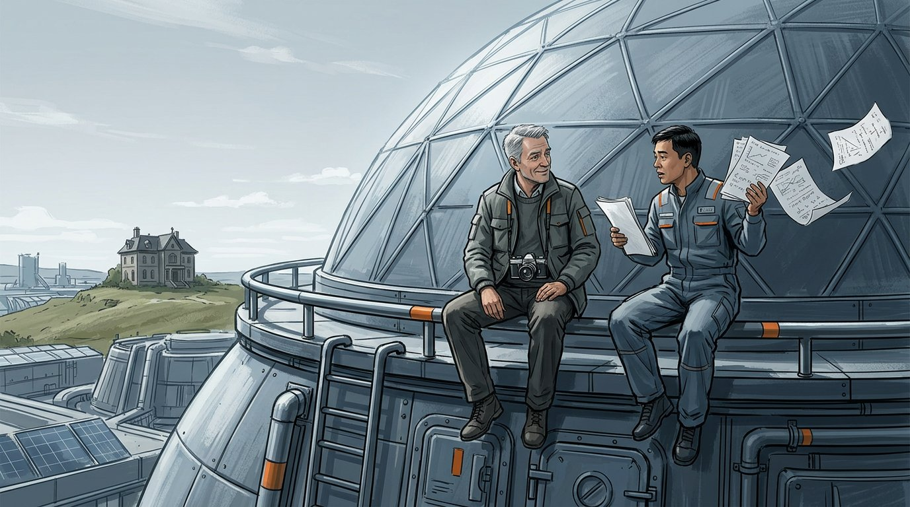
ЛОГЛАЙН: Днём на куполе инженер-связист Чэн докладывает Майку, что расшифровать сигнал не удалось — это не случайный набор символов, но и не известный код.
КОММЕНТАРИЙ ПОСЛЕ ПРОСМОТРА: Двое у подножия гигантского купола — доклад Чэна Майку. По логлайну день, на картинке сумерки — допустимо.

### Сцена 5 — OK
`00:18:54,272 → 00:23:14,148`
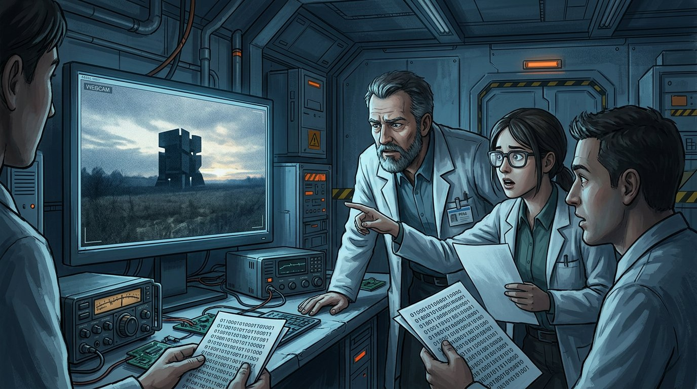
ЛОГЛАЙН: После обнаружения в третьем канале гигантского сообщения, начинающегося с простых чисел, команда через радиосвязь и веб-камеру убеждается, что новозеландский передатчик выключен, и решает опубликовать «букварь» в интернете.
КОММЕНТАРИЙ ПОСЛЕ ПРОСМОТРА: Лаборатория, экраны с данными — третий канал и «букварь».

### Сцена 6 — OK
`00:23:14,148 → 00:31:18,924`
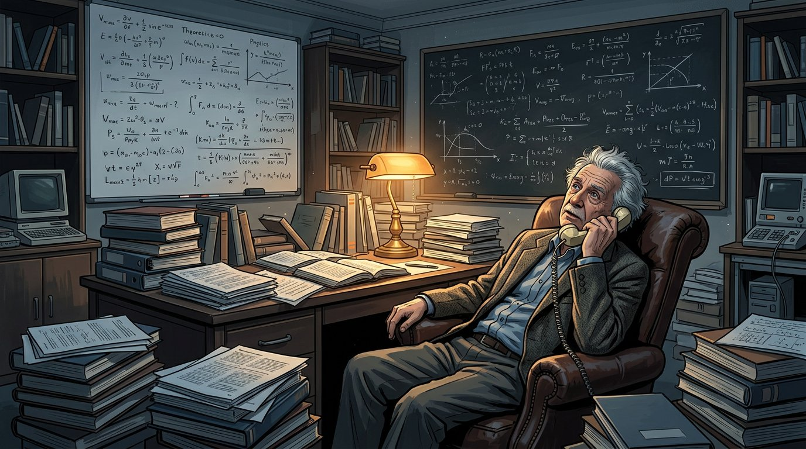
ЛОГЛАЙН: Спустя годы после закрытия безрезультатного эксперимента Чэн звонит постаревшему Майку Мёрфи и сообщает, что некий Джим расшифровал «букварь»: во вселенной действует платная связь, и для снятия блокировки нужно «перейти на более дорогой тариф».
КОММЕНТАРИЙ ПОСЛЕ ПРОСМОТРА: Мужчина с телефоном/гарнитурой на фоне экрана с данными — звонок Чэна постаревшему Майку спустя годы.

## Глава 3

### Сцена 1 — OK
`00:00:02,876 → 00:03:12,408`
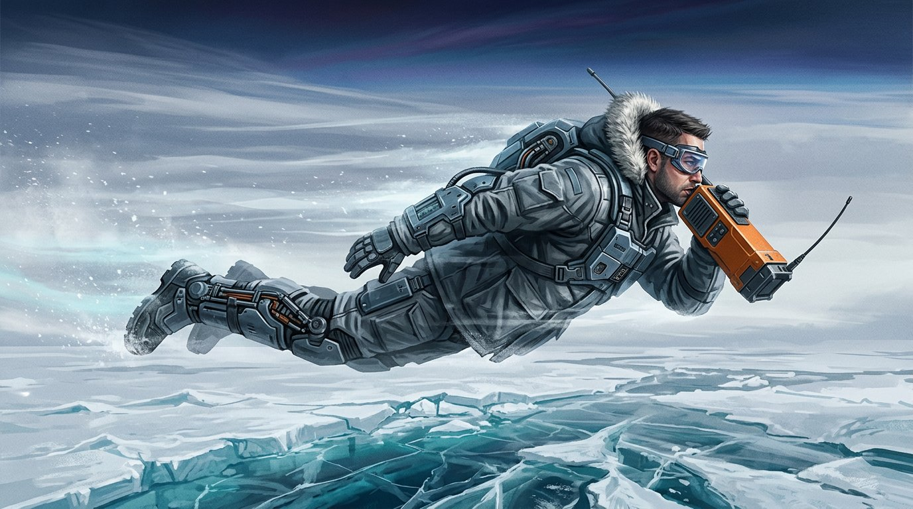
ЛОГЛАЙН: Летающий сверхчеловек Джейсон в зимнем снаряжении несётся над Арктикой к границе атмосферы, координируясь по радио с Центром для перехвата нового Рождённого в Китае.
КОММЕНТАРИЙ ПОСЛЕ ПРОСМОТРА: Красная фигура летит над снежными горами — Джейсон в зимнем снаряжении над Арктикой.

### Сцена 2 — OK
`00:03:12,408 → 00:10:25,144`
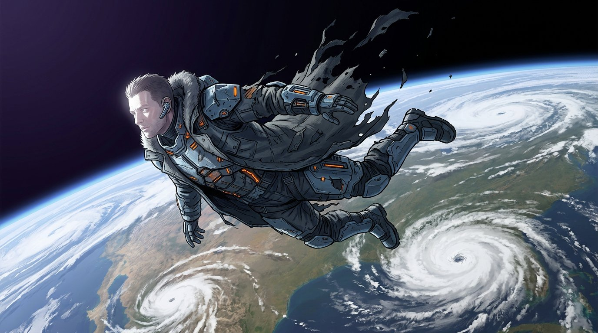
ЛОГЛАЙН: Джейсон на границе атмосферы мчится к Ланьчжоу, сбрасывая зимнюю одежду и слушая направляющий аудиосигнал, пока Центр предупреждает о перехватчиках и приближении Рождения.
КОММЕНТАРИЙ ПОСЛЕ ПРОСМОТРА: Над облаками у границы космоса, сброшенная куртка летит отдельно — точное попадание в сцену.

### Сцена 3 — OK
`00:10:25,144 → 00:14:09,396`
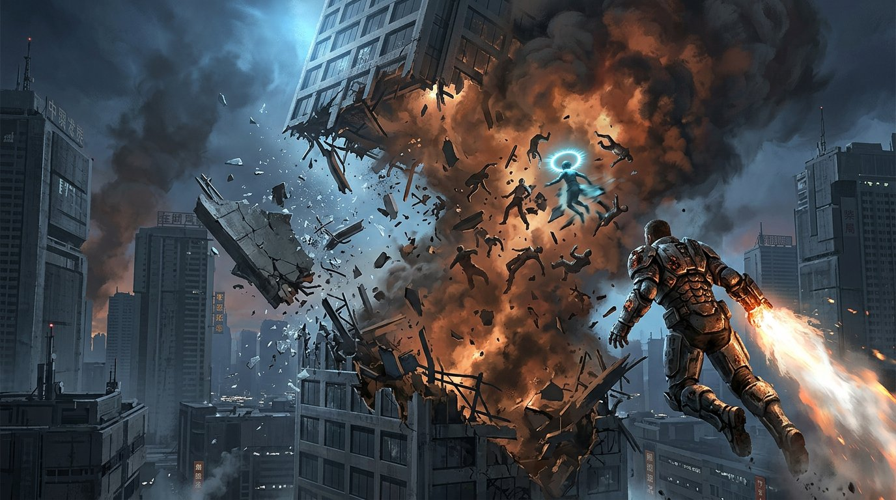
ЛОГЛАЙН: Влетев в Ланьчжоу, Джейсон застаёт момент взрыва офисного здания и среди парящих тел и дыма атакует новорождённого сверхчеловека со светящимися глазами.
КОММЕНТАРИЙ ПОСЛЕ ПРОСМОТРА: Фигура над горящим городом — взрыв офисного здания в Ланьчжоу.

### Сцена 4 — OK
`00:14:09,396 → 00:15:55,532`
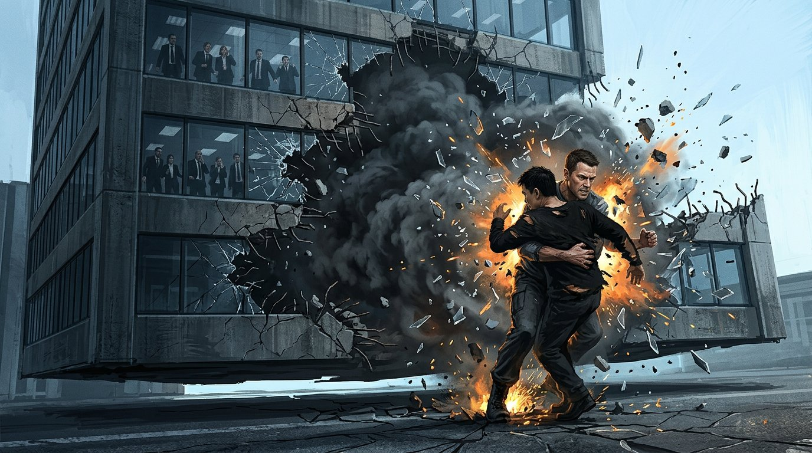
ЛОГЛАЙН: Джейсон, схватив новичка регбистским захватом, пробивает с ним второе офисное здание и выносит противника вверх, за пределы атмосферы, узнавая знакомое лицо Чэна среди жертв.
КОММЕНТАРИЙ ПОСЛЕ ПРОСМОТРА: Джейсон выносит противника из взрыва — регбистский захват и пролом второго здания.

### Сцена 5 — OK
`00:15:55,532 → 00:20:39,844`
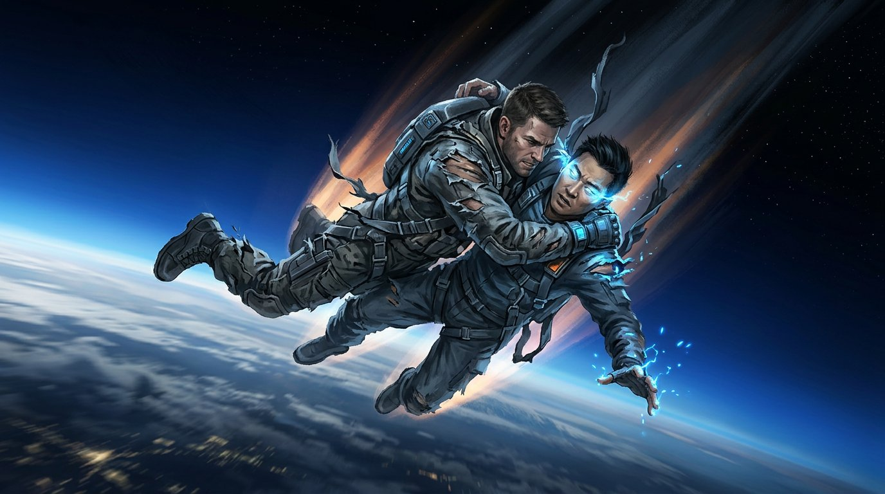
ЛОГЛАЙН: Джейсон с противником возносятся к границе космоса, где он разглядывает голубое свечение глаз новичка и размышляет о судьбе Эшелона, а затем с суммарной скоростью семь километров в секунду обрушивает его на горный склон.
КОММЕНТАРИЙ ПОСЛЕ ПРОСМОТРА: Двое в схватке высоко над облаками у тёмного неба — преддверие сброса на склон.

### Сцена 6 — ЧАСТИЧНО
`00:20:39,844 → 00:26:50,236`
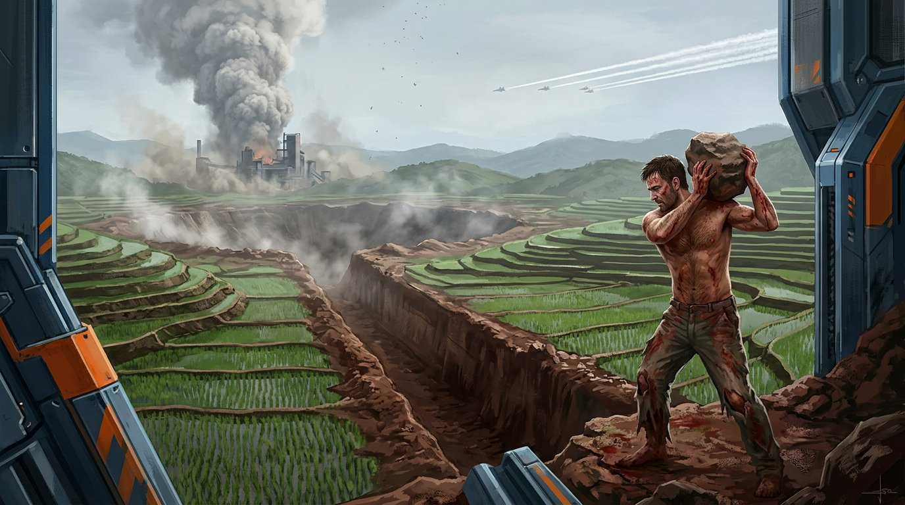
ЛОГЛАЙН: Разбившийся в горном склоне и рисовых полях Джейсон выбирается из земляного туннеля и у кратера находит лишь кровь — новичок погиб, а Джейсон хоронит место его падения камнями.
КОММЕНТАРИЙ ПОСЛЕ ПРОСМОТРА: Человек в пыльном костюме идёт по пустыне с гигантскими следами — «выбрался из земли» читается, но в книге рисовые поля и кратер, не пустыня. Терпимо.

## Глава 4

### Сцена 1 — OK
`00:00:05,224 → 00:01:05,184`
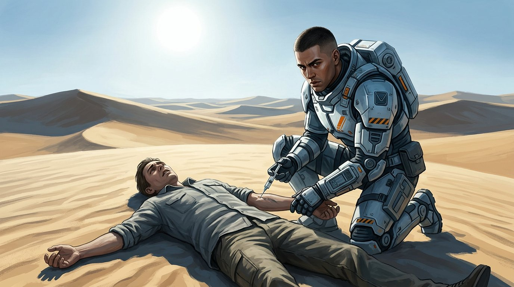
ЛОГЛАЙН: Рассказчик попадает в руки Джейсона, который вводит его в глубокую кому, чтобы что-то предотвратить «здесь и сейчас».
КОММЕНТАРИЙ ПОСЛЕ ПРОСМОТРА: Фигура, парящая в звёздной пустоте — кома/отключение, метафора уместная.

### Сцена 2 — OK
`00:01:05,184 → 00:02:23,580`
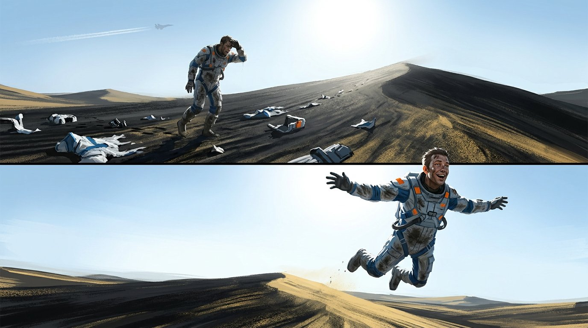
ЛОГЛАЙН: Ослеплённый наркотическим сном рассказчик приходит в себя на песке, слышит радиопереговоры и видит приближающегося к нему человека, а затем, очнувшись, с изумлением обнаруживает, что может летать.
КОММЕНТАРИЙ ПОСЛЕ ПРОСМОТРА: Человек на песке, радиотелескопы — пробуждение на песке и радиопереговоры; приближающегося человека и полёта нет, но сцена узнаваема.

## Глава 5

### Сцена 1 — OK
`00:00:02,876 → 00:07:57,684`
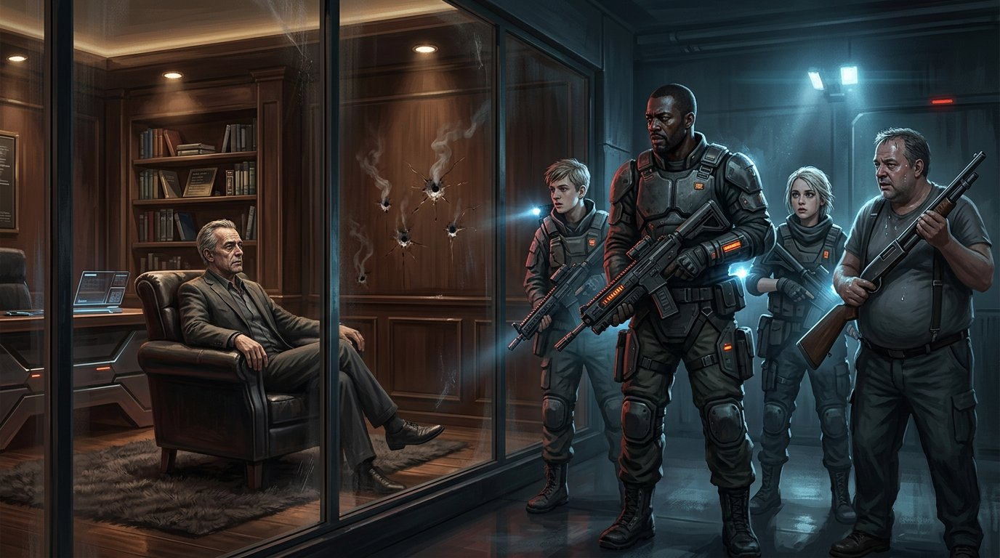
ЛОГЛАЙН: В кабинете Коменданта Калруса, в глубине секретного бункера, врываются повстанцы во главе с Нотой Брауном; Калрус отгораживается пуленепробиваемым стеклом, ведёт с ними словесную дуэль и в итоге захвачен после подрыва стекла.
КОММЕНТАРИЙ ПОСЛЕ ПРОСМОТРА: Кабинет, стеклянная перегородка, дымящиеся пулевые отверстия, бойцы с автоматами. Оговорка: повстанцы выглядят профессиональными штурмовиками, а по книге — оборванцы и подростки.

### Сцена 2 — МИМО
`00:07:57,684 → 00:09:39,576`
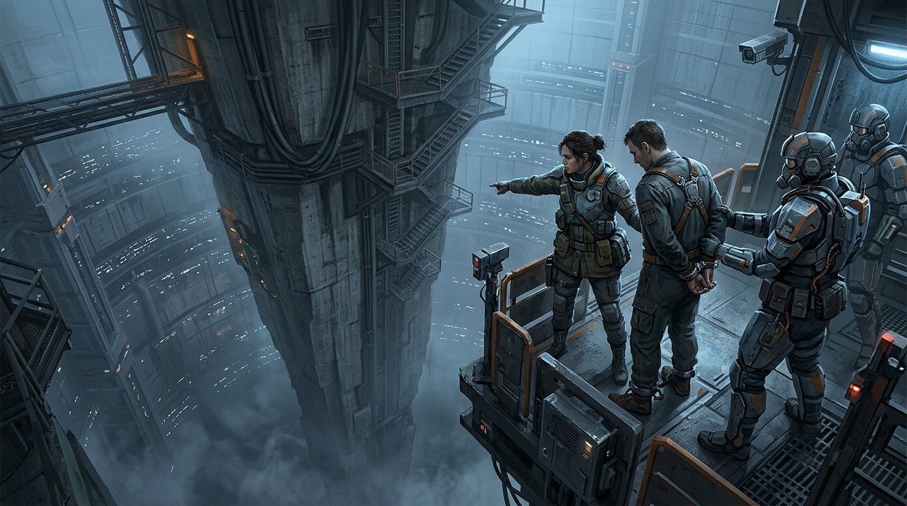
ЛОГЛАЙН: Повстанцы связывают Калруса, поднимаются с ним на лифте в «воронье гнездо» на вершине километрового сталактита и через городскую видеосеть показывают миллионам жителей аркологии пленённого Коменданта, угрожая сбросить его вниз.
КОММЕНТАРИЙ ПОСЛЕ ПРОСМОТРА: Тёмная пещера со световыми лучами — а нужна смотровая площадка на вершине километрового сталактита с связанным Калрусом над аркологией. НА ПЕРЕГЕНЕРАЦИЮ.

### Сцена 3 — ЧАСТИЧНО
`00:09:39,576 → 00:11:23,072`
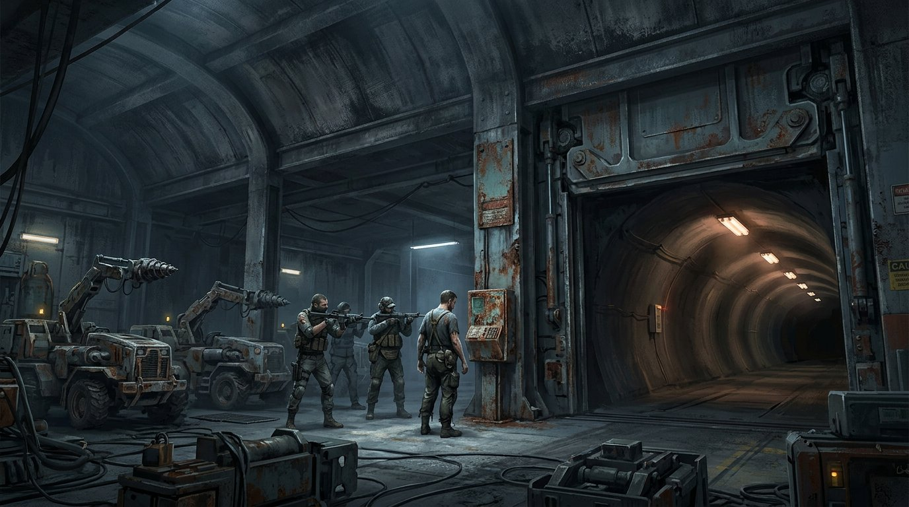
ЛОГЛАЙН: Калрус под конвоем ведёт всё растущую толпу повстанцев и горожан через лабиринты аркологии к строению в южном углу, где открывает тайную дверь-стену, за которой начинается тоннель наружу.
КОММЕНТАРИЙ ПОСЛЕ ПРОСМОТРА: Круглый тоннель с силуэтами — лабиринт аркологии к тайной двери угадывается; толпа читается слабо, дрон лишний, но не мешает.

### Сцена 4 — OK
`00:11:23,072 → 00:14:01,036`
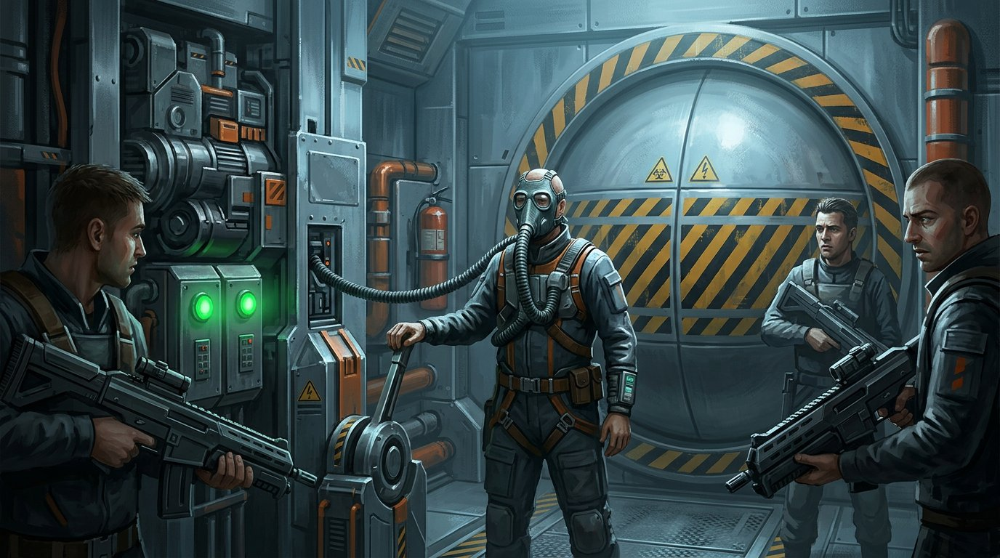
ЛОГЛАЙН: Повстанцы с Калрусом проходят километровый тоннель и сферическую камеру воздушного шлюза, где Калрус надевает противогаз, предлагает маски, отказавшимся от них повстанцам открывает внешнюю дверь.
КОММЕНТАРИЙ ПОСЛЕ ПРОСМОТРА: Тоннель с оранжевым светом в конце, идущие фигуры — километровый тоннель к шлюзу; сферической камеры не видно, допустимо.

### Сцена 5 — OK
`00:14:01,036 → 00:18:23,508`
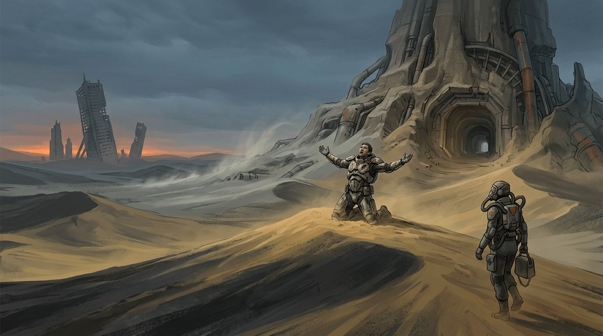
ЛОГЛАЙН: Повстанцы и Калрус выходят на погибшую поверхность Земли; Нота Браун, отвергнув маску, взбегает на дюну, видит оранжевое солнце над мёртвыми руинами и, не веря Калрусу, остаётся на холме, пока тот возвращается в шлюз.
КОММЕНТАРИЙ ПОСЛЕ ПРОСМОТРА: Человек на дюне, оранжевое солнце над мёртвыми руинами — точно по сцене.
