# Ревью бэтча 2 — главы 6–10 (12 картинок)

Ревью по одной картинке за раз (file_read каждого файла). Описание — то, что РЕАЛЬНО изображено, сверено с логлайном сцены.

**Итог: 11/12 приняты, 1 флаг** — ch08-s03: доктор Шапур отрисована мужчиной (по книге — женщина).

## Глава 6

### ch06-s01 ✅
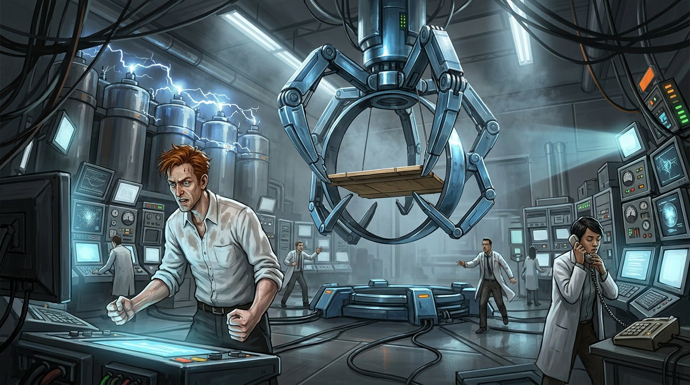
Лаборатория телепорта: пустое кольцо на платформе, рыжий Эшмор в гневе у пульта, электрические дуги на конденсаторах, команда в панике. Исчезновение Анны читается.

### ch06-s02 ✅
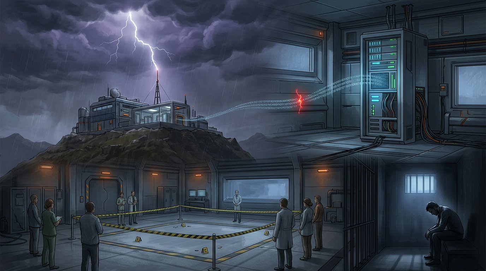
Монтаж: гроза с молнией над комплексом, поток бинарного кода с антенны, серверная, место преступления с лентой, Эшмор в камере. Все биты ретроспективы + приговор. Плотно, но работает.

### ch06-s03 ✅
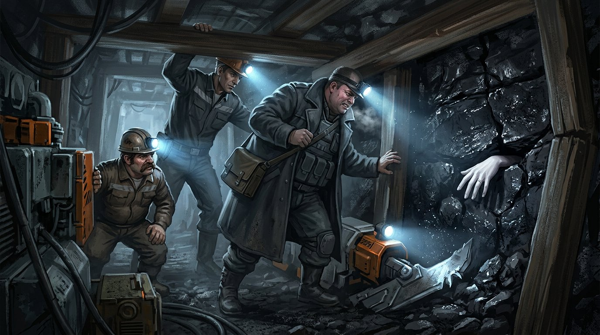
Шахта: бледная женская рука с кольцом торчит из антрацитового пласта, Хэддон с фонарём, горняки Джефф и Адам. Точно.

## Глава 7

### ch07-s01 ✅
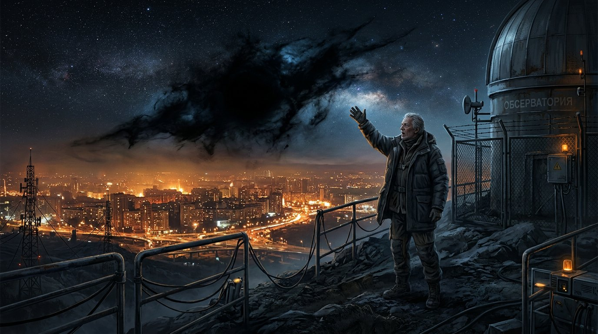
Астроном на площадке обсерватории указывает на чернильную дыру, пожирающую звёздное небо; огни города внизу, вывеска «ОБСЕРВАТОРИЯ». Точно.

### ch07-s02 ✅
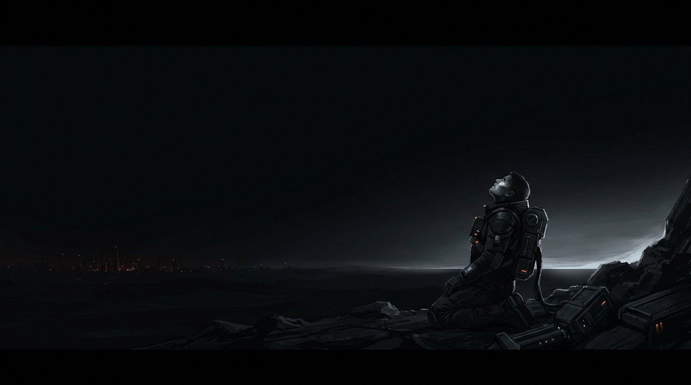
Почти чёрный кадр: фигура на коленях на тёмной поверхности, далёкие огни города. Абсолютная тьма по логлайну; кадр на грани читаемости — учесть при монтаже.

## Глава 8

### ch08-s01 ✅ (догенерирована в этом бэтче)
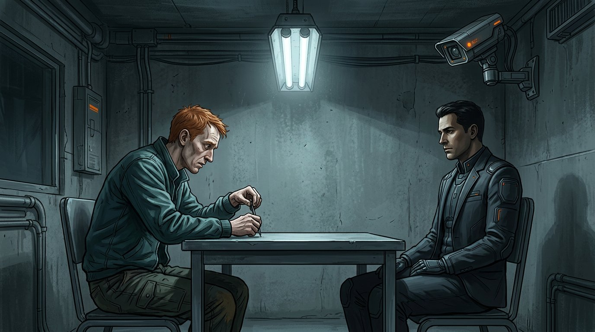
Комната допроса: сгорбленный рыжий Эшмор вертит ручку, детектив Хэддон напротив, камера в углу, серо-зелёная палитра. Точно.

### ch08-s02 ✅
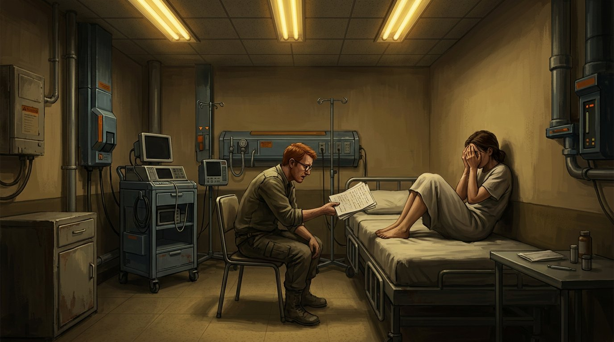
Тёмная палата, жёлтые флюоресцентные трубки; измождённая Анна калачиком на койке затыкает глаза ладонями, Эшмор склонился со стопкой исписанных листов. Точно.

### ch08-s03 ⚠️ ФЛАГ
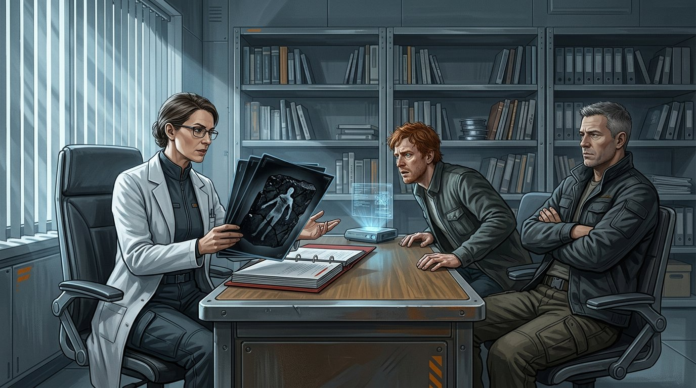
Кабинет: рентген-снимок с фигурой в угле над скоросшивателем, Эшмор подался вперёд, Хэддон скрестил руки. Композиция по логлайну, **но доктор Шапур отрисована мужчиной в очках** — по книге она женщина. Решение за Анатолем: перегенерить или оставить.

## Глава 9

### ch09-s01 ✅
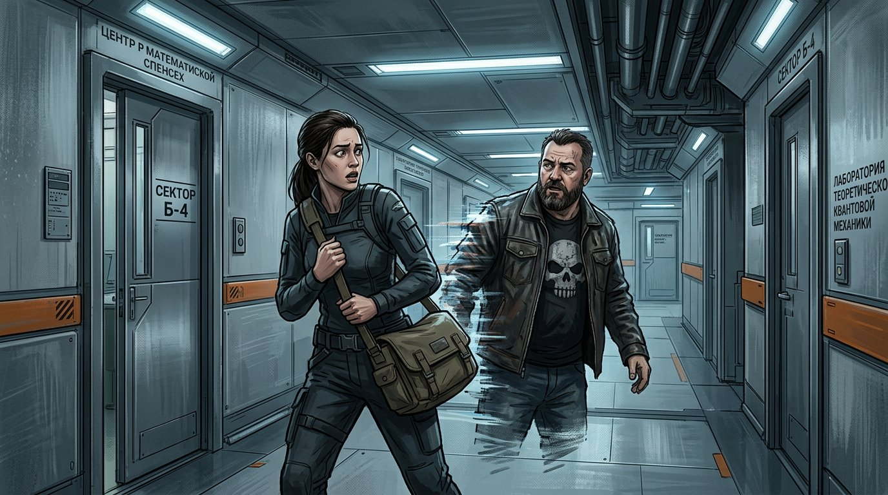
Университетский коридор: Митч проходит сквозь Зеф Бёрд, бумаги разлетаются, студенты в шоке. Зеф — темнокожая, как в книге. Точно.

### ch09-s02 ✅
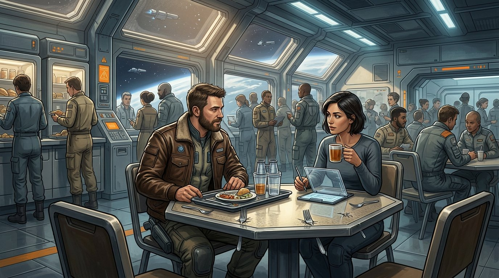
Кафетерий: Митч демонстрирует прохождение предметов сквозь друг друга, Зеф делает заметки. Точно.

## Глава 10

### ch10-s01 ✅
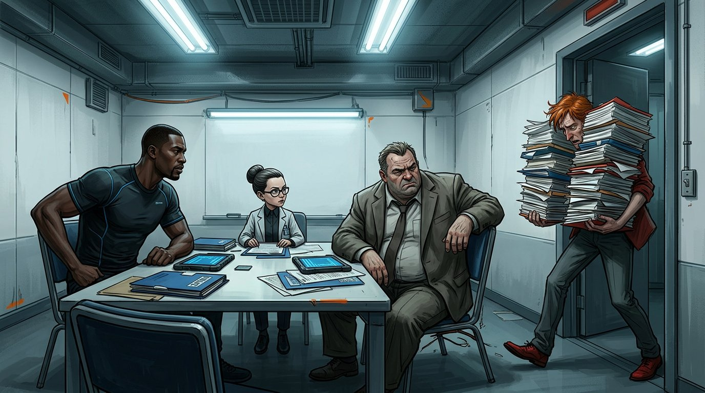
Тесная комната, четверо участников: Муока с макетом галактики, Шапур, Хэддон, Эшмор у белой доски. По логлайну.

### ch10-s02 ✅
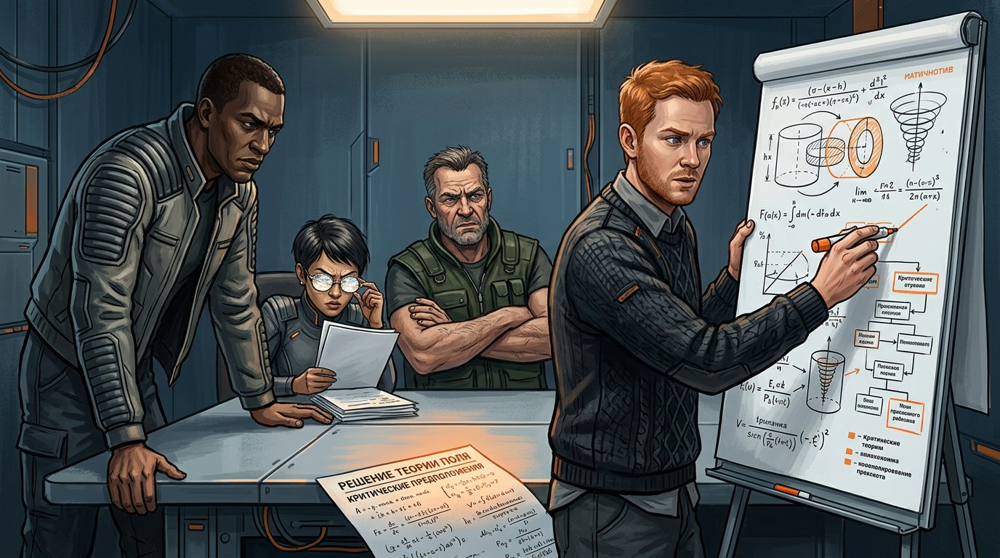
Эшмор у доски с формулами; Земля, парящее тело Анны, стрелка колебаний в четвёртом измерении. Отлично.
