# Ревью бэтча 3 — главы 11–15 (16 картинок)

Ревью по одной картинке за раз. Описание — то, что РЕАЛЬНО изображено, сверено с логлайном сцены.

**Итог: 16/16 приняты.** Заметки: кириллические таблички на американской базе (ch11-s01), внешность Зеф отличается от ch09 (ch14-s01) — генераторный шум, некритично.

## Глава 11

### ch11-s01 ✅
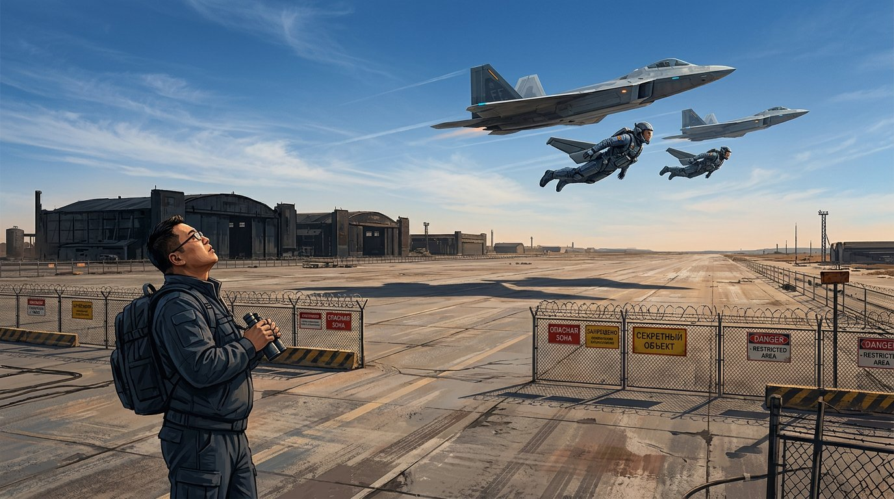
Чэн с биноклем у колючей проволоки; двое сверхлюдей (Джейсон и Арика) в строю с двумя F-22, секретная база, знаки ограничения. Точно (таблички местами кириллицей — шум генератора).

### ch11-s02 ✅
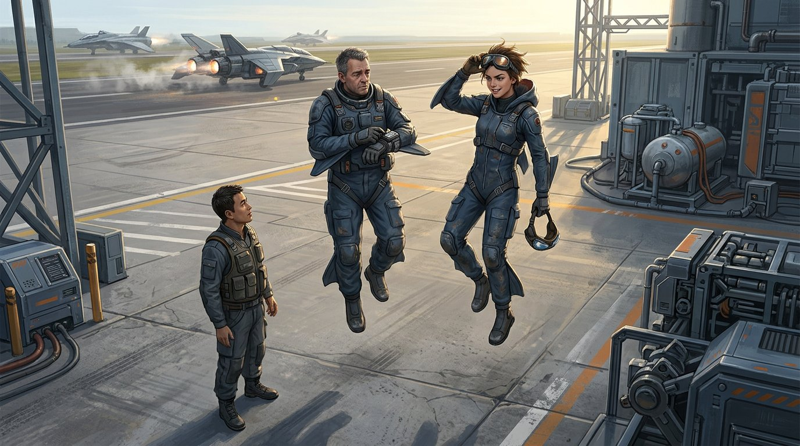
Джейсон и Арика невесомо висят над бетоном полосы, беседуют с Чэном; аэрокостюмы, ангары. Точно.

### ch11-s03 ✅
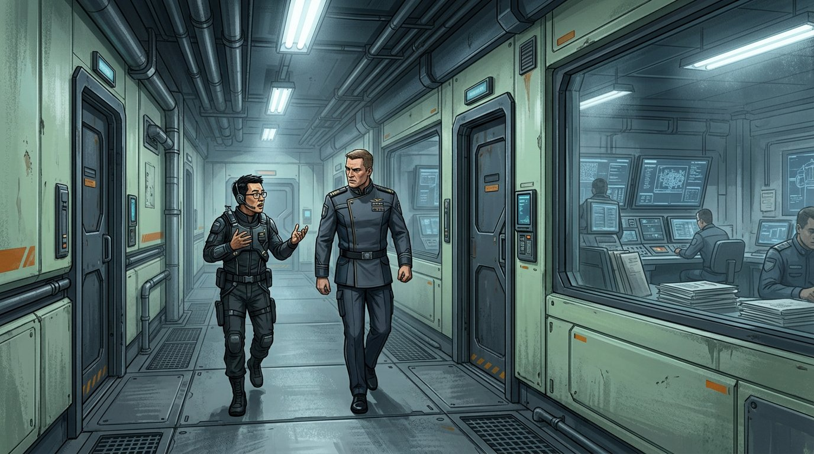
Коридор базы: Чэн в упор требует объяснений у капитана Моксона. Точно.

### ch11-s04 ✅
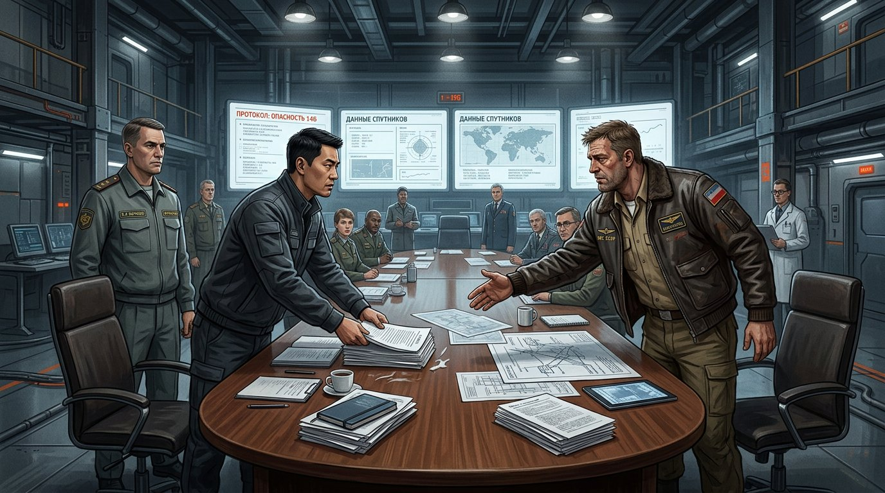
Зал совещаний, овальный стол, экраны «ПРОТОКОЛ: ОПАСНОСТЬ 146» и «ДАННЫЕ СПУТНИКОВ». Народу больше двух, но сцена брифинга читается.

## Глава 12

### ch12-s01 ✅
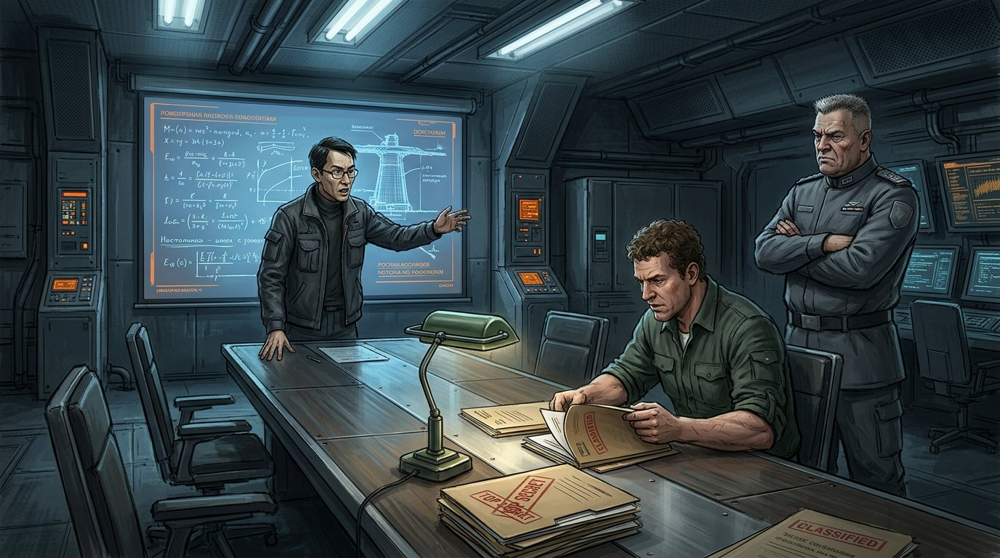
Чэн инструктирует агента Кавета у экрана с формулами, полковник Моксон надзирает, папки CLASSIFIED. Точно.

### ch12-s02 ✅
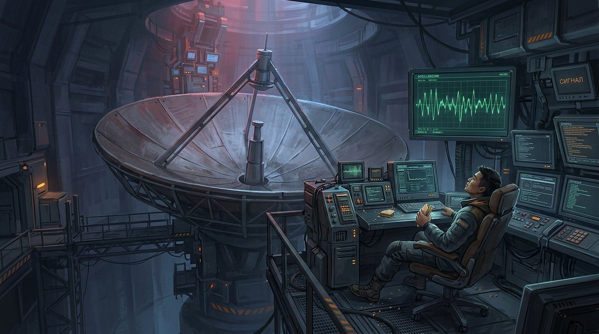
Подземный зал с законсервированным преонным детектором-тарелкой; Чэн один ночью у осциллографа, экран «СИГНАЛ». Атмосферно, точно.

### ch12-s03 ✅
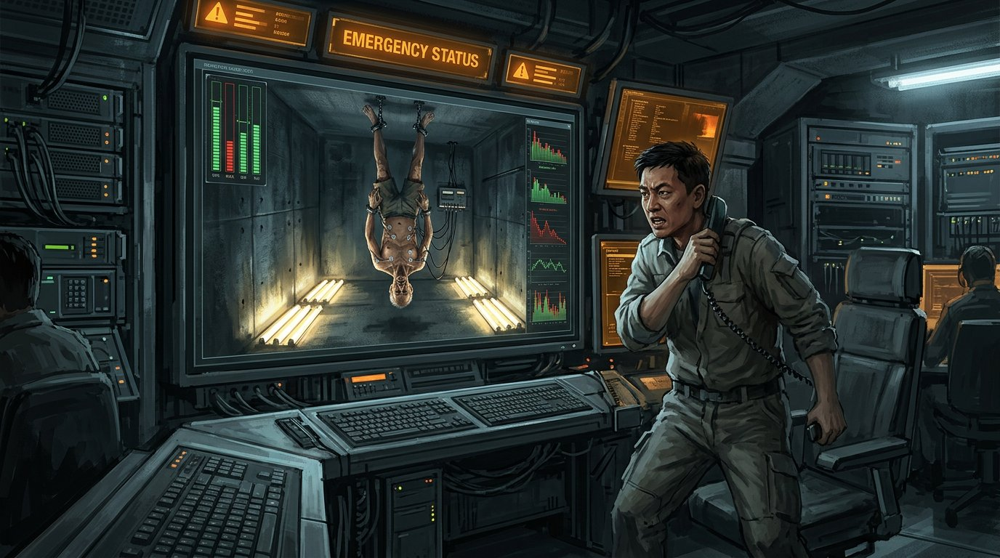
Чэн ссорится по телефону; на мониторе подвешенный за ноги Димасаланг, EMERGENCY STATUS. Точно.

### ch12-s04 ✅
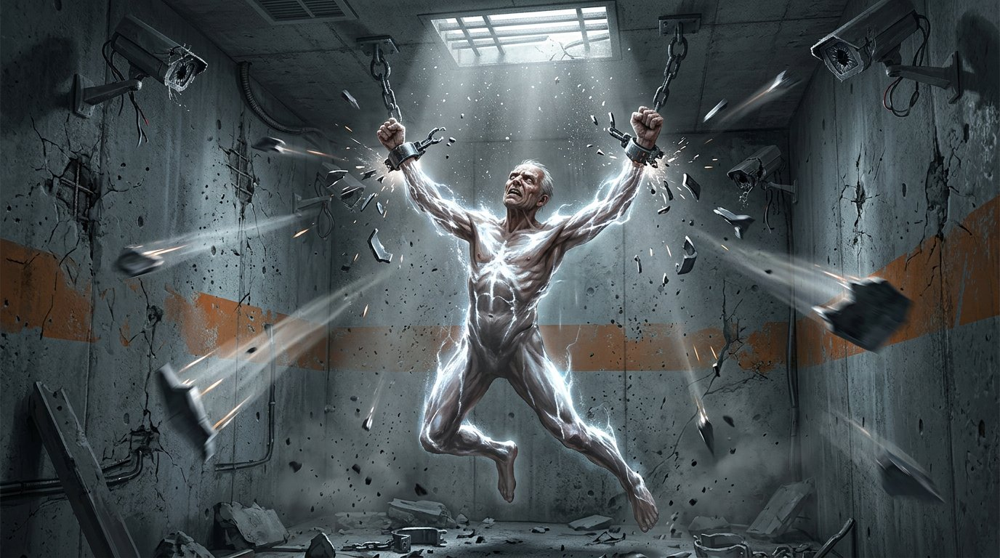
Димасаланг пробуждается и рвёт стальные оковы, энергия по телу, камеры слежения разлетаются. Мощно, точно.

### ch12-s05 ✅
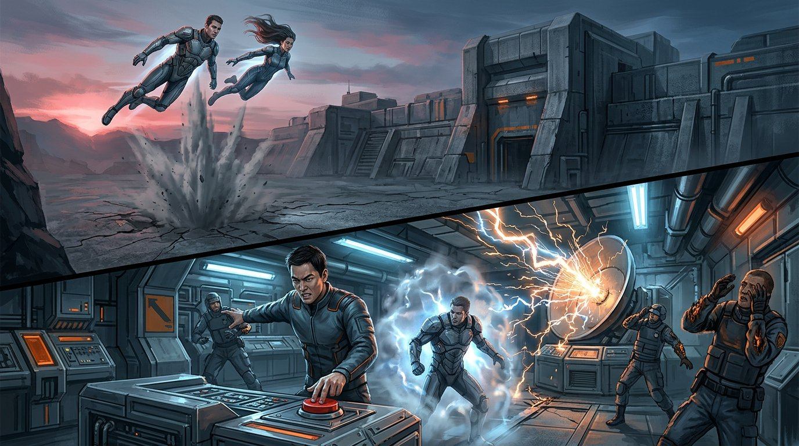
Диптих: Джейсон и Арика парят над бункером / Чэн жмёт красную кнопку, охрана врывается, телепорт-вспышка, детектор искрит. Все биты логлайна.

## Глава 13

### ch13-s01 ✅
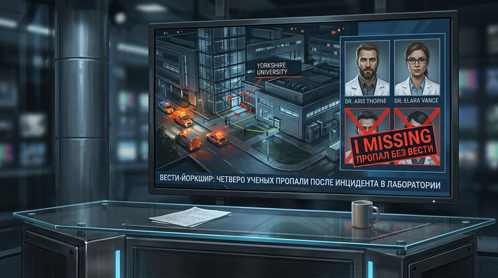
Новостной экран: Йоркширский университет ночью, кареты скорой, оцепление; фото двух учёных + двое MISSING «ПРОПАЛ БЕЗ ВЕСТИ», бегущая строка. Точно (строка говорит «четверо пропали», по тексту двое погибли + двое пропали — терпимо).

### ch13-s02 ✅
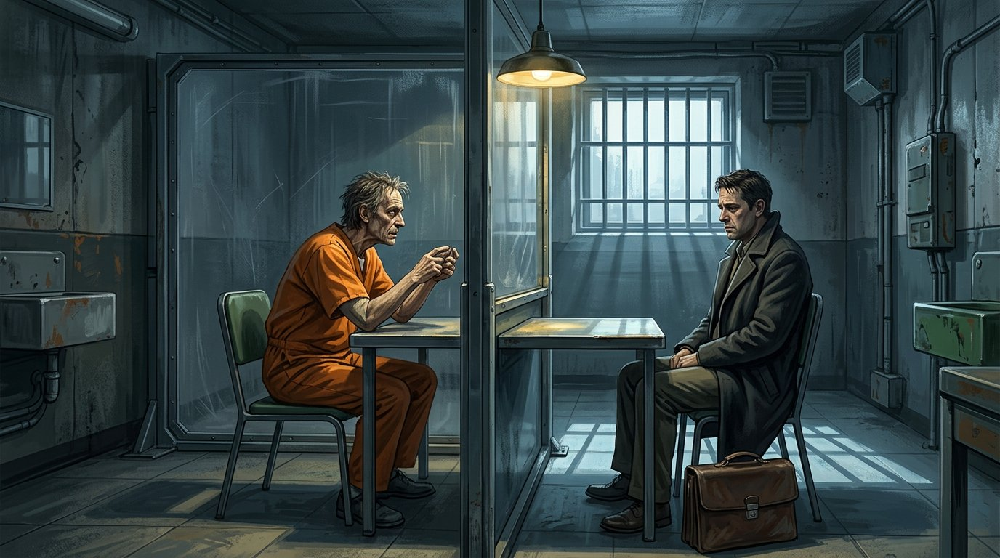
Тюремная комната свиданий: Эшмор в оранжевом комбинезоне, доктор Муока с портфелем по другую сторону стекла. Точно.

## Глава 14

### ch14-s01 ✅
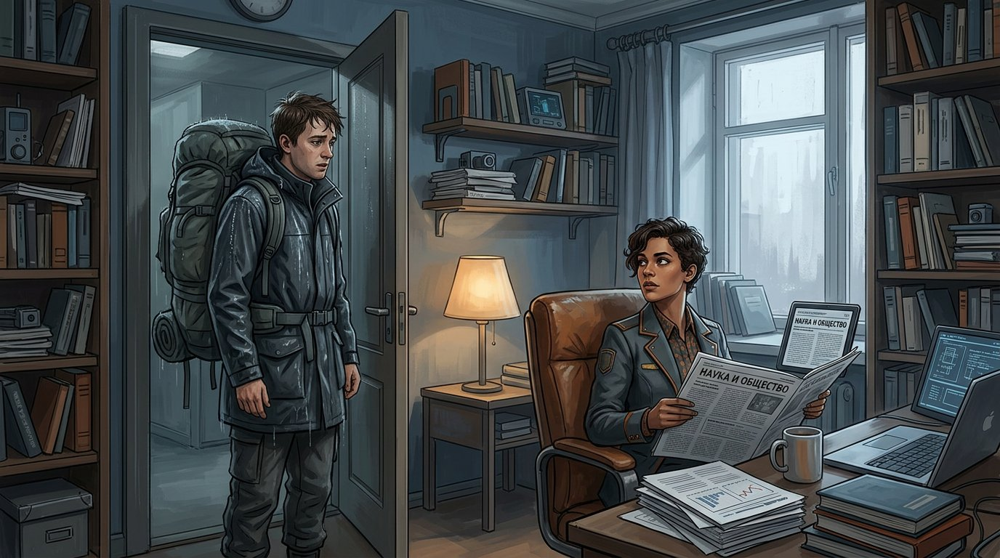
Промокший Митч с рюкзаком в дверях кабинета Зеф; она с газетой «НАУКА И ОБЩЕСТВО» — разоблачение читается. (Внешность Зеф отличается от ch09 — другая причёска; слабая межглавая консистентность, на заметку.)

## Глава 15

### ch15-s01 ✅
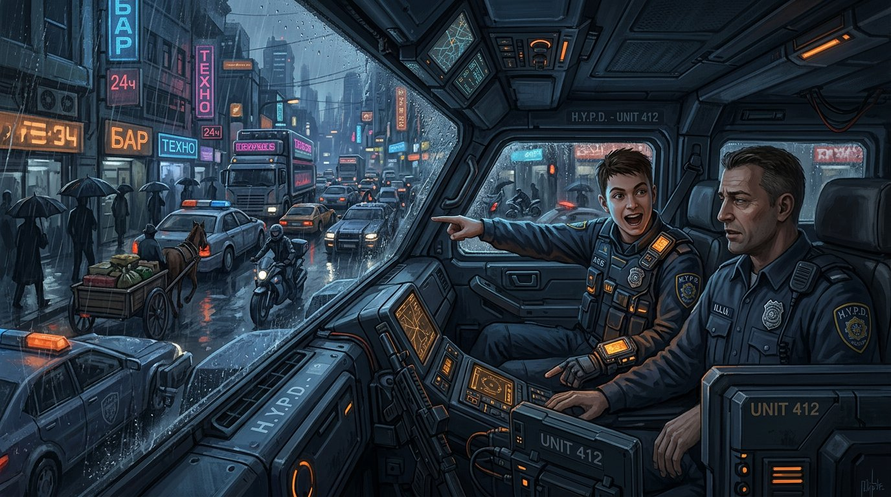
Патрульная H.Y.P.D. UNIT 412 в пробке, дождь, неон; молодой Акс возбуждённо указывает в окно, напарник за рулём. Точно.

### ch15-s02 ✅
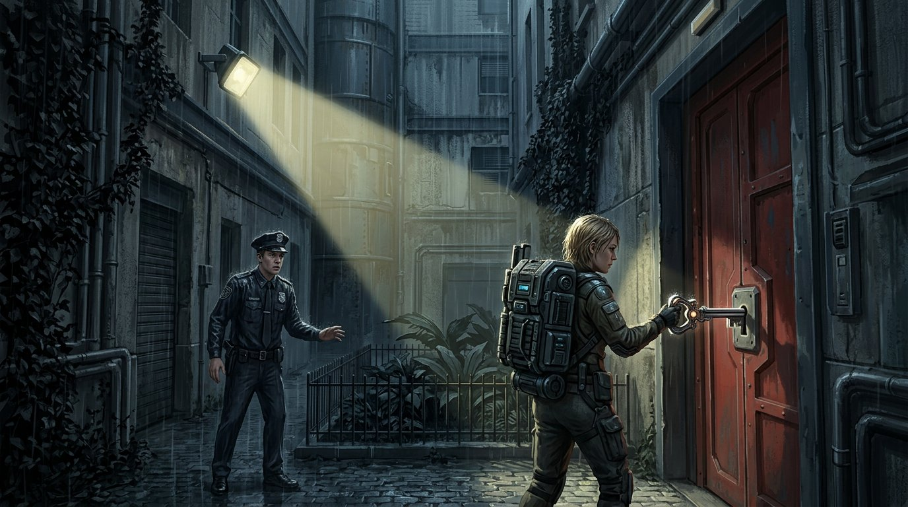
Тихий дворик за книжным магазином: блондинка с огромным ранцем скрывается за тяжёлой красной дверью, Акс окликает её. Точно.

### ch15-s03 ✅
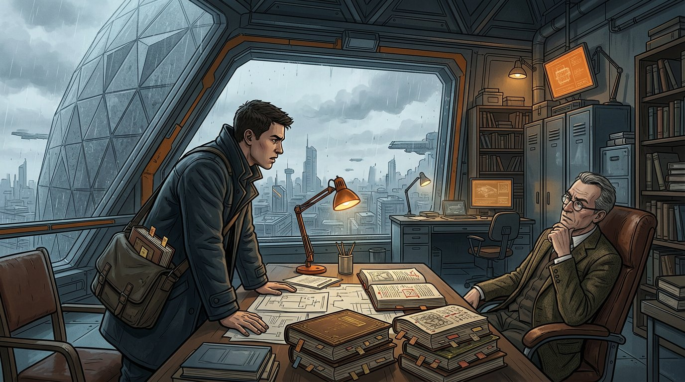
Кабинет профессора Гилланда внутри древнего каменного купола; Акс с сумкой книг излагает гипотезу, старые фолианты на столе. Точно.

### ch15-s04 ✅
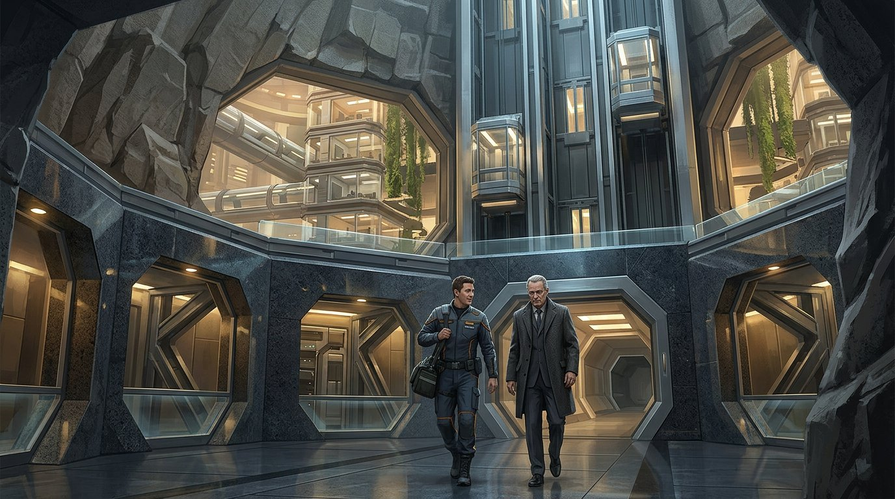
Гилланд и Акс выходят из купола: стеклянные лифты, шестиугольные проёмы, каменная оболочка; прощание. Точно.
